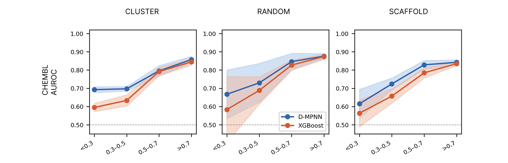

# hERGBench

**Representation Choice, Chemical Novelty and Reliability in hERG Prediction**

hERGBench is a scientific machine-learning project investigating how molecular
representation affects hERG cardiotoxicity prediction as compounds move away
from familiar training chemistry. It compares an ECFP4 + XGBoost baseline with
a ChemProp directed message-passing neural network (D-MPNN) under random,
scaffold, and chemical-cluster distribution shifts on curated ChEMBL and TDC
benchmarks.

> **Research status:** the findings below are preliminary computational results.
> They have not yet been established by external validation or prospective
> experimental testing.

## Key finding

The graph model contributes little additional discrimination in highly familiar
chemical space, but its relative advantage becomes substantially larger for
compounds distant from the training chemistry. This is more informative than a
blanket claim that one architecture is universally better.



The plotted means and uncertainty bands summarize five ChEMBL split seeds. The
canonical source is
[`reports/cross_model_comparison/cross_model_ad_bins.csv`](reports/cross_model_comparison/cross_model_ad_bins.csv);
see the [result provenance audit](docs/result_provenance.md) before reusing the
figure or values.

## Study design

| Component | Design |
| --- | --- |
| Datasets | Curated ChEMBL hERG and TDC hERG |
| Models | ECFP4 (radius 2, 2,048 bits) + XGBoost; ChemProp D-MPNN |
| Shifts | Random, Bemis–Murcko scaffold, and Butina chemical-cluster splits |
| Repeats | Five seeds per split; seed semantics differ by dataset and model |
| Novelty | Maximum ECFP4 Tanimoto similarity from each test compound to training chemistry |
| Evaluation | AUROC, AUPRC, Brier score, F1, balanced accuracy, reliability plots, and bootstrap confidence-interval machinery |

The current canonical ChEMBL cross-model summary reports progressively larger
D-MPNN discrimination gains from random to scaffold to cluster splitting. Full
precision, variability, calibration metrics, and TDC results remain in the
versioned CSVs rather than being copied into code. See
[`docs/results.md`](docs/results.md) for the evidence/interpretation boundary.

## Calibration and reliability

Discrimination and reliability are evaluated separately. A higher AUROC or
AUPRC does **not** imply better calibrated probabilities: the canonical ChEMBL
summary includes Brier scores, and post-hoc calibration outputs and reliability
figures are retained for audit. This distinction matters when predictions are
used for risk ranking or decision thresholds.

## Repository structure

- `src/hergbench/` — active package: data, models, evaluation, analysis, and reporting
- `configs/` — active experiment configurations
- `scripts/` — reproducible local and RunPod workflows
- `data/` — curated datasets and frozen split memberships; see [`data/README.md`](data/README.md)
- `reports/cross_model_comparison/` — canonical headline comparison and figures
- `reports/*_multiseed_analysis/` — raw, aggregated, calibrated, and manifest outputs
- `docs/` — methodology, results, provenance, and reproduction guidance
- `archive/` and `reports/archive/` — deprecated snapshots and superseded/diagnostic artifacts retained for provenance

Some frozen bundles and imported output trees remain at historical paths because
active configurations or provenance records still reference them. The
[`reports` index](reports/README.md) distinguishes canonical, supporting, and
archived material.

## Reproducing experiments

Python 3.11 or newer is required. For a local editable installation:

```bash
python -m venv .venv
source .venv/bin/activate
python -m pip install -e ".[dev]"
python -m pytest
```

The complete five-seed ChEMBL XGBoost workflow is documented in
[`scripts/runpod_chembl/README.md`](scripts/runpod_chembl/README.md). The D-MPNN
multi-seed workflow, aggregation, cross-model comparison, and export checks are
documented in
[`scripts/runpod_stage2/README.md`](scripts/runpod_stage2/README.md). In outline:

```bash
bash scripts/runpod_chembl/01_verify_data.sh
bash scripts/runpod_chembl/02_run_multiseed.sh
bash scripts/runpod_stage2/01_verify_environment.sh
bash scripts/runpod_stage2/02_generate_configs.sh
bash scripts/runpod_stage2/04_run_chembl_stage2.sh
bash scripts/runpod_stage2/05_compute_ad_bins.sh
bash scripts/runpod_stage2/06_cross_model_comparison.sh
```

Do not run the final comparison against an arbitrary duplicate tree. Confirm
inputs and expected outputs in [`docs/reproducibility.md`](docs/reproducibility.md)
and [`docs/result_provenance.md`](docs/result_provenance.md) first.

## Current limitations

- Similarity-dependent model advantage is preliminary and needs paired inference.
- External validation on an independently curated chemical series is outstanding.
- Some low-similarity bins are small, particularly in TDC, and should not be over-interpreted.
- Counterfactual lead optimisation is implemented, but its proposed molecules have not been experimentally validated.
- Historical exports contain unresolved numerical variants; they are archived and documented, not silently reconciled.

## Future research

Priorities are paired per-compound or paired-seed inference, external and temporal
validation, calibration under chemical shift, and prospective testing of
counterfactual lead-optimisation proposals.

## Citation and author

Author: **Hari Sreedeth**. A formal paper citation and archival DOI are not yet
available. Until then, cite the repository name, commit hash, and access date,
and identify the exact result files used. Licensing terms have not yet been
declared; contact the author before redistribution.

