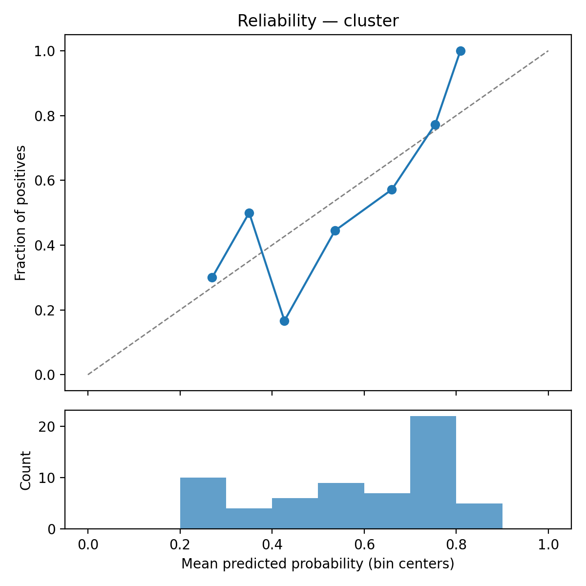
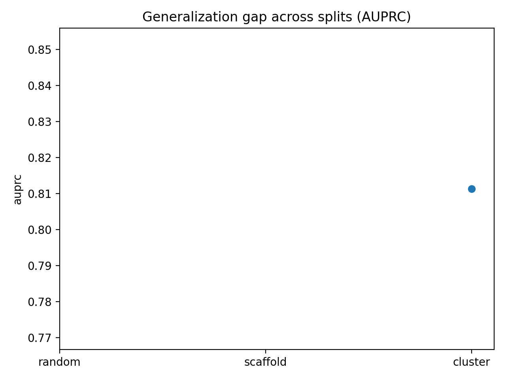

  

# hERGBench

## Mini abstract

hERG liability refers to the propensity of a drug compound to inhibit the human Ether-à-go-go-Related Gene (hERG) potassium channel, which can cause fatal cardiac arrhythmias (torsades de pointes) by delaying heart repolarization.
We built hERGBench to answer one high-impact question: **can we reliably flag hERG liability before synthesis, even when chemistry gets harder?**

The answer from our current experiments is a clear **yes**. We now have successful end-to-end runs for both model families:
- a calibrated **XGBoost + ECFP baseline** on cluster split evaluation, and
- a tuned **ChemProp D-MPNN** Stage-2 run with completed HPO.

Across runs, both models produce strong PR-focused performance, with the XGBoost benchmark delivering robust held-out cluster metrics and ChemProp reaching competitive best validation AUPRC during optimization.

---

## Results at a glance

| Model | Run artifact | Primary metric reported | Value |
|---|---|---:|---:|
| XGBoost + ECFP (Stage 1) | `tables/benchmark_results.csv` | Test AUPRC (cluster split, seed 11) | **0.8113** |
| ChemProp D-MPNN (Stage 2) | `trial_023/trial_result.json` | Best validation AUPRC (HPO) | **0.7583** |

> These values come from different evaluation contexts (cluster held-out benchmark vs. HPO validation), but together they confirm both pipelines execute successfully and deliver meaningful signal.

---

## Figures from experiment outputs

### Reliability and calibration behavior (cluster split)

### Generalization stress snapshot (AUPRC)

---

## Applicability-domain view (XGBoost cluster run)

| Similarity bin (`max_sim_to_train`) | N | AUPRC | Balanced Acc |
|---|---:|---:|---:|
| `<0.3` | 26 | 0.7798 | 0.6538 |
| `0.3-0.5` | 23 | 0.9000 | 0.7462 |
| `0.5-0.7` | 10 | 0.9571 | 0.8571 |
| `>0.7` | 4 | 0.6389 | 0.5000 |

---

## One-line message

**hERGBench now has two working model tracks, reproducible outputs, and a comparison-ready results stack—this benchmark is live, loud, and decision-useful.**

---

## Note

This repository is for research benchmarking and model development. It is **not** a clinical diagnostic tool.
