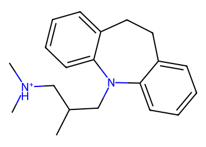
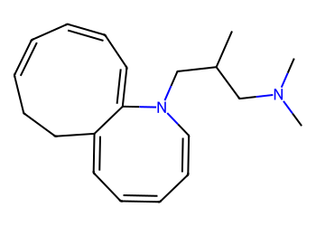
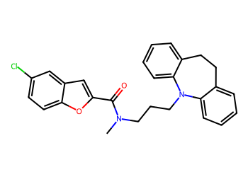
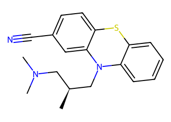
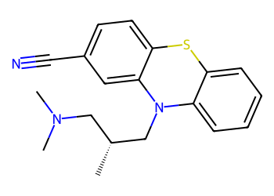
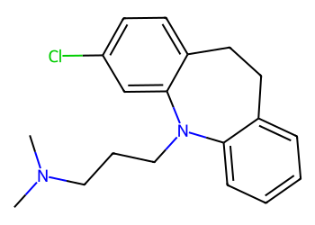
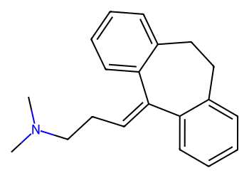

# Lead Optimization Report — 05843cedc45336b4ed7f9bd1e40dfe9a20bc69df
## Summary
- **Calibrated p(toxic):** 0.638
- **Threshold:** 0.510 → **Predicted class:** 1
- **Max similarity to train:** 0.538 (**bin:** 0.5-0.7)
- **OOD classification:** Borderline
- **Result classification:** Generated suggestions available (Tier: Tier 1 — Flip)
- Similarity is borderline; suggestions may be limited but still informative.
## Base molecule
- **SMILES:** `CC(CN1c2ccccc2CCc2ccccc21)C[NH+](C)C`
- **True label:** 1



## Counterfactual search summary
- ExMol requested: 1800 | drawn: 1251
- Generated tier (Tier 1–4): Tier 1 — Flip
- Relaxation used: True (applied: relax_flip_0.3)
- Generated survivors (Tier 1–4): 1
- Dataset analogue fallback count (not included in survivors): 5
- Relaxation note: lower flip min_tanimoto to 0.3

### Filter attrition by tier (baseline + final relaxation)
<table>
<tr><th>Tier</th><th>Relaxation</th><th>Sampled</th><th>Kept</th><th>Invalid</th><th>Duplicate</th><th>Similarity</th><th>Prob</th><th>Δp</th><th>SA</th><th>ΔLogP</th><th>QED</th><th>Alerts</th></tr>
<tr><td>Tier 1 — Flip</td><td>none</td><td>1251</td><td>0</td><td>0</td><td>2</td><td>975</td><td>274</td><td>0</td><td>0</td><td>0</td><td>0</td><td>0</td></tr>
<tr><td>Tier 1 — Flip</td><td>relax_flip_0.3</td><td>1251</td><td>1</td><td>0</td><td>2</td><td>584</td><td>639</td><td>0</td><td>17</td><td>4</td><td>0</td><td>4</td></tr>
</table>

<details><summary>All filter attempts (diagnostic)</summary>
```json
[
  {
    "tier": "flip",
    "tier_label": "Tier 1 \u2014 Flip",
    "relaxation": "none",
    "relaxation_desc": "baseline constraints",
    "counts": {
      "sampled": 1251,
      "invalid": 0,
      "duplicate": 2,
      "similarity_filtered": 975,
      "prob_filtered": 274,
      "delta_filtered": 0,
      "sa_filtered": 0,
      "logp_filtered": 0,
      "qed_filtered": 0,
      "alert_filtered": 0,
      "kept": 0,
      "min_tanimoto_used": 0.5,
      "min_tanimoto_source": "min_tanimoto_flip",
      "prob_max_used": 0.509999,
      "delta_min_used": null,
      "sa_max_used": 4.5,
      "logp_delta_max_used": 1.5,
      "qed_min_used": 0.0,
      "pains_used": true
    }
  },
  {
    "tier": "flip",
    "tier_label": "Tier 1 \u2014 Flip",
    "relaxation": "relax_flip_0.4",
    "relaxation_desc": "lower flip min_tanimoto to 0.4",
    "counts": {
      "sampled": 1251,
      "invalid": 0,
      "duplicate": 2,
      "similarity_filtered": 834,
      "prob_filtered": 414,
      "delta_filtered": 0,
      "sa_filtered": 0,
      "logp_filtered": 1,
      "qed_filtered": 0,
      "alert_filtered": 0,
      "kept": 0,
      "min_tanimoto_used": 0.4,
      "min_tanimoto_source": "min_tanimoto_flip",
      "prob_max_used": 0.509999,
      "delta_min_used": null,
      "sa_max_used": 4.5,
      "logp_delta_max_used": 1.5,
      "qed_min_used": 0.0,
      "pains_used": true
    }
  },
  {
    "tier": "flip",
    "tier_label": "Tier 1 \u2014 Flip",
    "relaxation": "relax_flip_0.3",
    "relaxation_desc": "lower flip min_tanimoto to 0.3",
    "counts": {
      "sampled": 1251,
      "invalid": 0,
      "duplicate": 2,
      "similarity_filtered": 584,
      "prob_filtered": 639,
      "delta_filtered": 0,
      "sa_filtered": 17,
      "logp_filtered": 4,
      "qed_filtered": 0,
      "alert_filtered": 4,
      "kept": 1,
      "min_tanimoto_used": 0.3,
      "min_tanimoto_source": "min_tanimoto_flip",
      "prob_max_used": 0.509999,
      "delta_min_used": null,
      "sa_max_used": 4.5,
      "logp_delta_max_used": 1.5,
      "qed_min_used": 0.0,
      "pains_used": true
    }
  }
]
```
</details>

## Counterfactual suggestions (filtered)
_Rows below are generated from Tier 1 — Flip (relaxation: relax_flip_0.3)._ 
<table>
<tr><th>Rank</th><th>Structure</th><th>Tier</th><th>Relaxation</th><th>Similarity</th><th>p(toxic)</th><th>Δp</th><th>LogP</th><th>QED</th><th>SA</th></tr>
<tr><td>1</td><td></td><td>Tier 1 — Flip</td><td>relax_flip_0.3</td><td>0.239</td><td>0.458</td><td>0.180</td><td>4.29</td><td>0.76</td><td>4.44</td></tr>
</table>

## Dataset-derived analogues (fallback)
_Nearest analogues from the dataset (context only, not generated edits)._ 
<table>
<tr><th>Rank</th><th>Structure</th><th>Similarity</th><th>p(toxic)</th><th>Δp</th><th>LogP</th><th>QED</th><th>SA</th><th>Alerts</th><th>Actionable?</th></tr>
<tr><td>1</td><td></td><td>0.317</td><td>0.664</td><td>-0.026</td><td>6.49</td><td>0.35</td><td>2.39</td><td>OK</td><td>NO</td></tr>
<tr><td>2</td><td></td><td>0.480</td><td>0.678</td><td>-0.040</td><td>4.36</td><td>0.84</td><td>2.97</td><td>OK</td><td>NO</td></tr>
<tr><td>3</td><td></td><td>0.480</td><td>0.678</td><td>-0.040</td><td>4.36</td><td>0.84</td><td>2.97</td><td>OK</td><td>NO</td></tr>
<tr><td>4</td><td></td><td>0.438</td><td>0.681</td><td>-0.043</td><td>4.53</td><td>0.82</td><td>2.06</td><td>OK</td><td>NO</td></tr>
<tr><td>5</td><td></td><td>0.333</td><td>0.686</td><td>-0.048</td><td>4.17</td><td>0.81</td><td>2.17</td><td>⚠</td><td>NO</td></tr>
</table>
Fallback analogues are context-only; none meet feasibility constraints.

## Raw records (for audit)
### Counterfactuals JSON
```json
[
  {
    "raw_smiles": "CC(CN(C)C)CN1C=CC=CC=C2CCC=CC=CC=C21",
    "smiles": "CC(CN(C)C)CN1C=CC=CC=C2CCC=CC=CC=C21",
    "similarity": 0.23880597014925373,
    "p": 0.45811523719395686,
    "delta_p": 0.1798776288731848,
    "logp": 4.286100000000004,
    "qed": 0.7635108374155279,
    "sascore": 4.435511916607891,
    "alert": false,
    "tier": "diagnostic_close_edits",
    "tier_label": "Tier 1 \u2014 Flip",
    "relaxation": "relax_flip_0.3",
    "relaxation_desc": "lower flip min_tanimoto to 0.3",
    "p_raw": 0.45811523719395686,
    "delta_p_raw": 0.1924860358970517,
    "tier_raw": "flip",
    "tier_num_std": 4,
    "tier_label_std": "diagnostic_close_edits"
  }
]
```
### Dataset analogues JSON
```json
[
  {
    "raw_smiles": "CN(CCCN1c2ccccc2CCc2ccccc21)C(=O)c1cc2cc(Cl)ccc2o1",
    "smiles": "CN(CCCN1c2ccccc2CCc2ccccc21)C(=O)c1cc2cc(Cl)ccc2o1",
    "similarity": 0.31746031746031744,
    "p": 0.6641551576193956,
    "delta_p": -0.026162291552253913,
    "logp": 6.485200000000006,
    "qed": 0.35292775943277405,
    "sascore": 2.3865215438847702,
    "sa_status": "ok",
    "actionable": false,
    "alert": false,
    "tier": "dataset_analogue",
    "tier_label": "Dataset analogue",
    "relaxation": "none",
    "relaxation_desc": "dataset fallback",
    "sa_max_used": 4.5,
    "pains_used": true
  },
  {
    "raw_smiles": "C[C@@H](CN(C)C)CN1c2ccccc2Sc2ccc(C#N)cc21",
    "smiles": "C[C@@H](CN(C)C)CN1c2ccccc2Sc2ccc(C#N)cc21",
    "similarity": 0.48,
    "p": 0.6776653018815384,
    "delta_p": -0.03967243581439672,
    "logp": 4.358680000000004,
    "qed": 0.8361911108543874,
    "sascore": 2.966341305431653,
    "sa_status": "ok",
    "actionable": false,
    "alert": false,
    "tier": "dataset_analogue",
    "tier_label": "Dataset analogue",
    "relaxation": "none",
    "relaxation_desc": "dataset fallback",
    "sa_max_used": 4.5,
    "pains_used": true
  },
  {
    "raw_smiles": "C[C@H](CN(C)C)CN1c2ccccc2Sc2ccc(C#N)cc21",
    "smiles": "C[C@H](CN(C)C)CN1c2ccccc2Sc2ccc(C#N)cc21",
    "similarity": 0.48,
    "p": 0.6776653018815384,
    "delta_p": -0.03967243581439672,
    "logp": 4.358680000000004,
    "qed": 0.8361911108543874,
    "sascore": 2.966341305431653,
    "sa_status": "ok",
    "actionable": false,
    "alert": false,
    "tier": "dataset_analogue",
    "tier_label": "Dataset analogue",
    "relaxation": "none",
    "relaxation_desc": "dataset fallback",
    "sa_max_used": 4.5,
    "pains_used": true
  },
  {
    "raw_smiles": "CN(C)CCCN1c2ccccc2CCc2ccc(Cl)cc21",
    "smiles": "CN(C)CCCN1c2ccccc2CCc2ccc(Cl)cc21",
    "similarity": 0.4375,
    "p": 0.6810429875498096,
    "delta_p": -0.04305012148266796,
    "logp": 4.528400000000004,
    "qed": 0.8178744322781549,
    "sascore": 2.0627761044395037,
    "sa_status": "ok",
    "actionable": false,
    "alert": false,
    "tier": "dataset_analogue",
    "tier_label": "Dataset analogue",
    "relaxation": "none",
    "relaxation_desc": "dataset fallback",
    "sa_max_used": 4.5,
    "pains_used": true
  },
  {
    "raw_smiles": "CN(C)CCC=C1c2ccccc2CCc2ccccc21",
    "smiles": "CN(C)CCC=C1c2ccccc2CCc2ccccc21",
    "similarity": 0.3333333333333333,
    "p": 0.6858530985393895,
    "delta_p": -0.0478602324722478,
    "logp": 4.168600000000003,
    "qed": 0.8136783893547587,
    "sascore": 2.1742287402304044,
    "sa_status": "ok",
    "actionable": false,
    "alert": true,
    "tier": "dataset_analogue",
    "tier_label": "Dataset analogue",
    "relaxation": "none",
    "relaxation_desc": "dataset fallback",
    "sa_max_used": 4.5,
    "pains_used": true
  }
]
```
