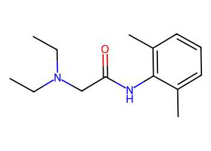
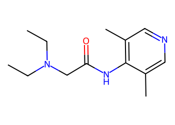
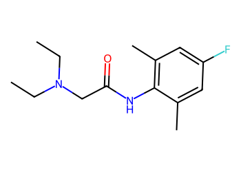
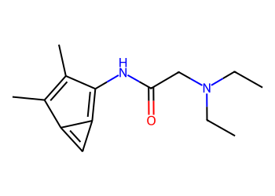
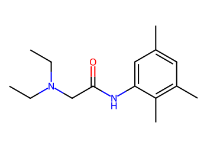
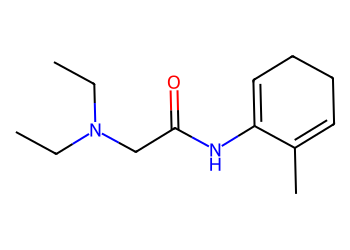
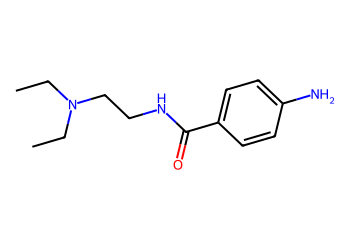
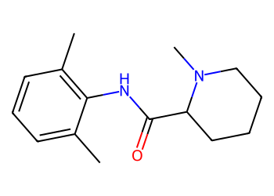
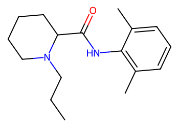
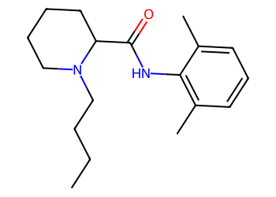

# Lead Optimization Report — 10b45aa88e1835ba54fb3f174ecab4b313711f93
## Summary
- **Calibrated p(toxic):** 0.594
- **Threshold:** 0.510 → **Predicted class:** 1
- **Max similarity to train:** 0.444 (**bin:** 0.3-0.5)
- **OOD classification:** Out-of-domain
- **Result classification:** Generated suggestions available (Tier: Tier 1 — Flip)
- Similarity is low; treat any suggestions cautiously and consult fallback analogues.
## Base molecule
- **SMILES:** `CCN(CC)CC(=O)Nc1c(C)cccc1C`
- **True label:** 0



## Counterfactual search summary
- ExMol requested: 1800 | drawn: 1116
- Generated tier (Tier 1–4): Tier 1 — Flip
- Relaxation used: False (applied: none)
- Generated survivors (Tier 1–4): 5
- Dataset analogue fallback count (not included in survivors): 4
- Relaxation note: baseline constraints

### Filter attrition by tier (baseline + final relaxation)
<table>
<tr><th>Tier</th><th>Relaxation</th><th>Sampled</th><th>Kept</th><th>Invalid</th><th>Duplicate</th><th>Similarity</th><th>Prob</th><th>Δp</th><th>SA</th><th>ΔLogP</th><th>QED</th><th>Alerts</th></tr>
<tr><td>Tier 1 — Flip</td><td>none</td><td>1116</td><td>7</td><td>0</td><td>7</td><td>941</td><td>150</td><td>0</td><td>0</td><td>2</td><td>0</td><td>9</td></tr>
</table>

<details><summary>All filter attempts (diagnostic)</summary>
```json
[
  {
    "tier": "flip",
    "tier_label": "Tier 1 \u2014 Flip",
    "relaxation": "none",
    "relaxation_desc": "baseline constraints",
    "counts": {
      "sampled": 1116,
      "invalid": 0,
      "duplicate": 7,
      "similarity_filtered": 941,
      "prob_filtered": 150,
      "delta_filtered": 0,
      "sa_filtered": 0,
      "logp_filtered": 2,
      "qed_filtered": 0,
      "alert_filtered": 9,
      "kept": 7,
      "min_tanimoto_used": 0.5,
      "min_tanimoto_source": "min_tanimoto_flip",
      "prob_max_used": 0.509999,
      "delta_min_used": null,
      "sa_max_used": 4.5,
      "logp_delta_max_used": 1.5,
      "qed_min_used": 0.0,
      "pains_used": true
    }
  }
]
```
</details>

## Counterfactual suggestions (filtered)
_Rows below are generated from Tier 1 — Flip (relaxation: none)._ 
<table>
<tr><th>Rank</th><th>Structure</th><th>Tier</th><th>Relaxation</th><th>Similarity</th><th>p(toxic)</th><th>Δp</th><th>LogP</th><th>QED</th><th>SA</th></tr>
<tr><td>1</td><td></td><td>Tier 1 — Flip</td><td>none</td><td>0.294</td><td>0.427</td><td>0.167</td><td>1.98</td><td>0.85</td><td>2.24</td></tr>
<tr><td>2</td><td></td><td>Tier 1 — Flip</td><td>none</td><td>0.305</td><td>0.427</td><td>0.167</td><td>2.72</td><td>0.87</td><td>2.01</td></tr>
<tr><td>3</td><td></td><td>Tier 1 — Flip</td><td>none</td><td>0.265</td><td>0.427</td><td>0.167</td><td>2.56</td><td>0.86</td><td>2.51</td></tr>
<tr><td>4</td><td></td><td>Tier 1 — Flip</td><td>none</td><td>0.260</td><td>0.427</td><td>0.167</td><td>2.89</td><td>0.87</td><td>1.95</td></tr>
<tr><td>5</td><td></td><td>Tier 1 — Flip</td><td>none</td><td>0.265</td><td>0.441</td><td>0.154</td><td>2.07</td><td>0.77</td><td>2.83</td></tr>
</table>

## Dataset-derived analogues (fallback)
_Nearest analogues from the dataset (context only, not generated edits)._ 
<table>
<tr><th>Rank</th><th>Structure</th><th>Similarity</th><th>p(toxic)</th><th>Δp</th><th>LogP</th><th>QED</th><th>SA</th><th>Alerts</th><th>Actionable?</th></tr>
<tr><td>1</td><td></td><td>0.304</td><td>0.432</td><td>0.162</td><td>1.34</td><td>0.73</td><td>1.79</td><td>⚠</td><td>NO</td></tr>
<tr><td>2</td><td></td><td>0.362</td><td>0.564</td><td>0.030</td><td>2.73</td><td>0.87</td><td>2.33</td><td>OK</td><td>YES</td></tr>
<tr><td>3</td><td></td><td>0.388</td><td>0.650</td><td>-0.056</td><td>3.51</td><td>0.91</td><td>2.37</td><td>OK</td><td>NO</td></tr>
<tr><td>4</td><td></td><td>0.373</td><td>0.684</td><td>-0.090</td><td>3.90</td><td>0.89</td><td>2.37</td><td>OK</td><td>NO</td></tr>
</table>

## Raw records (for audit)
### Counterfactuals JSON
```json
[
  {
    "raw_smiles": "CCN(CC)CC(=O)Nc1c(C)cncc1C",
    "smiles": "CCN(CC)CC(=O)Nc1c(C)cncc1C",
    "similarity": 0.29411764705882354,
    "p": 0.4274583483195352,
    "delta_p": 0.16661070900769492,
    "logp": 1.9787400000000002,
    "qed": 0.8484570082381011,
    "sascore": 2.239746180502763,
    "alert": false,
    "tier": "diagnostic_close_edits",
    "tier_label": "Tier 1 \u2014 Flip",
    "relaxation": "none",
    "relaxation_desc": "baseline constraints",
    "p_raw": 0.4274583483195352,
    "delta_p_raw": 0.16661070900769492,
    "tier_raw": "flip",
    "tier_num_std": 4,
    "tier_label_std": "diagnostic_close_edits"
  },
  {
    "raw_smiles": "CCN(CC)CC(=O)Nc1c(C)cc(F)cc1C",
    "smiles": "CCN(CC)CC(=O)Nc1c(C)cc(F)cc1C",
    "similarity": 0.3050847457627119,
    "p": 0.4274583483195352,
    "delta_p": 0.16661070900769492,
    "logp": 2.7228400000000006,
    "qed": 0.8735575582611946,
    "sascore": 2.0120625413765296,
    "alert": false,
    "tier": "diagnostic_close_edits",
    "tier_label": "Tier 1 \u2014 Flip",
    "relaxation": "none",
    "relaxation_desc": "baseline constraints",
    "p_raw": 0.4274583483195352,
    "delta_p_raw": 0.16661070900769492,
    "tier_raw": "flip",
    "tier_num_std": 4,
    "tier_label_std": "diagnostic_close_edits"
  },
  {
    "raw_smiles": "CCN(CC)CC(=O)Nc1c2cc-2c(C)c1C",
    "smiles": "CCN(CC)CC(=O)Nc1c2cc-2c(C)c1C",
    "similarity": 0.2653061224489796,
    "p": 0.4274583483195352,
    "delta_p": 0.16661070900769492,
    "logp": 2.564140000000001,
    "qed": 0.8589482379265225,
    "sascore": 2.5081659129442357,
    "alert": false,
    "tier": "diagnostic_close_edits",
    "tier_label": "Tier 1 \u2014 Flip",
    "relaxation": "none",
    "relaxation_desc": "baseline constraints",
    "p_raw": 0.4274583483195352,
    "delta_p_raw": 0.16661070900769492,
    "tier_raw": "flip",
    "tier_num_std": 4,
    "tier_label_std": "diagnostic_close_edits"
  },
  {
    "raw_smiles": "CCN(CC)CC(=O)Nc1cc(C)cc(C)c1C",
    "smiles": "CCN(CC)CC(=O)Nc1cc(C)cc(C)c1C",
    "similarity": 0.26,
    "p": 0.4274583483195352,
    "delta_p": 0.16661070900769492,
    "logp": 2.8921600000000014,
    "qed": 0.8686826686845109,
    "sascore": 1.9478135029149914,
    "alert": false,
    "tier": "diagnostic_close_edits",
    "tier_label": "Tier 1 \u2014 Flip",
    "relaxation": "none",
    "relaxation_desc": "baseline constraints",
    "p_raw": 0.4274583483195352,
    "delta_p_raw": 0.16661070900769492,
    "tier_raw": "flip",
    "tier_num_std": 4,
    "tier_label_std": "diagnostic_close_edits"
  },
  {
    "raw_smiles": "CCN(CC)CC(=O)NC1=CCCC=C1C",
    "smiles": "CCN(CC)CC(=O)NC1=CCCC=C1C",
    "similarity": 0.2653061224489796,
    "p": 0.44055822913256376,
    "delta_p": 0.15351082819466638,
    "logp": 2.0684,
    "qed": 0.7720317512522414,
    "sascore": 2.833424349474207,
    "alert": false,
    "tier": "diagnostic_close_edits",
    "tier_label": "Tier 1 \u2014 Flip",
    "relaxation": "none",
    "relaxation_desc": "baseline constraints",
    "p_raw": 0.44055822913256376,
    "delta_p_raw": 0.15351082819466638,
    "tier_raw": "flip",
    "tier_num_std": 4,
    "tier_label_std": "diagnostic_close_edits"
  }
]
```
### Dataset analogues JSON
```json
[
  {
    "raw_smiles": "CCN(CC)CCNC(=O)c1ccc(N)cc1",
    "smiles": "CCN(CC)CCNC(=O)c1ccc(N)cc1",
    "similarity": 0.30434782608695654,
    "p": 0.432089657742299,
    "delta_p": 0.16197939958493113,
    "logp": 1.3403999999999996,
    "qed": 0.7315396930195435,
    "sascore": 1.7916872037718168,
    "sa_status": "ok",
    "actionable": false,
    "alert": true,
    "tier": "dataset_analogue",
    "tier_label": "Dataset analogue",
    "relaxation": "none",
    "relaxation_desc": "dataset fallback",
    "sa_max_used": 4.5,
    "pains_used": true
  },
  {
    "raw_smiles": "Cc1cccc(C)c1NC(=O)C1CCCCN1C",
    "smiles": "Cc1cccc(C)c1NC(=O)C1CCCCN1C",
    "similarity": 0.3617021276595745,
    "p": 0.5642148562740176,
    "delta_p": 0.02985420105321257,
    "logp": 2.7262400000000007,
    "qed": 0.8699043213708457,
    "sascore": 2.3344541892189667,
    "sa_status": "ok",
    "actionable": true,
    "alert": false,
    "tier": "dataset_analogue",
    "tier_label": "Dataset analogue",
    "relaxation": "none",
    "relaxation_desc": "dataset fallback",
    "sa_max_used": 4.5,
    "pains_used": true
  },
  {
    "raw_smiles": "CCCN1CCCCC1C(=O)Nc1c(C)cccc1C",
    "smiles": "CCCN1CCCCC1C(=O)Nc1c(C)cccc1C",
    "similarity": 0.3877551020408163,
    "p": 0.6503838953086847,
    "delta_p": -0.056314837981454535,
    "logp": 3.5064400000000013,
    "qed": 0.9109962827378179,
    "sascore": 2.3724974377393693,
    "sa_status": "ok",
    "actionable": false,
    "alert": false,
    "tier": "dataset_analogue",
    "tier_label": "Dataset analogue",
    "relaxation": "none",
    "relaxation_desc": "dataset fallback",
    "sa_max_used": 4.5,
    "pains_used": true
  },
  {
    "raw_smiles": "CCCCN1CCCCC1C(=O)Nc1c(C)cccc1C",
    "smiles": "CCCCN1CCCCC1C(=O)Nc1c(C)cccc1C",
    "similarity": 0.37254901960784315,
    "p": 0.6842619372960929,
    "delta_p": -0.09019287996886272,
    "logp": 3.8965400000000026,
    "qed": 0.891012713024742,
    "sascore": 2.374678633985166,
    "sa_status": "ok",
    "actionable": false,
    "alert": false,
    "tier": "dataset_analogue",
    "tier_label": "Dataset analogue",
    "relaxation": "none",
    "relaxation_desc": "dataset fallback",
    "sa_max_used": 4.5,
    "pains_used": true
  }
]
```
