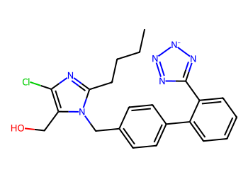
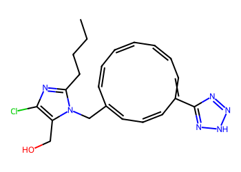
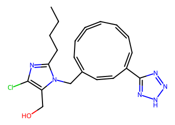
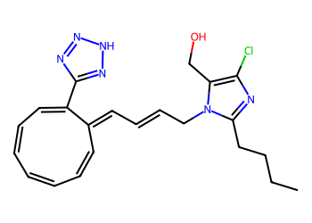
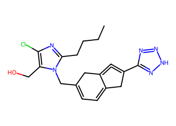
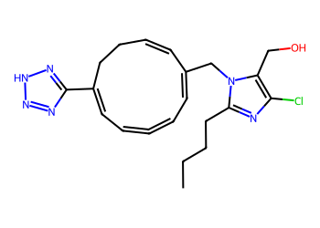
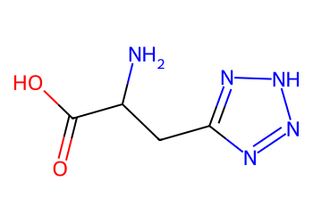

# Lead Optimization Report — 11597d4bfffb81310a7a3383203b1ae64b121041
## Summary
- **Calibrated p(toxic):** 0.644
- **Threshold:** 0.510 → **Predicted class:** 1
- **Max similarity to train:** 0.507 (**bin:** 0.5-0.7)
- **OOD classification:** Borderline
- **Result classification:** Generated suggestions available (Tier: Tier 1 — Flip)
- Similarity is borderline; suggestions may be limited but still informative.
## Base molecule
- **SMILES:** `CCCCc1nc(Cl)c(CO)n1Cc1ccc(-c2ccccc2-c2nn[n-]n2)cc1`
- **True label:** 1



## Counterfactual search summary
- ExMol requested: 1800 | drawn: 1472
- Generated tier (Tier 1–4): Tier 1 — Flip
- Relaxation used: False (applied: none)
- Generated survivors (Tier 1–4): 5
- Dataset analogue fallback count (not included in survivors): 5
- Relaxation note: baseline constraints

### Filter attrition by tier (baseline + final relaxation)
<table>
<tr><th>Tier</th><th>Relaxation</th><th>Sampled</th><th>Kept</th><th>Invalid</th><th>Duplicate</th><th>Similarity</th><th>Prob</th><th>Δp</th><th>SA</th><th>ΔLogP</th><th>QED</th><th>Alerts</th></tr>
<tr><td>Tier 1 — Flip</td><td>none</td><td>1472</td><td>7</td><td>0</td><td>8</td><td>968</td><td>480</td><td>0</td><td>4</td><td>1</td><td>0</td><td>4</td></tr>
</table>

<details><summary>All filter attempts (diagnostic)</summary>
```json
[
  {
    "tier": "flip",
    "tier_label": "Tier 1 \u2014 Flip",
    "relaxation": "none",
    "relaxation_desc": "baseline constraints",
    "counts": {
      "sampled": 1472,
      "invalid": 0,
      "duplicate": 8,
      "similarity_filtered": 968,
      "prob_filtered": 480,
      "delta_filtered": 0,
      "sa_filtered": 4,
      "logp_filtered": 1,
      "qed_filtered": 0,
      "alert_filtered": 4,
      "kept": 7,
      "min_tanimoto_used": 0.5,
      "min_tanimoto_source": "min_tanimoto_flip",
      "prob_max_used": 0.509999,
      "delta_min_used": null,
      "sa_max_used": 4.5,
      "logp_delta_max_used": 1.5,
      "qed_min_used": 0.0,
      "pains_used": true
    }
  }
]
```
</details>

## Counterfactual suggestions (filtered)
_Rows below are generated from Tier 1 — Flip (relaxation: none)._ 
<table>
<tr><th>Rank</th><th>Structure</th><th>Tier</th><th>Relaxation</th><th>Similarity</th><th>p(toxic)</th><th>Δp</th><th>LogP</th><th>QED</th><th>SA</th></tr>
<tr><td>1</td><td></td><td>Tier 1 — Flip</td><td>none</td><td>0.188</td><td>0.434</td><td>0.210</td><td>4.13</td><td>0.70</td><td>4.00</td></tr>
<tr><td>2</td><td></td><td>Tier 1 — Flip</td><td>none</td><td>0.180</td><td>0.434</td><td>0.210</td><td>3.73</td><td>0.68</td><td>4.36</td></tr>
<tr><td>3</td><td></td><td>Tier 1 — Flip</td><td>none</td><td>0.168</td><td>0.434</td><td>0.210</td><td>4.13</td><td>0.66</td><td>4.07</td></tr>
<tr><td>4</td><td></td><td>Tier 1 — Flip</td><td>none</td><td>0.196</td><td>0.448</td><td>0.197</td><td>3.15</td><td>0.72</td><td>4.00</td></tr>
<tr><td>5</td><td></td><td>Tier 1 — Flip</td><td>none</td><td>0.188</td><td>0.448</td><td>0.197</td><td>3.96</td><td>0.67</td><td>4.31</td></tr>
</table>

## Dataset-derived analogues (fallback)
_Nearest analogues from the dataset (context only, not generated edits)._ 
<table>
<tr><th>Rank</th><th>Structure</th><th>Similarity</th><th>p(toxic)</th><th>Δp</th><th>LogP</th><th>QED</th><th>SA</th><th>Alerts</th><th>Actionable?</th></tr>
<tr><td>1</td><td></td><td>0.082</td><td>0.395</td><td>0.249</td><td>-1.04</td><td>0.56</td><td>2.54</td><td>OK</td><td>YES</td></tr>
<tr><td>2</td><td></td><td>0.068</td><td>0.395</td><td>0.249</td><td>0.60</td><td>0.50</td><td>3.30</td><td>⚠</td><td>NO</td></tr>
<tr><td>3</td><td></td><td>0.176</td><td>0.396</td><td>0.249</td><td>-1.85</td><td>0.47</td><td>3.19</td><td>OK</td><td>YES</td></tr>
<tr><td>4</td><td></td><td>0.159</td><td>0.396</td><td>0.249</td><td>-1.93</td><td>0.47</td><td>3.46</td><td>OK</td><td>YES</td></tr>
<tr><td>5</td><td></td><td>0.105</td><td>0.396</td><td>0.249</td><td>5.39</td><td>0.30</td><td>3.21</td><td>⚠</td><td>NO</td></tr>
</table>

## Raw records (for audit)
### Counterfactuals JSON
```json
[
  {
    "raw_smiles": "CCCCc1nc(Cl)c(CO)n1CC1=CC=CC(c2nn[nH]n2)=CC=CC=CC=C1",
    "smiles": "CCCCc1nc(Cl)c(CO)n1CC1=CC=CC(c2nn[nH]n2)=CC=CC=CC=C1",
    "similarity": 0.1875,
    "p": 0.43412807208948834,
    "delta_p": 0.2100310359027261,
    "logp": 4.132900000000003,
    "qed": 0.6965320083459879,
    "sascore": 3.9979712681137825,
    "alert": false,
    "tier": "diagnostic_close_edits",
    "tier_label": "Tier 1 \u2014 Flip",
    "relaxation": "none",
    "relaxation_desc": "baseline constraints",
    "p_raw": 0.43412807208948834,
    "delta_p_raw": 0.19758556762666457,
    "tier_raw": "flip",
    "tier_num_std": 4,
    "tier_label_std": "diagnostic_close_edits"
  },
  {
    "raw_smiles": "CCCCc1nc(Cl)c(CO)n1CC1=CC=C=CC=CC=C(c2nn[nH]n2)C=C1",
    "smiles": "CCCCc1nc(Cl)c(CO)n1CC1=CC=C=CC=CC=C(c2nn[nH]n2)C=C1",
    "similarity": 0.18,
    "p": 0.43412807208948834,
    "delta_p": 0.2100310359027261,
    "logp": 3.7318000000000024,
    "qed": 0.6781944712569916,
    "sascore": 4.362163596836189,
    "alert": false,
    "tier": "diagnostic_close_edits",
    "tier_label": "Tier 1 \u2014 Flip",
    "relaxation": "none",
    "relaxation_desc": "baseline constraints",
    "p_raw": 0.43412807208948834,
    "delta_p_raw": 0.19758556762666457,
    "tier_raw": "flip",
    "tier_num_std": 4,
    "tier_label_std": "diagnostic_close_edits"
  },
  {
    "raw_smiles": "CCCCc1nc(Cl)c(CO)n1CC=CC=C1C=CC=CC=CC=C1c1nn[nH]n1",
    "smiles": "CCCCc1nc(Cl)c(CO)n1CC=CC=C1C=CC=CC=CC=C1c1nn[nH]n1",
    "similarity": 0.16831683168316833,
    "p": 0.43412807208948834,
    "delta_p": 0.2100310359027261,
    "logp": 4.132900000000003,
    "qed": 0.6640763612648473,
    "sascore": 4.071045538670813,
    "alert": false,
    "tier": "diagnostic_close_edits",
    "tier_label": "Tier 1 \u2014 Flip",
    "relaxation": "none",
    "relaxation_desc": "baseline constraints",
    "p_raw": 0.43412807208948834,
    "delta_p_raw": 0.19758556762666457,
    "tier_raw": "flip",
    "tier_num_std": 4,
    "tier_label_std": "diagnostic_close_edits"
  },
  {
    "raw_smiles": "CCCCc1nc(Cl)c(CO)n1CC1=CC=C2CC(c3nn[nH]n3)=C=C2C1",
    "smiles": "CCCCc1nc(Cl)c(CO)n1CC1=CC=C2CC(c3nn[nH]n3)=C=C2C1",
    "similarity": 0.1958762886597938,
    "p": 0.44754915829738,
    "delta_p": 0.19660994969483442,
    "logp": 3.153600000000001,
    "qed": 0.7151254902454631,
    "sascore": 4.004688683731512,
    "alert": false,
    "tier": "diagnostic_close_edits",
    "tier_label": "Tier 1 \u2014 Flip",
    "relaxation": "none",
    "relaxation_desc": "baseline constraints",
    "p_raw": 0.44754915829738,
    "delta_p_raw": 0.1841644814187729,
    "tier_raw": "flip",
    "tier_num_std": 4,
    "tier_label_std": "diagnostic_close_edits"
  },
  {
    "raw_smiles": "CCCCc1nc(Cl)c(CO)n1CC1=CC=C=CC=C(c2nn[nH]n2)CCC=C1",
    "smiles": "CCCCc1nc(Cl)c(CO)n1CC1=CC=C=CC=C(c2nn[nH]n2)CCC=C1",
    "similarity": 0.18811881188118812,
    "p": 0.44754915829738,
    "delta_p": 0.19660994969483442,
    "logp": 3.9558000000000026,
    "qed": 0.6713063602748345,
    "sascore": 4.307748212220804,
    "alert": false,
    "tier": "diagnostic_close_edits",
    "tier_label": "Tier 1 \u2014 Flip",
    "relaxation": "none",
    "relaxation_desc": "baseline constraints",
    "p_raw": 0.44754915829738,
    "delta_p_raw": 0.1841644814187729,
    "tier_raw": "flip",
    "tier_num_std": 4,
    "tier_label_std": "diagnostic_close_edits"
  }
]
```
### Dataset analogues JSON
```json
[
  {
    "raw_smiles": "Cn1c(=O)c2[nH]cnc2n(C)c1=O",
    "smiles": "Cn1c(=O)c2[nH]cnc2n(C)c1=O",
    "similarity": 0.0821917808219178,
    "p": 0.39478944477282535,
    "delta_p": 0.24936966321938908,
    "logp": -1.0397000000000005,
    "qed": 0.5624722357827983,
    "sascore": 2.5435777719868486,
    "sa_status": "ok",
    "actionable": true,
    "alert": false,
    "tier": "dataset_analogue",
    "tier_label": "Dataset analogue",
    "relaxation": "none",
    "relaxation_desc": "dataset fallback",
    "sa_max_used": 4.5,
    "pains_used": true
  },
  {
    "raw_smiles": "Nc1nc(=S)c2[nH]cnc2[nH]1",
    "smiles": "Nc1nc(=S)c2[nH]cnc2[nH]1",
    "similarity": 0.06756756756756757,
    "p": 0.39478944477282535,
    "delta_p": 0.24936966321938908,
    "logp": 0.5976899999999998,
    "qed": 0.5014913838271434,
    "sascore": 3.3037189467190657,
    "sa_status": "ok",
    "actionable": false,
    "alert": true,
    "tier": "dataset_analogue",
    "tier_label": "Dataset analogue",
    "relaxation": "none",
    "relaxation_desc": "dataset fallback",
    "sa_max_used": 4.5,
    "pains_used": true
  },
  {
    "raw_smiles": "NC(Cc1nn[nH]n1)C(=O)O",
    "smiles": "NC(Cc1nn[nH]n1)C(=O)O",
    "similarity": 0.17647058823529413,
    "p": 0.39562248764441715,
    "delta_p": 0.24853662034779728,
    "logp": -1.8459000000000003,
    "qed": 0.4738423616632481,
    "sascore": 3.185883407216588,
    "sa_status": "ok",
    "actionable": true,
    "alert": false,
    "tier": "dataset_analogue",
    "tier_label": "Dataset analogue",
    "relaxation": "none",
    "relaxation_desc": "dataset fallback",
    "sa_max_used": 4.5,
    "pains_used": true
  },
  {
    "raw_smiles": "NC(=O)C[C@@H](N)c1nn[nH]n1",
    "smiles": "NC(=O)C[C@@H](N)c1nn[nH]n1",
    "similarity": 0.15942028985507245,
    "p": 0.39562248764441715,
    "delta_p": 0.24853662034779728,
    "logp": -1.9250999999999996,
    "qed": 0.46999699596863087,
    "sascore": 3.4594280226012035,
    "sa_status": "ok",
    "actionable": true,
    "alert": false,
    "tier": "dataset_analogue",
    "tier_label": "Dataset analogue",
    "relaxation": "none",
    "relaxation_desc": "dataset fallback",
    "sa_max_used": 4.5,
    "pains_used": true
  },
  {
    "raw_smiles": "O=c1[nH]c(SCc2c(Cl)c(Cl)c(Cl)c(Cl)c2Cl)nc(=S)[nH]1",
    "smiles": "O=c1[nH]c(SCc2c(Cl)c(Cl)c(Cl)c(Cl)c2Cl)nc(=S)[nH]1",
    "similarity": 0.10526315789473684,
    "p": 0.39562248764441715,
    "delta_p": 0.24853662034779728,
    "logp": 5.38679,
    "qed": 0.30084441175659915,
    "sascore": 3.2095886753772245,
    "sa_status": "ok",
    "actionable": false,
    "alert": true,
    "tier": "dataset_analogue",
    "tier_label": "Dataset analogue",
    "relaxation": "none",
    "relaxation_desc": "dataset fallback",
    "sa_max_used": 4.5,
    "pains_used": true
  }
]
```
