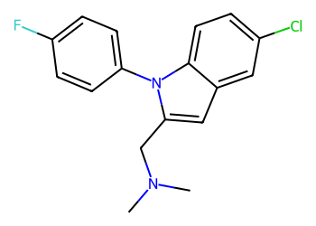
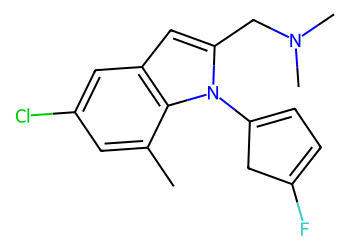
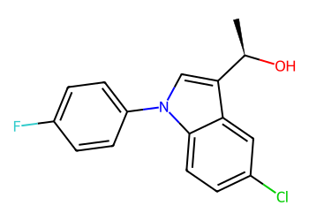
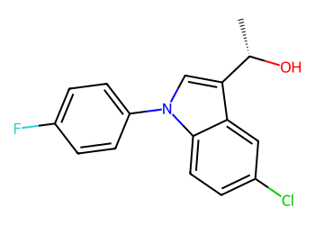
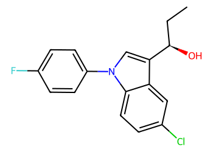
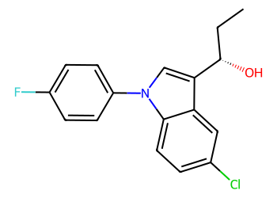
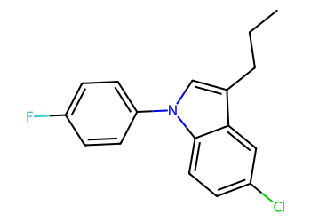

# Lead Optimization Report — 1451f091fe507ebb4c11b5a51a2508d5a28531ff
## Summary
- **Calibrated p(toxic):** 0.549
- **Threshold:** 0.510 → **Predicted class:** 1
- **Max similarity to train:** 0.396 (**bin:** 0.3-0.5)
- **OOD classification:** Out-of-domain
- **Result classification:** Generated suggestions available (Tier: Tier 1 — Flip)
- Similarity is low; treat any suggestions cautiously and consult fallback analogues.
## Base molecule
- **SMILES:** `CN(C)Cc1cc2cc(Cl)ccc2n1-c1ccc(F)cc1`
- **True label:** 1



## Counterfactual search summary
- ExMol requested: 1800 | drawn: 1370
- Generated tier (Tier 1–4): Tier 1 — Flip
- Relaxation used: True (applied: relax_flip_0.4)
- Generated survivors (Tier 1–4): 1
- Dataset analogue fallback count (not included in survivors): 5
- Relaxation note: lower flip min_tanimoto to 0.4

### Filter attrition by tier (baseline + final relaxation)
<table>
<tr><th>Tier</th><th>Relaxation</th><th>Sampled</th><th>Kept</th><th>Invalid</th><th>Duplicate</th><th>Similarity</th><th>Prob</th><th>Δp</th><th>SA</th><th>ΔLogP</th><th>QED</th><th>Alerts</th></tr>
<tr><td>Tier 1 — Flip</td><td>none</td><td>1370</td><td>0</td><td>0</td><td>3</td><td>1187</td><td>180</td><td>0</td><td>0</td><td>0</td><td>0</td><td>0</td></tr>
<tr><td>Tier 1 — Flip</td><td>relax_flip_0.4</td><td>1370</td><td>1</td><td>0</td><td>3</td><td>1053</td><td>311</td><td>0</td><td>0</td><td>0</td><td>0</td><td>2</td></tr>
</table>

<details><summary>All filter attempts (diagnostic)</summary>
```json
[
  {
    "tier": "flip",
    "tier_label": "Tier 1 \u2014 Flip",
    "relaxation": "none",
    "relaxation_desc": "baseline constraints",
    "counts": {
      "sampled": 1370,
      "invalid": 0,
      "duplicate": 3,
      "similarity_filtered": 1187,
      "prob_filtered": 180,
      "delta_filtered": 0,
      "sa_filtered": 0,
      "logp_filtered": 0,
      "qed_filtered": 0,
      "alert_filtered": 0,
      "kept": 0,
      "min_tanimoto_used": 0.5,
      "min_tanimoto_source": "min_tanimoto_flip",
      "prob_max_used": 0.509999,
      "delta_min_used": null,
      "sa_max_used": 4.5,
      "logp_delta_max_used": 1.5,
      "qed_min_used": 0.0,
      "pains_used": true
    }
  },
  {
    "tier": "flip",
    "tier_label": "Tier 1 \u2014 Flip",
    "relaxation": "relax_flip_0.4",
    "relaxation_desc": "lower flip min_tanimoto to 0.4",
    "counts": {
      "sampled": 1370,
      "invalid": 0,
      "duplicate": 3,
      "similarity_filtered": 1053,
      "prob_filtered": 311,
      "delta_filtered": 0,
      "sa_filtered": 0,
      "logp_filtered": 0,
      "qed_filtered": 0,
      "alert_filtered": 2,
      "kept": 1,
      "min_tanimoto_used": 0.4,
      "min_tanimoto_source": "min_tanimoto_flip",
      "prob_max_used": 0.509999,
      "delta_min_used": null,
      "sa_max_used": 4.5,
      "logp_delta_max_used": 1.5,
      "qed_min_used": 0.0,
      "pains_used": true
    }
  }
]
```
</details>

## Counterfactual suggestions (filtered)
_Rows below are generated from Tier 1 — Flip (relaxation: relax_flip_0.4)._ 
<table>
<tr><th>Rank</th><th>Structure</th><th>Tier</th><th>Relaxation</th><th>Similarity</th><th>p(toxic)</th><th>Δp</th><th>LogP</th><th>QED</th><th>SA</th></tr>
<tr><td>1</td><td></td><td>Tier 1 — Flip</td><td>relax_flip_0.4</td><td>0.194</td><td>0.437</td><td>0.112</td><td>4.76</td><td>0.79</td><td>3.32</td></tr>
</table>

## Dataset-derived analogues (fallback)
_Nearest analogues from the dataset (context only, not generated edits)._ 
<table>
<tr><th>Rank</th><th>Structure</th><th>Similarity</th><th>p(toxic)</th><th>Δp</th><th>LogP</th><th>QED</th><th>SA</th><th>Alerts</th><th>Actionable?</th></tr>
<tr><td>1</td><td></td><td>0.370</td><td>0.518</td><td>0.031</td><td>4.48</td><td>0.74</td><td>2.61</td><td>OK</td><td>YES</td></tr>
<tr><td>2</td><td></td><td>0.370</td><td>0.518</td><td>0.031</td><td>4.48</td><td>0.74</td><td>2.61</td><td>OK</td><td>YES</td></tr>
<tr><td>3</td><td></td><td>0.375</td><td>0.539</td><td>0.010</td><td>4.87</td><td>0.73</td><td>2.66</td><td>OK</td><td>YES</td></tr>
<tr><td>4</td><td></td><td>0.375</td><td>0.539</td><td>0.010</td><td>4.87</td><td>0.73</td><td>2.66</td><td>OK</td><td>YES</td></tr>
<tr><td>5</td><td></td><td>0.396</td><td>0.549</td><td>0.000</td><td>5.38</td><td>0.61</td><td>2.01</td><td>OK</td><td>NO</td></tr>
</table>

## Raw records (for audit)
### Counterfactuals JSON
```json
[
  {
    "raw_smiles": "Cc1cc(Cl)cc2cc(CN(C)C)n(C3=CC=C(F)C3)c12",
    "smiles": "Cc1cc(Cl)cc2cc(CN(C)C)n(C3=CC=C(F)C3)c12",
    "similarity": 0.19402985074626866,
    "p": 0.43697711052126453,
    "delta_p": 0.11194560602918291,
    "logp": 4.762720000000003,
    "qed": 0.7932507253334574,
    "sascore": 3.3195762464268643,
    "alert": false,
    "tier": "diagnostic_close_edits",
    "tier_label": "Tier 1 \u2014 Flip",
    "relaxation": "relax_flip_0.4",
    "relaxation_desc": "lower flip min_tanimoto to 0.4",
    "p_raw": 0.43697711052126453,
    "delta_p_raw": 0.11194560602918291,
    "tier_raw": "flip",
    "tier_num_std": 4,
    "tier_label_std": "diagnostic_close_edits"
  }
]
```
### Dataset analogues JSON
```json
[
  {
    "raw_smiles": "C[C@@H](O)c1cn(-c2ccc(F)cc2)c2ccc(Cl)cc12",
    "smiles": "C[C@@H](O)c1cn(-c2ccc(F)cc2)c2ccc(Cl)cc12",
    "similarity": 0.37037037037037035,
    "p": 0.5178887710170822,
    "delta_p": 0.031033945533365248,
    "logp": 4.476300000000002,
    "qed": 0.7393150359338725,
    "sascore": 2.6102235366404667,
    "sa_status": "ok",
    "actionable": true,
    "alert": false,
    "tier": "dataset_analogue",
    "tier_label": "Dataset analogue",
    "relaxation": "none",
    "relaxation_desc": "dataset fallback",
    "sa_max_used": 4.5,
    "pains_used": true
  },
  {
    "raw_smiles": "C[C@H](O)c1cn(-c2ccc(F)cc2)c2ccc(Cl)cc12",
    "smiles": "C[C@H](O)c1cn(-c2ccc(F)cc2)c2ccc(Cl)cc12",
    "similarity": 0.37037037037037035,
    "p": 0.5178887710170822,
    "delta_p": 0.031033945533365248,
    "logp": 4.476300000000002,
    "qed": 0.7393150359338725,
    "sascore": 2.6102235366404667,
    "sa_status": "ok",
    "actionable": true,
    "alert": false,
    "tier": "dataset_analogue",
    "tier_label": "Dataset analogue",
    "relaxation": "none",
    "relaxation_desc": "dataset fallback",
    "sa_max_used": 4.5,
    "pains_used": true
  },
  {
    "raw_smiles": "CC[C@@H](O)c1cn(-c2ccc(F)cc2)c2ccc(Cl)cc12",
    "smiles": "CC[C@@H](O)c1cn(-c2ccc(F)cc2)c2ccc(Cl)cc12",
    "similarity": 0.375,
    "p": 0.5388958410347908,
    "delta_p": 0.01002687551565662,
    "logp": 4.866400000000002,
    "qed": 0.7336902766484842,
    "sascore": 2.6598108373749962,
    "sa_status": "ok",
    "actionable": true,
    "alert": false,
    "tier": "dataset_analogue",
    "tier_label": "Dataset analogue",
    "relaxation": "none",
    "relaxation_desc": "dataset fallback",
    "sa_max_used": 4.5,
    "pains_used": true
  },
  {
    "raw_smiles": "CC[C@H](O)c1cn(-c2ccc(F)cc2)c2ccc(Cl)cc12",
    "smiles": "CC[C@H](O)c1cn(-c2ccc(F)cc2)c2ccc(Cl)cc12",
    "similarity": 0.375,
    "p": 0.5388958410347908,
    "delta_p": 0.01002687551565662,
    "logp": 4.866400000000002,
    "qed": 0.7336902766484842,
    "sascore": 2.6598108373749962,
    "sa_status": "ok",
    "actionable": true,
    "alert": false,
    "tier": "dataset_analogue",
    "tier_label": "Dataset analogue",
    "relaxation": "none",
    "relaxation_desc": "dataset fallback",
    "sa_max_used": 4.5,
    "pains_used": true
  },
  {
    "raw_smiles": "CCCc1cn(-c2ccc(F)cc2)c2ccc(Cl)cc12",
    "smiles": "CCCc1cn(-c2ccc(F)cc2)c2ccc(Cl)cc12",
    "similarity": 0.39622641509433965,
    "p": 0.5489227165504474,
    "delta_p": 0.0,
    "logp": 5.375500000000003,
    "qed": 0.6096824141419808,
    "sascore": 2.005096362193056,
    "sa_status": "ok",
    "actionable": false,
    "alert": false,
    "tier": "dataset_analogue",
    "tier_label": "Dataset analogue",
    "relaxation": "none",
    "relaxation_desc": "dataset fallback",
    "sa_max_used": 4.5,
    "pains_used": true
  }
]
```
