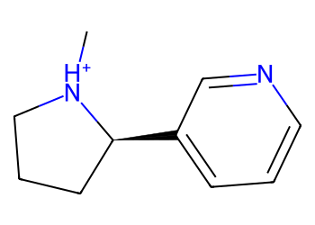
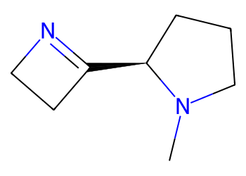
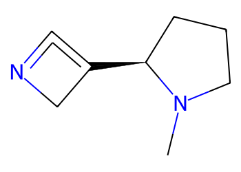
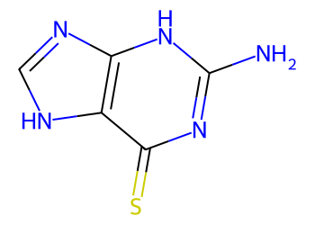
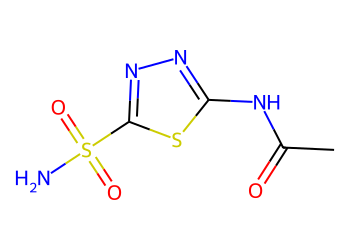
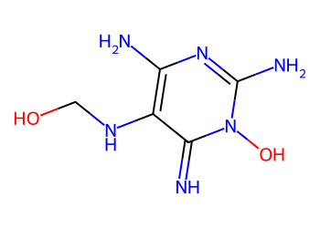

# Lead Optimization Report — 14990e3e56d3f4a728199e4fe079df492e4d0e0f
## Summary
- **Calibrated p(toxic):** 0.650
- **Threshold:** 0.510 → **Predicted class:** 1
- **Max similarity to train:** 0.340 (**bin:** 0.3-0.5)
- **OOD classification:** Out-of-domain
- **Result classification:** Generated suggestions available (Tier: Tier 1 — Flip)
- Similarity is low; treat any suggestions cautiously and consult fallback analogues.
## Base molecule
- **SMILES:** `C[NH+]1CCC[C@@H]1c1cccnc1`
- **True label:** 0



## Counterfactual search summary
- ExMol requested: 1800 | drawn: 1029
- Generated tier (Tier 1–4): Tier 1 — Flip
- Relaxation used: True (applied: relax_flip_0.4)
- Generated survivors (Tier 1–4): 2
- Dataset analogue fallback count (not included in survivors): 5
- Relaxation note: lower flip min_tanimoto to 0.4

### Filter attrition by tier (baseline + final relaxation)
<table>
<tr><th>Tier</th><th>Relaxation</th><th>Sampled</th><th>Kept</th><th>Invalid</th><th>Duplicate</th><th>Similarity</th><th>Prob</th><th>Δp</th><th>SA</th><th>ΔLogP</th><th>QED</th><th>Alerts</th></tr>
<tr><td>Tier 1 — Flip</td><td>none</td><td>1029</td><td>0</td><td>0</td><td>4</td><td>960</td><td>65</td><td>0</td><td>0</td><td>0</td><td>0</td><td>0</td></tr>
<tr><td>Tier 1 — Flip</td><td>relax_flip_0.4</td><td>1029</td><td>2</td><td>0</td><td>4</td><td>887</td><td>135</td><td>0</td><td>0</td><td>0</td><td>0</td><td>1</td></tr>
</table>

<details><summary>All filter attempts (diagnostic)</summary>
```json
[
  {
    "tier": "flip",
    "tier_label": "Tier 1 \u2014 Flip",
    "relaxation": "none",
    "relaxation_desc": "baseline constraints",
    "counts": {
      "sampled": 1029,
      "invalid": 0,
      "duplicate": 4,
      "similarity_filtered": 960,
      "prob_filtered": 65,
      "delta_filtered": 0,
      "sa_filtered": 0,
      "logp_filtered": 0,
      "qed_filtered": 0,
      "alert_filtered": 0,
      "kept": 0,
      "min_tanimoto_used": 0.5,
      "min_tanimoto_source": "min_tanimoto_flip",
      "prob_max_used": 0.509999,
      "delta_min_used": null,
      "sa_max_used": 4.5,
      "logp_delta_max_used": 1.5,
      "qed_min_used": 0.0,
      "pains_used": true
    }
  },
  {
    "tier": "flip",
    "tier_label": "Tier 1 \u2014 Flip",
    "relaxation": "relax_flip_0.4",
    "relaxation_desc": "lower flip min_tanimoto to 0.4",
    "counts": {
      "sampled": 1029,
      "invalid": 0,
      "duplicate": 4,
      "similarity_filtered": 887,
      "prob_filtered": 135,
      "delta_filtered": 0,
      "sa_filtered": 0,
      "logp_filtered": 0,
      "qed_filtered": 0,
      "alert_filtered": 1,
      "kept": 2,
      "min_tanimoto_used": 0.4,
      "min_tanimoto_source": "min_tanimoto_flip",
      "prob_max_used": 0.509999,
      "delta_min_used": null,
      "sa_max_used": 4.5,
      "logp_delta_max_used": 1.5,
      "qed_min_used": 0.0,
      "pains_used": true
    }
  }
]
```
</details>

## Counterfactual suggestions (filtered)
_Rows below are generated from Tier 1 — Flip (relaxation: relax_flip_0.4)._ 
<table>
<tr><th>Rank</th><th>Structure</th><th>Tier</th><th>Relaxation</th><th>Similarity</th><th>p(toxic)</th><th>Δp</th><th>LogP</th><th>QED</th><th>SA</th></tr>
<tr><td>1</td><td></td><td>Tier 1 — Flip</td><td>relax_flip_0.4</td><td>0.240</td><td>0.475</td><td>0.175</td><td>0.93</td><td>0.53</td><td>3.36</td></tr>
<tr><td>2</td><td></td><td>Tier 1 — Flip</td><td>relax_flip_0.4</td><td>0.224</td><td>0.475</td><td>0.175</td><td>0.69</td><td>0.52</td><td>4.37</td></tr>
</table>

## Dataset-derived analogues (fallback)
_Nearest analogues from the dataset (context only, not generated edits)._ 
<table>
<tr><th>Rank</th><th>Structure</th><th>Similarity</th><th>p(toxic)</th><th>Δp</th><th>LogP</th><th>QED</th><th>SA</th><th>Alerts</th><th>Actionable?</th></tr>
<tr><td>1</td><td></td><td>0.120</td><td>0.395</td><td>0.255</td><td>-1.04</td><td>0.56</td><td>2.54</td><td>OK</td><td>YES</td></tr>
<tr><td>2</td><td></td><td>0.057</td><td>0.395</td><td>0.255</td><td>0.60</td><td>0.50</td><td>3.30</td><td>⚠</td><td>NO</td></tr>
<tr><td>3</td><td></td><td>0.085</td><td>0.396</td><td>0.254</td><td>-1.75</td><td>0.49</td><td>2.79</td><td>OK</td><td>YES</td></tr>
<tr><td>4</td><td></td><td>0.055</td><td>0.396</td><td>0.254</td><td>-0.86</td><td>0.63</td><td>2.46</td><td>⚠</td><td>NO</td></tr>
<tr><td>5</td><td></td><td>0.055</td><td>0.396</td><td>0.254</td><td>-1.87</td><td>0.24</td><td>3.84</td><td>⚠</td><td>NO</td></tr>
</table>

## Raw records (for audit)
### Counterfactuals JSON
```json
[
  {
    "raw_smiles": "CN1CCC[C@@H]1C1=NCC1",
    "smiles": "CN1CCC[C@@H]1C1=NCC1",
    "similarity": 0.24,
    "p": 0.4745802828706941,
    "delta_p": 0.17503863961261812,
    "logp": 0.9252999999999999,
    "qed": 0.5259331623174448,
    "sascore": 3.361051558473992,
    "alert": false,
    "tier": "diagnostic_close_edits",
    "tier_label": "Tier 1 \u2014 Flip",
    "relaxation": "relax_flip_0.4",
    "relaxation_desc": "lower flip min_tanimoto to 0.4",
    "p_raw": 0.4745802828706941,
    "delta_p_raw": 0.18524867860272332,
    "tier_raw": "flip",
    "tier_num_std": 4,
    "tier_label_std": "diagnostic_close_edits"
  },
  {
    "raw_smiles": "CN1CCC[C@@H]1C1=C=NC1",
    "smiles": "CN1CCC[C@@H]1C1=C=NC1",
    "similarity": 0.22448979591836735,
    "p": 0.4745802828706941,
    "delta_p": 0.17503863961261812,
    "logp": 0.6902999999999999,
    "qed": 0.5175702942854419,
    "sascore": 4.374990569463005,
    "alert": false,
    "tier": "diagnostic_close_edits",
    "tier_label": "Tier 1 \u2014 Flip",
    "relaxation": "relax_flip_0.4",
    "relaxation_desc": "lower flip min_tanimoto to 0.4",
    "p_raw": 0.4745802828706941,
    "delta_p_raw": 0.18524867860272332,
    "tier_raw": "flip",
    "tier_num_std": 4,
    "tier_label_std": "diagnostic_close_edits"
  }
]
```
### Dataset analogues JSON
```json
[
  {
    "raw_smiles": "Cn1c(=O)c2[nH]cnc2n(C)c1=O",
    "smiles": "Cn1c(=O)c2[nH]cnc2n(C)c1=O",
    "similarity": 0.12,
    "p": 0.39478944477282535,
    "delta_p": 0.25482947771048686,
    "logp": -1.0397000000000005,
    "qed": 0.5624722357827983,
    "sascore": 2.5435777719868486,
    "sa_status": "ok",
    "actionable": true,
    "alert": false,
    "tier": "dataset_analogue",
    "tier_label": "Dataset analogue",
    "relaxation": "none",
    "relaxation_desc": "dataset fallback",
    "sa_max_used": 4.5,
    "pains_used": true
  },
  {
    "raw_smiles": "Nc1nc(=S)c2[nH]cnc2[nH]1",
    "smiles": "Nc1nc(=S)c2[nH]cnc2[nH]1",
    "similarity": 0.05660377358490566,
    "p": 0.39478944477282535,
    "delta_p": 0.25482947771048686,
    "logp": 0.5976899999999998,
    "qed": 0.5014913838271434,
    "sascore": 3.3037189467190657,
    "sa_status": "ok",
    "actionable": false,
    "alert": true,
    "tier": "dataset_analogue",
    "tier_label": "Dataset analogue",
    "relaxation": "none",
    "relaxation_desc": "dataset fallback",
    "sa_max_used": 4.5,
    "pains_used": true
  },
  {
    "raw_smiles": "Nc1nnnn1CCO",
    "smiles": "Nc1nnnn1CCO",
    "similarity": 0.0851063829787234,
    "p": 0.39562248764441715,
    "delta_p": 0.25399643483889506,
    "logp": -1.7524000000000002,
    "qed": 0.49374276519904164,
    "sascore": 2.7864784687640185,
    "sa_status": "ok",
    "actionable": true,
    "alert": false,
    "tier": "dataset_analogue",
    "tier_label": "Dataset analogue",
    "relaxation": "none",
    "relaxation_desc": "dataset fallback",
    "sa_max_used": 4.5,
    "pains_used": true
  },
  {
    "raw_smiles": "CC(=O)Nc1nnc(S(N)(=O)=O)s1",
    "smiles": "CC(=O)Nc1nnc(S(N)(=O)=O)s1",
    "similarity": 0.05454545454545454,
    "p": 0.39562248764441715,
    "delta_p": 0.25399643483889506,
    "logp": -0.8561000000000003,
    "qed": 0.6318586926732331,
    "sascore": 2.460960564488465,
    "sa_status": "ok",
    "actionable": false,
    "alert": true,
    "tier": "dataset_analogue",
    "tier_label": "Dataset analogue",
    "relaxation": "none",
    "relaxation_desc": "dataset fallback",
    "sa_max_used": 4.5,
    "pains_used": true
  },
  {
    "raw_smiles": "N=c1c(NCO)c(N)nc(N)n1O",
    "smiles": "N=c1c(NCO)c(N)nc(N)n1O",
    "similarity": 0.05454545454545454,
    "p": 0.39562248764441715,
    "delta_p": 0.25399643483889506,
    "logp": -1.8740299999999999,
    "qed": 0.23532334371198804,
    "sascore": 3.838770971728284,
    "sa_status": "ok",
    "actionable": false,
    "alert": true,
    "tier": "dataset_analogue",
    "tier_label": "Dataset analogue",
    "relaxation": "none",
    "relaxation_desc": "dataset fallback",
    "sa_max_used": 4.5,
    "pains_used": true
  }
]
```
