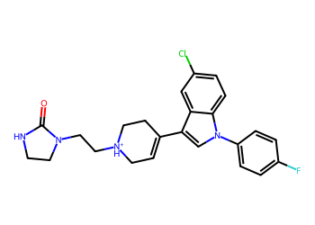
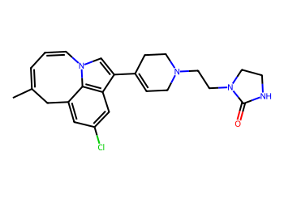
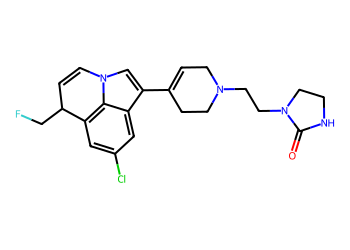
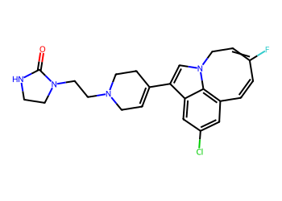

# Lead Optimization Report — 20ae67ffe6fb365715533270623337b04f656686
## Summary
- **Calibrated p(toxic):** 0.661
- **Threshold:** 0.510 → **Predicted class:** 1
- **Max similarity to train:** 0.700 (**bin:** >0.7)
- **OOD classification:** In-domain
- **Result classification:** Generated suggestions available (Tier: Tier 1 — Flip)
- Similarity is in-domain; suggestions should be more reliable locally.
## Base molecule
- **SMILES:** `O=C1NCCN1CC[NH+]1CC=C(c2cn(-c3ccc(F)cc3)c3ccc(Cl)cc23)CC1`
- **True label:** 1



## Counterfactual search summary
- ExMol requested: 1800 | drawn: 1549
- Generated tier (Tier 1–4): Tier 1 — Flip
- Relaxation used: False (applied: none)
- Generated survivors (Tier 1–4): 3
- Dataset analogue fallback count (not included in survivors): 0
- Relaxation note: baseline constraints

### Filter attrition by tier (baseline + final relaxation)
<table>
<tr><th>Tier</th><th>Relaxation</th><th>Sampled</th><th>Kept</th><th>Invalid</th><th>Duplicate</th><th>Similarity</th><th>Prob</th><th>Δp</th><th>SA</th><th>ΔLogP</th><th>QED</th><th>Alerts</th></tr>
<tr><td>Tier 1 — Flip</td><td>none</td><td>1549</td><td>3</td><td>0</td><td>2</td><td>1083</td><td>458</td><td>0</td><td>2</td><td>1</td><td>0</td><td>0</td></tr>
</table>

<details><summary>All filter attempts (diagnostic)</summary>
```json
[
  {
    "tier": "flip",
    "tier_label": "Tier 1 \u2014 Flip",
    "relaxation": "none",
    "relaxation_desc": "baseline constraints",
    "counts": {
      "sampled": 1549,
      "invalid": 0,
      "duplicate": 2,
      "similarity_filtered": 1083,
      "prob_filtered": 458,
      "delta_filtered": 0,
      "sa_filtered": 2,
      "logp_filtered": 1,
      "qed_filtered": 0,
      "alert_filtered": 0,
      "kept": 3,
      "min_tanimoto_used": 0.5,
      "min_tanimoto_source": "min_tanimoto_flip",
      "prob_max_used": 0.509999,
      "delta_min_used": null,
      "sa_max_used": 4.5,
      "logp_delta_max_used": 1.5,
      "qed_min_used": 0.0,
      "pains_used": true
    }
  }
]
```
</details>

## Counterfactual suggestions (filtered)
_Rows below are generated from Tier 1 — Flip (relaxation: none)._ 
<table>
<tr><th>Rank</th><th>Structure</th><th>Tier</th><th>Relaxation</th><th>Similarity</th><th>p(toxic)</th><th>Δp</th><th>LogP</th><th>QED</th><th>SA</th></tr>
<tr><td>1</td><td></td><td>Tier 1 — Flip</td><td>none</td><td>0.500</td><td>0.406</td><td>0.255</td><td>4.38</td><td>0.79</td><td>3.50</td></tr>
<tr><td>2</td><td></td><td>Tier 1 — Flip</td><td>none</td><td>0.526</td><td>0.412</td><td>0.250</td><td>3.95</td><td>0.80</td><td>4.02</td></tr>
<tr><td>3</td><td></td><td>Tier 1 — Flip</td><td>none</td><td>0.568</td><td>0.422</td><td>0.239</td><td>4.29</td><td>0.79</td><td>3.49</td></tr>
</table>

## Raw records (for audit)
### Counterfactuals JSON
```json
[
  {
    "raw_smiles": "CC1=CC=Cn2cc(C3=CCN(CCN4CCNC4=O)CC3)c3cc(Cl)cc(c32)C1",
    "smiles": "CC1=CC=Cn2cc(C3=CCN(CCN4CCNC4=O)CC3)c3cc(Cl)cc(c32)C1",
    "similarity": 0.5,
    "p": 0.40607110919879225,
    "delta_p": 0.2551887054472814,
    "logp": 4.382100000000004,
    "qed": 0.7937083524929136,
    "sascore": 3.498543528759411,
    "alert": false,
    "tier": "flip",
    "tier_label": "Tier 1 \u2014 Flip",
    "relaxation": "none",
    "relaxation_desc": "baseline constraints",
    "p_raw": 0.40607110919879225,
    "delta_p_raw": 0.2551887054472814,
    "tier_raw": "flip",
    "tier_num_std": 1,
    "tier_label_std": "flip"
  },
  {
    "raw_smiles": "O=C1NCCN1CCN1CC=C(c2cn3c4c(cc(Cl)cc24)C(CF)C=C3)CC1",
    "smiles": "O=C1NCCN1CCN1CC=C(c2cn3c4c(cc(Cl)cc24)C(CF)C=C3)CC1",
    "similarity": 0.5256410256410257,
    "p": 0.4115966835011852,
    "delta_p": 0.24966313114488842,
    "logp": 3.9464000000000024,
    "qed": 0.8044306293301797,
    "sascore": 4.019369091341682,
    "alert": false,
    "tier": "flip",
    "tier_label": "Tier 1 \u2014 Flip",
    "relaxation": "none",
    "relaxation_desc": "baseline constraints",
    "p_raw": 0.4115966835011852,
    "delta_p_raw": 0.24966313114488842,
    "tier_raw": "flip",
    "tier_num_std": 1,
    "tier_label_std": "flip"
  },
  {
    "raw_smiles": "O=C1NCCN1CCN1CC=C(c2cn3c4c(cc(Cl)cc24)C=CC(F)=CC3)CC1",
    "smiles": "O=C1NCCN1CCN1CC=C(c2cn3c4c(cc(Cl)cc24)C=CC(F)=CC3)CC1",
    "similarity": 0.5675675675675675,
    "p": 0.42214829300324475,
    "delta_p": 0.2391115216428289,
    "logp": 4.289200000000004,
    "qed": 0.7918779550104146,
    "sascore": 3.4901307966639195,
    "alert": false,
    "tier": "flip",
    "tier_label": "Tier 1 \u2014 Flip",
    "relaxation": "none",
    "relaxation_desc": "baseline constraints",
    "p_raw": 0.42214829300324475,
    "delta_p_raw": 0.2391115216428289,
    "tier_raw": "flip",
    "tier_num_std": 1,
    "tier_label_std": "flip"
  }
]
```
### Dataset analogues JSON
```json
[]
```
