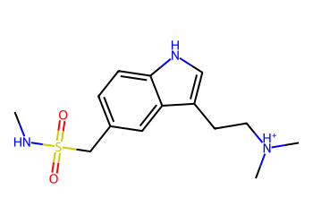
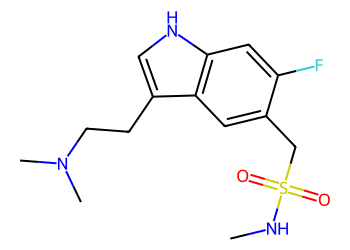
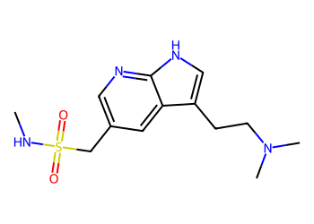
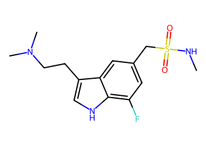
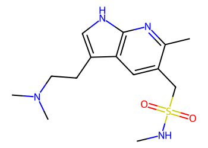
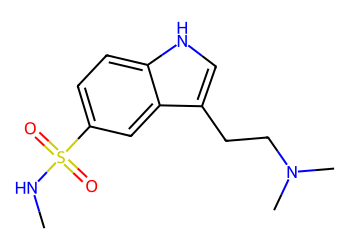
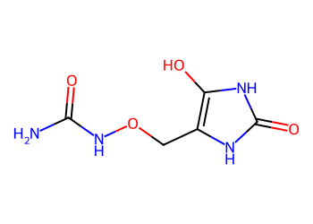

# Lead Optimization Report — 29e4bd10a745bd3ba4be5fe95dd4d136737949f7
## Summary
- **Calibrated p(toxic):** 0.566
- **Threshold:** 0.510 → **Predicted class:** 1
- **Max similarity to train:** 0.246 (**bin:** <0.3)
- **OOD classification:** Very out-of-domain
- **Result classification:** Generated suggestions available (Tier: Tier 1 — Flip)
- Similarity is very low; generated suggestions may be scarce and fallback analogues are provided for context.
## Base molecule
- **SMILES:** `CNS(=O)(=O)Cc1ccc2[nH]cc(CC[NH+](C)C)c2c1`
- **True label:** 0



## Counterfactual search summary
- ExMol requested: 1800 | drawn: 1310
- Generated tier (Tier 1–4): Tier 1 — Flip
- Relaxation used: False (applied: none)
- Generated survivors (Tier 1–4): 5
- Dataset analogue fallback count (not included in survivors): 5
- Relaxation note: baseline constraints

### Filter attrition by tier (baseline + final relaxation)
<table>
<tr><th>Tier</th><th>Relaxation</th><th>Sampled</th><th>Kept</th><th>Invalid</th><th>Duplicate</th><th>Similarity</th><th>Prob</th><th>Δp</th><th>SA</th><th>ΔLogP</th><th>QED</th><th>Alerts</th></tr>
<tr><td>Tier 1 — Flip</td><td>none</td><td>1310</td><td>7</td><td>0</td><td>4</td><td>1074</td><td>219</td><td>0</td><td>0</td><td>1</td><td>0</td><td>5</td></tr>
</table>

<details><summary>All filter attempts (diagnostic)</summary>
```json
[
  {
    "tier": "flip",
    "tier_label": "Tier 1 \u2014 Flip",
    "relaxation": "none",
    "relaxation_desc": "baseline constraints",
    "counts": {
      "sampled": 1310,
      "invalid": 0,
      "duplicate": 4,
      "similarity_filtered": 1074,
      "prob_filtered": 219,
      "delta_filtered": 0,
      "sa_filtered": 0,
      "logp_filtered": 1,
      "qed_filtered": 0,
      "alert_filtered": 5,
      "kept": 7,
      "min_tanimoto_used": 0.5,
      "min_tanimoto_source": "min_tanimoto_flip",
      "prob_max_used": 0.509999,
      "delta_min_used": null,
      "sa_max_used": 4.5,
      "logp_delta_max_used": 1.5,
      "qed_min_used": 0.0,
      "pains_used": true
    }
  }
]
```
</details>

## Counterfactual suggestions (filtered)
_Rows below are generated from Tier 1 — Flip (relaxation: none)._ 
<table>
<tr><th>Rank</th><th>Structure</th><th>Tier</th><th>Relaxation</th><th>Similarity</th><th>p(toxic)</th><th>Δp</th><th>LogP</th><th>QED</th><th>SA</th></tr>
<tr><td>1</td><td></td><td>Tier 1 — Flip</td><td>none</td><td>0.226</td><td>0.427</td><td>0.138</td><td>1.46</td><td>0.85</td><td>2.60</td></tr>
<tr><td>2</td><td></td><td>Tier 1 — Flip</td><td>none</td><td>0.185</td><td>0.427</td><td>0.138</td><td>0.72</td><td>0.82</td><td>2.66</td></tr>
<tr><td>3</td><td></td><td>Tier 1 — Flip</td><td>none</td><td>0.182</td><td>0.427</td><td>0.138</td><td>1.46</td><td>0.85</td><td>2.69</td></tr>
<tr><td>4</td><td></td><td>Tier 1 — Flip</td><td>none</td><td>0.192</td><td>0.427</td><td>0.138</td><td>1.02</td><td>0.84</td><td>2.80</td></tr>
<tr><td>5</td><td></td><td>Tier 1 — Flip</td><td>none</td><td>0.254</td><td>0.486</td><td>0.080</td><td>1.18</td><td>0.86</td><td>2.22</td></tr>
</table>

## Dataset-derived analogues (fallback)
_Nearest analogues from the dataset (context only, not generated edits)._ 
<table>
<tr><th>Rank</th><th>Structure</th><th>Similarity</th><th>p(toxic)</th><th>Δp</th><th>LogP</th><th>QED</th><th>SA</th><th>Alerts</th><th>Actionable?</th></tr>
<tr><td>1</td><td></td><td>0.098</td><td>0.395</td><td>0.171</td><td>-1.04</td><td>0.56</td><td>2.54</td><td>OK</td><td>YES</td></tr>
<tr><td>2</td><td></td><td>0.081</td><td>0.395</td><td>0.171</td><td>0.60</td><td>0.50</td><td>3.30</td><td>⚠</td><td>NO</td></tr>
<tr><td>3</td><td></td><td>0.100</td><td>0.396</td><td>0.170</td><td>-2.07</td><td>0.33</td><td>2.17</td><td>⚠</td><td>NO</td></tr>
<tr><td>4</td><td></td><td>0.095</td><td>0.396</td><td>0.170</td><td>-0.86</td><td>0.63</td><td>2.46</td><td>⚠</td><td>NO</td></tr>
<tr><td>5</td><td></td><td>0.078</td><td>0.396</td><td>0.170</td><td>-1.49</td><td>0.37</td><td>3.39</td><td>⚠</td><td>NO</td></tr>
</table>

## Raw records (for audit)
### Counterfactuals JSON
```json
[
  {
    "raw_smiles": "CNS(=O)(=O)Cc1cc2c(CCN(C)C)c[nH]c2cc1F",
    "smiles": "CNS(=O)(=O)Cc1cc2c(CCN(C)C)c[nH]c2cc1F",
    "similarity": 0.22580645161290322,
    "p": 0.4274583483195352,
    "delta_p": 0.13821927306648907,
    "logp": 1.4602999999999997,
    "qed": 0.8484233580365843,
    "sascore": 2.600431474683182,
    "alert": false,
    "tier": "diagnostic_close_edits",
    "tier_label": "Tier 1 \u2014 Flip",
    "relaxation": "none",
    "relaxation_desc": "baseline constraints",
    "p_raw": 0.4274583483195352,
    "delta_p_raw": 0.15590560862248803,
    "tier_raw": "flip",
    "tier_num_std": 4,
    "tier_label_std": "diagnostic_close_edits"
  },
  {
    "raw_smiles": "CNS(=O)(=O)Cc1cnc2[nH]cc(CCN(C)C)c2c1",
    "smiles": "CNS(=O)(=O)Cc1cnc2[nH]cc(CCN(C)C)c2c1",
    "similarity": 0.18461538461538463,
    "p": 0.4274583483195352,
    "delta_p": 0.13821927306648907,
    "logp": 0.7161999999999995,
    "qed": 0.8230149866382235,
    "sascore": 2.656739291894935,
    "alert": false,
    "tier": "diagnostic_close_edits",
    "tier_label": "Tier 1 \u2014 Flip",
    "relaxation": "none",
    "relaxation_desc": "baseline constraints",
    "p_raw": 0.4274583483195352,
    "delta_p_raw": 0.15590560862248803,
    "tier_raw": "flip",
    "tier_num_std": 4,
    "tier_label_std": "diagnostic_close_edits"
  },
  {
    "raw_smiles": "CNS(=O)(=O)Cc1cc(F)c2[nH]cc(CCN(C)C)c2c1",
    "smiles": "CNS(=O)(=O)Cc1cc(F)c2[nH]cc(CCN(C)C)c2c1",
    "similarity": 0.18181818181818182,
    "p": 0.4274583483195352,
    "delta_p": 0.13821927306648907,
    "logp": 1.4603,
    "qed": 0.8484233580365843,
    "sascore": 2.6915343086912795,
    "alert": false,
    "tier": "diagnostic_close_edits",
    "tier_label": "Tier 1 \u2014 Flip",
    "relaxation": "none",
    "relaxation_desc": "baseline constraints",
    "p_raw": 0.4274583483195352,
    "delta_p_raw": 0.15590560862248803,
    "tier_raw": "flip",
    "tier_num_std": 4,
    "tier_label_std": "diagnostic_close_edits"
  },
  {
    "raw_smiles": "CNS(=O)(=O)Cc1cc2c(CCN(C)C)c[nH]c2nc1C",
    "smiles": "CNS(=O)(=O)Cc1cc2c(CCN(C)C)c[nH]c2nc1C",
    "similarity": 0.19230769230769232,
    "p": 0.4274583483195352,
    "delta_p": 0.13821927306648907,
    "logp": 1.0246199999999996,
    "qed": 0.8350121506924431,
    "sascore": 2.79978208197063,
    "alert": false,
    "tier": "diagnostic_close_edits",
    "tier_label": "Tier 1 \u2014 Flip",
    "relaxation": "none",
    "relaxation_desc": "baseline constraints",
    "p_raw": 0.4274583483195352,
    "delta_p_raw": 0.15590560862248803,
    "tier_raw": "flip",
    "tier_num_std": 4,
    "tier_label_std": "diagnostic_close_edits"
  },
  {
    "raw_smiles": "CNS(=O)(=O)c1ccc2[nH]cc(CCN(C)C)c2c1",
    "smiles": "CNS(=O)(=O)c1ccc2[nH]cc(CCN(C)C)c2c1",
    "similarity": 0.2542372881355932,
    "p": 0.48596694266709856,
    "delta_p": 0.07971067871892573,
    "logp": 1.1801,
    "qed": 0.8647107256185664,
    "sascore": 2.2207377009209672,
    "alert": false,
    "tier": "diagnostic_close_edits",
    "tier_label": "Tier 1 \u2014 Flip",
    "relaxation": "none",
    "relaxation_desc": "baseline constraints",
    "p_raw": 0.48596694266709856,
    "delta_p_raw": 0.0973970142749247,
    "tier_raw": "flip",
    "tier_num_std": 4,
    "tier_label_std": "diagnostic_close_edits"
  }
]
```
### Dataset analogues JSON
```json
[
  {
    "raw_smiles": "Cn1c(=O)c2[nH]cnc2n(C)c1=O",
    "smiles": "Cn1c(=O)c2[nH]cnc2n(C)c1=O",
    "similarity": 0.09836065573770492,
    "p": 0.39478944477282535,
    "delta_p": 0.17088817661319894,
    "logp": -1.0397000000000005,
    "qed": 0.5624722357827983,
    "sascore": 2.5435777719868486,
    "sa_status": "ok",
    "actionable": true,
    "alert": false,
    "tier": "dataset_analogue",
    "tier_label": "Dataset analogue",
    "relaxation": "none",
    "relaxation_desc": "dataset fallback",
    "sa_max_used": 4.5,
    "pains_used": true
  },
  {
    "raw_smiles": "Nc1nc(=S)c2[nH]cnc2[nH]1",
    "smiles": "Nc1nc(=S)c2[nH]cnc2[nH]1",
    "similarity": 0.08064516129032258,
    "p": 0.39478944477282535,
    "delta_p": 0.17088817661319894,
    "logp": 0.5976899999999998,
    "qed": 0.5014913838271434,
    "sascore": 3.3037189467190657,
    "sa_status": "ok",
    "actionable": false,
    "alert": true,
    "tier": "dataset_analogue",
    "tier_label": "Dataset analogue",
    "relaxation": "none",
    "relaxation_desc": "dataset fallback",
    "sa_max_used": 4.5,
    "pains_used": true
  },
  {
    "raw_smiles": "O=C(O)CN(CCN(CC(=O)O)CC(=O)O)CC(=O)O",
    "smiles": "O=C(O)CN(CCN(CC(=O)O)CC(=O)O)CC(=O)O",
    "similarity": 0.1,
    "p": 0.39562248764441715,
    "delta_p": 0.17005513374160713,
    "logp": -2.0711999999999957,
    "qed": 0.333294737123963,
    "sascore": 2.171402762983991,
    "sa_status": "ok",
    "actionable": false,
    "alert": true,
    "tier": "dataset_analogue",
    "tier_label": "Dataset analogue",
    "relaxation": "none",
    "relaxation_desc": "dataset fallback",
    "sa_max_used": 4.5,
    "pains_used": true
  },
  {
    "raw_smiles": "CC(=O)Nc1nnc(S(N)(=O)=O)s1",
    "smiles": "CC(=O)Nc1nnc(S(N)(=O)=O)s1",
    "similarity": 0.09523809523809523,
    "p": 0.39562248764441715,
    "delta_p": 0.17005513374160713,
    "logp": -0.8561000000000003,
    "qed": 0.6318586926732331,
    "sascore": 2.460960564488465,
    "sa_status": "ok",
    "actionable": false,
    "alert": true,
    "tier": "dataset_analogue",
    "tier_label": "Dataset analogue",
    "relaxation": "none",
    "relaxation_desc": "dataset fallback",
    "sa_max_used": 4.5,
    "pains_used": true
  },
  {
    "raw_smiles": "NC(=O)NOCc1[nH]c(=O)[nH]c1O",
    "smiles": "NC(=O)NOCc1[nH]c(=O)[nH]c1O",
    "similarity": 0.078125,
    "p": 0.39562248764441715,
    "delta_p": 0.17005513374160713,
    "logp": -1.4915000000000007,
    "qed": 0.36918015695991285,
    "sascore": 3.392398431327507,
    "sa_status": "ok",
    "actionable": false,
    "alert": true,
    "tier": "dataset_analogue",
    "tier_label": "Dataset analogue",
    "relaxation": "none",
    "relaxation_desc": "dataset fallback",
    "sa_max_used": 4.5,
    "pains_used": true
  }
]
```
