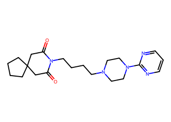
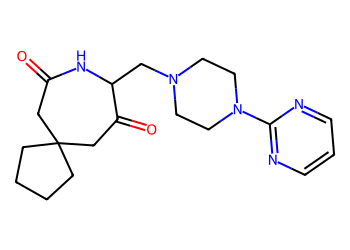
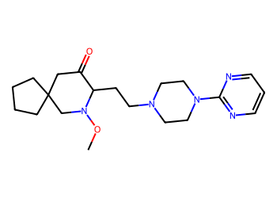
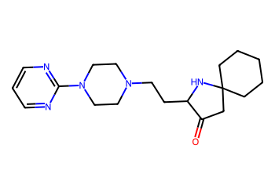
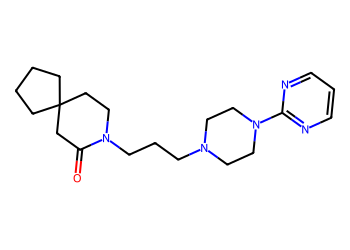
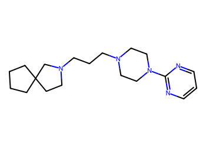

# Lead Optimization Report — 2f58388a144ceb04bad77c3d285f9a1edb39c1dd
## Summary
- **Calibrated p(toxic):** 0.458
- **Threshold:** 0.510 → **Predicted class:** 0
- **Max similarity to train:** 0.270 (**bin:** <0.3)
- **OOD classification:** Very out-of-domain
- **Result classification:** Generated suggestions available (Tier: Tier 1 — Flip)
- Similarity is very low; generated suggestions may be scarce and fallback analogues are provided for context.
## Base molecule
- **SMILES:** `O=C1CC2(CCCC2)CC(=O)N1CCCCN1CCN(c2ncccn2)CC1`
- **True label:** 1



## Counterfactual search summary
- ExMol requested: 1800 | drawn: 1355
- Generated tier (Tier 1–4): Tier 1 — Flip
- Relaxation used: False (applied: none)
- Generated survivors (Tier 1–4): 5
- Dataset analogue fallback count (not included in survivors): 5
- Relaxation note: baseline constraints

### Filter attrition by tier (baseline + final relaxation)
<table>
<tr><th>Tier</th><th>Relaxation</th><th>Sampled</th><th>Kept</th><th>Invalid</th><th>Duplicate</th><th>Similarity</th><th>Prob</th><th>Δp</th><th>SA</th><th>ΔLogP</th><th>QED</th><th>Alerts</th></tr>
<tr><td>Tier 1 — Flip</td><td>none</td><td>1355</td><td>13</td><td>0</td><td>5</td><td>975</td><td>56</td><td>0</td><td>5</td><td>10</td><td>0</td><td>291</td></tr>
</table>

<details><summary>All filter attempts (diagnostic)</summary>
```json
[
  {
    "tier": "flip",
    "tier_label": "Tier 1 \u2014 Flip",
    "relaxation": "none",
    "relaxation_desc": "baseline constraints",
    "counts": {
      "sampled": 1355,
      "invalid": 0,
      "duplicate": 5,
      "similarity_filtered": 975,
      "prob_filtered": 56,
      "delta_filtered": 0,
      "sa_filtered": 5,
      "logp_filtered": 10,
      "qed_filtered": 0,
      "alert_filtered": 291,
      "kept": 13,
      "min_tanimoto_used": 0.5,
      "min_tanimoto_source": "min_tanimoto_flip",
      "prob_max_used": 0.509999,
      "delta_min_used": null,
      "sa_max_used": 4.5,
      "logp_delta_max_used": 1.5,
      "qed_min_used": 0.0,
      "pains_used": true
    }
  }
]
```
</details>

## Counterfactual suggestions (filtered)
_Rows below are generated from Tier 1 — Flip (relaxation: none)._ 
<table>
<tr><th>Rank</th><th>Structure</th><th>Tier</th><th>Relaxation</th><th>Similarity</th><th>p(toxic)</th><th>Δp</th><th>LogP</th><th>QED</th><th>SA</th></tr>
<tr><td>1</td><td></td><td>Tier 1 — Flip</td><td>none</td><td>0.210</td><td>0.420</td><td>0.038</td><td>1.01</td><td>0.87</td><td>3.74</td></tr>
<tr><td>2</td><td></td><td>Tier 1 — Flip</td><td>none</td><td>0.214</td><td>0.420</td><td>0.038</td><td>1.75</td><td>0.78</td><td>3.92</td></tr>
<tr><td>3</td><td></td><td>Tier 1 — Flip</td><td>none</td><td>0.228</td><td>0.420</td><td>0.038</td><td>1.62</td><td>0.90</td><td>3.79</td></tr>
<tr><td>4</td><td></td><td>Tier 1 — Flip</td><td>none</td><td>0.271</td><td>0.458</td><td>0.000</td><td>2.17</td><td>0.81</td><td>2.99</td></tr>
<tr><td>5</td><td></td><td>Tier 1 — Flip</td><td>none</td><td>0.258</td><td>0.458</td><td>0.000</td><td>2.25</td><td>0.83</td><td>2.85</td></tr>
</table>

## Dataset-derived analogues (fallback)
_Nearest analogues from the dataset (context only, not generated edits)._ 
<table>
<tr><th>Rank</th><th>Structure</th><th>Similarity</th><th>p(toxic)</th><th>Δp</th><th>LogP</th><th>QED</th><th>SA</th><th>Alerts</th><th>Actionable?</th></tr>
<tr><td>1</td><td></td><td>0.138</td><td>0.395</td><td>0.063</td><td>-1.04</td><td>0.56</td><td>2.54</td><td>OK</td><td>YES</td></tr>
<tr><td>2</td><td></td><td>0.082</td><td>0.395</td><td>0.063</td><td>0.60</td><td>0.50</td><td>3.30</td><td>⚠</td><td>NO</td></tr>
<tr><td>3</td><td></td><td>0.117</td><td>0.396</td><td>0.062</td><td>-1.37</td><td>0.52</td><td>2.66</td><td>OK</td><td>YES</td></tr>
<tr><td>4</td><td></td><td>0.094</td><td>0.396</td><td>0.062</td><td>-0.89</td><td>0.38</td><td>2.75</td><td>OK</td><td>YES</td></tr>
<tr><td>5</td><td></td><td>0.092</td><td>0.396</td><td>0.062</td><td>5.39</td><td>0.30</td><td>3.21</td><td>⚠</td><td>NO</td></tr>
</table>

## Raw records (for audit)
### Counterfactuals JSON
```json
[
  {
    "raw_smiles": "O=C1CC2(CCCC2)CC(=O)C(CN2CCN(c3ncccn3)CC2)N1",
    "smiles": "O=C1CC2(CCCC2)CC(=O)C(CN2CCN(c3ncccn3)CC2)N1",
    "similarity": 0.20987654320987653,
    "p": 0.41963938450246285,
    "delta_p": 0.037963475074500375,
    "logp": 1.0067000000000006,
    "qed": 0.8697522672288917,
    "sascore": 3.738426117132338,
    "alert": false,
    "tier": "diagnostic_close_edits",
    "tier_label": "Tier 1 \u2014 Flip",
    "relaxation": "none",
    "relaxation_desc": "baseline constraints",
    "p_raw": 0.41963938450246285,
    "delta_p_raw": 0.037963475074500375,
    "tier_raw": "flip",
    "tier_num_std": 4,
    "tier_label_std": "diagnostic_close_edits"
  },
  {
    "raw_smiles": "CON1CC2(CCCC2)CC(=O)C1CCN1CCN(c2ncccn2)CC1",
    "smiles": "CON1CC2(CCCC2)CC(=O)C1CCN1CCN(c2ncccn2)CC1",
    "similarity": 0.21428571428571427,
    "p": 0.41963938450246285,
    "delta_p": 0.037963475074500375,
    "logp": 1.7538999999999996,
    "qed": 0.7791578516499905,
    "sascore": 3.922742814484918,
    "alert": false,
    "tier": "diagnostic_close_edits",
    "tier_label": "Tier 1 \u2014 Flip",
    "relaxation": "none",
    "relaxation_desc": "baseline constraints",
    "p_raw": 0.41963938450246285,
    "delta_p_raw": 0.037963475074500375,
    "tier_raw": "flip",
    "tier_num_std": 4,
    "tier_label_std": "diagnostic_close_edits"
  },
  {
    "raw_smiles": "O=C1CC2(CCCCC2)NC1CCN1CCN(c2ncccn2)CC1",
    "smiles": "O=C1CC2(CCCCC2)NC1CCN1CCN(c2ncccn2)CC1",
    "similarity": 0.22784810126582278,
    "p": 0.41963938450246285,
    "delta_p": 0.037963475074500375,
    "logp": 1.6225999999999994,
    "qed": 0.8964379443050082,
    "sascore": 3.794769020427003,
    "alert": false,
    "tier": "diagnostic_close_edits",
    "tier_label": "Tier 1 \u2014 Flip",
    "relaxation": "none",
    "relaxation_desc": "baseline constraints",
    "p_raw": 0.41963938450246285,
    "delta_p_raw": 0.037963475074500375,
    "tier_raw": "flip",
    "tier_num_std": 4,
    "tier_label_std": "diagnostic_close_edits"
  },
  {
    "raw_smiles": "O=C1CC2(CCCC2)CCN1CCCN1CCN(c2ncccn2)CC1",
    "smiles": "O=C1CC2(CCCC2)CCN1CCCN1CCN(c2ncccn2)CC1",
    "similarity": 0.2714285714285714,
    "p": 0.45760285957696323,
    "delta_p": 0.0,
    "logp": 2.1715,
    "qed": 0.8083567425047129,
    "sascore": 2.9949495434000024,
    "alert": false,
    "tier": "diagnostic_close_edits",
    "tier_label": "Tier 1 \u2014 Flip",
    "relaxation": "none",
    "relaxation_desc": "baseline constraints",
    "p_raw": 0.45760285957696323,
    "delta_p_raw": 0.0,
    "tier_raw": "flip",
    "tier_num_std": 4,
    "tier_label_std": "diagnostic_close_edits"
  },
  {
    "raw_smiles": "c1cnc(N2CCN(CCCN3CCC4(CCCC4)C3)CC2)nc1",
    "smiles": "c1cnc(N2CCN(CCCN3CCC4(CCCC4)C3)CC2)nc1",
    "similarity": 0.25757575757575757,
    "p": 0.45760285957696323,
    "delta_p": 0.0,
    "logp": 2.2547999999999995,
    "qed": 0.8278857813744189,
    "sascore": 2.850782028755532,
    "alert": false,
    "tier": "diagnostic_close_edits",
    "tier_label": "Tier 1 \u2014 Flip",
    "relaxation": "none",
    "relaxation_desc": "baseline constraints",
    "p_raw": 0.45760285957696323,
    "delta_p_raw": 0.0,
    "tier_raw": "flip",
    "tier_num_std": 4,
    "tier_label_std": "diagnostic_close_edits"
  }
]
```
### Dataset analogues JSON
```json
[
  {
    "raw_smiles": "Cn1c(=O)c2[nH]cnc2n(C)c1=O",
    "smiles": "Cn1c(=O)c2[nH]cnc2n(C)c1=O",
    "similarity": 0.13793103448275862,
    "p": 0.39478944477282535,
    "delta_p": 0.06281341480413788,
    "logp": -1.0397000000000005,
    "qed": 0.5624722357827983,
    "sascore": 2.5435777719868486,
    "sa_status": "ok",
    "actionable": true,
    "alert": false,
    "tier": "dataset_analogue",
    "tier_label": "Dataset analogue",
    "relaxation": "none",
    "relaxation_desc": "dataset fallback",
    "sa_max_used": 4.5,
    "pains_used": true
  },
  {
    "raw_smiles": "Nc1nc(=S)c2[nH]cnc2[nH]1",
    "smiles": "Nc1nc(=S)c2[nH]cnc2[nH]1",
    "similarity": 0.08196721311475409,
    "p": 0.39478944477282535,
    "delta_p": 0.06281341480413788,
    "logp": 0.5976899999999998,
    "qed": 0.5014913838271434,
    "sascore": 3.3037189467190657,
    "sa_status": "ok",
    "actionable": false,
    "alert": true,
    "tier": "dataset_analogue",
    "tier_label": "Dataset analogue",
    "relaxation": "none",
    "relaxation_desc": "dataset fallback",
    "sa_max_used": 4.5,
    "pains_used": true
  },
  {
    "raw_smiles": "O=C(O)CSc1n[nH]c(=O)[nH]c1=O",
    "smiles": "O=C(O)CSc1n[nH]c(=O)[nH]c1=O",
    "similarity": 0.11666666666666667,
    "p": 0.39562248764441715,
    "delta_p": 0.061980371932546074,
    "logp": -1.3651000000000004,
    "qed": 0.522012923698588,
    "sascore": 2.657270519239594,
    "sa_status": "ok",
    "actionable": true,
    "alert": false,
    "tier": "dataset_analogue",
    "tier_label": "Dataset analogue",
    "relaxation": "none",
    "relaxation_desc": "dataset fallback",
    "sa_max_used": 4.5,
    "pains_used": true
  },
  {
    "raw_smiles": "Nc1[nH]c(SCC(=O)O)nc(=O)c1N",
    "smiles": "Nc1[nH]c(SCC(=O)O)nc(=O)c1N",
    "similarity": 0.09375,
    "p": 0.39562248764441715,
    "delta_p": 0.061980371932546074,
    "logp": -0.8890000000000002,
    "qed": 0.37987832891849627,
    "sascore": 2.7514290264405794,
    "sa_status": "ok",
    "actionable": true,
    "alert": false,
    "tier": "dataset_analogue",
    "tier_label": "Dataset analogue",
    "relaxation": "none",
    "relaxation_desc": "dataset fallback",
    "sa_max_used": 4.5,
    "pains_used": true
  },
  {
    "raw_smiles": "O=c1[nH]c(SCc2c(Cl)c(Cl)c(Cl)c(Cl)c2Cl)nc(=S)[nH]1",
    "smiles": "O=c1[nH]c(SCc2c(Cl)c(Cl)c(Cl)c(Cl)c2Cl)nc(=S)[nH]1",
    "similarity": 0.09230769230769231,
    "p": 0.39562248764441715,
    "delta_p": 0.061980371932546074,
    "logp": 5.38679,
    "qed": 0.30084441175659915,
    "sascore": 3.2095886753772245,
    "sa_status": "ok",
    "actionable": false,
    "alert": true,
    "tier": "dataset_analogue",
    "tier_label": "Dataset analogue",
    "relaxation": "none",
    "relaxation_desc": "dataset fallback",
    "sa_max_used": 4.5,
    "pains_used": true
  }
]
```
