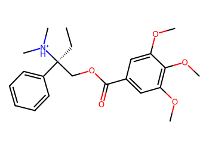
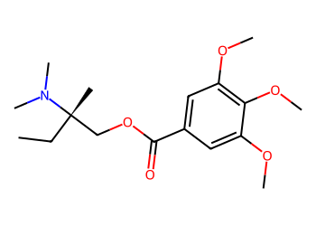
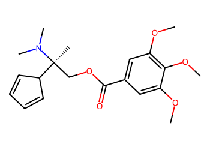
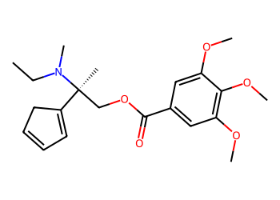
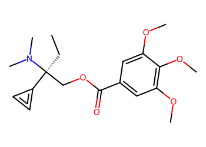
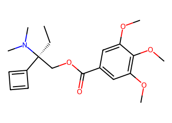

# Lead Optimization Report — 5d35bbec9770128b0437f80985d2a99241439a9f
## Summary
- **Calibrated p(toxic):** 0.629
- **Threshold:** 0.510 → **Predicted class:** 1
- **Max similarity to train:** 0.295 (**bin:** <0.3)
- **OOD classification:** Very out-of-domain
- **Result classification:** Generated suggestions available (Tier: Tier 1 — Flip)
- Similarity is very low; generated suggestions may be scarce and fallback analogues are provided for context.
## Base molecule
- **SMILES:** `CC[C@](COC(=O)c1cc(OC)c(OC)c(OC)c1)(c1ccccc1)[NH+](C)C`
- **True label:** 0



## Counterfactual search summary
- ExMol requested: 1800 | drawn: 1452
- Generated tier (Tier 1–4): Tier 1 — Flip
- Relaxation used: False (applied: none)
- Generated survivors (Tier 1–4): 5
- Dataset analogue fallback count (not included in survivors): 5
- Relaxation note: baseline constraints

### Filter attrition by tier (baseline + final relaxation)
<table>
<tr><th>Tier</th><th>Relaxation</th><th>Sampled</th><th>Kept</th><th>Invalid</th><th>Duplicate</th><th>Similarity</th><th>Prob</th><th>Δp</th><th>SA</th><th>ΔLogP</th><th>QED</th><th>Alerts</th></tr>
<tr><td>Tier 1 — Flip</td><td>none</td><td>1452</td><td>27</td><td>0</td><td>4</td><td>1073</td><td>300</td><td>0</td><td>0</td><td>1</td><td>0</td><td>47</td></tr>
</table>

<details><summary>All filter attempts (diagnostic)</summary>
```json
[
  {
    "tier": "flip",
    "tier_label": "Tier 1 \u2014 Flip",
    "relaxation": "none",
    "relaxation_desc": "baseline constraints",
    "counts": {
      "sampled": 1452,
      "invalid": 0,
      "duplicate": 4,
      "similarity_filtered": 1073,
      "prob_filtered": 300,
      "delta_filtered": 0,
      "sa_filtered": 0,
      "logp_filtered": 1,
      "qed_filtered": 0,
      "alert_filtered": 47,
      "kept": 27,
      "min_tanimoto_used": 0.5,
      "min_tanimoto_source": "min_tanimoto_flip",
      "prob_max_used": 0.509999,
      "delta_min_used": null,
      "sa_max_used": 4.5,
      "logp_delta_max_used": 1.5,
      "qed_min_used": 0.0,
      "pains_used": true
    }
  }
]
```
</details>

## Counterfactual suggestions (filtered)
_Rows below are generated from Tier 1 — Flip (relaxation: none)._ 
<table>
<tr><th>Rank</th><th>Structure</th><th>Tier</th><th>Relaxation</th><th>Similarity</th><th>p(toxic)</th><th>Δp</th><th>LogP</th><th>QED</th><th>SA</th></tr>
<tr><td>1</td><td></td><td>Tier 1 — Flip</td><td>none</td><td>0.268</td><td>0.417</td><td>0.211</td><td>2.60</td><td>0.68</td><td>2.85</td></tr>
<tr><td>2</td><td></td><td>Tier 1 — Flip</td><td>none</td><td>0.230</td><td>0.417</td><td>0.211</td><td>2.93</td><td>0.66</td><td>3.40</td></tr>
<tr><td>3</td><td></td><td>Tier 1 — Flip</td><td>none</td><td>0.231</td><td>0.426</td><td>0.203</td><td>3.47</td><td>0.62</td><td>3.40</td></tr>
<tr><td>4</td><td></td><td>Tier 1 — Flip</td><td>none</td><td>0.243</td><td>0.432</td><td>0.197</td><td>2.67</td><td>0.51</td><td>3.45</td></tr>
<tr><td>5</td><td></td><td>Tier 1 — Flip</td><td>none</td><td>0.240</td><td>0.432</td><td>0.197</td><td>3.08</td><td>0.63</td><td>3.23</td></tr>
</table>

## Dataset-derived analogues (fallback)
_Nearest analogues from the dataset (context only, not generated edits)._ 
<table>
<tr><th>Rank</th><th>Structure</th><th>Similarity</th><th>p(toxic)</th><th>Δp</th><th>LogP</th><th>QED</th><th>SA</th><th>Alerts</th><th>Actionable?</th></tr>
<tr><td>1</td><td></td><td>0.062</td><td>0.395</td><td>0.234</td><td>-1.04</td><td>0.56</td><td>2.54</td><td>OK</td><td>YES</td></tr>
<tr><td>2</td><td></td><td>0.030</td><td>0.395</td><td>0.234</td><td>0.60</td><td>0.50</td><td>3.30</td><td>⚠</td><td>NO</td></tr>
<tr><td>3</td><td></td><td>0.118</td><td>0.396</td><td>0.233</td><td>-2.07</td><td>0.33</td><td>2.17</td><td>⚠</td><td>NO</td></tr>
<tr><td>4</td><td></td><td>0.111</td><td>0.396</td><td>0.233</td><td>-1.85</td><td>0.47</td><td>3.19</td><td>OK</td><td>YES</td></tr>
<tr><td>5</td><td></td><td>0.105</td><td>0.396</td><td>0.233</td><td>-1.34</td><td>0.50</td><td>2.46</td><td>OK</td><td>YES</td></tr>
</table>

## Raw records (for audit)
### Counterfactuals JSON
```json
[
  {
    "raw_smiles": "CC[C@@](C)(COC(=O)c1cc(OC)c(OC)c(OC)c1)N(C)C",
    "smiles": "CC[C@@](C)(COC(=O)c1cc(OC)c(OC)c(OC)c1)N(C)C",
    "similarity": 0.26785714285714285,
    "p": 0.41729645506214647,
    "delta_p": 0.21147034770755818,
    "logp": 2.599500000000001,
    "qed": 0.684878681437234,
    "sascore": 2.8494171187986144,
    "alert": false,
    "tier": "diagnostic_close_edits",
    "tier_label": "Tier 1 \u2014 Flip",
    "relaxation": "none",
    "relaxation_desc": "baseline constraints",
    "p_raw": 0.41729645506214647,
    "delta_p_raw": 0.21483012348463765,
    "tier_raw": "flip",
    "tier_num_std": 4,
    "tier_label_std": "diagnostic_close_edits"
  },
  {
    "raw_smiles": "COc1cc(C(=O)OC[C@@](C)(C2C=CC=C2)N(C)C)cc(OC)c1OC",
    "smiles": "COc1cc(C(=O)OC[C@@](C)(C2C=CC=C2)N(C)C)cc(OC)c1OC",
    "similarity": 0.22972972972972974,
    "p": 0.41729645506214647,
    "delta_p": 0.21147034770755818,
    "logp": 2.931700000000001,
    "qed": 0.6637823748143515,
    "sascore": 3.400488573384103,
    "alert": false,
    "tier": "diagnostic_close_edits",
    "tier_label": "Tier 1 \u2014 Flip",
    "relaxation": "none",
    "relaxation_desc": "baseline constraints",
    "p_raw": 0.41729645506214647,
    "delta_p_raw": 0.21483012348463765,
    "tier_raw": "flip",
    "tier_num_std": 4,
    "tier_label_std": "diagnostic_close_edits"
  },
  {
    "raw_smiles": "CCN(C)[C@@](C)(COC(=O)c1cc(OC)c(OC)c(OC)c1)C1=CC=CC1",
    "smiles": "CCN(C)[C@@](C)(COC(=O)c1cc(OC)c(OC)c(OC)c1)C1=CC=CC1",
    "similarity": 0.23076923076923078,
    "p": 0.4262055143189995,
    "delta_p": 0.20256128845070515,
    "logp": 3.465900000000002,
    "qed": 0.6162449340603245,
    "sascore": 3.3990063716347194,
    "alert": false,
    "tier": "diagnostic_close_edits",
    "tier_label": "Tier 1 \u2014 Flip",
    "relaxation": "none",
    "relaxation_desc": "baseline constraints",
    "p_raw": 0.4262055143189995,
    "delta_p_raw": 0.2059210642277846,
    "tier_raw": "flip",
    "tier_num_std": 4,
    "tier_label_std": "diagnostic_close_edits"
  },
  {
    "raw_smiles": "CC[C@](COC(=O)c1cc(OC)c(OC)c(OC)c1)(C1=C=C1)N(C)C",
    "smiles": "CC[C@](COC(=O)c1cc(OC)c(OC)c(OC)c1)(C1=C=C1)N(C)C",
    "similarity": 0.24324324324324326,
    "p": 0.43220209489834616,
    "delta_p": 0.1965647078713585,
    "logp": 2.6747000000000005,
    "qed": 0.5056152085679128,
    "sascore": 3.454792653823901,
    "alert": false,
    "tier": "diagnostic_close_edits",
    "tier_label": "Tier 1 \u2014 Flip",
    "relaxation": "none",
    "relaxation_desc": "baseline constraints",
    "p_raw": 0.43220209489834616,
    "delta_p_raw": 0.19992448364843796,
    "tier_raw": "flip",
    "tier_num_std": 4,
    "tier_label_std": "diagnostic_close_edits"
  },
  {
    "raw_smiles": "CC[C@](COC(=O)c1cc(OC)c(OC)c(OC)c1)(C1=CC=C1)N(C)C",
    "smiles": "CC[C@](COC(=O)c1cc(OC)c(OC)c(OC)c1)(C1=CC=C1)N(C)C",
    "similarity": 0.24,
    "p": 0.43220209489834616,
    "delta_p": 0.1965647078713585,
    "logp": 3.075800000000002,
    "qed": 0.6302300970865861,
    "sascore": 3.23094267027313,
    "alert": false,
    "tier": "diagnostic_close_edits",
    "tier_label": "Tier 1 \u2014 Flip",
    "relaxation": "none",
    "relaxation_desc": "baseline constraints",
    "p_raw": 0.43220209489834616,
    "delta_p_raw": 0.19992448364843796,
    "tier_raw": "flip",
    "tier_num_std": 4,
    "tier_label_std": "diagnostic_close_edits"
  }
]
```
### Dataset analogues JSON
```json
[
  {
    "raw_smiles": "Cn1c(=O)c2[nH]cnc2n(C)c1=O",
    "smiles": "Cn1c(=O)c2[nH]cnc2n(C)c1=O",
    "similarity": 0.06153846153846154,
    "p": 0.39478944477282535,
    "delta_p": 0.2339773579968793,
    "logp": -1.0397000000000005,
    "qed": 0.5624722357827983,
    "sascore": 2.5435777719868486,
    "sa_status": "ok",
    "actionable": true,
    "alert": false,
    "tier": "dataset_analogue",
    "tier_label": "Dataset analogue",
    "relaxation": "none",
    "relaxation_desc": "dataset fallback",
    "sa_max_used": 4.5,
    "pains_used": true
  },
  {
    "raw_smiles": "Nc1nc(=S)c2[nH]cnc2[nH]1",
    "smiles": "Nc1nc(=S)c2[nH]cnc2[nH]1",
    "similarity": 0.029850746268656716,
    "p": 0.39478944477282535,
    "delta_p": 0.2339773579968793,
    "logp": 0.5976899999999998,
    "qed": 0.5014913838271434,
    "sascore": 3.3037189467190657,
    "sa_status": "ok",
    "actionable": false,
    "alert": true,
    "tier": "dataset_analogue",
    "tier_label": "Dataset analogue",
    "relaxation": "none",
    "relaxation_desc": "dataset fallback",
    "sa_max_used": 4.5,
    "pains_used": true
  },
  {
    "raw_smiles": "O=C(O)CN(CCN(CC(=O)O)CC(=O)O)CC(=O)O",
    "smiles": "O=C(O)CN(CCN(CC(=O)O)CC(=O)O)CC(=O)O",
    "similarity": 0.11764705882352941,
    "p": 0.39562248764441715,
    "delta_p": 0.2331443151252875,
    "logp": -2.0711999999999957,
    "qed": 0.333294737123963,
    "sascore": 2.171402762983991,
    "sa_status": "ok",
    "actionable": false,
    "alert": true,
    "tier": "dataset_analogue",
    "tier_label": "Dataset analogue",
    "relaxation": "none",
    "relaxation_desc": "dataset fallback",
    "sa_max_used": 4.5,
    "pains_used": true
  },
  {
    "raw_smiles": "NC(Cc1nn[nH]n1)C(=O)O",
    "smiles": "NC(Cc1nn[nH]n1)C(=O)O",
    "similarity": 0.1111111111111111,
    "p": 0.39562248764441715,
    "delta_p": 0.2331443151252875,
    "logp": -1.8459000000000003,
    "qed": 0.4738423616632481,
    "sascore": 3.185883407216588,
    "sa_status": "ok",
    "actionable": true,
    "alert": false,
    "tier": "dataset_analogue",
    "tier_label": "Dataset analogue",
    "relaxation": "none",
    "relaxation_desc": "dataset fallback",
    "sa_max_used": 4.5,
    "pains_used": true
  },
  {
    "raw_smiles": "Nc1nc(N)nc(CC(=O)O)n1",
    "smiles": "Nc1nc(N)nc(CC(=O)O)n1",
    "similarity": 0.10526315789473684,
    "p": 0.39562248764441715,
    "delta_p": 0.2331443151252875,
    "logp": -1.3369,
    "qed": 0.49944774236295647,
    "sascore": 2.457943484484762,
    "sa_status": "ok",
    "actionable": true,
    "alert": false,
    "tier": "dataset_analogue",
    "tier_label": "Dataset analogue",
    "relaxation": "none",
    "relaxation_desc": "dataset fallback",
    "sa_max_used": 4.5,
    "pains_used": true
  }
]
```
