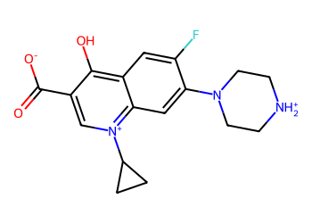
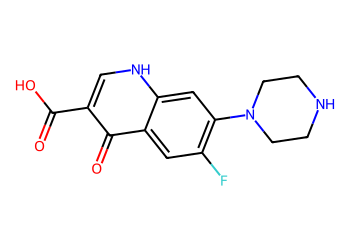
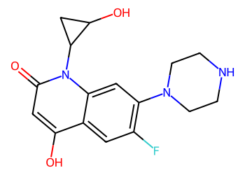

# Lead Optimization Report — 71a546711b11adbf8d7f352a83cc6805c7c5a32f
## Summary
- **Calibrated p(toxic):** 0.439
- **Threshold:** 0.510 → **Predicted class:** 0
- **Max similarity to train:** 0.522 (**bin:** 0.5-0.7)
- **OOD classification:** Borderline
- **Result classification:** Generated suggestions available (Tier: Tier 1 — Flip)
- Similarity is borderline; suggestions may be limited but still informative.
## Base molecule
- **SMILES:** `O=C([O-])c1c[n+](C2CC2)c2cc(N3CC[NH2+]CC3)c(F)cc2c1O`
- **True label:** 0



## Counterfactual search summary
- ExMol requested: 1800 | drawn: 1522
- Generated tier (Tier 1–4): Tier 1 — Flip
- Relaxation used: True (applied: relax_flip_0.4)
- Generated survivors (Tier 1–4): 2
- Dataset analogue fallback count (not included in survivors): 1
- Relaxation note: lower flip min_tanimoto to 0.4

### Filter attrition by tier (baseline + final relaxation)
<table>
<tr><th>Tier</th><th>Relaxation</th><th>Sampled</th><th>Kept</th><th>Invalid</th><th>Duplicate</th><th>Similarity</th><th>Prob</th><th>Δp</th><th>SA</th><th>ΔLogP</th><th>QED</th><th>Alerts</th></tr>
<tr><td>Tier 1 — Flip</td><td>none</td><td>1522</td><td>0</td><td>0</td><td>3</td><td>1305</td><td>33</td><td>0</td><td>36</td><td>3</td><td>0</td><td>142</td></tr>
<tr><td>Tier 1 — Flip</td><td>relax_flip_0.4</td><td>1522</td><td>2</td><td>0</td><td>3</td><td>1145</td><td>47</td><td>0</td><td>102</td><td>18</td><td>0</td><td>205</td></tr>
</table>

<details><summary>All filter attempts (diagnostic)</summary>
```json
[
  {
    "tier": "flip",
    "tier_label": "Tier 1 \u2014 Flip",
    "relaxation": "none",
    "relaxation_desc": "baseline constraints",
    "counts": {
      "sampled": 1522,
      "invalid": 0,
      "duplicate": 3,
      "similarity_filtered": 1305,
      "prob_filtered": 33,
      "delta_filtered": 0,
      "sa_filtered": 36,
      "logp_filtered": 3,
      "qed_filtered": 0,
      "alert_filtered": 142,
      "kept": 0,
      "min_tanimoto_used": 0.5,
      "min_tanimoto_source": "min_tanimoto_flip",
      "prob_max_used": 0.509999,
      "delta_min_used": null,
      "sa_max_used": 4.5,
      "logp_delta_max_used": 1.5,
      "qed_min_used": 0.0,
      "pains_used": true
    }
  },
  {
    "tier": "flip",
    "tier_label": "Tier 1 \u2014 Flip",
    "relaxation": "relax_flip_0.4",
    "relaxation_desc": "lower flip min_tanimoto to 0.4",
    "counts": {
      "sampled": 1522,
      "invalid": 0,
      "duplicate": 3,
      "similarity_filtered": 1145,
      "prob_filtered": 47,
      "delta_filtered": 0,
      "sa_filtered": 102,
      "logp_filtered": 18,
      "qed_filtered": 0,
      "alert_filtered": 205,
      "kept": 2,
      "min_tanimoto_used": 0.4,
      "min_tanimoto_source": "min_tanimoto_flip",
      "prob_max_used": 0.509999,
      "delta_min_used": null,
      "sa_max_used": 4.5,
      "logp_delta_max_used": 1.5,
      "qed_min_used": 0.0,
      "pains_used": true
    }
  }
]
```
</details>

## Counterfactual suggestions (filtered)
_Rows below are generated from Tier 1 — Flip (relaxation: relax_flip_0.4)._ 
<table>
<tr><th>Rank</th><th>Structure</th><th>Tier</th><th>Relaxation</th><th>Similarity</th><th>p(toxic)</th><th>Δp</th><th>LogP</th><th>QED</th><th>SA</th></tr>
<tr><td>1</td><td></td><td>Tier 1 — Flip</td><td>relax_flip_0.4</td><td>0.500</td><td>0.414</td><td>0.025</td><td>0.78</td><td>0.76</td><td>2.42</td></tr>
<tr><td>2</td><td></td><td>Tier 1 — Flip</td><td>relax_flip_0.4</td><td>0.476</td><td>0.414</td><td>0.025</td><td>0.56</td><td>0.75</td><td>3.51</td></tr>
</table>

## Dataset-derived analogues (fallback)
_Nearest analogues from the dataset (context only, not generated edits)._ 
<table>
<tr><th>Rank</th><th>Structure</th><th>Similarity</th><th>p(toxic)</th><th>Δp</th><th>LogP</th><th>QED</th><th>SA</th><th>Alerts</th><th>Actionable?</th></tr>
<tr><td>1</td><td></td><td>0.371</td><td>0.407</td><td>0.032</td><td>1.87</td><td>0.86</td><td>3.29</td><td>OK</td><td>YES</td></tr>
</table>

## Raw records (for audit)
### Counterfactuals JSON
```json
[
  {
    "raw_smiles": "O=C(O)c1cnc2cc(N3CCNCC3)c(F)cc2c1O",
    "smiles": "O=C(O)c1c[nH]c2cc(N3CCNCC3)c(F)cc2c1=O",
    "similarity": 0.5,
    "p": 0.4138924117061376,
    "delta_p": 0.025086938288375826,
    "logp": 0.7750000000000001,
    "qed": 0.760936166512818,
    "sascore": 2.420963046768545,
    "alert": false,
    "tier": "diagnostic_close_edits",
    "tier_label": "Tier 1 \u2014 Flip",
    "relaxation": "relax_flip_0.4",
    "relaxation_desc": "lower flip min_tanimoto to 0.4",
    "p_raw": 0.4138924117061376,
    "delta_p_raw": 0.025086938288375826,
    "tier_raw": "flip",
    "tier_num_std": 4,
    "tier_label_std": "diagnostic_close_edits"
  },
  {
    "raw_smiles": "O=c1cc(O)n(C2CC2O)c2cc(N3CCNCC3)c(F)cc12",
    "smiles": "O=c1cc(O)c2cc(F)c(N3CCNCC3)cc2n1C1CC1O",
    "similarity": 0.47619047619047616,
    "p": 0.4138924117061376,
    "delta_p": 0.025086938288375826,
    "logp": 0.5614999999999997,
    "qed": 0.7539495185787334,
    "sascore": 3.5115076641241343,
    "alert": false,
    "tier": "diagnostic_close_edits",
    "tier_label": "Tier 1 \u2014 Flip",
    "relaxation": "relax_flip_0.4",
    "relaxation_desc": "lower flip min_tanimoto to 0.4",
    "p_raw": 0.4138924117061376,
    "delta_p_raw": 0.025086938288375826,
    "tier_raw": "flip",
    "tier_num_std": 4,
    "tier_label_std": "diagnostic_close_edits"
  }
]
```
### Dataset analogues JSON
```json
[
  {
    "raw_smiles": "C[C@H]1Sc2c(C(=O)O)c(=O)c3cc(F)c(N4CCNCC4)cc3n21",
    "smiles": "C[C@H]1Sc2c(C(=O)O)c(=O)c3cc(F)c(N4CCNCC4)cc3n21",
    "similarity": 0.37142857142857144,
    "p": 0.4066996575344859,
    "delta_p": 0.03227969246002754,
    "logp": 1.8725999999999998,
    "qed": 0.8622628338904335,
    "sascore": 3.290931741729125,
    "sa_status": "ok",
    "actionable": true,
    "alert": false,
    "tier": "dataset_analogue",
    "tier_label": "Dataset analogue",
    "relaxation": "none",
    "relaxation_desc": "dataset fallback",
    "sa_max_used": 4.5,
    "pains_used": true
  }
]
```
