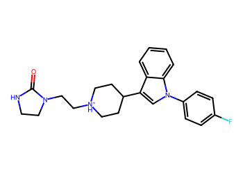
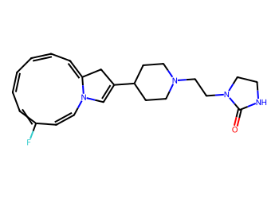
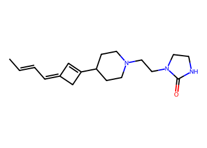
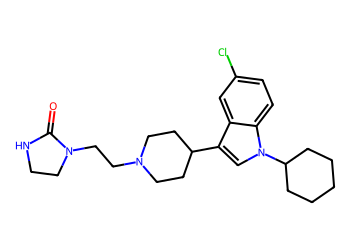
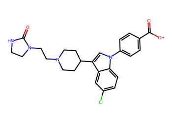
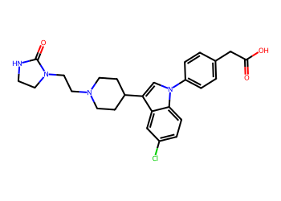
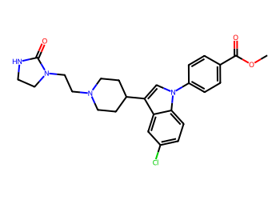

# Lead Optimization Report — 73aada1e2e67eda5237013f15911fffaaafeb49c
## Summary
- **Calibrated p(toxic):** 0.642
- **Threshold:** 0.510 → **Predicted class:** 1
- **Max similarity to train:** 0.774 (**bin:** >0.7)
- **OOD classification:** In-domain
- **Result classification:** Generated suggestions available (Tier: Tier 1 — Flip)
- Similarity is in-domain; suggestions should be more reliable locally.
## Base molecule
- **SMILES:** `O=C1NCCN1CC[NH+]1CCC(c2cn(-c3ccc(F)cc3)c3ccccc23)CC1`
- **True label:** 1



## Counterfactual search summary
- ExMol requested: 1800 | drawn: 1521
- Generated tier (Tier 1–4): Tier 1 — Flip
- Relaxation used: True (applied: relax_flip_0.4)
- Generated survivors (Tier 1–4): 2
- Dataset analogue fallback count (not included in survivors): 5
- Relaxation note: lower flip min_tanimoto to 0.4

### Filter attrition by tier (baseline + final relaxation)
<table>
<tr><th>Tier</th><th>Relaxation</th><th>Sampled</th><th>Kept</th><th>Invalid</th><th>Duplicate</th><th>Similarity</th><th>Prob</th><th>Δp</th><th>SA</th><th>ΔLogP</th><th>QED</th><th>Alerts</th></tr>
<tr><td>Tier 1 — Flip</td><td>none</td><td>1521</td><td>0</td><td>0</td><td>2</td><td>1056</td><td>463</td><td>0</td><td>0</td><td>0</td><td>0</td><td>0</td></tr>
<tr><td>Tier 1 — Flip</td><td>relax_flip_0.4</td><td>1521</td><td>2</td><td>0</td><td>2</td><td>797</td><td>715</td><td>0</td><td>0</td><td>5</td><td>0</td><td>0</td></tr>
</table>

<details><summary>All filter attempts (diagnostic)</summary>
```json
[
  {
    "tier": "flip",
    "tier_label": "Tier 1 \u2014 Flip",
    "relaxation": "none",
    "relaxation_desc": "baseline constraints",
    "counts": {
      "sampled": 1521,
      "invalid": 0,
      "duplicate": 2,
      "similarity_filtered": 1056,
      "prob_filtered": 463,
      "delta_filtered": 0,
      "sa_filtered": 0,
      "logp_filtered": 0,
      "qed_filtered": 0,
      "alert_filtered": 0,
      "kept": 0,
      "min_tanimoto_used": 0.5,
      "min_tanimoto_source": "min_tanimoto_flip",
      "prob_max_used": 0.509999,
      "delta_min_used": null,
      "sa_max_used": 4.5,
      "logp_delta_max_used": 1.5,
      "qed_min_used": 0.0,
      "pains_used": true
    }
  },
  {
    "tier": "flip",
    "tier_label": "Tier 1 \u2014 Flip",
    "relaxation": "relax_flip_0.4",
    "relaxation_desc": "lower flip min_tanimoto to 0.4",
    "counts": {
      "sampled": 1521,
      "invalid": 0,
      "duplicate": 2,
      "similarity_filtered": 797,
      "prob_filtered": 715,
      "delta_filtered": 0,
      "sa_filtered": 0,
      "logp_filtered": 5,
      "qed_filtered": 0,
      "alert_filtered": 0,
      "kept": 2,
      "min_tanimoto_used": 0.4,
      "min_tanimoto_source": "min_tanimoto_flip",
      "prob_max_used": 0.509999,
      "delta_min_used": null,
      "sa_max_used": 4.5,
      "logp_delta_max_used": 1.5,
      "qed_min_used": 0.0,
      "pains_used": true
    }
  }
]
```
</details>

## Counterfactual suggestions (filtered)
_Rows below are generated from Tier 1 — Flip (relaxation: relax_flip_0.4)._ 
<table>
<tr><th>Rank</th><th>Structure</th><th>Tier</th><th>Relaxation</th><th>Similarity</th><th>p(toxic)</th><th>Δp</th><th>LogP</th><th>QED</th><th>SA</th></tr>
<tr><td>1</td><td></td><td>Tier 1 — Flip</td><td>relax_flip_0.4</td><td>0.411</td><td>0.492</td><td>0.150</td><td>3.69</td><td>0.79</td><td>4.18</td></tr>
<tr><td>2</td><td></td><td>Tier 1 — Flip</td><td>relax_flip_0.4</td><td>0.418</td><td>0.505</td><td>0.137</td><td>2.56</td><td>0.85</td><td>3.20</td></tr>
</table>

## Dataset-derived analogues (fallback)
_Nearest analogues from the dataset (context only, not generated edits)._ 
<table>
<tr><th>Rank</th><th>Structure</th><th>Similarity</th><th>p(toxic)</th><th>Δp</th><th>LogP</th><th>QED</th><th>SA</th><th>Alerts</th><th>Actionable?</th></tr>
<tr><td>1</td><td></td><td>0.677</td><td>0.599</td><td>0.043</td><td>4.49</td><td>0.66</td><td>2.52</td><td>OK</td><td>YES</td></tr>
<tr><td>2</td><td></td><td>0.486</td><td>0.600</td><td>0.042</td><td>5.00</td><td>0.73</td><td>2.66</td><td>OK</td><td>YES</td></tr>
<tr><td>3</td><td></td><td>0.603</td><td>0.607</td><td>0.034</td><td>4.19</td><td>0.57</td><td>2.61</td><td>OK</td><td>YES</td></tr>
<tr><td>4</td><td></td><td>0.586</td><td>0.607</td><td>0.034</td><td>4.12</td><td>0.53</td><td>2.66</td><td>OK</td><td>YES</td></tr>
<tr><td>5</td><td></td><td>0.569</td><td>0.632</td><td>0.009</td><td>4.28</td><td>0.53</td><td>2.62</td><td>OK</td><td>YES</td></tr>
</table>

## Raw records (for audit)
### Counterfactuals JSON
```json
[
  {
    "raw_smiles": "O=C1NCCN1CCN1CCC(C2=CN3C=CC(F)=CC=CC=CC=C3C2)CC1",
    "smiles": "O=C1NCCN1CCN1CCC(C2=CN3C=CC(F)=CC=CC=CC=C3C2)CC1",
    "similarity": 0.410958904109589,
    "p": 0.4917114629754259,
    "delta_p": 0.15007060769789538,
    "logp": 3.6902000000000026,
    "qed": 0.7877694757757062,
    "sascore": 4.177443105562755,
    "alert": false,
    "tier": "diagnostic_close_edits",
    "tier_label": "Tier 1 \u2014 Flip",
    "relaxation": "relax_flip_0.4",
    "relaxation_desc": "lower flip min_tanimoto to 0.4",
    "p_raw": 0.4917114629754259,
    "delta_p_raw": 0.1986643633515207,
    "tier_raw": "flip",
    "tier_num_std": 4,
    "tier_label_std": "diagnostic_close_edits"
  },
  {
    "raw_smiles": "CC=CC=C1C=C(C2CCN(CCN3CCNC3=O)CC2)C1",
    "smiles": "CC=CC=C1C=C(C2CCN(CCN3CCNC3=O)CC2)C1",
    "similarity": 0.417910447761194,
    "p": 0.5049273174774054,
    "delta_p": 0.1368547531959159,
    "logp": 2.5562000000000005,
    "qed": 0.8468877336263626,
    "sascore": 3.2005101703735708,
    "alert": false,
    "tier": "diagnostic_close_edits",
    "tier_label": "Tier 1 \u2014 Flip",
    "relaxation": "relax_flip_0.4",
    "relaxation_desc": "lower flip min_tanimoto to 0.4",
    "p_raw": 0.5049273174774054,
    "delta_p_raw": 0.18544850884954123,
    "tier_raw": "flip",
    "tier_num_std": 4,
    "tier_label_std": "diagnostic_close_edits"
  }
]
```
### Dataset analogues JSON
```json
[
  {
    "raw_smiles": "O=C1NCCN1CCN1CCC(c2cn(-c3ccccc3)c3ccc(Cl)cc23)CC1",
    "smiles": "O=C1NCCN1CCN1CCC(c2cn(-c3ccccc3)c3ccc(Cl)cc23)CC1",
    "similarity": 0.6774193548387096,
    "p": 0.5985334377490399,
    "delta_p": 0.04324863292428138,
    "logp": 4.488500000000004,
    "qed": 0.657735744367849,
    "sascore": 2.515668962808121,
    "sa_status": "ok",
    "actionable": true,
    "alert": false,
    "tier": "dataset_analogue",
    "tier_label": "Dataset analogue",
    "relaxation": "none",
    "relaxation_desc": "dataset fallback",
    "sa_max_used": 4.5,
    "pains_used": true
  },
  {
    "raw_smiles": "O=C1NCCN1CCN1CCC(c2cn(C3CCCCC3)c3ccc(Cl)cc23)CC1",
    "smiles": "O=C1NCCN1CCN1CCC(c2cn(C3CCCCC3)c3ccc(Cl)cc23)CC1",
    "similarity": 0.4857142857142857,
    "p": 0.6000423880965996,
    "delta_p": 0.04173968257672167,
    "logp": 5.004500000000005,
    "qed": 0.7270837490609694,
    "sascore": 2.661766340430498,
    "sa_status": "ok",
    "actionable": true,
    "alert": false,
    "tier": "dataset_analogue",
    "tier_label": "Dataset analogue",
    "relaxation": "none",
    "relaxation_desc": "dataset fallback",
    "sa_max_used": 4.5,
    "pains_used": true
  },
  {
    "raw_smiles": "O=C(O)c1ccc(-n2cc(C3CCN(CCN4CCNC4=O)CC3)c3cc(Cl)ccc32)cc1",
    "smiles": "O=C(O)c1ccc(-n2cc(C3CCN(CCN4CCNC4=O)CC3)c3cc(Cl)ccc32)cc1",
    "similarity": 0.6029411764705882,
    "p": 0.6073509957452903,
    "delta_p": 0.03443107492803099,
    "logp": 4.186700000000004,
    "qed": 0.5707682273327199,
    "sascore": 2.6082928672604684,
    "sa_status": "ok",
    "actionable": true,
    "alert": false,
    "tier": "dataset_analogue",
    "tier_label": "Dataset analogue",
    "relaxation": "none",
    "relaxation_desc": "dataset fallback",
    "sa_max_used": 4.5,
    "pains_used": true
  },
  {
    "raw_smiles": "O=C(O)Cc1ccc(-n2cc(C3CCN(CCN4CCNC4=O)CC3)c3cc(Cl)ccc32)cc1",
    "smiles": "O=C(O)Cc1ccc(-n2cc(C3CCN(CCN4CCNC4=O)CC3)c3cc(Cl)ccc32)cc1",
    "similarity": 0.5857142857142857,
    "p": 0.6073509957452903,
    "delta_p": 0.03443107492803099,
    "logp": 4.115600000000003,
    "qed": 0.5330468942806741,
    "sascore": 2.6607575445423244,
    "sa_status": "ok",
    "actionable": true,
    "alert": false,
    "tier": "dataset_analogue",
    "tier_label": "Dataset analogue",
    "relaxation": "none",
    "relaxation_desc": "dataset fallback",
    "sa_max_used": 4.5,
    "pains_used": true
  },
  {
    "raw_smiles": "COC(=O)c1ccc(-n2cc(C3CCN(CCN4CCNC4=O)CC3)c3cc(Cl)ccc32)cc1",
    "smiles": "COC(=O)c1ccc(-n2cc(C3CCN(CCN4CCNC4=O)CC3)c3cc(Cl)ccc32)cc1",
    "similarity": 0.5694444444444444,
    "p": 0.6323911314689019,
    "delta_p": 0.009390939204419357,
    "logp": 4.275100000000003,
    "qed": 0.5347873907589458,
    "sascore": 2.6167945932079473,
    "sa_status": "ok",
    "actionable": true,
    "alert": false,
    "tier": "dataset_analogue",
    "tier_label": "Dataset analogue",
    "relaxation": "none",
    "relaxation_desc": "dataset fallback",
    "sa_max_used": 4.5,
    "pains_used": true
  }
]
```
