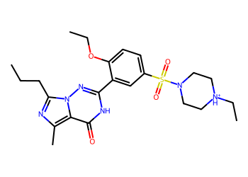
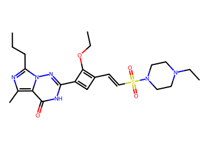
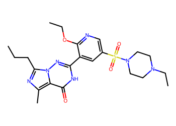
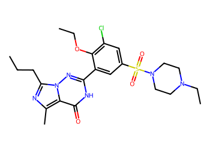
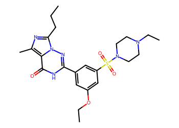
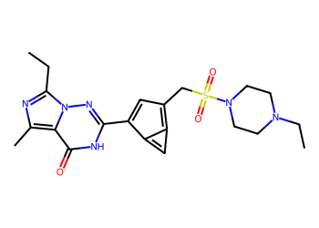
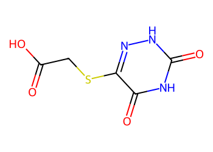
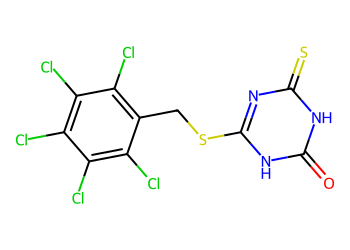
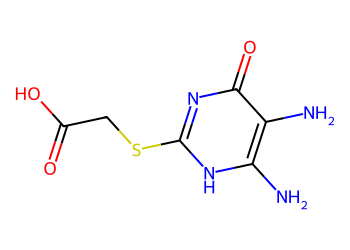

# Lead Optimization Report — 7a7205f68340a2895a326726c48d6d19021f08c8
## Summary
- **Calibrated p(toxic):** 0.577
- **Threshold:** 0.510 → **Predicted class:** 1
- **Max similarity to train:** 0.188 (**bin:** <0.3)
- **OOD classification:** Very out-of-domain
- **Result classification:** Generated suggestions available (Tier: Tier 1 — Flip)
- Similarity is very low; generated suggestions may be scarce and fallback analogues are provided for context.
## Base molecule
- **SMILES:** `CCCc1nc(C)c2c(=O)[nH]c(-c3cc(S(=O)(=O)N4CC[NH+](CC)CC4)ccc3OCC)nn12`
- **True label:** 1



## Counterfactual search summary
- ExMol requested: 1800 | drawn: 1570
- Generated tier (Tier 1–4): Tier 1 — Flip
- Relaxation used: False (applied: none)
- Generated survivors (Tier 1–4): 5
- Dataset analogue fallback count (not included in survivors): 5
- Relaxation note: baseline constraints

### Filter attrition by tier (baseline + final relaxation)
<table>
<tr><th>Tier</th><th>Relaxation</th><th>Sampled</th><th>Kept</th><th>Invalid</th><th>Duplicate</th><th>Similarity</th><th>Prob</th><th>Δp</th><th>SA</th><th>ΔLogP</th><th>QED</th><th>Alerts</th></tr>
<tr><td>Tier 1 — Flip</td><td>none</td><td>1570</td><td>35</td><td>0</td><td>4</td><td>1209</td><td>289</td><td>0</td><td>6</td><td>2</td><td>0</td><td>25</td></tr>
</table>

<details><summary>All filter attempts (diagnostic)</summary>
```json
[
  {
    "tier": "flip",
    "tier_label": "Tier 1 \u2014 Flip",
    "relaxation": "none",
    "relaxation_desc": "baseline constraints",
    "counts": {
      "sampled": 1570,
      "invalid": 0,
      "duplicate": 4,
      "similarity_filtered": 1209,
      "prob_filtered": 289,
      "delta_filtered": 0,
      "sa_filtered": 6,
      "logp_filtered": 2,
      "qed_filtered": 0,
      "alert_filtered": 25,
      "kept": 35,
      "min_tanimoto_used": 0.5,
      "min_tanimoto_source": "min_tanimoto_flip",
      "prob_max_used": 0.509999,
      "delta_min_used": null,
      "sa_max_used": 4.5,
      "logp_delta_max_used": 1.5,
      "qed_min_used": 0.0,
      "pains_used": true
    }
  }
]
```
</details>

## Counterfactual suggestions (filtered)
_Rows below are generated from Tier 1 — Flip (relaxation: none)._ 
<table>
<tr><th>Rank</th><th>Structure</th><th>Tier</th><th>Relaxation</th><th>Similarity</th><th>p(toxic)</th><th>Δp</th><th>LogP</th><th>QED</th><th>SA</th></tr>
<tr><td>1</td><td></td><td>Tier 1 — Flip</td><td>none</td><td>0.167</td><td>0.420</td><td>0.158</td><td>1.85</td><td>0.57</td><td>3.59</td></tr>
<tr><td>2</td><td></td><td>Tier 1 — Flip</td><td>none</td><td>0.175</td><td>0.422</td><td>0.155</td><td>1.47</td><td>0.50</td><td>3.08</td></tr>
<tr><td>3</td><td></td><td>Tier 1 — Flip</td><td>none</td><td>0.211</td><td>0.422</td><td>0.155</td><td>2.72</td><td>0.48</td><td>3.07</td></tr>
<tr><td>4</td><td></td><td>Tier 1 — Flip</td><td>none</td><td>0.175</td><td>0.422</td><td>0.155</td><td>2.07</td><td>0.52</td><td>2.97</td></tr>
<tr><td>5</td><td></td><td>Tier 1 — Flip</td><td>none</td><td>0.162</td><td>0.422</td><td>0.155</td><td>1.40</td><td>0.48</td><td>3.23</td></tr>
</table>

## Dataset-derived analogues (fallback)
_Nearest analogues from the dataset (context only, not generated edits)._ 
<table>
<tr><th>Rank</th><th>Structure</th><th>Similarity</th><th>p(toxic)</th><th>Δp</th><th>LogP</th><th>QED</th><th>SA</th><th>Alerts</th><th>Actionable?</th></tr>
<tr><td>1</td><td></td><td>0.127</td><td>0.395</td><td>0.183</td><td>-1.04</td><td>0.56</td><td>2.54</td><td>OK</td><td>YES</td></tr>
<tr><td>2</td><td></td><td>0.099</td><td>0.395</td><td>0.183</td><td>0.60</td><td>0.50</td><td>3.30</td><td>⚠</td><td>NO</td></tr>
<tr><td>3</td><td></td><td>0.111</td><td>0.396</td><td>0.182</td><td>-1.37</td><td>0.52</td><td>2.66</td><td>OK</td><td>YES</td></tr>
<tr><td>4</td><td></td><td>0.106</td><td>0.396</td><td>0.182</td><td>5.39</td><td>0.30</td><td>3.21</td><td>⚠</td><td>NO</td></tr>
<tr><td>5</td><td></td><td>0.094</td><td>0.396</td><td>0.182</td><td>-0.89</td><td>0.38</td><td>2.75</td><td>OK</td><td>YES</td></tr>
</table>

## Raw records (for audit)
### Counterfactuals JSON
```json
[
  {
    "raw_smiles": "CCCc1nc(C)c2c(=O)[nH]c(C3=CC(C=CS(=O)(=O)N4CCN(CC)CC4)=C3OCC)nn12",
    "smiles": "CCCc1nc(C)c2c(=O)[nH]c(C3=CC(C=CS(=O)(=O)N4CCN(CC)CC4)=C3OCC)nn12",
    "similarity": 0.16666666666666666,
    "p": 0.41963938450246285,
    "delta_p": 0.1578586341832332,
    "logp": 1.8471199999999999,
    "qed": 0.5730743438079107,
    "sascore": 3.5898905661072282,
    "alert": false,
    "tier": "diagnostic_close_edits",
    "tier_label": "Tier 1 \u2014 Flip",
    "relaxation": "none",
    "relaxation_desc": "baseline constraints",
    "p_raw": 0.41963938450246285,
    "delta_p_raw": 0.1578586341832332,
    "tier_raw": "flip",
    "tier_num_std": 4,
    "tier_label_std": "diagnostic_close_edits"
  },
  {
    "raw_smiles": "CCCc1nc(C)c2c(=O)[nH]c(-c3cc(S(=O)(=O)N4CCN(CC)CC4)cnc3OCC)nn12",
    "smiles": "CCCc1nc(C)c2c(=O)[nH]c(-c3cc(S(=O)(=O)N4CCN(CC)CC4)cnc3OCC)nn12",
    "similarity": 0.17525773195876287,
    "p": 0.42214829300324475,
    "delta_p": 0.1553497256824513,
    "logp": 1.4654200000000002,
    "qed": 0.5041286591062588,
    "sascore": 3.08027923007484,
    "alert": false,
    "tier": "diagnostic_close_edits",
    "tier_label": "Tier 1 \u2014 Flip",
    "relaxation": "none",
    "relaxation_desc": "baseline constraints",
    "p_raw": 0.42214829300324475,
    "delta_p_raw": 0.1553497256824513,
    "tier_raw": "flip",
    "tier_num_std": 4,
    "tier_label_std": "diagnostic_close_edits"
  },
  {
    "raw_smiles": "CCCc1nc(C)c2c(=O)[nH]c(-c3cc(S(=O)(=O)N4CCN(CC)CC4)cc(Cl)c3OCC)nn12",
    "smiles": "CCCc1nc(C)c2c(=O)[nH]c(-c3cc(S(=O)(=O)N4CCN(CC)CC4)cc(Cl)c3OCC)nn12",
    "similarity": 0.21052631578947367,
    "p": 0.42214829300324475,
    "delta_p": 0.1553497256824513,
    "logp": 2.723820000000001,
    "qed": 0.48361280053014816,
    "sascore": 3.06954911433572,
    "alert": false,
    "tier": "diagnostic_close_edits",
    "tier_label": "Tier 1 \u2014 Flip",
    "relaxation": "none",
    "relaxation_desc": "baseline constraints",
    "p_raw": 0.42214829300324475,
    "delta_p_raw": 0.1553497256824513,
    "tier_raw": "flip",
    "tier_num_std": 4,
    "tier_label_std": "diagnostic_close_edits"
  },
  {
    "raw_smiles": "CCCc1nc(C)c2c(=O)[nH]c(-c3cc(OCC)cc(S(=O)(=O)N4CCN(CC)CC4)c3)nn12",
    "smiles": "CCCc1nc(C)c2c(=O)[nH]c(-c3cc(OCC)cc(S(=O)(=O)N4CCN(CC)CC4)c3)nn12",
    "similarity": 0.17475728155339806,
    "p": 0.42214829300324475,
    "delta_p": 0.1553497256824513,
    "logp": 2.0704199999999995,
    "qed": 0.5164114874787473,
    "sascore": 2.9690960721801005,
    "alert": false,
    "tier": "diagnostic_close_edits",
    "tier_label": "Tier 1 \u2014 Flip",
    "relaxation": "none",
    "relaxation_desc": "baseline constraints",
    "p_raw": 0.42214829300324475,
    "delta_p_raw": 0.1553497256824513,
    "tier_raw": "flip",
    "tier_num_std": 4,
    "tier_label_std": "diagnostic_close_edits"
  },
  {
    "raw_smiles": "CCc1nc(C)c2c(=O)[nH]c(-c3cc(CS(=O)(=O)N4CCN(CC)CC4)c4cc3-4)nn12",
    "smiles": "CCc1nc(C)c2c(=O)[nH]c(-c3cc(CS(=O)(=O)N4CCN(CC)CC4)c4cc3-4)nn12",
    "similarity": 0.16161616161616163,
    "p": 0.42214829300324475,
    "delta_p": 0.1553497256824513,
    "logp": 1.4031199999999997,
    "qed": 0.48418407211360615,
    "sascore": 3.2251275762814426,
    "alert": false,
    "tier": "diagnostic_close_edits",
    "tier_label": "Tier 1 \u2014 Flip",
    "relaxation": "none",
    "relaxation_desc": "baseline constraints",
    "p_raw": 0.42214829300324475,
    "delta_p_raw": 0.1553497256824513,
    "tier_raw": "flip",
    "tier_num_std": 4,
    "tier_label_std": "diagnostic_close_edits"
  }
]
```
### Dataset analogues JSON
```json
[
  {
    "raw_smiles": "Cn1c(=O)c2[nH]cnc2n(C)c1=O",
    "smiles": "Cn1c(=O)c2[nH]cnc2n(C)c1=O",
    "similarity": 0.12658227848101267,
    "p": 0.39478944477282535,
    "delta_p": 0.1827085739128707,
    "logp": -1.0397000000000005,
    "qed": 0.5624722357827983,
    "sascore": 2.5435777719868486,
    "sa_status": "ok",
    "actionable": true,
    "alert": false,
    "tier": "dataset_analogue",
    "tier_label": "Dataset analogue",
    "relaxation": "none",
    "relaxation_desc": "dataset fallback",
    "sa_max_used": 4.5,
    "pains_used": true
  },
  {
    "raw_smiles": "Nc1nc(=S)c2[nH]cnc2[nH]1",
    "smiles": "Nc1nc(=S)c2[nH]cnc2[nH]1",
    "similarity": 0.09876543209876543,
    "p": 0.39478944477282535,
    "delta_p": 0.1827085739128707,
    "logp": 0.5976899999999998,
    "qed": 0.5014913838271434,
    "sascore": 3.3037189467190657,
    "sa_status": "ok",
    "actionable": false,
    "alert": true,
    "tier": "dataset_analogue",
    "tier_label": "Dataset analogue",
    "relaxation": "none",
    "relaxation_desc": "dataset fallback",
    "sa_max_used": 4.5,
    "pains_used": true
  },
  {
    "raw_smiles": "O=C(O)CSc1n[nH]c(=O)[nH]c1=O",
    "smiles": "O=C(O)CSc1n[nH]c(=O)[nH]c1=O",
    "similarity": 0.1111111111111111,
    "p": 0.39562248764441715,
    "delta_p": 0.1818755310412789,
    "logp": -1.3651000000000004,
    "qed": 0.522012923698588,
    "sascore": 2.657270519239594,
    "sa_status": "ok",
    "actionable": true,
    "alert": false,
    "tier": "dataset_analogue",
    "tier_label": "Dataset analogue",
    "relaxation": "none",
    "relaxation_desc": "dataset fallback",
    "sa_max_used": 4.5,
    "pains_used": true
  },
  {
    "raw_smiles": "O=c1[nH]c(SCc2c(Cl)c(Cl)c(Cl)c(Cl)c2Cl)nc(=S)[nH]1",
    "smiles": "O=c1[nH]c(SCc2c(Cl)c(Cl)c(Cl)c(Cl)c2Cl)nc(=S)[nH]1",
    "similarity": 0.10588235294117647,
    "p": 0.39562248764441715,
    "delta_p": 0.1818755310412789,
    "logp": 5.38679,
    "qed": 0.30084441175659915,
    "sascore": 3.2095886753772245,
    "sa_status": "ok",
    "actionable": false,
    "alert": true,
    "tier": "dataset_analogue",
    "tier_label": "Dataset analogue",
    "relaxation": "none",
    "relaxation_desc": "dataset fallback",
    "sa_max_used": 4.5,
    "pains_used": true
  },
  {
    "raw_smiles": "Nc1[nH]c(SCC(=O)O)nc(=O)c1N",
    "smiles": "Nc1[nH]c(SCC(=O)O)nc(=O)c1N",
    "similarity": 0.09411764705882353,
    "p": 0.39562248764441715,
    "delta_p": 0.1818755310412789,
    "logp": -0.8890000000000002,
    "qed": 0.37987832891849627,
    "sascore": 2.7514290264405794,
    "sa_status": "ok",
    "actionable": true,
    "alert": false,
    "tier": "dataset_analogue",
    "tier_label": "Dataset analogue",
    "relaxation": "none",
    "relaxation_desc": "dataset fallback",
    "sa_max_used": 4.5,
    "pains_used": true
  }
]
```
