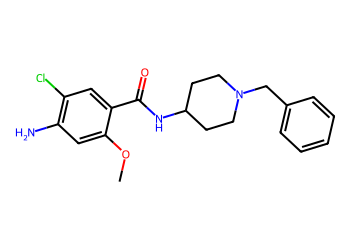
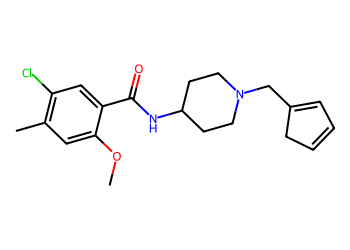
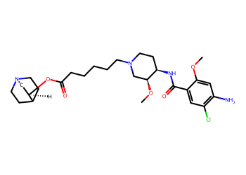
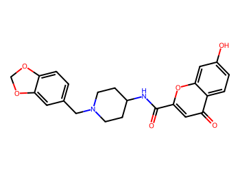
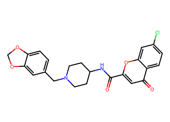
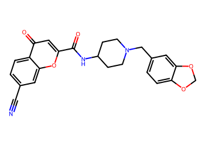
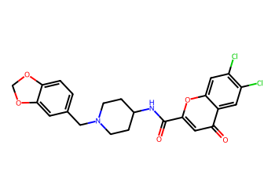

# Lead Optimization Report — a180e37baa48f151c00cf5a65b7810eab27a3ed7
## Summary
- **Calibrated p(toxic):** 0.677
- **Threshold:** 0.510 → **Predicted class:** 1
- **Max similarity to train:** 0.500 (**bin:** 0.5-0.7)
- **OOD classification:** Borderline
- **Result classification:** Generated suggestions available (Tier: Tier 2 — Risk reduction)
- Similarity is borderline; suggestions may be limited but still informative.
## Base molecule
- **SMILES:** `COc1cc(N)c(Cl)cc1C(=O)NC1CCN(Cc2ccccc2)CC1`
- **True label:** 1



## Counterfactual search summary
- ExMol requested: 1800 | drawn: 1421
- Generated tier (Tier 1–4): Tier 2 — Risk reduction
- Relaxation used: True (applied: relax_improve_0.5)
- Generated survivors (Tier 1–4): 1
- Dataset analogue fallback count (not included in survivors): 5
- Relaxation note: lower improve min_tanimoto to 0.5

### Filter attrition by tier (baseline + final relaxation)
<table>
<tr><th>Tier</th><th>Relaxation</th><th>Sampled</th><th>Kept</th><th>Invalid</th><th>Duplicate</th><th>Similarity</th><th>Prob</th><th>Δp</th><th>SA</th><th>ΔLogP</th><th>QED</th><th>Alerts</th></tr>
<tr><td>Tier 1 — Flip</td><td>none</td><td>1421</td><td>0</td><td>0</td><td>6</td><td>1009</td><td>394</td><td>0</td><td>0</td><td>3</td><td>0</td><td>9</td></tr>
<tr><td>Tier 1 — Flip</td><td>relax_improve_0.5</td><td>1421</td><td>0</td><td>0</td><td>6</td><td>1009</td><td>394</td><td>0</td><td>0</td><td>3</td><td>0</td><td>9</td></tr>
<tr><td>Tier 2 — Risk reduction</td><td>none</td><td>1421</td><td>0</td><td>0</td><td>6</td><td>1335</td><td>0</td><td>63</td><td>0</td><td>2</td><td>0</td><td>15</td></tr>
<tr><td>Tier 2 — Risk reduction</td><td>relax_improve_0.5</td><td>1421</td><td>1</td><td>0</td><td>6</td><td>1009</td><td>0</td><td>264</td><td>0</td><td>6</td><td>0</td><td>135</td></tr>
</table>

<details><summary>All filter attempts (diagnostic)</summary>
```json
[
  {
    "tier": "flip",
    "tier_label": "Tier 1 \u2014 Flip",
    "relaxation": "none",
    "relaxation_desc": "baseline constraints",
    "counts": {
      "sampled": 1421,
      "invalid": 0,
      "duplicate": 6,
      "similarity_filtered": 1009,
      "prob_filtered": 394,
      "delta_filtered": 0,
      "sa_filtered": 0,
      "logp_filtered": 3,
      "qed_filtered": 0,
      "alert_filtered": 9,
      "kept": 0,
      "min_tanimoto_used": 0.5,
      "min_tanimoto_source": "min_tanimoto_flip",
      "prob_max_used": 0.509999,
      "delta_min_used": null,
      "sa_max_used": 4.5,
      "logp_delta_max_used": 1.5,
      "qed_min_used": 0.0,
      "pains_used": true
    }
  },
  {
    "tier": "flip",
    "tier_label": "Tier 1 \u2014 Flip",
    "relaxation": "relax_flip_0.4",
    "relaxation_desc": "lower flip min_tanimoto to 0.4",
    "counts": {
      "sampled": 1421,
      "invalid": 0,
      "duplicate": 6,
      "similarity_filtered": 700,
      "prob_filtered": 667,
      "delta_filtered": 0,
      "sa_filtered": 3,
      "logp_filtered": 10,
      "qed_filtered": 0,
      "alert_filtered": 35,
      "kept": 0,
      "min_tanimoto_used": 0.4,
      "min_tanimoto_source": "min_tanimoto_flip",
      "prob_max_used": 0.509999,
      "delta_min_used": null,
      "sa_max_used": 4.5,
      "logp_delta_max_used": 1.5,
      "qed_min_used": 0.0,
      "pains_used": true
    }
  },
  {
    "tier": "flip",
    "tier_label": "Tier 1 \u2014 Flip",
    "relaxation": "relax_flip_0.3",
    "relaxation_desc": "lower flip min_tanimoto to 0.3",
    "counts": {
      "sampled": 1421,
      "invalid": 0,
      "duplicate": 6,
      "similarity_filtered": 485,
      "prob_filtered": 840,
      "delta_filtered": 0,
      "sa_filtered": 3,
      "logp_filtered": 18,
      "qed_filtered": 0,
      "alert_filtered": 69,
      "kept": 0,
      "min_tanimoto_used": 0.3,
      "min_tanimoto_source": "min_tanimoto_flip",
      "prob_max_used": 0.509999,
      "delta_min_used": null,
      "sa_max_used": 4.5,
      "logp_delta_max_used": 1.5,
      "qed_min_used": 0.0,
      "pains_used": true
    }
  },
  {
    "tier": "flip",
    "tier_label": "Tier 1 \u2014 Flip",
    "relaxation": "relax_improve_0.6",
    "relaxation_desc": "lower improve min_tanimoto to 0.6",
    "counts": {
      "sampled": 1421,
      "invalid": 0,
      "duplicate": 6,
      "similarity_filtered": 1009,
      "prob_filtered": 394,
      "delta_filtered": 0,
      "sa_filtered": 0,
      "logp_filtered": 3,
      "qed_filtered": 0,
      "alert_filtered": 9,
      "kept": 0,
      "min_tanimoto_used": 0.5,
      "min_tanimoto_source": "min_tanimoto_flip",
      "prob_max_used": 0.509999,
      "delta_min_used": null,
      "sa_max_used": 4.5,
      "logp_delta_max_used": 1.5,
      "qed_min_used": 0.0,
      "pains_used": true
    }
  },
  {
    "tier": "flip",
    "tier_label": "Tier 1 \u2014 Flip",
    "relaxation": "relax_improve_0.5",
    "relaxation_desc": "lower improve min_tanimoto to 0.5",
    "counts": {
      "sampled": 1421,
      "invalid": 0,
      "duplicate": 6,
      "similarity_filtered": 1009,
      "prob_filtered": 394,
      "delta_filtered": 0,
      "sa_filtered": 0,
      "logp_filtered": 3,
      "qed_filtered": 0,
      "alert_filtered": 9,
      "kept": 0,
      "min_tanimoto_used": 0.5,
      "min_tanimoto_source": "min_tanimoto_flip",
      "prob_max_used": 0.509999,
      "delta_min_used": null,
      "sa_max_used": 4.5,
      "logp_delta_max_used": 1.5,
      "qed_min_used": 0.0,
      "pains_used": true
    }
  },
  {
    "tier": "flip",
    "tier_label": "Tier 1 \u2014 Flip",
    "relaxation": "relax_sa_5.5",
    "relaxation_desc": "raise SA max to 5.5",
    "counts": {
      "sampled": 1421,
      "invalid": 0,
      "duplicate": 6,
      "similarity_filtered": 1009,
      "prob_filtered": 394,
      "delta_filtered": 0,
      "sa_filtered": 0,
      "logp_filtered": 3,
      "qed_filtered": 0,
      "alert_filtered": 9,
      "kept": 0,
      "min_tanimoto_used": 0.5,
      "min_tanimoto_source": "min_tanimoto_flip",
      "prob_max_used": 0.509999,
      "delta_min_used": null,
      "sa_max_used": 5.5,
      "logp_delta_max_used": 1.5,
      "qed_min_used": 0.0,
      "pains_used": true
    }
  },
  {
    "tier": "risk_reduction",
    "tier_label": "Tier 2 \u2014 Risk reduction",
    "relaxation": "none",
    "relaxation_desc": "baseline constraints",
    "counts": {
      "sampled": 1421,
      "invalid": 0,
      "duplicate": 6,
      "similarity_filtered": 1335,
      "prob_filtered": 0,
      "delta_filtered": 63,
      "sa_filtered": 0,
      "logp_filtered": 2,
      "qed_filtered": 0,
      "alert_filtered": 15,
      "kept": 0,
      "min_tanimoto_used": 0.7,
      "min_tanimoto_source": "min_tanimoto_improve",
      "prob_max_used": null,
      "delta_min_used": 0.1,
      "sa_max_used": 4.5,
      "logp_delta_max_used": 1.5,
      "qed_min_used": 0.0,
      "pains_used": true
    }
  },
  {
    "tier": "risk_reduction",
    "tier_label": "Tier 2 \u2014 Risk reduction",
    "relaxation": "relax_flip_0.4",
    "relaxation_desc": "lower flip min_tanimoto to 0.4",
    "counts": {
      "sampled": 1421,
      "invalid": 0,
      "duplicate": 6,
      "similarity_filtered": 1335,
      "prob_filtered": 0,
      "delta_filtered": 63,
      "sa_filtered": 0,
      "logp_filtered": 2,
      "qed_filtered": 0,
      "alert_filtered": 15,
      "kept": 0,
      "min_tanimoto_used": 0.7,
      "min_tanimoto_source": "min_tanimoto_improve",
      "prob_max_used": null,
      "delta_min_used": 0.1,
      "sa_max_used": 4.5,
      "logp_delta_max_used": 1.5,
      "qed_min_used": 0.0,
      "pains_used": true
    }
  },
  {
    "tier": "risk_reduction",
    "tier_label": "Tier 2 \u2014 Risk reduction",
    "relaxation": "relax_flip_0.3",
    "relaxation_desc": "lower flip min_tanimoto to 0.3",
    "counts": {
      "sampled": 1421,
      "invalid": 0,
      "duplicate": 6,
      "similarity_filtered": 1335,
      "prob_filtered": 0,
      "delta_filtered": 63,
      "sa_filtered": 0,
      "logp_filtered": 2,
      "qed_filtered": 0,
      "alert_filtered": 15,
      "kept": 0,
      "min_tanimoto_used": 0.7,
      "min_tanimoto_source": "min_tanimoto_improve",
      "prob_max_used": null,
      "delta_min_used": 0.1,
      "sa_max_used": 4.5,
      "logp_delta_max_used": 1.5,
      "qed_min_used": 0.0,
      "pains_used": true
    }
  },
  {
    "tier": "risk_reduction",
    "tier_label": "Tier 2 \u2014 Risk reduction",
    "relaxation": "relax_improve_0.6",
    "relaxation_desc": "lower improve min_tanimoto to 0.6",
    "counts": {
      "sampled": 1421,
      "invalid": 0,
      "duplicate": 6,
      "similarity_filtered": 1205,
      "prob_filtered": 0,
      "delta_filtered": 123,
      "sa_filtered": 0,
      "logp_filtered": 2,
      "qed_filtered": 0,
      "alert_filtered": 85,
      "kept": 0,
      "min_tanimoto_used": 0.6,
      "min_tanimoto_source": "min_tanimoto_improve",
      "prob_max_used": null,
      "delta_min_used": 0.1,
      "sa_max_used": 4.5,
      "logp_delta_max_used": 1.5,
      "qed_min_used": 0.0,
      "pains_used": true
    }
  },
  {
    "tier": "risk_reduction",
    "tier_label": "Tier 2 \u2014 Risk reduction",
    "relaxation": "relax_improve_0.5",
    "relaxation_desc": "lower improve min_tanimoto to 0.5",
    "counts": {
      "sampled": 1421,
      "invalid": 0,
      "duplicate": 6,
      "similarity_filtered": 1009,
      "prob_filtered": 0,
      "delta_filtered": 264,
      "sa_filtered": 0,
      "logp_filtered": 6,
      "qed_filtered": 0,
      "alert_filtered": 135,
      "kept": 1,
      "min_tanimoto_used": 0.5,
      "min_tanimoto_source": "min_tanimoto_improve",
      "prob_max_used": null,
      "delta_min_used": 0.1,
      "sa_max_used": 4.5,
      "logp_delta_max_used": 1.5,
      "qed_min_used": 0.0,
      "pains_used": true
    }
  }
]
```
</details>

## Counterfactual suggestions (filtered)
_Rows below are generated from Tier 2 — Risk reduction (relaxation: relax_improve_0.5)._ 
<table>
<tr><th>Rank</th><th>Structure</th><th>Tier</th><th>Relaxation</th><th>Similarity</th><th>p(toxic)</th><th>Δp</th><th>LogP</th><th>QED</th><th>SA</th></tr>
<tr><td>1</td><td></td><td>Tier 2 — Risk reduction</td><td>relax_improve_0.5</td><td>0.365</td><td>0.547</td><td>0.129</td><td>3.74</td><td>0.87</td><td>2.54</td></tr>
</table>

## Dataset-derived analogues (fallback)
_Nearest analogues from the dataset (context only, not generated edits)._ 
<table>
<tr><th>Rank</th><th>Structure</th><th>Similarity</th><th>p(toxic)</th><th>Δp</th><th>LogP</th><th>QED</th><th>SA</th><th>Alerts</th><th>Actionable?</th></tr>
<tr><td>1</td><td></td><td>0.457</td><td>0.503</td><td>0.174</td><td>2.95</td><td>0.25</td><td>4.45</td><td>⚠</td><td>NO</td></tr>
<tr><td>2</td><td></td><td>0.342</td><td>0.584</td><td>0.093</td><td>2.62</td><td>0.67</td><td>2.41</td><td>OK</td><td>YES</td></tr>
<tr><td>3</td><td></td><td>0.372</td><td>0.638</td><td>0.039</td><td>3.57</td><td>0.67</td><td>2.37</td><td>OK</td><td>YES</td></tr>
<tr><td>4</td><td></td><td>0.325</td><td>0.644</td><td>0.032</td><td>2.79</td><td>0.68</td><td>2.50</td><td>OK</td><td>YES</td></tr>
<tr><td>5</td><td></td><td>0.400</td><td>0.645</td><td>0.032</td><td>4.22</td><td>0.61</td><td>2.47</td><td>OK</td><td>YES</td></tr>
</table>

## Raw records (for audit)
### Counterfactuals JSON
```json
[
  {
    "raw_smiles": "COc1cc(C)c(Cl)cc1C(=O)NC1CCN(CC2=CC=CC2)CC1",
    "smiles": "COc1cc(C)c(Cl)cc1C(=O)NC1CCN(CC2=CC=CC2)CC1",
    "similarity": 0.36470588235294116,
    "p": 0.5474014999462256,
    "delta_p": 0.12926431413813178,
    "logp": 3.7375200000000026,
    "qed": 0.8692967446369264,
    "sascore": 2.537664670629514,
    "alert": false,
    "tier": "diagnostic_close_edits",
    "tier_label": "Tier 2 \u2014 Risk reduction",
    "relaxation": "relax_improve_0.5",
    "relaxation_desc": "lower improve min_tanimoto to 0.5",
    "p_raw": 0.5474014999462256,
    "delta_p_raw": 0.12926431413813178,
    "tier_raw": "risk_reduction",
    "tier_num_std": 4,
    "tier_label_std": "diagnostic_close_edits"
  }
]
```
### Dataset analogues JSON
```json
[
  {
    "raw_smiles": "COc1cc(N)c(Cl)cc1C(=O)N[C@@H]1CCN(CCCCCC(=O)O[C@@H]2CN3CCC2CC3)C[C@@H]1OC",
    "smiles": "COc1cc(N)c(Cl)cc1C(=O)N[C@@H]1CCN(CCCCCC(=O)O[C@@H]2CN3CCC2CC3)C[C@@H]1OC",
    "similarity": 0.4567901234567901,
    "p": 0.5025098112228997,
    "delta_p": 0.1741560028614576,
    "logp": 2.947700000000002,
    "qed": 0.2524836133569561,
    "sascore": 4.446535373213112,
    "sa_status": "ok",
    "actionable": false,
    "alert": true,
    "tier": "dataset_analogue",
    "tier_label": "Dataset analogue",
    "relaxation": "none",
    "relaxation_desc": "dataset fallback",
    "sa_max_used": 4.5,
    "pains_used": true
  },
  {
    "raw_smiles": "O=C(NC1CCN(Cc2ccc3c(c2)OCO3)CC1)c1cc(=O)c2ccc(O)cc2o1",
    "smiles": "O=C(NC1CCN(Cc2ccc3c(c2)OCO3)CC1)c1cc(=O)c2ccc(O)cc2o1",
    "similarity": 0.34177215189873417,
    "p": 0.5839338610037903,
    "delta_p": 0.09273195308056703,
    "logp": 2.6217000000000006,
    "qed": 0.6664983380156505,
    "sascore": 2.409683703602397,
    "sa_status": "ok",
    "actionable": true,
    "alert": false,
    "tier": "dataset_analogue",
    "tier_label": "Dataset analogue",
    "relaxation": "none",
    "relaxation_desc": "dataset fallback",
    "sa_max_used": 4.5,
    "pains_used": true
  },
  {
    "raw_smiles": "O=C(NC1CCN(Cc2ccc3c(c2)OCO3)CC1)c1cc(=O)c2ccc(Cl)cc2o1",
    "smiles": "O=C(NC1CCN(Cc2ccc3c(c2)OCO3)CC1)c1cc(=O)c2ccc(Cl)cc2o1",
    "similarity": 0.3717948717948718,
    "p": 0.6378047354853895,
    "delta_p": 0.03886107859896781,
    "logp": 3.5695000000000023,
    "qed": 0.6676303784373012,
    "sascore": 2.3691283189870127,
    "sa_status": "ok",
    "actionable": true,
    "alert": false,
    "tier": "dataset_analogue",
    "tier_label": "Dataset analogue",
    "relaxation": "none",
    "relaxation_desc": "dataset fallback",
    "sa_max_used": 4.5,
    "pains_used": true
  },
  {
    "raw_smiles": "N#Cc1ccc2c(=O)cc(C(=O)NC3CCN(Cc4ccc5c(c4)OCO5)CC3)oc2c1",
    "smiles": "N#Cc1ccc2c(=O)cc(C(=O)NC3CCN(Cc4ccc5c(c4)OCO5)CC3)oc2c1",
    "similarity": 0.3253012048192771,
    "p": 0.644339660983262,
    "delta_p": 0.03232615310109532,
    "logp": 2.7877800000000006,
    "qed": 0.6772178490161196,
    "sascore": 2.5007121146043723,
    "sa_status": "ok",
    "actionable": true,
    "alert": false,
    "tier": "dataset_analogue",
    "tier_label": "Dataset analogue",
    "relaxation": "none",
    "relaxation_desc": "dataset fallback",
    "sa_max_used": 4.5,
    "pains_used": true
  },
  {
    "raw_smiles": "O=C(NC1CCN(Cc2ccc3c(c2)OCO3)CC1)c1cc(=O)c2cc(Cl)c(Cl)cc2o1",
    "smiles": "O=C(NC1CCN(Cc2ccc3c(c2)OCO3)CC1)c1cc(=O)c2cc(Cl)c(Cl)cc2o1",
    "similarity": 0.4,
    "p": 0.6448997419108785,
    "delta_p": 0.03176607217347882,
    "logp": 4.222900000000004,
    "qed": 0.6088633112578566,
    "sascore": 2.4693396688173426,
    "sa_status": "ok",
    "actionable": true,
    "alert": false,
    "tier": "dataset_analogue",
    "tier_label": "Dataset analogue",
    "relaxation": "none",
    "relaxation_desc": "dataset fallback",
    "sa_max_used": 4.5,
    "pains_used": true
  }
]
```
