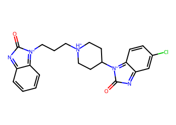
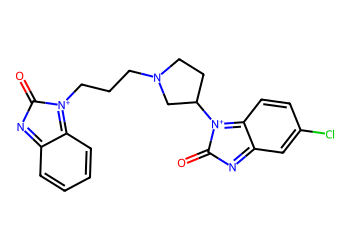
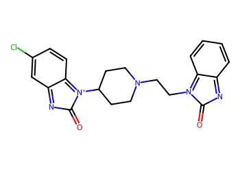
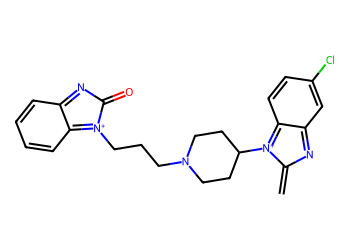
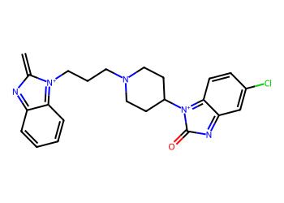
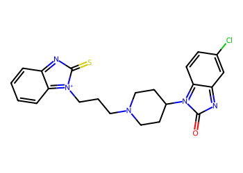
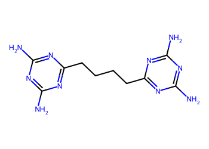

# Lead Optimization Report — a8a6b1664facbb6c9b5aa6f56ebb4c475a87f882
## Summary
- **Calibrated p(toxic):** 0.635
- **Threshold:** 0.510 → **Predicted class:** 1
- **Max similarity to train:** 0.554 (**bin:** 0.5-0.7)
- **OOD classification:** Borderline
- **Result classification:** Generated suggestions available (Tier: Tier 4 — Closest edits (diagnostic))
- Similarity is borderline; suggestions may be limited but still informative.
## Base molecule
- **SMILES:** `O=C1N=c2ccccc2=[N+]1CCC[NH+]1CCC([N+]2=c3ccc(Cl)cc3=NC2=O)CC1`
- **True label:** 1



## Counterfactual search summary
- ExMol requested: 1800 | drawn: 1443
- Generated tier (Tier 1–4): Tier 4 — Closest edits (diagnostic)
- Relaxation used: False (applied: none)
- Generated survivors (Tier 1–4): 5
- Dataset analogue fallback count (not included in survivors): 5
- Relaxation note: diagnostic fallback (no valid improvements found)

### Filter attrition by tier (baseline + final relaxation)
<table>
<tr><th>Tier</th><th>Relaxation</th><th>Sampled</th><th>Kept</th><th>Invalid</th><th>Duplicate</th><th>Similarity</th><th>Prob</th><th>Δp</th><th>SA</th><th>ΔLogP</th><th>QED</th><th>Alerts</th></tr>
<tr><td>Tier 1 — Flip</td><td>none</td><td>1443</td><td>0</td><td>0</td><td>3</td><td>871</td><td>567</td><td>0</td><td>2</td><td>0</td><td>0</td><td>0</td></tr>
<tr><td>Tier 2 — Risk reduction</td><td>none</td><td>1443</td><td>0</td><td>0</td><td>3</td><td>1379</td><td>0</td><td>61</td><td>0</td><td>0</td><td>0</td><td>0</td></tr>
<tr><td>Tier 3 — Weak improvement</td><td>none</td><td>1443</td><td>0</td><td>0</td><td>3</td><td>1379</td><td>0</td><td>60</td><td>0</td><td>0</td><td>0</td><td>1</td></tr>
</table>

<details><summary>All filter attempts (diagnostic)</summary>
```json
[
  {
    "tier": "flip",
    "tier_label": "Tier 1 \u2014 Flip",
    "relaxation": "none",
    "relaxation_desc": "baseline constraints",
    "counts": {
      "sampled": 1443,
      "invalid": 0,
      "duplicate": 3,
      "similarity_filtered": 871,
      "prob_filtered": 567,
      "delta_filtered": 0,
      "sa_filtered": 2,
      "logp_filtered": 0,
      "qed_filtered": 0,
      "alert_filtered": 0,
      "kept": 0,
      "min_tanimoto_used": 0.5,
      "min_tanimoto_source": "min_tanimoto_flip",
      "prob_max_used": 0.509999,
      "delta_min_used": null,
      "sa_max_used": 4.5,
      "logp_delta_max_used": 1.5,
      "qed_min_used": 0.0,
      "pains_used": true
    }
  },
  {
    "tier": "flip",
    "tier_label": "Tier 1 \u2014 Flip",
    "relaxation": "relax_flip_0.4",
    "relaxation_desc": "lower flip min_tanimoto to 0.4",
    "counts": {
      "sampled": 1443,
      "invalid": 0,
      "duplicate": 3,
      "similarity_filtered": 613,
      "prob_filtered": 816,
      "delta_filtered": 0,
      "sa_filtered": 7,
      "logp_filtered": 0,
      "qed_filtered": 0,
      "alert_filtered": 4,
      "kept": 0,
      "min_tanimoto_used": 0.4,
      "min_tanimoto_source": "min_tanimoto_flip",
      "prob_max_used": 0.509999,
      "delta_min_used": null,
      "sa_max_used": 4.5,
      "logp_delta_max_used": 1.5,
      "qed_min_used": 0.0,
      "pains_used": true
    }
  },
  {
    "tier": "flip",
    "tier_label": "Tier 1 \u2014 Flip",
    "relaxation": "relax_flip_0.3",
    "relaxation_desc": "lower flip min_tanimoto to 0.3",
    "counts": {
      "sampled": 1443,
      "invalid": 0,
      "duplicate": 3,
      "similarity_filtered": 401,
      "prob_filtered": 1006,
      "delta_filtered": 0,
      "sa_filtered": 18,
      "logp_filtered": 1,
      "qed_filtered": 0,
      "alert_filtered": 14,
      "kept": 0,
      "min_tanimoto_used": 0.3,
      "min_tanimoto_source": "min_tanimoto_flip",
      "prob_max_used": 0.509999,
      "delta_min_used": null,
      "sa_max_used": 4.5,
      "logp_delta_max_used": 1.5,
      "qed_min_used": 0.0,
      "pains_used": true
    }
  },
  {
    "tier": "flip",
    "tier_label": "Tier 1 \u2014 Flip",
    "relaxation": "relax_improve_0.6",
    "relaxation_desc": "lower improve min_tanimoto to 0.6",
    "counts": {
      "sampled": 1443,
      "invalid": 0,
      "duplicate": 3,
      "similarity_filtered": 871,
      "prob_filtered": 567,
      "delta_filtered": 0,
      "sa_filtered": 2,
      "logp_filtered": 0,
      "qed_filtered": 0,
      "alert_filtered": 0,
      "kept": 0,
      "min_tanimoto_used": 0.5,
      "min_tanimoto_source": "min_tanimoto_flip",
      "prob_max_used": 0.509999,
      "delta_min_used": null,
      "sa_max_used": 4.5,
      "logp_delta_max_used": 1.5,
      "qed_min_used": 0.0,
      "pains_used": true
    }
  },
  {
    "tier": "flip",
    "tier_label": "Tier 1 \u2014 Flip",
    "relaxation": "relax_improve_0.5",
    "relaxation_desc": "lower improve min_tanimoto to 0.5",
    "counts": {
      "sampled": 1443,
      "invalid": 0,
      "duplicate": 3,
      "similarity_filtered": 871,
      "prob_filtered": 567,
      "delta_filtered": 0,
      "sa_filtered": 2,
      "logp_filtered": 0,
      "qed_filtered": 0,
      "alert_filtered": 0,
      "kept": 0,
      "min_tanimoto_used": 0.5,
      "min_tanimoto_source": "min_tanimoto_flip",
      "prob_max_used": 0.509999,
      "delta_min_used": null,
      "sa_max_used": 4.5,
      "logp_delta_max_used": 1.5,
      "qed_min_used": 0.0,
      "pains_used": true
    }
  },
  {
    "tier": "flip",
    "tier_label": "Tier 1 \u2014 Flip",
    "relaxation": "relax_sa_5.5",
    "relaxation_desc": "raise SA max to 5.5",
    "counts": {
      "sampled": 1443,
      "invalid": 0,
      "duplicate": 3,
      "similarity_filtered": 871,
      "prob_filtered": 567,
      "delta_filtered": 0,
      "sa_filtered": 0,
      "logp_filtered": 0,
      "qed_filtered": 0,
      "alert_filtered": 2,
      "kept": 0,
      "min_tanimoto_used": 0.5,
      "min_tanimoto_source": "min_tanimoto_flip",
      "prob_max_used": 0.509999,
      "delta_min_used": null,
      "sa_max_used": 5.5,
      "logp_delta_max_used": 1.5,
      "qed_min_used": 0.0,
      "pains_used": true
    }
  },
  {
    "tier": "risk_reduction",
    "tier_label": "Tier 2 \u2014 Risk reduction",
    "relaxation": "none",
    "relaxation_desc": "baseline constraints",
    "counts": {
      "sampled": 1443,
      "invalid": 0,
      "duplicate": 3,
      "similarity_filtered": 1379,
      "prob_filtered": 0,
      "delta_filtered": 61,
      "sa_filtered": 0,
      "logp_filtered": 0,
      "qed_filtered": 0,
      "alert_filtered": 0,
      "kept": 0,
      "min_tanimoto_used": 0.7,
      "min_tanimoto_source": "min_tanimoto_improve",
      "prob_max_used": null,
      "delta_min_used": 0.1,
      "sa_max_used": 4.5,
      "logp_delta_max_used": 1.5,
      "qed_min_used": 0.0,
      "pains_used": true
    }
  },
  {
    "tier": "risk_reduction",
    "tier_label": "Tier 2 \u2014 Risk reduction",
    "relaxation": "relax_flip_0.4",
    "relaxation_desc": "lower flip min_tanimoto to 0.4",
    "counts": {
      "sampled": 1443,
      "invalid": 0,
      "duplicate": 3,
      "similarity_filtered": 1379,
      "prob_filtered": 0,
      "delta_filtered": 61,
      "sa_filtered": 0,
      "logp_filtered": 0,
      "qed_filtered": 0,
      "alert_filtered": 0,
      "kept": 0,
      "min_tanimoto_used": 0.7,
      "min_tanimoto_source": "min_tanimoto_improve",
      "prob_max_used": null,
      "delta_min_used": 0.1,
      "sa_max_used": 4.5,
      "logp_delta_max_used": 1.5,
      "qed_min_used": 0.0,
      "pains_used": true
    }
  },
  {
    "tier": "risk_reduction",
    "tier_label": "Tier 2 \u2014 Risk reduction",
    "relaxation": "relax_flip_0.3",
    "relaxation_desc": "lower flip min_tanimoto to 0.3",
    "counts": {
      "sampled": 1443,
      "invalid": 0,
      "duplicate": 3,
      "similarity_filtered": 1379,
      "prob_filtered": 0,
      "delta_filtered": 61,
      "sa_filtered": 0,
      "logp_filtered": 0,
      "qed_filtered": 0,
      "alert_filtered": 0,
      "kept": 0,
      "min_tanimoto_used": 0.7,
      "min_tanimoto_source": "min_tanimoto_improve",
      "prob_max_used": null,
      "delta_min_used": 0.1,
      "sa_max_used": 4.5,
      "logp_delta_max_used": 1.5,
      "qed_min_used": 0.0,
      "pains_used": true
    }
  },
  {
    "tier": "risk_reduction",
    "tier_label": "Tier 2 \u2014 Risk reduction",
    "relaxation": "relax_improve_0.6",
    "relaxation_desc": "lower improve min_tanimoto to 0.6",
    "counts": {
      "sampled": 1443,
      "invalid": 0,
      "duplicate": 3,
      "similarity_filtered": 1180,
      "prob_filtered": 0,
      "delta_filtered": 258,
      "sa_filtered": 0,
      "logp_filtered": 0,
      "qed_filtered": 0,
      "alert_filtered": 2,
      "kept": 0,
      "min_tanimoto_used": 0.6,
      "min_tanimoto_source": "min_tanimoto_improve",
      "prob_max_used": null,
      "delta_min_used": 0.1,
      "sa_max_used": 4.5,
      "logp_delta_max_used": 1.5,
      "qed_min_used": 0.0,
      "pains_used": true
    }
  },
  {
    "tier": "risk_reduction",
    "tier_label": "Tier 2 \u2014 Risk reduction",
    "relaxation": "relax_improve_0.5",
    "relaxation_desc": "lower improve min_tanimoto to 0.5",
    "counts": {
      "sampled": 1443,
      "invalid": 0,
      "duplicate": 3,
      "similarity_filtered": 871,
      "prob_filtered": 0,
      "delta_filtered": 559,
      "sa_filtered": 7,
      "logp_filtered": 0,
      "qed_filtered": 0,
      "alert_filtered": 3,
      "kept": 0,
      "min_tanimoto_used": 0.5,
      "min_tanimoto_source": "min_tanimoto_improve",
      "prob_max_used": null,
      "delta_min_used": 0.1,
      "sa_max_used": 4.5,
      "logp_delta_max_used": 1.5,
      "qed_min_used": 0.0,
      "pains_used": true
    }
  },
  {
    "tier": "risk_reduction",
    "tier_label": "Tier 2 \u2014 Risk reduction",
    "relaxation": "relax_sa_5.5",
    "relaxation_desc": "raise SA max to 5.5",
    "counts": {
      "sampled": 1443,
      "invalid": 0,
      "duplicate": 3,
      "similarity_filtered": 1379,
      "prob_filtered": 0,
      "delta_filtered": 61,
      "sa_filtered": 0,
      "logp_filtered": 0,
      "qed_filtered": 0,
      "alert_filtered": 0,
      "kept": 0,
      "min_tanimoto_used": 0.7,
      "min_tanimoto_source": "min_tanimoto_improve",
      "prob_max_used": null,
      "delta_min_used": 0.1,
      "sa_max_used": 5.5,
      "logp_delta_max_used": 1.5,
      "qed_min_used": 0.0,
      "pains_used": true
    }
  },
  {
    "tier": "weak_reduction",
    "tier_label": "Tier 3 \u2014 Weak improvement",
    "relaxation": "none",
    "relaxation_desc": "baseline constraints",
    "counts": {
      "sampled": 1443,
      "invalid": 0,
      "duplicate": 3,
      "similarity_filtered": 1379,
      "prob_filtered": 0,
      "delta_filtered": 60,
      "sa_filtered": 0,
      "logp_filtered": 0,
      "qed_filtered": 0,
      "alert_filtered": 1,
      "kept": 0,
      "min_tanimoto_used": 0.7,
      "min_tanimoto_source": "min_tanimoto_improve",
      "prob_max_used": null,
      "delta_min_used": 0.05,
      "sa_max_used": 4.5,
      "logp_delta_max_used": 1.5,
      "qed_min_used": 0.0,
      "pains_used": true
    }
  },
  {
    "tier": "weak_reduction",
    "tier_label": "Tier 3 \u2014 Weak improvement",
    "relaxation": "relax_flip_0.4",
    "relaxation_desc": "lower flip min_tanimoto to 0.4",
    "counts": {
      "sampled": 1443,
      "invalid": 0,
      "duplicate": 3,
      "similarity_filtered": 1379,
      "prob_filtered": 0,
      "delta_filtered": 60,
      "sa_filtered": 0,
      "logp_filtered": 0,
      "qed_filtered": 0,
      "alert_filtered": 1,
      "kept": 0,
      "min_tanimoto_used": 0.7,
      "min_tanimoto_source": "min_tanimoto_improve",
      "prob_max_used": null,
      "delta_min_used": 0.05,
      "sa_max_used": 4.5,
      "logp_delta_max_used": 1.5,
      "qed_min_used": 0.0,
      "pains_used": true
    }
  },
  {
    "tier": "weak_reduction",
    "tier_label": "Tier 3 \u2014 Weak improvement",
    "relaxation": "relax_flip_0.3",
    "relaxation_desc": "lower flip min_tanimoto to 0.3",
    "counts": {
      "sampled": 1443,
      "invalid": 0,
      "duplicate": 3,
      "similarity_filtered": 1379,
      "prob_filtered": 0,
      "delta_filtered": 60,
      "sa_filtered": 0,
      "logp_filtered": 0,
      "qed_filtered": 0,
      "alert_filtered": 1,
      "kept": 0,
      "min_tanimoto_used": 0.7,
      "min_tanimoto_source": "min_tanimoto_improve",
      "prob_max_used": null,
      "delta_min_used": 0.05,
      "sa_max_used": 4.5,
      "logp_delta_max_used": 1.5,
      "qed_min_used": 0.0,
      "pains_used": true
    }
  },
  {
    "tier": "weak_reduction",
    "tier_label": "Tier 3 \u2014 Weak improvement",
    "relaxation": "relax_improve_0.6",
    "relaxation_desc": "lower improve min_tanimoto to 0.6",
    "counts": {
      "sampled": 1443,
      "invalid": 0,
      "duplicate": 3,
      "similarity_filtered": 1180,
      "prob_filtered": 0,
      "delta_filtered": 254,
      "sa_filtered": 1,
      "logp_filtered": 0,
      "qed_filtered": 0,
      "alert_filtered": 5,
      "kept": 0,
      "min_tanimoto_used": 0.6,
      "min_tanimoto_source": "min_tanimoto_improve",
      "prob_max_used": null,
      "delta_min_used": 0.05,
      "sa_max_used": 4.5,
      "logp_delta_max_used": 1.5,
      "qed_min_used": 0.0,
      "pains_used": true
    }
  },
  {
    "tier": "weak_reduction",
    "tier_label": "Tier 3 \u2014 Weak improvement",
    "relaxation": "relax_improve_0.5",
    "relaxation_desc": "lower improve min_tanimoto to 0.5",
    "counts": {
      "sampled": 1443,
      "invalid": 0,
      "duplicate": 3,
      "similarity_filtered": 871,
      "prob_filtered": 0,
      "delta_filtered": 542,
      "sa_filtered": 14,
      "logp_filtered": 0,
      "qed_filtered": 0,
      "alert_filtered": 13,
      "kept": 0,
      "min_tanimoto_used": 0.5,
      "min_tanimoto_source": "min_tanimoto_improve",
      "prob_max_used": null,
      "delta_min_used": 0.05,
      "sa_max_used": 4.5,
      "logp_delta_max_used": 1.5,
      "qed_min_used": 0.0,
      "pains_used": true
    }
  },
  {
    "tier": "weak_reduction",
    "tier_label": "Tier 3 \u2014 Weak improvement",
    "relaxation": "relax_sa_5.5",
    "relaxation_desc": "raise SA max to 5.5",
    "counts": {
      "sampled": 1443,
      "invalid": 0,
      "duplicate": 3,
      "similarity_filtered": 1379,
      "prob_filtered": 0,
      "delta_filtered": 60,
      "sa_filtered": 0,
      "logp_filtered": 0,
      "qed_filtered": 0,
      "alert_filtered": 1,
      "kept": 0,
      "min_tanimoto_used": 0.7,
      "min_tanimoto_source": "min_tanimoto_improve",
      "prob_max_used": null,
      "delta_min_used": 0.05,
      "sa_max_used": 5.5,
      "logp_delta_max_used": 1.5,
      "qed_min_used": 0.0,
      "pains_used": true
    }
  }
]
```
</details>

## Counterfactual suggestions (filtered)
_Rows below are generated from Tier 4 — Closest edits (diagnostic) (relaxation: none)._ 
<table>
<tr><th>Rank</th><th>Structure</th><th>Tier</th><th>Relaxation</th><th>Similarity</th><th>p(toxic)</th><th>Δp</th><th>LogP</th><th>QED</th><th>SA</th></tr>
<tr><td>1</td><td></td><td>Tier 4 — Closest edits (diagnostic)</td><td>none</td><td>0.373</td><td>0.645</td><td>-0.009</td><td>-0.01</td><td>0.65</td><td>4.32</td></tr>
<tr><td>2</td><td></td><td>Tier 4 — Closest edits (diagnostic)</td><td>none</td><td>0.375</td><td>0.650</td><td>-0.014</td><td>-0.01</td><td>0.67</td><td>3.89</td></tr>
<tr><td>3</td><td></td><td>Tier 4 — Closest edits (diagnostic)</td><td>none</td><td>0.329</td><td>0.664</td><td>-0.029</td><td>0.73</td><td>0.67</td><td>3.88</td></tr>
<tr><td>4</td><td></td><td>Tier 4 — Closest edits (diagnostic)</td><td>none</td><td>0.364</td><td>0.664</td><td>-0.029</td><td>0.73</td><td>0.67</td><td>3.88</td></tr>
<tr><td>5</td><td></td><td>Tier 4 — Closest edits (diagnostic)</td><td>none</td><td>0.364</td><td>0.664</td><td>-0.029</td><td>0.55</td><td>0.50</td><td>3.85</td></tr>
</table>

## Dataset-derived analogues (fallback)
_Nearest analogues from the dataset (context only, not generated edits)._ 
<table>
<tr><th>Rank</th><th>Structure</th><th>Similarity</th><th>p(toxic)</th><th>Δp</th><th>LogP</th><th>QED</th><th>SA</th><th>Alerts</th><th>Actionable?</th></tr>
<tr><td>1</td><td></td><td>0.099</td><td>0.395</td><td>0.241</td><td>-1.04</td><td>0.56</td><td>2.54</td><td>OK</td><td>YES</td></tr>
<tr><td>2</td><td></td><td>0.040</td><td>0.395</td><td>0.241</td><td>0.60</td><td>0.50</td><td>3.30</td><td>⚠</td><td>NO</td></tr>
<tr><td>3</td><td></td><td>0.092</td><td>0.396</td><td>0.240</td><td>5.39</td><td>0.30</td><td>3.21</td><td>⚠</td><td>NO</td></tr>
<tr><td>4</td><td></td><td>0.082</td><td>0.396</td><td>0.240</td><td>-1.37</td><td>0.52</td><td>2.66</td><td>OK</td><td>YES</td></tr>
<tr><td>5</td><td></td><td>0.079</td><td>0.396</td><td>0.240</td><td>-1.05</td><td>0.49</td><td>2.50</td><td>⚠</td><td>NO</td></tr>
</table>

## Raw records (for audit)
### Counterfactuals JSON
```json
[
  {
    "raw_smiles": "O=C1N=c2ccccc2=[N+]1CCCN1CCC([N+]2=c3ccc(Cl)cc3=NC2=O)C1",
    "smiles": "O=C1N=c2ccccc2=[N+]1CCCN1CCC([N+]2=c3ccc(Cl)cc3=NC2=O)C1",
    "similarity": 0.37333333333333335,
    "p": 0.6445736049874629,
    "delta_p": -0.009124066401276498,
    "logp": -0.006799999999999473,
    "qed": 0.6524076934639513,
    "sascore": 4.315024036396628,
    "alert": true,
    "tier": "diagnostic_close_edits",
    "tier_label": "Tier 4 \u2014 Closest edits (diagnostic)",
    "relaxation": "none",
    "relaxation_desc": "diagnostic fallback (no valid improvements found)",
    "p_raw": 0.6445736049874629,
    "delta_p_raw": 0.01962358378598117,
    "tier_raw": "diagnostic_close_edits",
    "tier_num_std": 4,
    "tier_label_std": "diagnostic_close_edits"
  },
  {
    "raw_smiles": "O=C1N=c2ccccc2=[N+]1CCN1CCC([N+]2=c3ccc(Cl)cc3=NC2=O)CC1",
    "smiles": "O=C1N=c2ccccc2=[N+]1CCN1CCC([N+]2=c3ccc(Cl)cc3=NC2=O)CC1",
    "similarity": 0.375,
    "p": 0.6495913835865761,
    "delta_p": -0.01414184500038973,
    "logp": -0.006799999999998585,
    "qed": 0.6671332150266577,
    "sascore": 3.8926088775651815,
    "alert": true,
    "tier": "diagnostic_close_edits",
    "tier_label": "Tier 4 \u2014 Closest edits (diagnostic)",
    "relaxation": "none",
    "relaxation_desc": "diagnostic fallback (no valid improvements found)",
    "p_raw": 0.6495913835865761,
    "delta_p_raw": 0.014605805186867937,
    "tier_raw": "diagnostic_close_edits",
    "tier_num_std": 4,
    "tier_label_std": "diagnostic_close_edits"
  },
  {
    "raw_smiles": "C=C1N=c2cc(Cl)ccc2=[N+]1C1CCN(CCC[N+]2=c3ccccc3=NC2=O)CC1",
    "smiles": "C=C1N=c2cc(Cl)ccc2=[N+]1C1CCN(CCC[N+]2=c3ccccc3=NC2=O)CC1",
    "similarity": 0.3291139240506329,
    "p": 0.664197188773444,
    "delta_p": -0.028747650187257667,
    "logp": 0.7345000000000008,
    "qed": 0.6683959912500951,
    "sascore": 3.8779329186798357,
    "alert": true,
    "tier": "diagnostic_close_edits",
    "tier_label": "Tier 4 \u2014 Closest edits (diagnostic)",
    "relaxation": "none",
    "relaxation_desc": "diagnostic fallback (no valid improvements found)",
    "p_raw": 0.664197188773444,
    "delta_p_raw": 0.0,
    "tier_raw": "diagnostic_close_edits",
    "tier_num_std": 4,
    "tier_label_std": "diagnostic_close_edits"
  },
  {
    "raw_smiles": "C=C1N=c2ccccc2=[N+]1CCCN1CCC([N+]2=c3ccc(Cl)cc3=NC2=O)CC1",
    "smiles": "C=C1N=c2ccccc2=[N+]1CCCN1CCC([N+]2=c3ccc(Cl)cc3=NC2=O)CC1",
    "similarity": 0.36363636363636365,
    "p": 0.664197188773444,
    "delta_p": -0.028747650187257667,
    "logp": 0.7344999999999999,
    "qed": 0.6683959912500953,
    "sascore": 3.8779329186798357,
    "alert": true,
    "tier": "diagnostic_close_edits",
    "tier_label": "Tier 4 \u2014 Closest edits (diagnostic)",
    "relaxation": "none",
    "relaxation_desc": "diagnostic fallback (no valid improvements found)",
    "p_raw": 0.664197188773444,
    "delta_p_raw": 0.0,
    "tier_raw": "diagnostic_close_edits",
    "tier_num_std": 4,
    "tier_label_std": "diagnostic_close_edits"
  },
  {
    "raw_smiles": "O=C1N=c2cc(Cl)ccc2=[N+]1C1CCN(CCC[N+]2=c3ccccc3=NC2=S)CC1",
    "smiles": "O=C1N=c2cc(Cl)ccc2=[N+]1C1CCN(CCC[N+]2=c3ccccc3=NC2=S)CC1",
    "similarity": 0.36363636363636365,
    "p": 0.664197188773444,
    "delta_p": -0.028747650187257667,
    "logp": 0.5482000000000011,
    "qed": 0.5047276189266252,
    "sascore": 3.8536973749132564,
    "alert": true,
    "tier": "diagnostic_close_edits",
    "tier_label": "Tier 4 \u2014 Closest edits (diagnostic)",
    "relaxation": "none",
    "relaxation_desc": "diagnostic fallback (no valid improvements found)",
    "p_raw": 0.664197188773444,
    "delta_p_raw": 0.0,
    "tier_raw": "diagnostic_close_edits",
    "tier_num_std": 4,
    "tier_label_std": "diagnostic_close_edits"
  }
]
```
### Dataset analogues JSON
```json
[
  {
    "raw_smiles": "Cn1c(=O)c2[nH]cnc2n(C)c1=O",
    "smiles": "Cn1c(=O)c2[nH]cnc2n(C)c1=O",
    "similarity": 0.09859154929577464,
    "p": 0.39478944477282535,
    "delta_p": 0.240660093813361,
    "logp": -1.0397000000000005,
    "qed": 0.5624722357827983,
    "sascore": 2.5435777719868486,
    "sa_status": "ok",
    "actionable": true,
    "alert": false,
    "tier": "dataset_analogue",
    "tier_label": "Dataset analogue",
    "relaxation": "none",
    "relaxation_desc": "dataset fallback",
    "sa_max_used": 4.5,
    "pains_used": true
  },
  {
    "raw_smiles": "Nc1nc(=S)c2[nH]cnc2[nH]1",
    "smiles": "Nc1nc(=S)c2[nH]cnc2[nH]1",
    "similarity": 0.04,
    "p": 0.39478944477282535,
    "delta_p": 0.240660093813361,
    "logp": 0.5976899999999998,
    "qed": 0.5014913838271434,
    "sascore": 3.3037189467190657,
    "sa_status": "ok",
    "actionable": false,
    "alert": true,
    "tier": "dataset_analogue",
    "tier_label": "Dataset analogue",
    "relaxation": "none",
    "relaxation_desc": "dataset fallback",
    "sa_max_used": 4.5,
    "pains_used": true
  },
  {
    "raw_smiles": "O=c1[nH]c(SCc2c(Cl)c(Cl)c(Cl)c(Cl)c2Cl)nc(=S)[nH]1",
    "smiles": "O=c1[nH]c(SCc2c(Cl)c(Cl)c(Cl)c(Cl)c2Cl)nc(=S)[nH]1",
    "similarity": 0.09210526315789473,
    "p": 0.39562248764441715,
    "delta_p": 0.2398270509417692,
    "logp": 5.38679,
    "qed": 0.30084441175659915,
    "sascore": 3.2095886753772245,
    "sa_status": "ok",
    "actionable": false,
    "alert": true,
    "tier": "dataset_analogue",
    "tier_label": "Dataset analogue",
    "relaxation": "none",
    "relaxation_desc": "dataset fallback",
    "sa_max_used": 4.5,
    "pains_used": true
  },
  {
    "raw_smiles": "O=C(O)CSc1n[nH]c(=O)[nH]c1=O",
    "smiles": "O=C(O)CSc1n[nH]c(=O)[nH]c1=O",
    "similarity": 0.0821917808219178,
    "p": 0.39562248764441715,
    "delta_p": 0.2398270509417692,
    "logp": -1.3651000000000004,
    "qed": 0.522012923698588,
    "sascore": 2.657270519239594,
    "sa_status": "ok",
    "actionable": true,
    "alert": false,
    "tier": "dataset_analogue",
    "tier_label": "Dataset analogue",
    "relaxation": "none",
    "relaxation_desc": "dataset fallback",
    "sa_max_used": 4.5,
    "pains_used": true
  },
  {
    "raw_smiles": "Nc1nc(N)nc(CCCCc2nc(N)nc(N)n2)n1",
    "smiles": "Nc1nc(N)nc(CCCCc2nc(N)nc(N)n2)n1",
    "similarity": 0.07936507936507936,
    "p": 0.39562248764441715,
    "delta_p": 0.2398270509417692,
    "logp": -1.0491999999999992,
    "qed": 0.49136576642794,
    "sascore": 2.5005817983277545,
    "sa_status": "ok",
    "actionable": false,
    "alert": true,
    "tier": "dataset_analogue",
    "tier_label": "Dataset analogue",
    "relaxation": "none",
    "relaxation_desc": "dataset fallback",
    "sa_max_used": 4.5,
    "pains_used": true
  }
]
```
