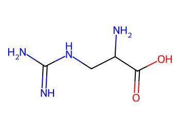
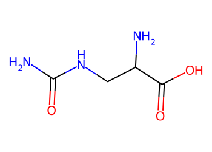
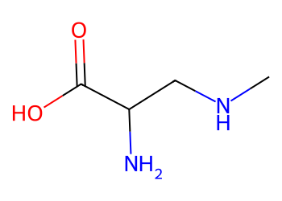

# Lead Optimization Report — d71661a6c787d26afd0eee2bcdfa94ad817f7481
## Summary
- **Calibrated p(toxic):** 0.396
- **Threshold:** 0.510 → **Predicted class:** 0
- **Max similarity to train:** 0.538 (**bin:** 0.5-0.7)
- **OOD classification:** Borderline
- **Result classification:** Generated suggestions available (Tier: Tier 1 — Flip)
- Similarity is borderline; suggestions may be limited but still informative.
## Base molecule
- **SMILES:** `N=C(N)NCC(N)C(=O)O`
- **True label:** 0



## Counterfactual search summary
- ExMol requested: 1800 | drawn: 878
- Generated tier (Tier 1–4): Tier 1 — Flip
- Relaxation used: False (applied: none)
- Generated survivors (Tier 1–4): 2
- Dataset analogue fallback count (not included in survivors): 0
- Relaxation note: baseline constraints

### Filter attrition by tier (baseline + final relaxation)
<table>
<tr><th>Tier</th><th>Relaxation</th><th>Sampled</th><th>Kept</th><th>Invalid</th><th>Duplicate</th><th>Similarity</th><th>Prob</th><th>Δp</th><th>SA</th><th>ΔLogP</th><th>QED</th><th>Alerts</th></tr>
<tr><td>Tier 1 — Flip</td><td>none</td><td>878</td><td>2</td><td>1</td><td>48</td><td>752</td><td>0</td><td>0</td><td>4</td><td>0</td><td>0</td><td>71</td></tr>
</table>

<details><summary>All filter attempts (diagnostic)</summary>
```json
[
  {
    "tier": "flip",
    "tier_label": "Tier 1 \u2014 Flip",
    "relaxation": "none",
    "relaxation_desc": "baseline constraints",
    "counts": {
      "sampled": 878,
      "invalid": 1,
      "duplicate": 48,
      "similarity_filtered": 752,
      "prob_filtered": 0,
      "delta_filtered": 0,
      "sa_filtered": 4,
      "logp_filtered": 0,
      "qed_filtered": 0,
      "alert_filtered": 71,
      "kept": 2,
      "min_tanimoto_used": 0.5,
      "min_tanimoto_source": "min_tanimoto_flip",
      "prob_max_used": 0.509999,
      "delta_min_used": null,
      "sa_max_used": 4.5,
      "logp_delta_max_used": 1.5,
      "qed_min_used": 0.0,
      "pains_used": true
    }
  }
]
```
</details>

## Counterfactual suggestions (filtered)
_Rows below are generated from Tier 1 — Flip (relaxation: none)._ 
<table>
<tr><th>Rank</th><th>Structure</th><th>Tier</th><th>Relaxation</th><th>Similarity</th><th>p(toxic)</th><th>Δp</th><th>LogP</th><th>QED</th><th>SA</th></tr>
<tr><td>1</td><td></td><td>Tier 1 — Flip</td><td>none</td><td>0.583</td><td>0.396</td><td>0.000</td><td>-1.93</td><td>0.37</td><td>2.79</td></tr>
<tr><td>2</td><td></td><td>Tier 1 — Flip</td><td>none</td><td>0.609</td><td>0.396</td><td>0.000</td><td>-1.38</td><td>0.43</td><td>2.83</td></tr>
</table>

## Raw records (for audit)
### Counterfactuals JSON
```json
[
  {
    "raw_smiles": "NC(=O)NCC(N)C(=O)O",
    "smiles": "NC(=O)NCC(N)C(=O)O",
    "similarity": 0.5833333333333334,
    "p": 0.39562248764441715,
    "delta_p": 0.0,
    "logp": -1.9333999999999998,
    "qed": 0.3712304881878742,
    "sascore": 2.786074591441025,
    "alert": false,
    "tier": "flip",
    "tier_label": "Tier 1 \u2014 Flip",
    "relaxation": "none",
    "relaxation_desc": "baseline constraints",
    "p_raw": 0.39562248764441715,
    "delta_p_raw": 0.0,
    "tier_raw": "flip",
    "tier_num_std": 1,
    "tier_label_std": "flip"
  },
  {
    "raw_smiles": "CNCC(N)C(=O)O",
    "smiles": "CNCC(N)C(=O)O",
    "similarity": 0.6086956521739131,
    "p": 0.39562248764441715,
    "delta_p": 0.0,
    "logp": -1.382299999999999,
    "qed": 0.4265662494630695,
    "sascore": 2.833270632003508,
    "alert": false,
    "tier": "flip",
    "tier_label": "Tier 1 \u2014 Flip",
    "relaxation": "none",
    "relaxation_desc": "baseline constraints",
    "p_raw": 0.39562248764441715,
    "delta_p_raw": 0.0,
    "tier_raw": "flip",
    "tier_num_std": 1,
    "tier_label_std": "flip"
  }
]
```
### Dataset analogues JSON
```json
[]
```
