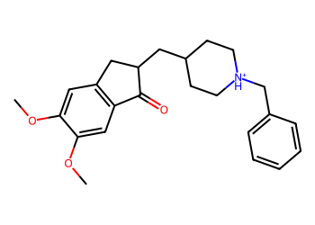
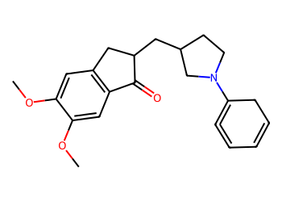
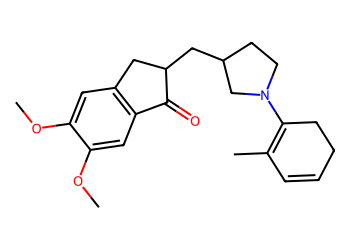
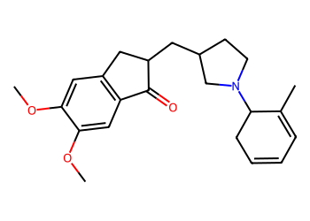
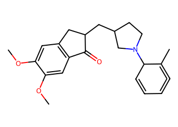
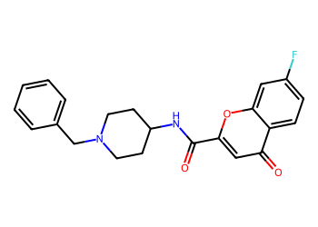
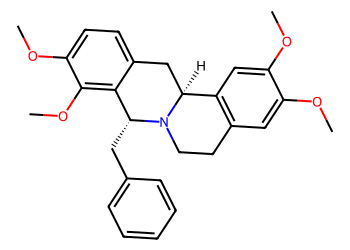
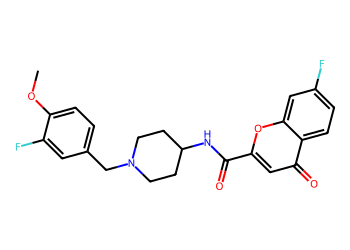
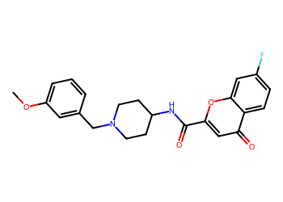

# Lead Optimization Report — de1e633dac3d28dd08f3f89445d9a7c08e9e2700
## Summary
- **Calibrated p(toxic):** 0.614
- **Threshold:** 0.510 → **Predicted class:** 1
- **Max similarity to train:** 0.297 (**bin:** <0.3)
- **OOD classification:** Very out-of-domain
- **Result classification:** Generated suggestions available (Tier: Tier 1 — Flip)
- Similarity is very low; generated suggestions may be scarce and fallback analogues are provided for context.
## Base molecule
- **SMILES:** `COc1cc2c(cc1OC)C(=O)C(CC1CC[NH+](Cc3ccccc3)CC1)C2`
- **True label:** 1



## Counterfactual search summary
- ExMol requested: 1800 | drawn: 1472
- Generated tier (Tier 1–4): Tier 1 — Flip
- Relaxation used: False (applied: none)
- Generated survivors (Tier 1–4): 4
- Dataset analogue fallback count (not included in survivors): 5
- Relaxation note: baseline constraints

### Filter attrition by tier (baseline + final relaxation)
<table>
<tr><th>Tier</th><th>Relaxation</th><th>Sampled</th><th>Kept</th><th>Invalid</th><th>Duplicate</th><th>Similarity</th><th>Prob</th><th>Δp</th><th>SA</th><th>ΔLogP</th><th>QED</th><th>Alerts</th></tr>
<tr><td>Tier 1 — Flip</td><td>none</td><td>1472</td><td>4</td><td>0</td><td>5</td><td>1075</td><td>379</td><td>0</td><td>1</td><td>4</td><td>0</td><td>4</td></tr>
</table>

<details><summary>All filter attempts (diagnostic)</summary>
```json
[
  {
    "tier": "flip",
    "tier_label": "Tier 1 \u2014 Flip",
    "relaxation": "none",
    "relaxation_desc": "baseline constraints",
    "counts": {
      "sampled": 1472,
      "invalid": 0,
      "duplicate": 5,
      "similarity_filtered": 1075,
      "prob_filtered": 379,
      "delta_filtered": 0,
      "sa_filtered": 1,
      "logp_filtered": 4,
      "qed_filtered": 0,
      "alert_filtered": 4,
      "kept": 4,
      "min_tanimoto_used": 0.5,
      "min_tanimoto_source": "min_tanimoto_flip",
      "prob_max_used": 0.509999,
      "delta_min_used": null,
      "sa_max_used": 4.5,
      "logp_delta_max_used": 1.5,
      "qed_min_used": 0.0,
      "pains_used": true
    }
  }
]
```
</details>

## Counterfactual suggestions (filtered)
_Rows below are generated from Tier 1 — Flip (relaxation: none)._ 
<table>
<tr><th>Rank</th><th>Structure</th><th>Tier</th><th>Relaxation</th><th>Similarity</th><th>p(toxic)</th><th>Δp</th><th>LogP</th><th>QED</th><th>SA</th></tr>
<tr><td>1</td><td></td><td>Tier 1 — Flip</td><td>none</td><td>0.241</td><td>0.502</td><td>0.112</td><td>3.77</td><td>0.76</td><td>4.16</td></tr>
<tr><td>2</td><td></td><td>Tier 1 — Flip</td><td>none</td><td>0.238</td><td>0.502</td><td>0.112</td><td>4.39</td><td>0.77</td><td>3.71</td></tr>
<tr><td>3</td><td></td><td>Tier 1 — Flip</td><td>none</td><td>0.237</td><td>0.502</td><td>0.112</td><td>4.05</td><td>0.79</td><td>3.86</td></tr>
<tr><td>4</td><td></td><td>Tier 1 — Flip</td><td>none</td><td>0.235</td><td>0.502</td><td>0.112</td><td>3.81</td><td>0.74</td><td>4.36</td></tr>
</table>

## Dataset-derived analogues (fallback)
_Nearest analogues from the dataset (context only, not generated edits)._ 
<table>
<tr><th>Rank</th><th>Structure</th><th>Similarity</th><th>p(toxic)</th><th>Δp</th><th>LogP</th><th>QED</th><th>SA</th><th>Alerts</th><th>Actionable?</th></tr>
<tr><td>1</td><td></td><td>0.324</td><td>0.672</td><td>-0.058</td><td>3.33</td><td>0.75</td><td>2.11</td><td>OK</td><td>NO</td></tr>
<tr><td>2</td><td></td><td>0.406</td><td>0.677</td><td>-0.063</td><td>3.33</td><td>0.79</td><td>1.98</td><td>⚠</td><td>NO</td></tr>
<tr><td>3</td><td></td><td>0.333</td><td>0.681</td><td>-0.068</td><td>5.16</td><td>0.52</td><td>3.24</td><td>OK</td><td>NO</td></tr>
<tr><td>4</td><td></td><td>0.309</td><td>0.691</td><td>-0.078</td><td>3.47</td><td>0.67</td><td>2.30</td><td>OK</td><td>NO</td></tr>
<tr><td>5</td><td></td><td>0.309</td><td>0.693</td><td>-0.079</td><td>3.34</td><td>0.70</td><td>2.21</td><td>OK</td><td>NO</td></tr>
</table>
Fallback analogues are context-only; none meet feasibility constraints.

## Raw records (for audit)
### Counterfactuals JSON
```json
[
  {
    "raw_smiles": "COc1cc2c(cc1OC)C(=O)C(CC1CCN(C3=C=CC=CC3)C1)C2",
    "smiles": "COc1cc2c(cc1OC)C(=O)C(CC1CCN(C3=C=CC=CC3)C1)C2",
    "similarity": 0.24096385542168675,
    "p": 0.5021399687365066,
    "delta_p": 0.11164004839167141,
    "logp": 3.769700000000003,
    "qed": 0.757185389809423,
    "sascore": 4.162789380613962,
    "alert": false,
    "tier": "diagnostic_close_edits",
    "tier_label": "Tier 1 \u2014 Flip",
    "relaxation": "none",
    "relaxation_desc": "baseline constraints",
    "p_raw": 0.5021399687365066,
    "delta_p_raw": 0.17124940248796072,
    "tier_raw": "flip",
    "tier_num_std": 4,
    "tier_label_std": "diagnostic_close_edits"
  },
  {
    "raw_smiles": "COc1cc2c(cc1OC)C(=O)C(CC1CCN(C3=C(C)C=CCC3)C1)C2",
    "smiles": "COc1cc2c(cc1OC)C(=O)C(CC1CCN(C3=C(C)C=CCC3)C1)C2",
    "similarity": 0.23809523809523808,
    "p": 0.5021399687365066,
    "delta_p": 0.11164004839167141,
    "logp": 4.394800000000004,
    "qed": 0.7734062185889243,
    "sascore": 3.7091334134278844,
    "alert": false,
    "tier": "diagnostic_close_edits",
    "tier_label": "Tier 1 \u2014 Flip",
    "relaxation": "none",
    "relaxation_desc": "baseline constraints",
    "p_raw": 0.5021399687365066,
    "delta_p_raw": 0.17124940248796072,
    "tier_raw": "flip",
    "tier_num_std": 4,
    "tier_label_std": "diagnostic_close_edits"
  },
  {
    "raw_smiles": "COc1cc2c(cc1OC)C(=O)C(CC1CCN(C3CC=CC=C3C)C1)C2",
    "smiles": "COc1cc2c(cc1OC)C(=O)C(CC1CCN(C3CC=CC=C3C)C1)C2",
    "similarity": 0.2375,
    "p": 0.5021399687365066,
    "delta_p": 0.11164004839167141,
    "logp": 4.045600000000003,
    "qed": 0.7871160153447903,
    "sascore": 3.8607053304499654,
    "alert": false,
    "tier": "diagnostic_close_edits",
    "tier_label": "Tier 1 \u2014 Flip",
    "relaxation": "none",
    "relaxation_desc": "baseline constraints",
    "p_raw": 0.5021399687365066,
    "delta_p_raw": 0.17124940248796072,
    "tier_raw": "flip",
    "tier_num_std": 4,
    "tier_label_std": "diagnostic_close_edits"
  },
  {
    "raw_smiles": "COc1cc2c(cc1OC)C(=O)C(CC1CCN(C3C=CC=C=C3C)C1)C2",
    "smiles": "COc1cc2c(cc1OC)C(=O)C(CC1CCN(C3C=CC=C=C3C)C1)C2",
    "similarity": 0.2345679012345679,
    "p": 0.5021399687365066,
    "delta_p": 0.11164004839167141,
    "logp": 3.8106000000000027,
    "qed": 0.7440173831643622,
    "sascore": 4.364104731049366,
    "alert": false,
    "tier": "diagnostic_close_edits",
    "tier_label": "Tier 1 \u2014 Flip",
    "relaxation": "none",
    "relaxation_desc": "baseline constraints",
    "p_raw": 0.5021399687365066,
    "delta_p_raw": 0.17124940248796072,
    "tier_raw": "flip",
    "tier_num_std": 4,
    "tier_label_std": "diagnostic_close_edits"
  }
]
```
### Dataset analogues JSON
```json
[
  {
    "raw_smiles": "O=C(NC1CCN(Cc2ccccc2)CC1)c1cc(=O)c2ccc(F)cc2o1",
    "smiles": "O=C(NC1CCN(Cc2ccccc2)CC1)c1cc(=O)c2ccc(F)cc2o1",
    "similarity": 0.32432432432432434,
    "p": 0.6715572526724128,
    "delta_p": -0.05777723554423486,
    "logp": 3.326500000000002,
    "qed": 0.7542441940134043,
    "sascore": 2.1085511344062517,
    "sa_status": "ok",
    "actionable": false,
    "alert": false,
    "tier": "dataset_analogue",
    "tier_label": "Dataset analogue",
    "relaxation": "none",
    "relaxation_desc": "dataset fallback",
    "sa_max_used": 4.5,
    "pains_used": true
  },
  {
    "raw_smiles": "COc1cc(N)c(Cl)cc1C(=O)NC1CCN(Cc2ccccc2)CC1",
    "smiles": "COc1cc(N)c(Cl)cc1C(=O)NC1CCN(Cc2ccccc2)CC1",
    "similarity": 0.4057971014492754,
    "p": 0.6766658140843573,
    "delta_p": -0.06288579695617935,
    "logp": 3.3252000000000024,
    "qed": 0.78874496828116,
    "sascore": 1.983702254536425,
    "sa_status": "ok",
    "actionable": false,
    "alert": true,
    "tier": "dataset_analogue",
    "tier_label": "Dataset analogue",
    "relaxation": "none",
    "relaxation_desc": "dataset fallback",
    "sa_max_used": 4.5,
    "pains_used": true
  },
  {
    "raw_smiles": "COc1cc2c(cc1OC)[C@@H]1Cc3ccc(OC)c(OC)c3[C@@H](Cc3ccccc3)N1CC2",
    "smiles": "COc1cc2c(cc1OC)[C@@H]1Cc3ccc(OC)c(OC)c3[C@@H](Cc3ccccc3)N1CC2",
    "similarity": 0.3333333333333333,
    "p": 0.6813762895405087,
    "delta_p": -0.06759627241233068,
    "logp": 5.160300000000005,
    "qed": 0.5241684413987495,
    "sascore": 3.2425912847265597,
    "sa_status": "ok",
    "actionable": false,
    "alert": false,
    "tier": "dataset_analogue",
    "tier_label": "Dataset analogue",
    "relaxation": "none",
    "relaxation_desc": "dataset fallback",
    "sa_max_used": 4.5,
    "pains_used": true
  },
  {
    "raw_smiles": "COc1ccc(CN2CCC(NC(=O)c3cc(=O)c4ccc(F)cc4o3)CC2)cc1F",
    "smiles": "COc1ccc(CN2CCC(NC(=O)c3cc(=O)c4ccc(F)cc4o3)CC2)cc1F",
    "similarity": 0.30864197530864196,
    "p": 0.6913205977604768,
    "delta_p": -0.07754058063229885,
    "logp": 3.4742000000000015,
    "qed": 0.6738990190982999,
    "sascore": 2.300664717588413,
    "sa_status": "ok",
    "actionable": false,
    "alert": false,
    "tier": "dataset_analogue",
    "tier_label": "Dataset analogue",
    "relaxation": "none",
    "relaxation_desc": "dataset fallback",
    "sa_max_used": 4.5,
    "pains_used": true
  },
  {
    "raw_smiles": "COc1cccc(CN2CCC(NC(=O)c3cc(=O)c4ccc(F)cc4o3)CC2)c1",
    "smiles": "COc1cccc(CN2CCC(NC(=O)c3cc(=O)c4ccc(F)cc4o3)CC2)c1",
    "similarity": 0.30864197530864196,
    "p": 0.6932098899148553,
    "delta_p": -0.07942987278667735,
    "logp": 3.3351000000000015,
    "qed": 0.6986466902976151,
    "sascore": 2.2136774316648467,
    "sa_status": "ok",
    "actionable": false,
    "alert": false,
    "tier": "dataset_analogue",
    "tier_label": "Dataset analogue",
    "relaxation": "none",
    "relaxation_desc": "dataset fallback",
    "sa_max_used": 4.5,
    "pains_used": true
  }
]
```
