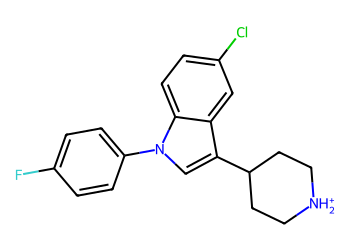
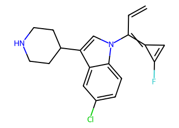

# Lead Optimization Report — 0ab5fc1803b9adf390ab3e9ad75b2c6108efe98f
## Summary
- **Calibrated p(toxic):** 0.653
- **Threshold:** 0.510 → **Predicted class:** 1
- **Max similarity to train:** 0.745 (**bin:** >0.7)
- **OOD classification:** In-domain
- **Result classification:** Generated suggestions available (Tier: Tier 1 — Flip)
- Similarity is in-domain; suggestions should be more reliable locally.
## Base molecule
- **SMILES:** `Fc1ccc(-n2cc(C3CC[NH2+]CC3)c3cc(Cl)ccc32)cc1`
- **True label:** 0



## Counterfactual search summary
- ExMol requested: 1800 | drawn: 1413
- Generated tier (Tier 1–4): Tier 1 — Flip
- Relaxation used: False (applied: none)
- Generated survivors (Tier 1–4): 1
- Dataset analogue fallback count (not included in survivors): 0
- Relaxation note: baseline constraints

### Filter attrition by tier (baseline + final relaxation)
<table>
<tr><th>Tier</th><th>Relaxation</th><th>Sampled</th><th>Kept</th><th>Invalid</th><th>Duplicate</th><th>Similarity</th><th>Prob</th><th>Δp</th><th>SA</th><th>ΔLogP</th><th>QED</th><th>Alerts</th></tr>
<tr><td>Tier 1 — Flip</td><td>none</td><td>1413</td><td>1</td><td>0</td><td>2</td><td>1204</td><td>206</td><td>0</td><td>0</td><td>0</td><td>0</td><td>0</td></tr>
</table>

<details><summary>All filter attempts (diagnostic)</summary>
```json
[
  {
    "tier": "flip",
    "tier_label": "Tier 1 \u2014 Flip",
    "relaxation": "none",
    "relaxation_desc": "baseline constraints",
    "counts": {
      "sampled": 1413,
      "invalid": 0,
      "duplicate": 2,
      "similarity_filtered": 1204,
      "prob_filtered": 206,
      "delta_filtered": 0,
      "sa_filtered": 0,
      "logp_filtered": 0,
      "qed_filtered": 0,
      "alert_filtered": 0,
      "kept": 1,
      "min_tanimoto_used": 0.5,
      "min_tanimoto_source": "min_tanimoto_flip",
      "prob_max_used": 0.509999,
      "delta_min_used": null,
      "sa_max_used": 4.5,
      "logp_delta_max_used": 1.5,
      "qed_min_used": 0.0,
      "pains_used": true
    }
  }
]
```
</details>

## Counterfactual suggestions (filtered)
_Rows below are generated from Tier 1 — Flip (relaxation: none)._ 
<table>
<tr><th>Rank</th><th>Structure</th><th>Tier</th><th>Relaxation</th><th>Similarity</th><th>p(toxic)</th><th>Δp</th><th>LogP</th><th>QED</th><th>SA</th></tr>
<tr><td>1</td><td></td><td>Tier 1 — Flip</td><td>none</td><td>0.534</td><td>0.493</td><td>0.160</td><td>5.03</td><td>0.84</td><td>3.22</td></tr>
</table>

## Raw records (for audit)
### Counterfactuals JSON
```json
[
  {
    "raw_smiles": "C=CC(=C1C=C1F)n1cc(C2CCNCC2)c2cc(Cl)ccc21",
    "smiles": "C=CC(=C1C=C1F)n1cc(C2CCNCC2)c2cc(Cl)ccc21",
    "similarity": 0.5344827586206896,
    "p": 0.4934564214110532,
    "delta_p": 0.1597076794053069,
    "logp": 5.025800000000003,
    "qed": 0.8361872737454502,
    "sascore": 3.2176351575892177,
    "alert": false,
    "tier": "flip",
    "tier_label": "Tier 1 \u2014 Flip",
    "relaxation": "none",
    "relaxation_desc": "baseline constraints",
    "p_raw": 0.4934564214110532,
    "delta_p_raw": 0.17608167391664747,
    "tier_raw": "flip",
    "tier_num_std": 1,
    "tier_label_std": "flip"
  }
]
```
### Dataset analogues JSON
```json
[]
```
