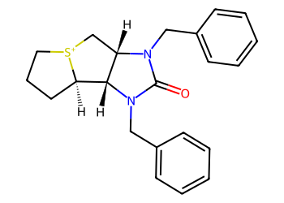
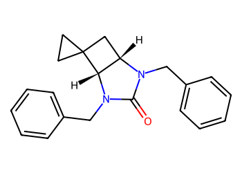

# Lead Optimization Report — 134001de89c8f9924655b206909a3a351e95afd9
## Summary
- **Calibrated p(toxic):** 0.600
- **Threshold:** 0.510 → **Predicted class:** 1
- **Max similarity to train:** 0.239 (**bin:** <0.3)
- **OOD classification:** Very out-of-domain
- **Result classification:** Generated suggestions available (Tier: Tier 1 — Flip)
- Similarity is very low; generated suggestions may be scarce and fallback analogues are provided for context.
## Base molecule
- **SMILES:** `O=C1N(Cc2ccccc2)[C@@H]2[C@H]3CCC[S+]3C[C@@H]2N1Cc1ccccc1`
- **True label:** 1



## Counterfactual search summary
- ExMol requested: 1800 | drawn: 1453
- Generated tier (Tier 1–4): Tier 1 — Flip
- Relaxation used: True (applied: relax_flip_0.4)
- Generated survivors (Tier 1–4): 1
- Dataset analogue fallback count (not included in survivors): 5
- Relaxation note: lower flip min_tanimoto to 0.4

### Filter attrition by tier (baseline + final relaxation)
<table>
<tr><th>Tier</th><th>Relaxation</th><th>Sampled</th><th>Kept</th><th>Invalid</th><th>Duplicate</th><th>Similarity</th><th>Prob</th><th>Δp</th><th>SA</th><th>ΔLogP</th><th>QED</th><th>Alerts</th></tr>
<tr><td>Tier 1 — Flip</td><td>none</td><td>1453</td><td>0</td><td>0</td><td>4</td><td>1050</td><td>382</td><td>0</td><td>7</td><td>0</td><td>0</td><td>10</td></tr>
<tr><td>Tier 1 — Flip</td><td>relax_flip_0.4</td><td>1453</td><td>1</td><td>0</td><td>4</td><td>838</td><td>571</td><td>0</td><td>14</td><td>2</td><td>0</td><td>23</td></tr>
</table>

<details><summary>All filter attempts (diagnostic)</summary>
```json
[
  {
    "tier": "flip",
    "tier_label": "Tier 1 \u2014 Flip",
    "relaxation": "none",
    "relaxation_desc": "baseline constraints",
    "counts": {
      "sampled": 1453,
      "invalid": 0,
      "duplicate": 4,
      "similarity_filtered": 1050,
      "prob_filtered": 382,
      "delta_filtered": 0,
      "sa_filtered": 7,
      "logp_filtered": 0,
      "qed_filtered": 0,
      "alert_filtered": 10,
      "kept": 0,
      "min_tanimoto_used": 0.5,
      "min_tanimoto_source": "min_tanimoto_flip",
      "prob_max_used": 0.509999,
      "delta_min_used": null,
      "sa_max_used": 4.5,
      "logp_delta_max_used": 1.5,
      "qed_min_used": 0.0,
      "pains_used": true
    }
  },
  {
    "tier": "flip",
    "tier_label": "Tier 1 \u2014 Flip",
    "relaxation": "relax_flip_0.4",
    "relaxation_desc": "lower flip min_tanimoto to 0.4",
    "counts": {
      "sampled": 1453,
      "invalid": 0,
      "duplicate": 4,
      "similarity_filtered": 838,
      "prob_filtered": 571,
      "delta_filtered": 0,
      "sa_filtered": 14,
      "logp_filtered": 2,
      "qed_filtered": 0,
      "alert_filtered": 23,
      "kept": 1,
      "min_tanimoto_used": 0.4,
      "min_tanimoto_source": "min_tanimoto_flip",
      "prob_max_used": 0.509999,
      "delta_min_used": null,
      "sa_max_used": 4.5,
      "logp_delta_max_used": 1.5,
      "qed_min_used": 0.0,
      "pains_used": true
    }
  }
]
```
</details>

## Counterfactual suggestions (filtered)
_Rows below are generated from Tier 1 — Flip (relaxation: relax_flip_0.4)._ 
<table>
<tr><th>Rank</th><th>Structure</th><th>Tier</th><th>Relaxation</th><th>Similarity</th><th>p(toxic)</th><th>Δp</th><th>LogP</th><th>QED</th><th>SA</th></tr>
<tr><td>1</td><td></td><td>Tier 1 — Flip</td><td>relax_flip_0.4</td><td>0.246</td><td>0.504</td><td>0.096</td><td>4.05</td><td>0.83</td><td>3.56</td></tr>
</table>

## Dataset-derived analogues (fallback)
_Nearest analogues from the dataset (context only, not generated edits)._ 
<table>
<tr><th>Rank</th><th>Structure</th><th>Similarity</th><th>p(toxic)</th><th>Δp</th><th>LogP</th><th>QED</th><th>SA</th><th>Alerts</th><th>Actionable?</th></tr>
<tr><td>1</td><td></td><td>0.105</td><td>0.395</td><td>0.205</td><td>-1.04</td><td>0.56</td><td>2.54</td><td>OK</td><td>YES</td></tr>
<tr><td>2</td><td></td><td>0.033</td><td>0.395</td><td>0.205</td><td>0.60</td><td>0.50</td><td>3.30</td><td>⚠</td><td>NO</td></tr>
<tr><td>3</td><td></td><td>0.085</td><td>0.396</td><td>0.204</td><td>-1.37</td><td>0.52</td><td>2.66</td><td>OK</td><td>YES</td></tr>
<tr><td>4</td><td></td><td>0.083</td><td>0.396</td><td>0.204</td><td>-1.49</td><td>0.37</td><td>3.39</td><td>⚠</td><td>NO</td></tr>
<tr><td>5</td><td></td><td>0.081</td><td>0.396</td><td>0.204</td><td>-0.89</td><td>0.38</td><td>2.75</td><td>OK</td><td>YES</td></tr>
</table>

## Raw records (for audit)
### Counterfactuals JSON
```json
[
  {
    "raw_smiles": "O=C1N(Cc2ccccc2)[C@H]2[C@H](CC23CC3)N1Cc1ccccc1",
    "smiles": "O=C1N(Cc2ccccc2)[C@H]2[C@H](CC23CC3)N1Cc1ccccc1",
    "similarity": 0.2463768115942029,
    "p": 0.5038326329634518,
    "delta_p": 0.09568072381693027,
    "logp": 4.045500000000003,
    "qed": 0.834170732081205,
    "sascore": 3.564676073751987,
    "alert": false,
    "tier": "diagnostic_close_edits",
    "tier_label": "Tier 1 \u2014 Flip",
    "relaxation": "relax_flip_0.4",
    "relaxation_desc": "lower flip min_tanimoto to 0.4",
    "p_raw": 0.5038326329634518,
    "delta_p_raw": 0.09568072381693027,
    "tier_raw": "flip",
    "tier_num_std": 4,
    "tier_label_std": "diagnostic_close_edits"
  }
]
```
### Dataset analogues JSON
```json
[
  {
    "raw_smiles": "Cn1c(=O)c2[nH]cnc2n(C)c1=O",
    "smiles": "Cn1c(=O)c2[nH]cnc2n(C)c1=O",
    "similarity": 0.10526315789473684,
    "p": 0.39478944477282535,
    "delta_p": 0.20472391200755674,
    "logp": -1.0397000000000005,
    "qed": 0.5624722357827983,
    "sascore": 2.5435777719868486,
    "sa_status": "ok",
    "actionable": true,
    "alert": false,
    "tier": "dataset_analogue",
    "tier_label": "Dataset analogue",
    "relaxation": "none",
    "relaxation_desc": "dataset fallback",
    "sa_max_used": 4.5,
    "pains_used": true
  },
  {
    "raw_smiles": "Nc1nc(=S)c2[nH]cnc2[nH]1",
    "smiles": "Nc1nc(=S)c2[nH]cnc2[nH]1",
    "similarity": 0.03278688524590164,
    "p": 0.39478944477282535,
    "delta_p": 0.20472391200755674,
    "logp": 0.5976899999999998,
    "qed": 0.5014913838271434,
    "sascore": 3.3037189467190657,
    "sa_status": "ok",
    "actionable": false,
    "alert": true,
    "tier": "dataset_analogue",
    "tier_label": "Dataset analogue",
    "relaxation": "none",
    "relaxation_desc": "dataset fallback",
    "sa_max_used": 4.5,
    "pains_used": true
  },
  {
    "raw_smiles": "O=C(O)CSc1n[nH]c(=O)[nH]c1=O",
    "smiles": "O=C(O)CSc1n[nH]c(=O)[nH]c1=O",
    "similarity": 0.0847457627118644,
    "p": 0.39562248764441715,
    "delta_p": 0.20389086913596494,
    "logp": -1.3651000000000004,
    "qed": 0.522012923698588,
    "sascore": 2.657270519239594,
    "sa_status": "ok",
    "actionable": true,
    "alert": false,
    "tier": "dataset_analogue",
    "tier_label": "Dataset analogue",
    "relaxation": "none",
    "relaxation_desc": "dataset fallback",
    "sa_max_used": 4.5,
    "pains_used": true
  },
  {
    "raw_smiles": "NC(=O)NOCc1[nH]c(=O)[nH]c1O",
    "smiles": "NC(=O)NOCc1[nH]c(=O)[nH]c1O",
    "similarity": 0.08333333333333333,
    "p": 0.39562248764441715,
    "delta_p": 0.20389086913596494,
    "logp": -1.4915000000000007,
    "qed": 0.36918015695991285,
    "sascore": 3.392398431327507,
    "sa_status": "ok",
    "actionable": false,
    "alert": true,
    "tier": "dataset_analogue",
    "tier_label": "Dataset analogue",
    "relaxation": "none",
    "relaxation_desc": "dataset fallback",
    "sa_max_used": 4.5,
    "pains_used": true
  },
  {
    "raw_smiles": "Nc1[nH]c(SCC(=O)O)nc(=O)c1N",
    "smiles": "Nc1[nH]c(SCC(=O)O)nc(=O)c1N",
    "similarity": 0.08064516129032258,
    "p": 0.39562248764441715,
    "delta_p": 0.20389086913596494,
    "logp": -0.8890000000000002,
    "qed": 0.37987832891849627,
    "sascore": 2.7514290264405794,
    "sa_status": "ok",
    "actionable": true,
    "alert": false,
    "tier": "dataset_analogue",
    "tier_label": "Dataset analogue",
    "relaxation": "none",
    "relaxation_desc": "dataset fallback",
    "sa_max_used": 4.5,
    "pains_used": true
  }
]
```
