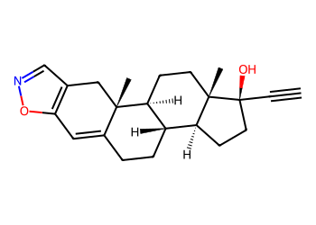
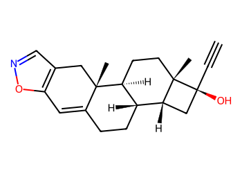
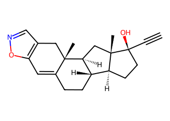
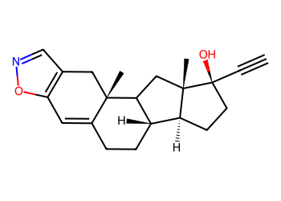
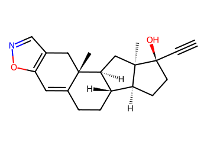
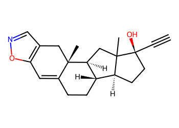
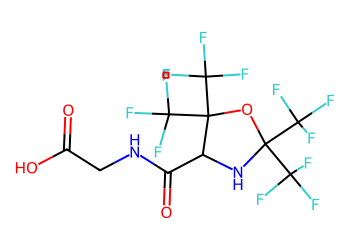

# Lead Optimization Report — 21705d40e0177efa509d6d786d48650432d56706
## Summary
- **Calibrated p(toxic):** 0.538
- **Threshold:** 0.510 → **Predicted class:** 1
- **Max similarity to train:** 0.237 (**bin:** <0.3)
- **OOD classification:** Very out-of-domain
- **Result classification:** Generated suggestions available (Tier: Tier 4 — Closest edits (diagnostic))
- Similarity is very low; generated suggestions may be scarce and fallback analogues are provided for context.
## Base molecule
- **SMILES:** `C#C[C@]1(O)CC[C@H]2[C@@H]3CCC4=Cc5oncc5C[C@]4(C)[C@H]3CC[C@@]21C`
- **True label:** 0



## Counterfactual search summary
- ExMol requested: 1800 | drawn: 1547
- Generated tier (Tier 1–4): Tier 4 — Closest edits (diagnostic)
- Relaxation used: False (applied: none)
- Generated survivors (Tier 1–4): 5
- Dataset analogue fallback count (not included in survivors): 5
- Relaxation note: diagnostic fallback (no valid improvements found)

### Filter attrition by tier (baseline + final relaxation)
<table>
<tr><th>Tier</th><th>Relaxation</th><th>Sampled</th><th>Kept</th><th>Invalid</th><th>Duplicate</th><th>Similarity</th><th>Prob</th><th>Δp</th><th>SA</th><th>ΔLogP</th><th>QED</th><th>Alerts</th></tr>
<tr><td>Tier 1 — Flip</td><td>none</td><td>1547</td><td>0</td><td>0</td><td>2</td><td>1158</td><td>360</td><td>0</td><td>27</td><td>0</td><td>0</td><td>0</td></tr>
<tr><td>Tier 2 — Risk reduction</td><td>none</td><td>1547</td><td>0</td><td>0</td><td>2</td><td>1484</td><td>0</td><td>61</td><td>0</td><td>0</td><td>0</td><td>0</td></tr>
<tr><td>Tier 3 — Weak improvement</td><td>none</td><td>1547</td><td>0</td><td>0</td><td>2</td><td>1484</td><td>0</td><td>61</td><td>0</td><td>0</td><td>0</td><td>0</td></tr>
</table>

<details><summary>All filter attempts (diagnostic)</summary>
```json
[
  {
    "tier": "flip",
    "tier_label": "Tier 1 \u2014 Flip",
    "relaxation": "none",
    "relaxation_desc": "baseline constraints",
    "counts": {
      "sampled": 1547,
      "invalid": 0,
      "duplicate": 2,
      "similarity_filtered": 1158,
      "prob_filtered": 360,
      "delta_filtered": 0,
      "sa_filtered": 27,
      "logp_filtered": 0,
      "qed_filtered": 0,
      "alert_filtered": 0,
      "kept": 0,
      "min_tanimoto_used": 0.5,
      "min_tanimoto_source": "min_tanimoto_flip",
      "prob_max_used": 0.509999,
      "delta_min_used": null,
      "sa_max_used": 4.5,
      "logp_delta_max_used": 1.5,
      "qed_min_used": 0.0,
      "pains_used": true
    }
  },
  {
    "tier": "flip",
    "tier_label": "Tier 1 \u2014 Flip",
    "relaxation": "relax_flip_0.4",
    "relaxation_desc": "lower flip min_tanimoto to 0.4",
    "counts": {
      "sampled": 1547,
      "invalid": 0,
      "duplicate": 2,
      "similarity_filtered": 883,
      "prob_filtered": 560,
      "delta_filtered": 0,
      "sa_filtered": 101,
      "logp_filtered": 0,
      "qed_filtered": 0,
      "alert_filtered": 1,
      "kept": 0,
      "min_tanimoto_used": 0.4,
      "min_tanimoto_source": "min_tanimoto_flip",
      "prob_max_used": 0.509999,
      "delta_min_used": null,
      "sa_max_used": 4.5,
      "logp_delta_max_used": 1.5,
      "qed_min_used": 0.0,
      "pains_used": true
    }
  },
  {
    "tier": "flip",
    "tier_label": "Tier 1 \u2014 Flip",
    "relaxation": "relax_flip_0.3",
    "relaxation_desc": "lower flip min_tanimoto to 0.3",
    "counts": {
      "sampled": 1547,
      "invalid": 0,
      "duplicate": 2,
      "similarity_filtered": 569,
      "prob_filtered": 770,
      "delta_filtered": 0,
      "sa_filtered": 205,
      "logp_filtered": 0,
      "qed_filtered": 0,
      "alert_filtered": 1,
      "kept": 0,
      "min_tanimoto_used": 0.3,
      "min_tanimoto_source": "min_tanimoto_flip",
      "prob_max_used": 0.509999,
      "delta_min_used": null,
      "sa_max_used": 4.5,
      "logp_delta_max_used": 1.5,
      "qed_min_used": 0.0,
      "pains_used": true
    }
  },
  {
    "tier": "flip",
    "tier_label": "Tier 1 \u2014 Flip",
    "relaxation": "relax_improve_0.6",
    "relaxation_desc": "lower improve min_tanimoto to 0.6",
    "counts": {
      "sampled": 1547,
      "invalid": 0,
      "duplicate": 2,
      "similarity_filtered": 1158,
      "prob_filtered": 360,
      "delta_filtered": 0,
      "sa_filtered": 27,
      "logp_filtered": 0,
      "qed_filtered": 0,
      "alert_filtered": 0,
      "kept": 0,
      "min_tanimoto_used": 0.5,
      "min_tanimoto_source": "min_tanimoto_flip",
      "prob_max_used": 0.509999,
      "delta_min_used": null,
      "sa_max_used": 4.5,
      "logp_delta_max_used": 1.5,
      "qed_min_used": 0.0,
      "pains_used": true
    }
  },
  {
    "tier": "flip",
    "tier_label": "Tier 1 \u2014 Flip",
    "relaxation": "relax_improve_0.5",
    "relaxation_desc": "lower improve min_tanimoto to 0.5",
    "counts": {
      "sampled": 1547,
      "invalid": 0,
      "duplicate": 2,
      "similarity_filtered": 1158,
      "prob_filtered": 360,
      "delta_filtered": 0,
      "sa_filtered": 27,
      "logp_filtered": 0,
      "qed_filtered": 0,
      "alert_filtered": 0,
      "kept": 0,
      "min_tanimoto_used": 0.5,
      "min_tanimoto_source": "min_tanimoto_flip",
      "prob_max_used": 0.509999,
      "delta_min_used": null,
      "sa_max_used": 4.5,
      "logp_delta_max_used": 1.5,
      "qed_min_used": 0.0,
      "pains_used": true
    }
  },
  {
    "tier": "flip",
    "tier_label": "Tier 1 \u2014 Flip",
    "relaxation": "relax_sa_5.5",
    "relaxation_desc": "raise SA max to 5.5",
    "counts": {
      "sampled": 1547,
      "invalid": 0,
      "duplicate": 2,
      "similarity_filtered": 1158,
      "prob_filtered": 360,
      "delta_filtered": 0,
      "sa_filtered": 9,
      "logp_filtered": 0,
      "qed_filtered": 0,
      "alert_filtered": 18,
      "kept": 0,
      "min_tanimoto_used": 0.5,
      "min_tanimoto_source": "min_tanimoto_flip",
      "prob_max_used": 0.509999,
      "delta_min_used": null,
      "sa_max_used": 5.5,
      "logp_delta_max_used": 1.5,
      "qed_min_used": 0.0,
      "pains_used": true
    }
  },
  {
    "tier": "risk_reduction",
    "tier_label": "Tier 2 \u2014 Risk reduction",
    "relaxation": "none",
    "relaxation_desc": "baseline constraints",
    "counts": {
      "sampled": 1547,
      "invalid": 0,
      "duplicate": 2,
      "similarity_filtered": 1484,
      "prob_filtered": 0,
      "delta_filtered": 61,
      "sa_filtered": 0,
      "logp_filtered": 0,
      "qed_filtered": 0,
      "alert_filtered": 0,
      "kept": 0,
      "min_tanimoto_used": 0.7,
      "min_tanimoto_source": "min_tanimoto_improve",
      "prob_max_used": null,
      "delta_min_used": 0.1,
      "sa_max_used": 4.5,
      "logp_delta_max_used": 1.5,
      "qed_min_used": 0.0,
      "pains_used": true
    }
  },
  {
    "tier": "risk_reduction",
    "tier_label": "Tier 2 \u2014 Risk reduction",
    "relaxation": "relax_flip_0.4",
    "relaxation_desc": "lower flip min_tanimoto to 0.4",
    "counts": {
      "sampled": 1547,
      "invalid": 0,
      "duplicate": 2,
      "similarity_filtered": 1484,
      "prob_filtered": 0,
      "delta_filtered": 61,
      "sa_filtered": 0,
      "logp_filtered": 0,
      "qed_filtered": 0,
      "alert_filtered": 0,
      "kept": 0,
      "min_tanimoto_used": 0.7,
      "min_tanimoto_source": "min_tanimoto_improve",
      "prob_max_used": null,
      "delta_min_used": 0.1,
      "sa_max_used": 4.5,
      "logp_delta_max_used": 1.5,
      "qed_min_used": 0.0,
      "pains_used": true
    }
  },
  {
    "tier": "risk_reduction",
    "tier_label": "Tier 2 \u2014 Risk reduction",
    "relaxation": "relax_flip_0.3",
    "relaxation_desc": "lower flip min_tanimoto to 0.3",
    "counts": {
      "sampled": 1547,
      "invalid": 0,
      "duplicate": 2,
      "similarity_filtered": 1484,
      "prob_filtered": 0,
      "delta_filtered": 61,
      "sa_filtered": 0,
      "logp_filtered": 0,
      "qed_filtered": 0,
      "alert_filtered": 0,
      "kept": 0,
      "min_tanimoto_used": 0.7,
      "min_tanimoto_source": "min_tanimoto_improve",
      "prob_max_used": null,
      "delta_min_used": 0.1,
      "sa_max_used": 4.5,
      "logp_delta_max_used": 1.5,
      "qed_min_used": 0.0,
      "pains_used": true
    }
  },
  {
    "tier": "risk_reduction",
    "tier_label": "Tier 2 \u2014 Risk reduction",
    "relaxation": "relax_improve_0.6",
    "relaxation_desc": "lower improve min_tanimoto to 0.6",
    "counts": {
      "sampled": 1547,
      "invalid": 0,
      "duplicate": 2,
      "similarity_filtered": 1379,
      "prob_filtered": 0,
      "delta_filtered": 166,
      "sa_filtered": 0,
      "logp_filtered": 0,
      "qed_filtered": 0,
      "alert_filtered": 0,
      "kept": 0,
      "min_tanimoto_used": 0.6,
      "min_tanimoto_source": "min_tanimoto_improve",
      "prob_max_used": null,
      "delta_min_used": 0.1,
      "sa_max_used": 4.5,
      "logp_delta_max_used": 1.5,
      "qed_min_used": 0.0,
      "pains_used": true
    }
  },
  {
    "tier": "risk_reduction",
    "tier_label": "Tier 2 \u2014 Risk reduction",
    "relaxation": "relax_improve_0.5",
    "relaxation_desc": "lower improve min_tanimoto to 0.5",
    "counts": {
      "sampled": 1547,
      "invalid": 0,
      "duplicate": 2,
      "similarity_filtered": 1158,
      "prob_filtered": 0,
      "delta_filtered": 385,
      "sa_filtered": 2,
      "logp_filtered": 0,
      "qed_filtered": 0,
      "alert_filtered": 0,
      "kept": 0,
      "min_tanimoto_used": 0.5,
      "min_tanimoto_source": "min_tanimoto_improve",
      "prob_max_used": null,
      "delta_min_used": 0.1,
      "sa_max_used": 4.5,
      "logp_delta_max_used": 1.5,
      "qed_min_used": 0.0,
      "pains_used": true
    }
  },
  {
    "tier": "risk_reduction",
    "tier_label": "Tier 2 \u2014 Risk reduction",
    "relaxation": "relax_sa_5.5",
    "relaxation_desc": "raise SA max to 5.5",
    "counts": {
      "sampled": 1547,
      "invalid": 0,
      "duplicate": 2,
      "similarity_filtered": 1484,
      "prob_filtered": 0,
      "delta_filtered": 61,
      "sa_filtered": 0,
      "logp_filtered": 0,
      "qed_filtered": 0,
      "alert_filtered": 0,
      "kept": 0,
      "min_tanimoto_used": 0.7,
      "min_tanimoto_source": "min_tanimoto_improve",
      "prob_max_used": null,
      "delta_min_used": 0.1,
      "sa_max_used": 5.5,
      "logp_delta_max_used": 1.5,
      "qed_min_used": 0.0,
      "pains_used": true
    }
  },
  {
    "tier": "weak_reduction",
    "tier_label": "Tier 3 \u2014 Weak improvement",
    "relaxation": "none",
    "relaxation_desc": "baseline constraints",
    "counts": {
      "sampled": 1547,
      "invalid": 0,
      "duplicate": 2,
      "similarity_filtered": 1484,
      "prob_filtered": 0,
      "delta_filtered": 61,
      "sa_filtered": 0,
      "logp_filtered": 0,
      "qed_filtered": 0,
      "alert_filtered": 0,
      "kept": 0,
      "min_tanimoto_used": 0.7,
      "min_tanimoto_source": "min_tanimoto_improve",
      "prob_max_used": null,
      "delta_min_used": 0.05,
      "sa_max_used": 4.5,
      "logp_delta_max_used": 1.5,
      "qed_min_used": 0.0,
      "pains_used": true
    }
  },
  {
    "tier": "weak_reduction",
    "tier_label": "Tier 3 \u2014 Weak improvement",
    "relaxation": "relax_flip_0.4",
    "relaxation_desc": "lower flip min_tanimoto to 0.4",
    "counts": {
      "sampled": 1547,
      "invalid": 0,
      "duplicate": 2,
      "similarity_filtered": 1484,
      "prob_filtered": 0,
      "delta_filtered": 61,
      "sa_filtered": 0,
      "logp_filtered": 0,
      "qed_filtered": 0,
      "alert_filtered": 0,
      "kept": 0,
      "min_tanimoto_used": 0.7,
      "min_tanimoto_source": "min_tanimoto_improve",
      "prob_max_used": null,
      "delta_min_used": 0.05,
      "sa_max_used": 4.5,
      "logp_delta_max_used": 1.5,
      "qed_min_used": 0.0,
      "pains_used": true
    }
  },
  {
    "tier": "weak_reduction",
    "tier_label": "Tier 3 \u2014 Weak improvement",
    "relaxation": "relax_flip_0.3",
    "relaxation_desc": "lower flip min_tanimoto to 0.3",
    "counts": {
      "sampled": 1547,
      "invalid": 0,
      "duplicate": 2,
      "similarity_filtered": 1484,
      "prob_filtered": 0,
      "delta_filtered": 61,
      "sa_filtered": 0,
      "logp_filtered": 0,
      "qed_filtered": 0,
      "alert_filtered": 0,
      "kept": 0,
      "min_tanimoto_used": 0.7,
      "min_tanimoto_source": "min_tanimoto_improve",
      "prob_max_used": null,
      "delta_min_used": 0.05,
      "sa_max_used": 4.5,
      "logp_delta_max_used": 1.5,
      "qed_min_used": 0.0,
      "pains_used": true
    }
  },
  {
    "tier": "weak_reduction",
    "tier_label": "Tier 3 \u2014 Weak improvement",
    "relaxation": "relax_improve_0.6",
    "relaxation_desc": "lower improve min_tanimoto to 0.6",
    "counts": {
      "sampled": 1547,
      "invalid": 0,
      "duplicate": 2,
      "similarity_filtered": 1379,
      "prob_filtered": 0,
      "delta_filtered": 165,
      "sa_filtered": 1,
      "logp_filtered": 0,
      "qed_filtered": 0,
      "alert_filtered": 0,
      "kept": 0,
      "min_tanimoto_used": 0.6,
      "min_tanimoto_source": "min_tanimoto_improve",
      "prob_max_used": null,
      "delta_min_used": 0.05,
      "sa_max_used": 4.5,
      "logp_delta_max_used": 1.5,
      "qed_min_used": 0.0,
      "pains_used": true
    }
  },
  {
    "tier": "weak_reduction",
    "tier_label": "Tier 3 \u2014 Weak improvement",
    "relaxation": "relax_improve_0.5",
    "relaxation_desc": "lower improve min_tanimoto to 0.5",
    "counts": {
      "sampled": 1547,
      "invalid": 0,
      "duplicate": 2,
      "similarity_filtered": 1158,
      "prob_filtered": 0,
      "delta_filtered": 383,
      "sa_filtered": 4,
      "logp_filtered": 0,
      "qed_filtered": 0,
      "alert_filtered": 0,
      "kept": 0,
      "min_tanimoto_used": 0.5,
      "min_tanimoto_source": "min_tanimoto_improve",
      "prob_max_used": null,
      "delta_min_used": 0.05,
      "sa_max_used": 4.5,
      "logp_delta_max_used": 1.5,
      "qed_min_used": 0.0,
      "pains_used": true
    }
  },
  {
    "tier": "weak_reduction",
    "tier_label": "Tier 3 \u2014 Weak improvement",
    "relaxation": "relax_sa_5.5",
    "relaxation_desc": "raise SA max to 5.5",
    "counts": {
      "sampled": 1547,
      "invalid": 0,
      "duplicate": 2,
      "similarity_filtered": 1484,
      "prob_filtered": 0,
      "delta_filtered": 61,
      "sa_filtered": 0,
      "logp_filtered": 0,
      "qed_filtered": 0,
      "alert_filtered": 0,
      "kept": 0,
      "min_tanimoto_used": 0.7,
      "min_tanimoto_source": "min_tanimoto_improve",
      "prob_max_used": null,
      "delta_min_used": 0.05,
      "sa_max_used": 5.5,
      "logp_delta_max_used": 1.5,
      "qed_min_used": 0.0,
      "pains_used": true
    }
  }
]
```
</details>

## Counterfactual suggestions (filtered)
_Rows below are generated from Tier 4 — Closest edits (diagnostic) (relaxation: none)._ 
<table>
<tr><th>Rank</th><th>Structure</th><th>Tier</th><th>Relaxation</th><th>Similarity</th><th>p(toxic)</th><th>Δp</th><th>LogP</th><th>QED</th><th>SA</th></tr>
<tr><td>1</td><td></td><td>Tier 4 — Closest edits (diagnostic)</td><td>none</td><td>0.235</td><td>0.538</td><td>0.000</td><td>3.83</td><td>0.74</td><td>4.88</td></tr>
<tr><td>2</td><td></td><td>Tier 4 — Closest edits (diagnostic)</td><td>none</td><td>0.220</td><td>0.538</td><td>0.000</td><td>3.83</td><td>0.74</td><td>4.85</td></tr>
<tr><td>3</td><td></td><td>Tier 4 — Closest edits (diagnostic)</td><td>none</td><td>0.220</td><td>0.538</td><td>0.000</td><td>3.83</td><td>0.74</td><td>4.85</td></tr>
<tr><td>4</td><td></td><td>Tier 4 — Closest edits (diagnostic)</td><td>none</td><td>0.220</td><td>0.538</td><td>0.000</td><td>3.83</td><td>0.74</td><td>4.85</td></tr>
<tr><td>5</td><td></td><td>Tier 4 — Closest edits (diagnostic)</td><td>none</td><td>0.220</td><td>0.538</td><td>0.000</td><td>3.83</td><td>0.74</td><td>4.85</td></tr>
</table>

## Dataset-derived analogues (fallback)
_Nearest analogues from the dataset (context only, not generated edits)._ 
<table>
<tr><th>Rank</th><th>Structure</th><th>Similarity</th><th>p(toxic)</th><th>Δp</th><th>LogP</th><th>QED</th><th>SA</th><th>Alerts</th><th>Actionable?</th></tr>
<tr><td>1</td><td></td><td>0.069</td><td>0.395</td><td>0.143</td><td>-1.04</td><td>0.56</td><td>2.54</td><td>OK</td><td>YES</td></tr>
<tr><td>2</td><td></td><td>0.041</td><td>0.395</td><td>0.143</td><td>0.60</td><td>0.50</td><td>3.30</td><td>⚠</td><td>NO</td></tr>
<tr><td>3</td><td></td><td>0.062</td><td>0.396</td><td>0.143</td><td>1.86</td><td>0.58</td><td>4.05</td><td>OK</td><td>YES</td></tr>
<tr><td>4</td><td></td><td>0.053</td><td>0.396</td><td>0.143</td><td>-0.86</td><td>0.63</td><td>2.46</td><td>⚠</td><td>NO</td></tr>
<tr><td>5</td><td></td><td>0.044</td><td>0.396</td><td>0.143</td><td>-1.34</td><td>0.50</td><td>2.46</td><td>OK</td><td>YES</td></tr>
</table>

## Raw records (for audit)
### Counterfactuals JSON
```json
[
  {
    "raw_smiles": "C#C[C@]1(O)C[C@@H]2[C@@H]3CCC4=Cc5oncc5C[C@]4(C)[C@H]3CC[C@@]21C",
    "smiles": "C#C[C@]1(O)C[C@@H]2[C@@H]3CCC4=Cc5oncc5C[C@]4(C)[C@H]3CC[C@@]21C",
    "similarity": 0.2345679012345679,
    "p": 0.5381695926921544,
    "delta_p": 0.0,
    "logp": 3.8309000000000024,
    "qed": 0.7381340762823343,
    "sascore": 4.883677827720167,
    "alert": true,
    "tier": "diagnostic_close_edits",
    "tier_label": "Tier 4 \u2014 Closest edits (diagnostic)",
    "relaxation": "none",
    "relaxation_desc": "diagnostic fallback (no valid improvements found)",
    "p_raw": 0.5381695926921544,
    "delta_p_raw": 0.0,
    "tier_raw": "diagnostic_close_edits",
    "tier_num_std": 4,
    "tier_label_std": "diagnostic_close_edits"
  },
  {
    "raw_smiles": "C#C[C@]1(O)CC[C@H]2[C@@H]3CCC4=Cc5oncc5C[C@]4(C)[C@H]3C[C@@]21C",
    "smiles": "C#C[C@]1(O)CC[C@H]2[C@@H]3CCC4=Cc5oncc5C[C@]4(C)[C@H]3C[C@@]21C",
    "similarity": 0.21951219512195122,
    "p": 0.5381695926921544,
    "delta_p": 0.0,
    "logp": 3.8309000000000024,
    "qed": 0.7381340762823343,
    "sascore": 4.846181221385325,
    "alert": true,
    "tier": "diagnostic_close_edits",
    "tier_label": "Tier 4 \u2014 Closest edits (diagnostic)",
    "relaxation": "none",
    "relaxation_desc": "diagnostic fallback (no valid improvements found)",
    "p_raw": 0.5381695926921544,
    "delta_p_raw": 0.0,
    "tier_raw": "diagnostic_close_edits",
    "tier_num_std": 4,
    "tier_label_std": "diagnostic_close_edits"
  },
  {
    "raw_smiles": "C#C[C@]1(O)CC[C@H]2[C@@H]3CCC4=Cc5oncc5C[C@]4(C)C3C[C@@]21C",
    "smiles": "C#C[C@]1(O)CC[C@H]2[C@@H]3CCC4=Cc5oncc5C[C@]4(C)C3C[C@@]21C",
    "similarity": 0.21951219512195122,
    "p": 0.5381695926921544,
    "delta_p": 0.0,
    "logp": 3.8309000000000024,
    "qed": 0.7381340762823343,
    "sascore": 4.846181221385325,
    "alert": true,
    "tier": "diagnostic_close_edits",
    "tier_label": "Tier 4 \u2014 Closest edits (diagnostic)",
    "relaxation": "none",
    "relaxation_desc": "diagnostic fallback (no valid improvements found)",
    "p_raw": 0.5381695926921544,
    "delta_p_raw": 0.0,
    "tier_raw": "diagnostic_close_edits",
    "tier_num_std": 4,
    "tier_label_std": "diagnostic_close_edits"
  },
  {
    "raw_smiles": "C#C[C@]1(O)CC[C@H]2[C@@H]3CCC4=Cc5oncc5C[C@]4(C)[C@H]3C[C@]21C",
    "smiles": "C#C[C@]1(O)CC[C@H]2[C@@H]3CCC4=Cc5oncc5C[C@]4(C)[C@H]3C[C@]21C",
    "similarity": 0.21951219512195122,
    "p": 0.5381695926921544,
    "delta_p": 0.0,
    "logp": 3.8309000000000024,
    "qed": 0.7381340762823343,
    "sascore": 4.846181221385325,
    "alert": true,
    "tier": "diagnostic_close_edits",
    "tier_label": "Tier 4 \u2014 Closest edits (diagnostic)",
    "relaxation": "none",
    "relaxation_desc": "diagnostic fallback (no valid improvements found)",
    "p_raw": 0.5381695926921544,
    "delta_p_raw": 0.0,
    "tier_raw": "diagnostic_close_edits",
    "tier_num_std": 4,
    "tier_label_std": "diagnostic_close_edits"
  },
  {
    "raw_smiles": "C#C[C@]1(O)CC[C@H]2[C@@H]3CCC4=Cc5oncc5C[C@]4(C)[C@H]3CC21C",
    "smiles": "C#C[C@]1(O)CC[C@H]2[C@@H]3CCC4=Cc5oncc5C[C@]4(C)[C@H]3CC21C",
    "similarity": 0.21951219512195122,
    "p": 0.5381695926921544,
    "delta_p": 0.0,
    "logp": 3.8309000000000024,
    "qed": 0.7381340762823343,
    "sascore": 4.846181221385325,
    "alert": true,
    "tier": "diagnostic_close_edits",
    "tier_label": "Tier 4 \u2014 Closest edits (diagnostic)",
    "relaxation": "none",
    "relaxation_desc": "diagnostic fallback (no valid improvements found)",
    "p_raw": 0.5381695926921544,
    "delta_p_raw": 0.0,
    "tier_raw": "diagnostic_close_edits",
    "tier_num_std": 4,
    "tier_label_std": "diagnostic_close_edits"
  }
]
```
### Dataset analogues JSON
```json
[
  {
    "raw_smiles": "Cn1c(=O)c2[nH]cnc2n(C)c1=O",
    "smiles": "Cn1c(=O)c2[nH]cnc2n(C)c1=O",
    "similarity": 0.06944444444444445,
    "p": 0.39478944477282535,
    "delta_p": 0.14338014791932902,
    "logp": -1.0397000000000005,
    "qed": 0.5624722357827983,
    "sascore": 2.5435777719868486,
    "sa_status": "ok",
    "actionable": true,
    "alert": false,
    "tier": "dataset_analogue",
    "tier_label": "Dataset analogue",
    "relaxation": "none",
    "relaxation_desc": "dataset fallback",
    "sa_max_used": 4.5,
    "pains_used": true
  },
  {
    "raw_smiles": "Nc1nc(=S)c2[nH]cnc2[nH]1",
    "smiles": "Nc1nc(=S)c2[nH]cnc2[nH]1",
    "similarity": 0.04054054054054054,
    "p": 0.39478944477282535,
    "delta_p": 0.14338014791932902,
    "logp": 0.5976899999999998,
    "qed": 0.5014913838271434,
    "sascore": 3.3037189467190657,
    "sa_status": "ok",
    "actionable": false,
    "alert": true,
    "tier": "dataset_analogue",
    "tier_label": "Dataset analogue",
    "relaxation": "none",
    "relaxation_desc": "dataset fallback",
    "sa_max_used": 4.5,
    "pains_used": true
  },
  {
    "raw_smiles": "O=C(O)CNC(=O)C1NC(C(F)(F)F)(C(F)(F)F)OC1(C(F)(F)F)C(F)(F)F",
    "smiles": "O=C(O)CNC(=O)C1NC(C(F)(F)F)(C(F)(F)F)OC1(C(F)(F)F)C(F)(F)F",
    "similarity": 0.0625,
    "p": 0.39562248764441715,
    "delta_p": 0.1425471050477372,
    "logp": 1.8598999999999999,
    "qed": 0.5768274174598099,
    "sascore": 4.048334026953259,
    "sa_status": "ok",
    "actionable": true,
    "alert": false,
    "tier": "dataset_analogue",
    "tier_label": "Dataset analogue",
    "relaxation": "none",
    "relaxation_desc": "dataset fallback",
    "sa_max_used": 4.5,
    "pains_used": true
  },
  {
    "raw_smiles": "CC(=O)Nc1nnc(S(N)(=O)=O)s1",
    "smiles": "CC(=O)Nc1nnc(S(N)(=O)=O)s1",
    "similarity": 0.05333333333333334,
    "p": 0.39562248764441715,
    "delta_p": 0.1425471050477372,
    "logp": -0.8561000000000003,
    "qed": 0.6318586926732331,
    "sascore": 2.460960564488465,
    "sa_status": "ok",
    "actionable": false,
    "alert": true,
    "tier": "dataset_analogue",
    "tier_label": "Dataset analogue",
    "relaxation": "none",
    "relaxation_desc": "dataset fallback",
    "sa_max_used": 4.5,
    "pains_used": true
  },
  {
    "raw_smiles": "Nc1nc(N)nc(CC(=O)O)n1",
    "smiles": "Nc1nc(N)nc(CC(=O)O)n1",
    "similarity": 0.04411764705882353,
    "p": 0.39562248764441715,
    "delta_p": 0.1425471050477372,
    "logp": -1.3369,
    "qed": 0.49944774236295647,
    "sascore": 2.457943484484762,
    "sa_status": "ok",
    "actionable": true,
    "alert": false,
    "tier": "dataset_analogue",
    "tier_label": "Dataset analogue",
    "relaxation": "none",
    "relaxation_desc": "dataset fallback",
    "sa_max_used": 4.5,
    "pains_used": true
  }
]
```
