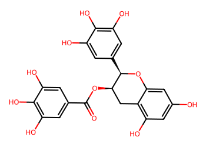
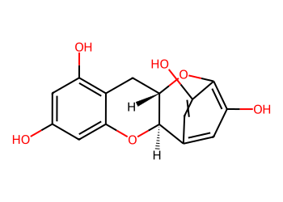
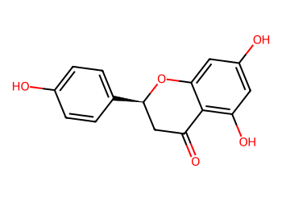
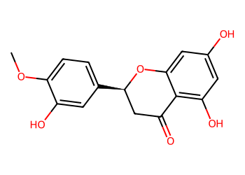

# Lead Optimization Report — 31cc736d33d9848a196a76dac8564e760eeb7140
## Summary
- **Calibrated p(toxic):** 0.429
- **Threshold:** 0.510 → **Predicted class:** 0
- **Max similarity to train:** 0.333 (**bin:** 0.3-0.5)
- **OOD classification:** Out-of-domain
- **Result classification:** Generated suggestions available (Tier: Tier 1 — Flip)
- Similarity is low; treat any suggestions cautiously and consult fallback analogues.
## Base molecule
- **SMILES:** `O=C(O[C@@H]1Cc2c(O)cc(O)cc2O[C@@H]1c1cc(O)c(O)c(O)c1)c1cc(O)c(O)c(O)c1`
- **True label:** 1



## Counterfactual search summary
- ExMol requested: 1800 | drawn: 1586
- Generated tier (Tier 1–4): Tier 1 — Flip
- Relaxation used: False (applied: none)
- Generated survivors (Tier 1–4): 1
- Dataset analogue fallback count (not included in survivors): 2
- Relaxation note: baseline constraints

### Filter attrition by tier (baseline + final relaxation)
<table>
<tr><th>Tier</th><th>Relaxation</th><th>Sampled</th><th>Kept</th><th>Invalid</th><th>Duplicate</th><th>Similarity</th><th>Prob</th><th>Δp</th><th>SA</th><th>ΔLogP</th><th>QED</th><th>Alerts</th></tr>
<tr><td>Tier 1 — Flip</td><td>none</td><td>1586</td><td>1</td><td>0</td><td>17</td><td>1109</td><td>51</td><td>0</td><td>74</td><td>30</td><td>0</td><td>304</td></tr>
</table>

<details><summary>All filter attempts (diagnostic)</summary>
```json
[
  {
    "tier": "flip",
    "tier_label": "Tier 1 \u2014 Flip",
    "relaxation": "none",
    "relaxation_desc": "baseline constraints",
    "counts": {
      "sampled": 1586,
      "invalid": 0,
      "duplicate": 17,
      "similarity_filtered": 1109,
      "prob_filtered": 51,
      "delta_filtered": 0,
      "sa_filtered": 74,
      "logp_filtered": 30,
      "qed_filtered": 0,
      "alert_filtered": 304,
      "kept": 1,
      "min_tanimoto_used": 0.5,
      "min_tanimoto_source": "min_tanimoto_flip",
      "prob_max_used": 0.509999,
      "delta_min_used": null,
      "sa_max_used": 4.5,
      "logp_delta_max_used": 1.5,
      "qed_min_used": 0.0,
      "pains_used": true
    }
  }
]
```
</details>

## Counterfactual suggestions (filtered)
_Rows below are generated from Tier 1 — Flip (relaxation: none)._ 
<table>
<tr><th>Rank</th><th>Structure</th><th>Tier</th><th>Relaxation</th><th>Similarity</th><th>p(toxic)</th><th>Δp</th><th>LogP</th><th>QED</th><th>SA</th></tr>
<tr><td>1</td><td></td><td>Tier 1 — Flip</td><td>none</td><td>0.340</td><td>0.440</td><td>-0.011</td><td>1.95</td><td>0.59</td><td>4.44</td></tr>
</table>

## Dataset-derived analogues (fallback)
_Nearest analogues from the dataset (context only, not generated edits)._ 
<table>
<tr><th>Rank</th><th>Structure</th><th>Similarity</th><th>p(toxic)</th><th>Δp</th><th>LogP</th><th>QED</th><th>SA</th><th>Alerts</th><th>Actionable?</th></tr>
<tr><td>1</td><td></td><td>0.310</td><td>0.466</td><td>-0.038</td><td>2.51</td><td>0.74</td><td>2.83</td><td>⚠</td><td>NO</td></tr>
<tr><td>2</td><td></td><td>0.333</td><td>0.485</td><td>-0.057</td><td>2.52</td><td>0.79</td><td>2.91</td><td>⚠</td><td>NO</td></tr>
</table>
Fallback analogues are context-only; none meet feasibility constraints.

## Raw records (for audit)
### Counterfactuals JSON
```json
[
  {
    "raw_smiles": "Oc1cc(O)c2c(c1)O[C@@H]1c3cc(O)c(c(O)c3)O[C@H]1C2",
    "smiles": "Oc1cc(O)c2c(c1)O[C@@H]1c3cc(O)c(c(O)c3)O[C@H]1C2",
    "similarity": 0.34,
    "p": 0.43985328024109466,
    "delta_p": -0.011333289102226085,
    "logp": 1.9461999999999997,
    "qed": 0.5910549650619816,
    "sascore": 4.4417788812203876,
    "alert": false,
    "tier": "diagnostic_close_edits",
    "tier_label": "Tier 1 \u2014 Flip",
    "relaxation": "none",
    "relaxation_desc": "baseline constraints",
    "p_raw": 0.43985328024109466,
    "delta_p_raw": -0.011333289102226085,
    "tier_raw": "flip",
    "tier_num_std": 4,
    "tier_label_std": "diagnostic_close_edits"
  }
]
```
### Dataset analogues JSON
```json
[
  {
    "raw_smiles": "O=C1C[C@@H](c2ccc(O)cc2)Oc2cc(O)cc(O)c21",
    "smiles": "O=C1C[C@@H](c2ccc(O)cc2)Oc2cc(O)cc(O)c21",
    "similarity": 0.3103448275862069,
    "p": 0.46629036595855117,
    "delta_p": -0.037770374819682595,
    "logp": 2.5099000000000014,
    "qed": 0.7421139126791214,
    "sascore": 2.825486723453654,
    "sa_status": "ok",
    "actionable": false,
    "alert": true,
    "tier": "dataset_analogue",
    "tier_label": "Dataset analogue",
    "relaxation": "none",
    "relaxation_desc": "dataset fallback",
    "sa_max_used": 4.5,
    "pains_used": true
  },
  {
    "raw_smiles": "COc1ccc([C@@H]2CC(=O)c3c(O)cc(O)cc3O2)cc1O",
    "smiles": "COc1ccc([C@@H]2CC(=O)c3c(O)cc(O)cc3O2)cc1O",
    "similarity": 0.3333333333333333,
    "p": 0.4853860032639538,
    "delta_p": -0.05686601212508524,
    "logp": 2.518500000000001,
    "qed": 0.7885404127535282,
    "sascore": 2.911946982961096,
    "sa_status": "ok",
    "actionable": false,
    "alert": true,
    "tier": "dataset_analogue",
    "tier_label": "Dataset analogue",
    "relaxation": "none",
    "relaxation_desc": "dataset fallback",
    "sa_max_used": 4.5,
    "pains_used": true
  }
]
```
