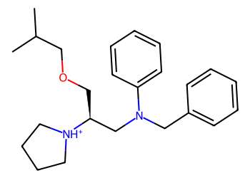
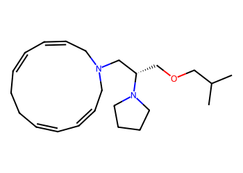
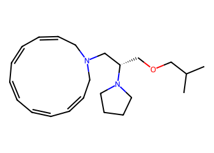
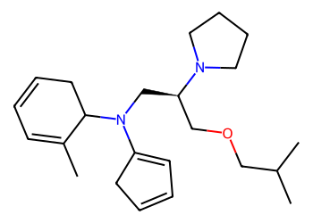
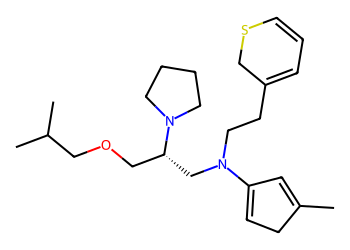
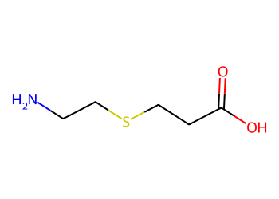
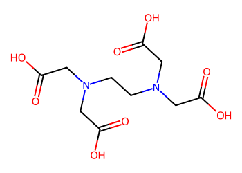

# Lead Optimization Report — 46b2801089f18d224d441e46e987706215b98910
## Summary
- **Calibrated p(toxic):** 0.664
- **Threshold:** 0.510 → **Predicted class:** 1
- **Max similarity to train:** 0.266 (**bin:** <0.3)
- **OOD classification:** Very out-of-domain
- **Result classification:** Generated suggestions available (Tier: Tier 1 — Flip)
- Similarity is very low; generated suggestions may be scarce and fallback analogues are provided for context.
## Base molecule
- **SMILES:** `CC(C)COC[C@@H](CN(Cc1ccccc1)c1ccccc1)[NH+]1CCCC1`
- **True label:** 1



## Counterfactual search summary
- ExMol requested: 1800 | drawn: 1259
- Generated tier (Tier 1–4): Tier 1 — Flip
- Relaxation used: True (applied: relax_flip_0.4)
- Generated survivors (Tier 1–4): 4
- Dataset analogue fallback count (not included in survivors): 5
- Relaxation note: lower flip min_tanimoto to 0.4

### Filter attrition by tier (baseline + final relaxation)
<table>
<tr><th>Tier</th><th>Relaxation</th><th>Sampled</th><th>Kept</th><th>Invalid</th><th>Duplicate</th><th>Similarity</th><th>Prob</th><th>Δp</th><th>SA</th><th>ΔLogP</th><th>QED</th><th>Alerts</th></tr>
<tr><td>Tier 1 — Flip</td><td>none</td><td>1259</td><td>0</td><td>0</td><td>1</td><td>795</td><td>463</td><td>0</td><td>0</td><td>0</td><td>0</td><td>0</td></tr>
<tr><td>Tier 1 — Flip</td><td>relax_flip_0.4</td><td>1259</td><td>4</td><td>0</td><td>1</td><td>586</td><td>663</td><td>0</td><td>2</td><td>2</td><td>0</td><td>1</td></tr>
</table>

<details><summary>All filter attempts (diagnostic)</summary>
```json
[
  {
    "tier": "flip",
    "tier_label": "Tier 1 \u2014 Flip",
    "relaxation": "none",
    "relaxation_desc": "baseline constraints",
    "counts": {
      "sampled": 1259,
      "invalid": 0,
      "duplicate": 1,
      "similarity_filtered": 795,
      "prob_filtered": 463,
      "delta_filtered": 0,
      "sa_filtered": 0,
      "logp_filtered": 0,
      "qed_filtered": 0,
      "alert_filtered": 0,
      "kept": 0,
      "min_tanimoto_used": 0.5,
      "min_tanimoto_source": "min_tanimoto_flip",
      "prob_max_used": 0.509999,
      "delta_min_used": null,
      "sa_max_used": 4.5,
      "logp_delta_max_used": 1.5,
      "qed_min_used": 0.0,
      "pains_used": true
    }
  },
  {
    "tier": "flip",
    "tier_label": "Tier 1 \u2014 Flip",
    "relaxation": "relax_flip_0.4",
    "relaxation_desc": "lower flip min_tanimoto to 0.4",
    "counts": {
      "sampled": 1259,
      "invalid": 0,
      "duplicate": 1,
      "similarity_filtered": 586,
      "prob_filtered": 663,
      "delta_filtered": 0,
      "sa_filtered": 2,
      "logp_filtered": 2,
      "qed_filtered": 0,
      "alert_filtered": 1,
      "kept": 4,
      "min_tanimoto_used": 0.4,
      "min_tanimoto_source": "min_tanimoto_flip",
      "prob_max_used": 0.509999,
      "delta_min_used": null,
      "sa_max_used": 4.5,
      "logp_delta_max_used": 1.5,
      "qed_min_used": 0.0,
      "pains_used": true
    }
  }
]
```
</details>

## Counterfactual suggestions (filtered)
_Rows below are generated from Tier 1 — Flip (relaxation: relax_flip_0.4)._ 
<table>
<tr><th>Rank</th><th>Structure</th><th>Tier</th><th>Relaxation</th><th>Similarity</th><th>p(toxic)</th><th>Δp</th><th>LogP</th><th>QED</th><th>SA</th></tr>
<tr><td>1</td><td></td><td>Tier 1 — Flip</td><td>relax_flip_0.4</td><td>0.200</td><td>0.454</td><td>0.210</td><td>4.44</td><td>0.67</td><td>4.11</td></tr>
<tr><td>2</td><td></td><td>Tier 1 — Flip</td><td>relax_flip_0.4</td><td>0.208</td><td>0.454</td><td>0.210</td><td>4.22</td><td>0.68</td><td>4.11</td></tr>
<tr><td>3</td><td></td><td>Tier 1 — Flip</td><td>relax_flip_0.4</td><td>0.153</td><td>0.471</td><td>0.193</td><td>4.54</td><td>0.60</td><td>4.29</td></tr>
<tr><td>4</td><td></td><td>Tier 1 — Flip</td><td>relax_flip_0.4</td><td>0.140</td><td>0.471</td><td>0.193</td><td>5.24</td><td>0.47</td><td>4.26</td></tr>
</table>

## Dataset-derived analogues (fallback)
_Nearest analogues from the dataset (context only, not generated edits)._ 
<table>
<tr><th>Rank</th><th>Structure</th><th>Similarity</th><th>p(toxic)</th><th>Δp</th><th>LogP</th><th>QED</th><th>SA</th><th>Alerts</th><th>Actionable?</th></tr>
<tr><td>1</td><td></td><td>0.063</td><td>0.395</td><td>0.269</td><td>-1.04</td><td>0.56</td><td>2.54</td><td>OK</td><td>YES</td></tr>
<tr><td>2</td><td></td><td>0.031</td><td>0.395</td><td>0.269</td><td>0.60</td><td>0.50</td><td>3.30</td><td>⚠</td><td>NO</td></tr>
<tr><td>3</td><td></td><td>0.071</td><td>0.396</td><td>0.268</td><td>0.15</td><td>0.55</td><td>2.44</td><td>⚠</td><td>NO</td></tr>
<tr><td>4</td><td></td><td>0.062</td><td>0.396</td><td>0.268</td><td>-1.85</td><td>0.47</td><td>3.19</td><td>OK</td><td>YES</td></tr>
<tr><td>5</td><td></td><td>0.058</td><td>0.396</td><td>0.268</td><td>-2.07</td><td>0.33</td><td>2.17</td><td>⚠</td><td>NO</td></tr>
</table>

## Raw records (for audit)
### Counterfactuals JSON
```json
[
  {
    "raw_smiles": "CC(C)COC[C@@H](CN1CC=CC=CCCC=CC=CC1)N1CCCC1",
    "smiles": "CC(C)COC[C@@H](CN1CC=CC=CCCC=CC=CC1)N1CCCC1",
    "similarity": 0.2,
    "p": 0.4540773108387021,
    "delta_p": 0.20983383548810536,
    "logp": 4.444000000000004,
    "qed": 0.668836686120523,
    "sascore": 4.109880165715333,
    "alert": false,
    "tier": "diagnostic_close_edits",
    "tier_label": "Tier 1 \u2014 Flip",
    "relaxation": "relax_flip_0.4",
    "relaxation_desc": "lower flip min_tanimoto to 0.4",
    "p_raw": 0.4540773108387021,
    "delta_p_raw": 0.21742276875661465,
    "tier_raw": "flip",
    "tier_num_std": 4,
    "tier_label_std": "diagnostic_close_edits"
  },
  {
    "raw_smiles": "CC(C)COC[C@@H](CN1CC=CC=CC=CC=CC=CC1)N1CCCC1",
    "smiles": "CC(C)COC[C@@H](CN1CC=CC=CC=CC=CC=CC1)N1CCCC1",
    "similarity": 0.20754716981132076,
    "p": 0.4540773108387021,
    "delta_p": 0.20983383548810536,
    "logp": 4.220000000000004,
    "qed": 0.6791514257126726,
    "sascore": 4.114248991626265,
    "alert": false,
    "tier": "diagnostic_close_edits",
    "tier_label": "Tier 1 \u2014 Flip",
    "relaxation": "relax_flip_0.4",
    "relaxation_desc": "lower flip min_tanimoto to 0.4",
    "p_raw": 0.4540773108387021,
    "delta_p_raw": 0.21742276875661465,
    "tier_raw": "flip",
    "tier_num_std": 4,
    "tier_label_std": "diagnostic_close_edits"
  },
  {
    "raw_smiles": "CC1=CC=CCC1N(C[C@H](COCC(C)C)N1CCCC1)C1=CC=CC1",
    "smiles": "CC1=CC=CCC1N(C[C@H](COCC(C)C)N1CCCC1)C1=CC=CC1",
    "similarity": 0.15294117647058825,
    "p": 0.4705358483640696,
    "delta_p": 0.1933752979627379,
    "logp": 4.544000000000004,
    "qed": 0.6029189712892298,
    "sascore": 4.288108149844731,
    "alert": false,
    "tier": "diagnostic_close_edits",
    "tier_label": "Tier 1 \u2014 Flip",
    "relaxation": "relax_flip_0.4",
    "relaxation_desc": "lower flip min_tanimoto to 0.4",
    "p_raw": 0.4705358483640696,
    "delta_p_raw": 0.20096423123124718,
    "tier_raw": "flip",
    "tier_num_std": 4,
    "tier_label_std": "diagnostic_close_edits"
  },
  {
    "raw_smiles": "CC1=CC(N(CCC2=CC=CSC2)C[C@H](COCC(C)C)N2CCCC2)=CC1",
    "smiles": "CC1=CC(N(CCC2=CC=CSC2)C[C@H](COCC(C)C)N2CCCC2)=CC1",
    "similarity": 0.13978494623655913,
    "p": 0.4705358483640696,
    "delta_p": 0.1933752979627379,
    "logp": 5.236300000000005,
    "qed": 0.4695201872775672,
    "sascore": 4.259038820710226,
    "alert": false,
    "tier": "diagnostic_close_edits",
    "tier_label": "Tier 1 \u2014 Flip",
    "relaxation": "relax_flip_0.4",
    "relaxation_desc": "lower flip min_tanimoto to 0.4",
    "p_raw": 0.4705358483640696,
    "delta_p_raw": 0.20096423123124718,
    "tier_raw": "flip",
    "tier_num_std": 4,
    "tier_label_std": "diagnostic_close_edits"
  }
]
```
### Dataset analogues JSON
```json
[
  {
    "raw_smiles": "Cn1c(=O)c2[nH]cnc2n(C)c1=O",
    "smiles": "Cn1c(=O)c2[nH]cnc2n(C)c1=O",
    "similarity": 0.06349206349206349,
    "p": 0.39478944477282535,
    "delta_p": 0.26912170155398213,
    "logp": -1.0397000000000005,
    "qed": 0.5624722357827983,
    "sascore": 2.5435777719868486,
    "sa_status": "ok",
    "actionable": true,
    "alert": false,
    "tier": "dataset_analogue",
    "tier_label": "Dataset analogue",
    "relaxation": "none",
    "relaxation_desc": "dataset fallback",
    "sa_max_used": 4.5,
    "pains_used": true
  },
  {
    "raw_smiles": "Nc1nc(=S)c2[nH]cnc2[nH]1",
    "smiles": "Nc1nc(=S)c2[nH]cnc2[nH]1",
    "similarity": 0.03076923076923077,
    "p": 0.39478944477282535,
    "delta_p": 0.26912170155398213,
    "logp": 0.5976899999999998,
    "qed": 0.5014913838271434,
    "sascore": 3.3037189467190657,
    "sa_status": "ok",
    "actionable": false,
    "alert": true,
    "tier": "dataset_analogue",
    "tier_label": "Dataset analogue",
    "relaxation": "none",
    "relaxation_desc": "dataset fallback",
    "sa_max_used": 4.5,
    "pains_used": true
  },
  {
    "raw_smiles": "NCCSCCC(=O)O",
    "smiles": "NCCSCCC(=O)O",
    "similarity": 0.07142857142857142,
    "p": 0.39562248764441715,
    "delta_p": 0.2682886586823903,
    "logp": 0.15299999999999997,
    "qed": 0.5462020434467761,
    "sascore": 2.44325493030248,
    "sa_status": "ok",
    "actionable": false,
    "alert": true,
    "tier": "dataset_analogue",
    "tier_label": "Dataset analogue",
    "relaxation": "none",
    "relaxation_desc": "dataset fallback",
    "sa_max_used": 4.5,
    "pains_used": true
  },
  {
    "raw_smiles": "NC(Cc1nn[nH]n1)C(=O)O",
    "smiles": "NC(Cc1nn[nH]n1)C(=O)O",
    "similarity": 0.0625,
    "p": 0.39562248764441715,
    "delta_p": 0.2682886586823903,
    "logp": -1.8459000000000003,
    "qed": 0.4738423616632481,
    "sascore": 3.185883407216588,
    "sa_status": "ok",
    "actionable": true,
    "alert": false,
    "tier": "dataset_analogue",
    "tier_label": "Dataset analogue",
    "relaxation": "none",
    "relaxation_desc": "dataset fallback",
    "sa_max_used": 4.5,
    "pains_used": true
  },
  {
    "raw_smiles": "O=C(O)CN(CCN(CC(=O)O)CC(=O)O)CC(=O)O",
    "smiles": "O=C(O)CN(CCN(CC(=O)O)CC(=O)O)CC(=O)O",
    "similarity": 0.057692307692307696,
    "p": 0.39562248764441715,
    "delta_p": 0.2682886586823903,
    "logp": -2.0711999999999957,
    "qed": 0.333294737123963,
    "sascore": 2.171402762983991,
    "sa_status": "ok",
    "actionable": false,
    "alert": true,
    "tier": "dataset_analogue",
    "tier_label": "Dataset analogue",
    "relaxation": "none",
    "relaxation_desc": "dataset fallback",
    "sa_max_used": 4.5,
    "pains_used": true
  }
]
```
