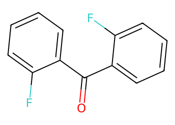
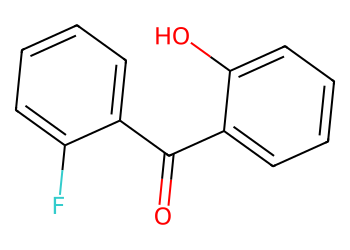
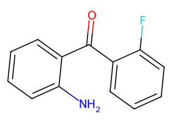
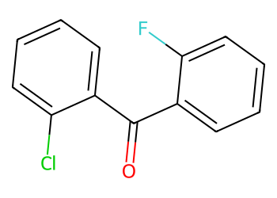
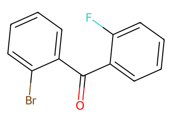
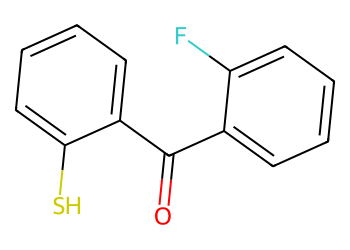
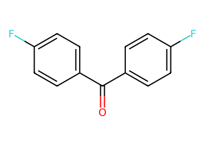

# Lead Optimization Report — 5ea6c3e7ad301fbabcacab37e0957bb18f0a2010
## Summary
- **Calibrated p(toxic):** 0.581
- **Threshold:** 0.510 → **Predicted class:** 1
- **Max similarity to train:** 0.217 (**bin:** <0.3)
- **OOD classification:** Very out-of-domain
- **Result classification:** Generated suggestions available (Tier: Tier 4 — Closest edits (diagnostic))
- Similarity is very low; generated suggestions may be scarce and fallback analogues are provided for context.
## Base molecule
- **SMILES:** `O=C(c1ccccc1F)c1ccccc1F`
- **True label:** 0



## Counterfactual search summary
- ExMol requested: 1800 | drawn: 1025
- Generated tier (Tier 1–4): Tier 4 — Closest edits (diagnostic)
- Relaxation used: False (applied: none)
- Generated survivors (Tier 1–4): 5
- Dataset analogue fallback count (not included in survivors): 1
- Relaxation note: diagnostic fallback (no valid improvements found)

### Filter attrition by tier (baseline + final relaxation)
<table>
<tr><th>Tier</th><th>Relaxation</th><th>Sampled</th><th>Kept</th><th>Invalid</th><th>Duplicate</th><th>Similarity</th><th>Prob</th><th>Δp</th><th>SA</th><th>ΔLogP</th><th>QED</th><th>Alerts</th></tr>
<tr><td>Tier 1 — Flip</td><td>none</td><td>1025</td><td>0</td><td>0</td><td>25</td><td>861</td><td>136</td><td>0</td><td>0</td><td>0</td><td>0</td><td>3</td></tr>
<tr><td>Tier 2 — Risk reduction</td><td>none</td><td>1025</td><td>0</td><td>0</td><td>25</td><td>991</td><td>0</td><td>9</td><td>0</td><td>0</td><td>0</td><td>0</td></tr>
<tr><td>Tier 3 — Weak improvement</td><td>none</td><td>1025</td><td>0</td><td>0</td><td>25</td><td>991</td><td>0</td><td>9</td><td>0</td><td>0</td><td>0</td><td>0</td></tr>
</table>

<details><summary>All filter attempts (diagnostic)</summary>
```json
[
  {
    "tier": "flip",
    "tier_label": "Tier 1 \u2014 Flip",
    "relaxation": "none",
    "relaxation_desc": "baseline constraints",
    "counts": {
      "sampled": 1025,
      "invalid": 0,
      "duplicate": 25,
      "similarity_filtered": 861,
      "prob_filtered": 136,
      "delta_filtered": 0,
      "sa_filtered": 0,
      "logp_filtered": 0,
      "qed_filtered": 0,
      "alert_filtered": 3,
      "kept": 0,
      "min_tanimoto_used": 0.5,
      "min_tanimoto_source": "min_tanimoto_flip",
      "prob_max_used": 0.509999,
      "delta_min_used": null,
      "sa_max_used": 4.5,
      "logp_delta_max_used": 1.5,
      "qed_min_used": 0.0,
      "pains_used": true
    }
  },
  {
    "tier": "flip",
    "tier_label": "Tier 1 \u2014 Flip",
    "relaxation": "relax_flip_0.4",
    "relaxation_desc": "lower flip min_tanimoto to 0.4",
    "counts": {
      "sampled": 1025,
      "invalid": 0,
      "duplicate": 25,
      "similarity_filtered": 691,
      "prob_filtered": 306,
      "delta_filtered": 0,
      "sa_filtered": 0,
      "logp_filtered": 0,
      "qed_filtered": 0,
      "alert_filtered": 3,
      "kept": 0,
      "min_tanimoto_used": 0.4,
      "min_tanimoto_source": "min_tanimoto_flip",
      "prob_max_used": 0.509999,
      "delta_min_used": null,
      "sa_max_used": 4.5,
      "logp_delta_max_used": 1.5,
      "qed_min_used": 0.0,
      "pains_used": true
    }
  },
  {
    "tier": "flip",
    "tier_label": "Tier 1 \u2014 Flip",
    "relaxation": "relax_flip_0.3",
    "relaxation_desc": "lower flip min_tanimoto to 0.3",
    "counts": {
      "sampled": 1025,
      "invalid": 0,
      "duplicate": 25,
      "similarity_filtered": 584,
      "prob_filtered": 409,
      "delta_filtered": 0,
      "sa_filtered": 0,
      "logp_filtered": 0,
      "qed_filtered": 0,
      "alert_filtered": 7,
      "kept": 0,
      "min_tanimoto_used": 0.3,
      "min_tanimoto_source": "min_tanimoto_flip",
      "prob_max_used": 0.509999,
      "delta_min_used": null,
      "sa_max_used": 4.5,
      "logp_delta_max_used": 1.5,
      "qed_min_used": 0.0,
      "pains_used": true
    }
  },
  {
    "tier": "flip",
    "tier_label": "Tier 1 \u2014 Flip",
    "relaxation": "relax_improve_0.6",
    "relaxation_desc": "lower improve min_tanimoto to 0.6",
    "counts": {
      "sampled": 1025,
      "invalid": 0,
      "duplicate": 25,
      "similarity_filtered": 861,
      "prob_filtered": 136,
      "delta_filtered": 0,
      "sa_filtered": 0,
      "logp_filtered": 0,
      "qed_filtered": 0,
      "alert_filtered": 3,
      "kept": 0,
      "min_tanimoto_used": 0.5,
      "min_tanimoto_source": "min_tanimoto_flip",
      "prob_max_used": 0.509999,
      "delta_min_used": null,
      "sa_max_used": 4.5,
      "logp_delta_max_used": 1.5,
      "qed_min_used": 0.0,
      "pains_used": true
    }
  },
  {
    "tier": "flip",
    "tier_label": "Tier 1 \u2014 Flip",
    "relaxation": "relax_improve_0.5",
    "relaxation_desc": "lower improve min_tanimoto to 0.5",
    "counts": {
      "sampled": 1025,
      "invalid": 0,
      "duplicate": 25,
      "similarity_filtered": 861,
      "prob_filtered": 136,
      "delta_filtered": 0,
      "sa_filtered": 0,
      "logp_filtered": 0,
      "qed_filtered": 0,
      "alert_filtered": 3,
      "kept": 0,
      "min_tanimoto_used": 0.5,
      "min_tanimoto_source": "min_tanimoto_flip",
      "prob_max_used": 0.509999,
      "delta_min_used": null,
      "sa_max_used": 4.5,
      "logp_delta_max_used": 1.5,
      "qed_min_used": 0.0,
      "pains_used": true
    }
  },
  {
    "tier": "flip",
    "tier_label": "Tier 1 \u2014 Flip",
    "relaxation": "relax_sa_5.5",
    "relaxation_desc": "raise SA max to 5.5",
    "counts": {
      "sampled": 1025,
      "invalid": 0,
      "duplicate": 25,
      "similarity_filtered": 861,
      "prob_filtered": 136,
      "delta_filtered": 0,
      "sa_filtered": 0,
      "logp_filtered": 0,
      "qed_filtered": 0,
      "alert_filtered": 3,
      "kept": 0,
      "min_tanimoto_used": 0.5,
      "min_tanimoto_source": "min_tanimoto_flip",
      "prob_max_used": 0.509999,
      "delta_min_used": null,
      "sa_max_used": 5.5,
      "logp_delta_max_used": 1.5,
      "qed_min_used": 0.0,
      "pains_used": true
    }
  },
  {
    "tier": "risk_reduction",
    "tier_label": "Tier 2 \u2014 Risk reduction",
    "relaxation": "none",
    "relaxation_desc": "baseline constraints",
    "counts": {
      "sampled": 1025,
      "invalid": 0,
      "duplicate": 25,
      "similarity_filtered": 991,
      "prob_filtered": 0,
      "delta_filtered": 9,
      "sa_filtered": 0,
      "logp_filtered": 0,
      "qed_filtered": 0,
      "alert_filtered": 0,
      "kept": 0,
      "min_tanimoto_used": 0.7,
      "min_tanimoto_source": "min_tanimoto_improve",
      "prob_max_used": null,
      "delta_min_used": 0.1,
      "sa_max_used": 4.5,
      "logp_delta_max_used": 1.5,
      "qed_min_used": 0.0,
      "pains_used": true
    }
  },
  {
    "tier": "risk_reduction",
    "tier_label": "Tier 2 \u2014 Risk reduction",
    "relaxation": "relax_flip_0.4",
    "relaxation_desc": "lower flip min_tanimoto to 0.4",
    "counts": {
      "sampled": 1025,
      "invalid": 0,
      "duplicate": 25,
      "similarity_filtered": 991,
      "prob_filtered": 0,
      "delta_filtered": 9,
      "sa_filtered": 0,
      "logp_filtered": 0,
      "qed_filtered": 0,
      "alert_filtered": 0,
      "kept": 0,
      "min_tanimoto_used": 0.7,
      "min_tanimoto_source": "min_tanimoto_improve",
      "prob_max_used": null,
      "delta_min_used": 0.1,
      "sa_max_used": 4.5,
      "logp_delta_max_used": 1.5,
      "qed_min_used": 0.0,
      "pains_used": true
    }
  },
  {
    "tier": "risk_reduction",
    "tier_label": "Tier 2 \u2014 Risk reduction",
    "relaxation": "relax_flip_0.3",
    "relaxation_desc": "lower flip min_tanimoto to 0.3",
    "counts": {
      "sampled": 1025,
      "invalid": 0,
      "duplicate": 25,
      "similarity_filtered": 991,
      "prob_filtered": 0,
      "delta_filtered": 9,
      "sa_filtered": 0,
      "logp_filtered": 0,
      "qed_filtered": 0,
      "alert_filtered": 0,
      "kept": 0,
      "min_tanimoto_used": 0.7,
      "min_tanimoto_source": "min_tanimoto_improve",
      "prob_max_used": null,
      "delta_min_used": 0.1,
      "sa_max_used": 4.5,
      "logp_delta_max_used": 1.5,
      "qed_min_used": 0.0,
      "pains_used": true
    }
  },
  {
    "tier": "risk_reduction",
    "tier_label": "Tier 2 \u2014 Risk reduction",
    "relaxation": "relax_improve_0.6",
    "relaxation_desc": "lower improve min_tanimoto to 0.6",
    "counts": {
      "sampled": 1025,
      "invalid": 0,
      "duplicate": 25,
      "similarity_filtered": 962,
      "prob_filtered": 0,
      "delta_filtered": 38,
      "sa_filtered": 0,
      "logp_filtered": 0,
      "qed_filtered": 0,
      "alert_filtered": 0,
      "kept": 0,
      "min_tanimoto_used": 0.6,
      "min_tanimoto_source": "min_tanimoto_improve",
      "prob_max_used": null,
      "delta_min_used": 0.1,
      "sa_max_used": 4.5,
      "logp_delta_max_used": 1.5,
      "qed_min_used": 0.0,
      "pains_used": true
    }
  },
  {
    "tier": "risk_reduction",
    "tier_label": "Tier 2 \u2014 Risk reduction",
    "relaxation": "relax_improve_0.5",
    "relaxation_desc": "lower improve min_tanimoto to 0.5",
    "counts": {
      "sampled": 1025,
      "invalid": 0,
      "duplicate": 25,
      "similarity_filtered": 861,
      "prob_filtered": 0,
      "delta_filtered": 138,
      "sa_filtered": 0,
      "logp_filtered": 0,
      "qed_filtered": 0,
      "alert_filtered": 1,
      "kept": 0,
      "min_tanimoto_used": 0.5,
      "min_tanimoto_source": "min_tanimoto_improve",
      "prob_max_used": null,
      "delta_min_used": 0.1,
      "sa_max_used": 4.5,
      "logp_delta_max_used": 1.5,
      "qed_min_used": 0.0,
      "pains_used": true
    }
  },
  {
    "tier": "risk_reduction",
    "tier_label": "Tier 2 \u2014 Risk reduction",
    "relaxation": "relax_sa_5.5",
    "relaxation_desc": "raise SA max to 5.5",
    "counts": {
      "sampled": 1025,
      "invalid": 0,
      "duplicate": 25,
      "similarity_filtered": 991,
      "prob_filtered": 0,
      "delta_filtered": 9,
      "sa_filtered": 0,
      "logp_filtered": 0,
      "qed_filtered": 0,
      "alert_filtered": 0,
      "kept": 0,
      "min_tanimoto_used": 0.7,
      "min_tanimoto_source": "min_tanimoto_improve",
      "prob_max_used": null,
      "delta_min_used": 0.1,
      "sa_max_used": 5.5,
      "logp_delta_max_used": 1.5,
      "qed_min_used": 0.0,
      "pains_used": true
    }
  },
  {
    "tier": "weak_reduction",
    "tier_label": "Tier 3 \u2014 Weak improvement",
    "relaxation": "none",
    "relaxation_desc": "baseline constraints",
    "counts": {
      "sampled": 1025,
      "invalid": 0,
      "duplicate": 25,
      "similarity_filtered": 991,
      "prob_filtered": 0,
      "delta_filtered": 9,
      "sa_filtered": 0,
      "logp_filtered": 0,
      "qed_filtered": 0,
      "alert_filtered": 0,
      "kept": 0,
      "min_tanimoto_used": 0.7,
      "min_tanimoto_source": "min_tanimoto_improve",
      "prob_max_used": null,
      "delta_min_used": 0.05,
      "sa_max_used": 4.5,
      "logp_delta_max_used": 1.5,
      "qed_min_used": 0.0,
      "pains_used": true
    }
  },
  {
    "tier": "weak_reduction",
    "tier_label": "Tier 3 \u2014 Weak improvement",
    "relaxation": "relax_flip_0.4",
    "relaxation_desc": "lower flip min_tanimoto to 0.4",
    "counts": {
      "sampled": 1025,
      "invalid": 0,
      "duplicate": 25,
      "similarity_filtered": 991,
      "prob_filtered": 0,
      "delta_filtered": 9,
      "sa_filtered": 0,
      "logp_filtered": 0,
      "qed_filtered": 0,
      "alert_filtered": 0,
      "kept": 0,
      "min_tanimoto_used": 0.7,
      "min_tanimoto_source": "min_tanimoto_improve",
      "prob_max_used": null,
      "delta_min_used": 0.05,
      "sa_max_used": 4.5,
      "logp_delta_max_used": 1.5,
      "qed_min_used": 0.0,
      "pains_used": true
    }
  },
  {
    "tier": "weak_reduction",
    "tier_label": "Tier 3 \u2014 Weak improvement",
    "relaxation": "relax_flip_0.3",
    "relaxation_desc": "lower flip min_tanimoto to 0.3",
    "counts": {
      "sampled": 1025,
      "invalid": 0,
      "duplicate": 25,
      "similarity_filtered": 991,
      "prob_filtered": 0,
      "delta_filtered": 9,
      "sa_filtered": 0,
      "logp_filtered": 0,
      "qed_filtered": 0,
      "alert_filtered": 0,
      "kept": 0,
      "min_tanimoto_used": 0.7,
      "min_tanimoto_source": "min_tanimoto_improve",
      "prob_max_used": null,
      "delta_min_used": 0.05,
      "sa_max_used": 4.5,
      "logp_delta_max_used": 1.5,
      "qed_min_used": 0.0,
      "pains_used": true
    }
  },
  {
    "tier": "weak_reduction",
    "tier_label": "Tier 3 \u2014 Weak improvement",
    "relaxation": "relax_improve_0.6",
    "relaxation_desc": "lower improve min_tanimoto to 0.6",
    "counts": {
      "sampled": 1025,
      "invalid": 0,
      "duplicate": 25,
      "similarity_filtered": 962,
      "prob_filtered": 0,
      "delta_filtered": 38,
      "sa_filtered": 0,
      "logp_filtered": 0,
      "qed_filtered": 0,
      "alert_filtered": 0,
      "kept": 0,
      "min_tanimoto_used": 0.6,
      "min_tanimoto_source": "min_tanimoto_improve",
      "prob_max_used": null,
      "delta_min_used": 0.05,
      "sa_max_used": 4.5,
      "logp_delta_max_used": 1.5,
      "qed_min_used": 0.0,
      "pains_used": true
    }
  },
  {
    "tier": "weak_reduction",
    "tier_label": "Tier 3 \u2014 Weak improvement",
    "relaxation": "relax_improve_0.5",
    "relaxation_desc": "lower improve min_tanimoto to 0.5",
    "counts": {
      "sampled": 1025,
      "invalid": 0,
      "duplicate": 25,
      "similarity_filtered": 861,
      "prob_filtered": 0,
      "delta_filtered": 136,
      "sa_filtered": 0,
      "logp_filtered": 0,
      "qed_filtered": 0,
      "alert_filtered": 3,
      "kept": 0,
      "min_tanimoto_used": 0.5,
      "min_tanimoto_source": "min_tanimoto_improve",
      "prob_max_used": null,
      "delta_min_used": 0.05,
      "sa_max_used": 4.5,
      "logp_delta_max_used": 1.5,
      "qed_min_used": 0.0,
      "pains_used": true
    }
  },
  {
    "tier": "weak_reduction",
    "tier_label": "Tier 3 \u2014 Weak improvement",
    "relaxation": "relax_sa_5.5",
    "relaxation_desc": "raise SA max to 5.5",
    "counts": {
      "sampled": 1025,
      "invalid": 0,
      "duplicate": 25,
      "similarity_filtered": 991,
      "prob_filtered": 0,
      "delta_filtered": 9,
      "sa_filtered": 0,
      "logp_filtered": 0,
      "qed_filtered": 0,
      "alert_filtered": 0,
      "kept": 0,
      "min_tanimoto_used": 0.7,
      "min_tanimoto_source": "min_tanimoto_improve",
      "prob_max_used": null,
      "delta_min_used": 0.05,
      "sa_max_used": 5.5,
      "logp_delta_max_used": 1.5,
      "qed_min_used": 0.0,
      "pains_used": true
    }
  }
]
```
</details>

## Counterfactual suggestions (filtered)
_Rows below are generated from Tier 4 — Closest edits (diagnostic) (relaxation: none)._ 
<table>
<tr><th>Rank</th><th>Structure</th><th>Tier</th><th>Relaxation</th><th>Similarity</th><th>p(toxic)</th><th>Δp</th><th>LogP</th><th>QED</th><th>SA</th></tr>
<tr><td>1</td><td></td><td>Tier 4 — Closest edits (diagnostic)</td><td>none</td><td>0.196</td><td>0.559</td><td>0.022</td><td>2.76</td><td>0.78</td><td>1.60</td></tr>
<tr><td>2</td><td></td><td>Tier 4 — Closest edits (diagnostic)</td><td>none</td><td>0.216</td><td>0.561</td><td>0.020</td><td>2.64</td><td>0.62</td><td>1.65</td></tr>
<tr><td>3</td><td></td><td>Tier 4 — Closest edits (diagnostic)</td><td>none</td><td>0.217</td><td>0.581</td><td>0.000</td><td>3.71</td><td>0.72</td><td>1.51</td></tr>
<tr><td>4</td><td></td><td>Tier 4 — Closest edits (diagnostic)</td><td>none</td><td>0.192</td><td>0.581</td><td>0.000</td><td>3.82</td><td>0.76</td><td>1.63</td></tr>
<tr><td>5</td><td></td><td>Tier 4 — Closest edits (diagnostic)</td><td>none</td><td>0.216</td><td>0.605</td><td>-0.024</td><td>3.35</td><td>0.62</td><td>1.97</td></tr>
</table>

## Dataset-derived analogues (fallback)
_Nearest analogues from the dataset (context only, not generated edits)._ 
<table>
<tr><th>Rank</th><th>Structure</th><th>Similarity</th><th>p(toxic)</th><th>Δp</th><th>LogP</th><th>QED</th><th>SA</th><th>Alerts</th><th>Actionable?</th></tr>
<tr><td>1</td><td></td><td>0.360</td><td>0.483</td><td>0.098</td><td>3.20</td><td>0.71</td><td>1.37</td><td>OK</td><td>YES</td></tr>
</table>

## Raw records (for audit)
### Counterfactuals JSON
```json
[
  {
    "raw_smiles": "O=C(c1ccccc1O)c1ccccc1F",
    "smiles": "O=C(c1ccccc1O)c1ccccc1F",
    "similarity": 0.19607843137254902,
    "p": 0.5588440314361475,
    "delta_p": 0.02228469921763898,
    "logp": 2.7623000000000006,
    "qed": 0.7835225450592104,
    "sascore": 1.6019853984252528,
    "alert": false,
    "tier": "diagnostic_close_edits",
    "tier_label": "Tier 4 \u2014 Closest edits (diagnostic)",
    "relaxation": "none",
    "relaxation_desc": "diagnostic fallback (no valid improvements found)",
    "p_raw": 0.5588440314361475,
    "delta_p_raw": 0.02228469921763898,
    "tier_raw": "diagnostic_close_edits",
    "tier_num_std": 4,
    "tier_label_std": "diagnostic_close_edits"
  },
  {
    "raw_smiles": "Nc1ccccc1C(=O)c1ccccc1F",
    "smiles": "Nc1ccccc1C(=O)c1ccccc1F",
    "similarity": 0.21568627450980393,
    "p": 0.5608510432979177,
    "delta_p": 0.020277687355868768,
    "logp": 2.6389000000000014,
    "qed": 0.6177786078922561,
    "sascore": 1.6480930907329459,
    "alert": true,
    "tier": "diagnostic_close_edits",
    "tier_label": "Tier 4 \u2014 Closest edits (diagnostic)",
    "relaxation": "none",
    "relaxation_desc": "diagnostic fallback (no valid improvements found)",
    "p_raw": 0.5608510432979177,
    "delta_p_raw": 0.020277687355868768,
    "tier_raw": "diagnostic_close_edits",
    "tier_num_std": 4,
    "tier_label_std": "diagnostic_close_edits"
  },
  {
    "raw_smiles": "O=C(c1ccccc1F)c1ccccc1Cl",
    "smiles": "O=C(c1ccccc1F)c1ccccc1Cl",
    "similarity": 0.21739130434782608,
    "p": 0.5811287306537865,
    "delta_p": 0.0,
    "logp": 3.7101000000000015,
    "qed": 0.7242969490307496,
    "sascore": 1.5071053984252547,
    "alert": false,
    "tier": "diagnostic_close_edits",
    "tier_label": "Tier 4 \u2014 Closest edits (diagnostic)",
    "relaxation": "none",
    "relaxation_desc": "diagnostic fallback (no valid improvements found)",
    "p_raw": 0.5811287306537865,
    "delta_p_raw": 0.0,
    "tier_raw": "diagnostic_close_edits",
    "tier_num_std": 4,
    "tier_label_std": "diagnostic_close_edits"
  },
  {
    "raw_smiles": "O=C(c1ccccc1F)c1ccccc1Br",
    "smiles": "O=C(c1ccccc1F)c1ccccc1Br",
    "similarity": 0.19230769230769232,
    "p": 0.5811287306537865,
    "delta_p": 0.0,
    "logp": 3.8192000000000013,
    "qed": 0.7636554876230705,
    "sascore": 1.628588475348332,
    "alert": false,
    "tier": "diagnostic_close_edits",
    "tier_label": "Tier 4 \u2014 Closest edits (diagnostic)",
    "relaxation": "none",
    "relaxation_desc": "diagnostic fallback (no valid improvements found)",
    "p_raw": 0.5811287306537865,
    "delta_p_raw": 0.0,
    "tier_raw": "diagnostic_close_edits",
    "tier_num_std": 4,
    "tier_label_std": "diagnostic_close_edits"
  },
  {
    "raw_smiles": "O=C(c1ccccc1F)c1ccccc1S",
    "smiles": "O=C(c1ccccc1F)c1ccccc1S",
    "similarity": 0.21568627450980393,
    "p": 0.6047737261791146,
    "delta_p": -0.023644995525328172,
    "logp": 3.345400000000001,
    "qed": 0.620408567451933,
    "sascore": 1.9656100138098722,
    "alert": true,
    "tier": "diagnostic_close_edits",
    "tier_label": "Tier 4 \u2014 Closest edits (diagnostic)",
    "relaxation": "none",
    "relaxation_desc": "diagnostic fallback (no valid improvements found)",
    "p_raw": 0.6047737261791146,
    "delta_p_raw": -0.023644995525328172,
    "tier_raw": "diagnostic_close_edits",
    "tier_num_std": 4,
    "tier_label_std": "diagnostic_close_edits"
  }
]
```
### Dataset analogues JSON
```json
[
  {
    "raw_smiles": "O=C(c1ccc(F)cc1)c1ccc(F)cc1",
    "smiles": "O=C(c1ccc(F)cc1)c1ccc(F)cc1",
    "similarity": 0.36,
    "p": 0.4829904951734655,
    "delta_p": 0.09813823548032097,
    "logp": 3.195800000000002,
    "qed": 0.7072485841376659,
    "sascore": 1.3676315522714084,
    "sa_status": "ok",
    "actionable": true,
    "alert": false,
    "tier": "dataset_analogue",
    "tier_label": "Dataset analogue",
    "relaxation": "none",
    "relaxation_desc": "dataset fallback",
    "sa_max_used": 4.5,
    "pains_used": true
  }
]
```
