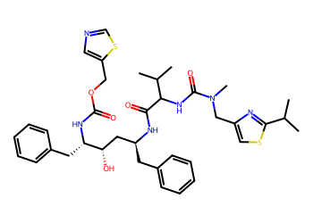
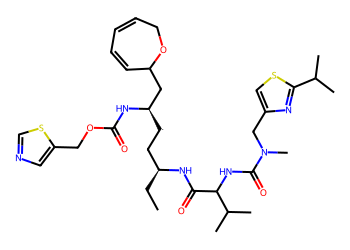
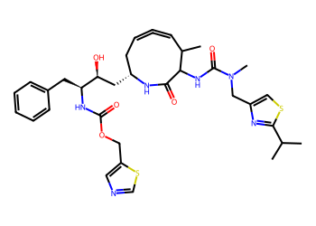
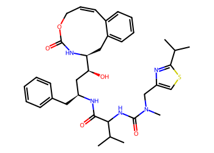
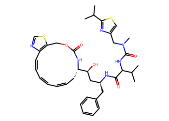
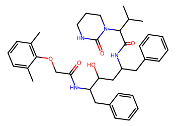

# Lead Optimization Report — 9da84360bd49192655003b99de1e76f8a3a94388
## Summary
- **Calibrated p(toxic):** 0.596
- **Threshold:** 0.510 → **Predicted class:** 1
- **Max similarity to train:** 0.312 (**bin:** 0.3-0.5)
- **OOD classification:** Out-of-domain
- **Result classification:** Generated suggestions available (Tier: Tier 1 — Flip)
- Similarity is low; treat any suggestions cautiously and consult fallback analogues.
## Base molecule
- **SMILES:** `CC(C)c1nc(CN(C)C(=O)NC(C(=O)N[C@@H](Cc2ccccc2)C[C@H](O)[C@H](Cc2ccccc2)NC(=O)OCc2cncs2)C(C)C)cs1`
- **True label:** 1



## Counterfactual search summary
- ExMol requested: 1800 | drawn: 1580
- Generated tier (Tier 1–4): Tier 1 — Flip
- Relaxation used: True (applied: relax_sa_5.5)
- Generated survivors (Tier 1–4): 5
- Dataset analogue fallback count (not included in survivors): 2
- Relaxation note: raise SA max to 5.5

### Filter attrition by tier (baseline + final relaxation)
<table>
<tr><th>Tier</th><th>Relaxation</th><th>Sampled</th><th>Kept</th><th>Invalid</th><th>Duplicate</th><th>Similarity</th><th>Prob</th><th>Δp</th><th>SA</th><th>ΔLogP</th><th>QED</th><th>Alerts</th></tr>
<tr><td>Tier 1 — Flip</td><td>none</td><td>1580</td><td>0</td><td>0</td><td>3</td><td>567</td><td>978</td><td>0</td><td>31</td><td>1</td><td>0</td><td>0</td></tr>
<tr><td>Tier 1 — Flip</td><td>relax_sa_5.5</td><td>1580</td><td>9</td><td>0</td><td>3</td><td>567</td><td>978</td><td>0</td><td>3</td><td>3</td><td>0</td><td>17</td></tr>
</table>

<details><summary>All filter attempts (diagnostic)</summary>
```json
[
  {
    "tier": "flip",
    "tier_label": "Tier 1 \u2014 Flip",
    "relaxation": "none",
    "relaxation_desc": "baseline constraints",
    "counts": {
      "sampled": 1580,
      "invalid": 0,
      "duplicate": 3,
      "similarity_filtered": 567,
      "prob_filtered": 978,
      "delta_filtered": 0,
      "sa_filtered": 31,
      "logp_filtered": 1,
      "qed_filtered": 0,
      "alert_filtered": 0,
      "kept": 0,
      "min_tanimoto_used": 0.5,
      "min_tanimoto_source": "min_tanimoto_flip",
      "prob_max_used": 0.509999,
      "delta_min_used": null,
      "sa_max_used": 4.5,
      "logp_delta_max_used": 1.5,
      "qed_min_used": 0.0,
      "pains_used": true
    }
  },
  {
    "tier": "flip",
    "tier_label": "Tier 1 \u2014 Flip",
    "relaxation": "relax_flip_0.4",
    "relaxation_desc": "lower flip min_tanimoto to 0.4",
    "counts": {
      "sampled": 1580,
      "invalid": 0,
      "duplicate": 3,
      "similarity_filtered": 293,
      "prob_filtered": 1227,
      "delta_filtered": 0,
      "sa_filtered": 52,
      "logp_filtered": 5,
      "qed_filtered": 0,
      "alert_filtered": 0,
      "kept": 0,
      "min_tanimoto_used": 0.4,
      "min_tanimoto_source": "min_tanimoto_flip",
      "prob_max_used": 0.509999,
      "delta_min_used": null,
      "sa_max_used": 4.5,
      "logp_delta_max_used": 1.5,
      "qed_min_used": 0.0,
      "pains_used": true
    }
  },
  {
    "tier": "flip",
    "tier_label": "Tier 1 \u2014 Flip",
    "relaxation": "relax_flip_0.3",
    "relaxation_desc": "lower flip min_tanimoto to 0.3",
    "counts": {
      "sampled": 1580,
      "invalid": 0,
      "duplicate": 3,
      "similarity_filtered": 138,
      "prob_filtered": 1346,
      "delta_filtered": 0,
      "sa_filtered": 78,
      "logp_filtered": 15,
      "qed_filtered": 0,
      "alert_filtered": 0,
      "kept": 0,
      "min_tanimoto_used": 0.3,
      "min_tanimoto_source": "min_tanimoto_flip",
      "prob_max_used": 0.509999,
      "delta_min_used": null,
      "sa_max_used": 4.5,
      "logp_delta_max_used": 1.5,
      "qed_min_used": 0.0,
      "pains_used": true
    }
  },
  {
    "tier": "flip",
    "tier_label": "Tier 1 \u2014 Flip",
    "relaxation": "relax_improve_0.6",
    "relaxation_desc": "lower improve min_tanimoto to 0.6",
    "counts": {
      "sampled": 1580,
      "invalid": 0,
      "duplicate": 3,
      "similarity_filtered": 567,
      "prob_filtered": 978,
      "delta_filtered": 0,
      "sa_filtered": 31,
      "logp_filtered": 1,
      "qed_filtered": 0,
      "alert_filtered": 0,
      "kept": 0,
      "min_tanimoto_used": 0.5,
      "min_tanimoto_source": "min_tanimoto_flip",
      "prob_max_used": 0.509999,
      "delta_min_used": null,
      "sa_max_used": 4.5,
      "logp_delta_max_used": 1.5,
      "qed_min_used": 0.0,
      "pains_used": true
    }
  },
  {
    "tier": "flip",
    "tier_label": "Tier 1 \u2014 Flip",
    "relaxation": "relax_improve_0.5",
    "relaxation_desc": "lower improve min_tanimoto to 0.5",
    "counts": {
      "sampled": 1580,
      "invalid": 0,
      "duplicate": 3,
      "similarity_filtered": 567,
      "prob_filtered": 978,
      "delta_filtered": 0,
      "sa_filtered": 31,
      "logp_filtered": 1,
      "qed_filtered": 0,
      "alert_filtered": 0,
      "kept": 0,
      "min_tanimoto_used": 0.5,
      "min_tanimoto_source": "min_tanimoto_flip",
      "prob_max_used": 0.509999,
      "delta_min_used": null,
      "sa_max_used": 4.5,
      "logp_delta_max_used": 1.5,
      "qed_min_used": 0.0,
      "pains_used": true
    }
  },
  {
    "tier": "flip",
    "tier_label": "Tier 1 \u2014 Flip",
    "relaxation": "relax_sa_5.5",
    "relaxation_desc": "raise SA max to 5.5",
    "counts": {
      "sampled": 1580,
      "invalid": 0,
      "duplicate": 3,
      "similarity_filtered": 567,
      "prob_filtered": 978,
      "delta_filtered": 0,
      "sa_filtered": 3,
      "logp_filtered": 3,
      "qed_filtered": 0,
      "alert_filtered": 17,
      "kept": 9,
      "min_tanimoto_used": 0.5,
      "min_tanimoto_source": "min_tanimoto_flip",
      "prob_max_used": 0.509999,
      "delta_min_used": null,
      "sa_max_used": 5.5,
      "logp_delta_max_used": 1.5,
      "qed_min_used": 0.0,
      "pains_used": true
    }
  }
]
```
</details>

## Counterfactual suggestions (filtered)
_Rows below are generated from Tier 1 — Flip (relaxation: relax_sa_5.5)._ 
<table>
<tr><th>Rank</th><th>Structure</th><th>Tier</th><th>Relaxation</th><th>Similarity</th><th>p(toxic)</th><th>Δp</th><th>LogP</th><th>QED</th><th>SA</th></tr>
<tr><td>1</td><td></td><td>Tier 1 — Flip</td><td>relax_sa_5.5</td><td>0.190</td><td>0.459</td><td>0.137</td><td>6.16</td><td>0.15</td><td>5.37</td></tr>
<tr><td>2</td><td></td><td>Tier 1 — Flip</td><td>relax_sa_5.5</td><td>0.163</td><td>0.471</td><td>0.126</td><td>5.57</td><td>0.21</td><td>4.90</td></tr>
<tr><td>3</td><td></td><td>Tier 1 — Flip</td><td>relax_sa_5.5</td><td>0.215</td><td>0.499</td><td>0.097</td><td>4.76</td><td>0.20</td><td>5.40</td></tr>
<tr><td>4</td><td></td><td>Tier 1 — Flip</td><td>relax_sa_5.5</td><td>0.250</td><td>0.500</td><td>0.096</td><td>5.28</td><td>0.21</td><td>4.80</td></tr>
<tr><td>5</td><td></td><td>Tier 1 — Flip</td><td>relax_sa_5.5</td><td>0.252</td><td>0.500</td><td>0.096</td><td>6.19</td><td>0.17</td><td>5.23</td></tr>
</table>

## Dataset-derived analogues (fallback)
_Nearest analogues from the dataset (context only, not generated edits)._ 
<table>
<tr><th>Rank</th><th>Structure</th><th>Similarity</th><th>p(toxic)</th><th>Δp</th><th>LogP</th><th>QED</th><th>SA</th><th>Alerts</th><th>Actionable?</th></tr>
<tr><td>1</td><td></td><td>0.312</td><td>0.635</td><td>-0.039</td><td>4.33</td><td>0.20</td><td>3.90</td><td>OK</td><td>NO</td></tr>
<tr><td>2</td><td></td><td>0.312</td><td>0.635</td><td>-0.039</td><td>4.33</td><td>0.20</td><td>3.90</td><td>OK</td><td>NO</td></tr>
</table>
Fallback analogues are context-only; none meet feasibility constraints.

## Raw records (for audit)
### Counterfactuals JSON
```json
[
  {
    "raw_smiles": "CC1=C(C[C@@H](C[C@H](O)[C@H](CC=C2C=CC=C=N2)NC(=O)OCc2cncs2)NC(=O)C(NC(=O)N(C)Cc2csc(C(C)C)n2)C(C)C)C=CC1",
    "smiles": "CC1=C(C[C@@H](C[C@H](O)[C@H](CC=C2C=CC=C=N2)NC(=O)OCc2cncs2)NC(=O)C(NC(=O)N(C)Cc2csc(C(C)C)n2)C(C)C)C=CC1",
    "similarity": 0.1897810218978102,
    "p": 0.45885201181979773,
    "delta_p": 0.13749994205381844,
    "logp": 6.156000000000006,
    "qed": 0.15166654820572706,
    "sascore": 5.368212646849942,
    "alert": false,
    "tier": "diagnostic_close_edits",
    "tier_label": "Tier 1 \u2014 Flip",
    "relaxation": "relax_sa_5.5",
    "relaxation_desc": "raise SA max to 5.5",
    "p_raw": 0.45885201181979773,
    "delta_p_raw": 0.13749994205381844,
    "tier_raw": "flip",
    "tier_num_std": 4,
    "tier_label_std": "diagnostic_close_edits"
  },
  {
    "raw_smiles": "CC[C@@H](C[CH][C@H](CC1C=CC=CCO1)NC(=O)OCc1cncs1)NC(=O)C(NC(=O)N(C)Cc1csc(C(C)C)n1)C(C)C",
    "smiles": "CC[C@@H](C[CH][C@H](CC1C=CC=CCO1)NC(=O)OCc1cncs1)NC(=O)C(NC(=O)N(C)Cc1csc(C(C)C)n1)C(C)C",
    "similarity": 0.16260162601626016,
    "p": 0.4705358483640696,
    "delta_p": 0.12581610550954658,
    "logp": 5.574490000000004,
    "qed": 0.21439583974386614,
    "sascore": 4.902634901743493,
    "alert": false,
    "tier": "diagnostic_close_edits",
    "tier_label": "Tier 1 \u2014 Flip",
    "relaxation": "relax_sa_5.5",
    "relaxation_desc": "raise SA max to 5.5",
    "p_raw": 0.4705358483640696,
    "delta_p_raw": 0.12581610550954658,
    "tier_raw": "flip",
    "tier_num_std": 4,
    "tier_label_std": "diagnostic_close_edits"
  },
  {
    "raw_smiles": "CC(C)c1nc(CN(C)C(=O)NC2C(=O)N[C@H](C[C@H](O)[C@H](Cc3ccccc3)NC(=O)OCc3cncs3)CC=C=CC2C)cs1",
    "smiles": "CC(C)c1nc(CN(C)C(=O)NC2C(=O)N[C@H](C[C@H](O)[C@H](Cc3ccccc3)NC(=O)OCc3cncs3)CC=C=CC2C)cs1",
    "similarity": 0.2153846153846154,
    "p": 0.49936484759973077,
    "delta_p": 0.0969871062738854,
    "logp": 4.757600000000005,
    "qed": 0.20411705098859012,
    "sascore": 5.3950086264898545,
    "alert": false,
    "tier": "diagnostic_close_edits",
    "tier_label": "Tier 1 \u2014 Flip",
    "relaxation": "relax_sa_5.5",
    "relaxation_desc": "raise SA max to 5.5",
    "p_raw": 0.49936484759973077,
    "delta_p_raw": 0.0969871062738854,
    "tier_raw": "flip",
    "tier_num_std": 4,
    "tier_label_std": "diagnostic_close_edits"
  },
  {
    "raw_smiles": "CC(C)c1nc(CN(C)C(=O)NC(C(=O)N[C@@H](Cc2ccccc2)C[C@H](O)[C@@H]2Cc3ccccc3C=CCOC(=O)N2)C(C)C)cs1",
    "smiles": "CC(C)c1nc(CN(C)C(=O)NC(C(=O)N[C@@H](Cc2ccccc2)C[C@H](O)[C@@H]2Cc3ccccc3C=CCOC(=O)N2)C(C)C)cs1",
    "similarity": 0.25,
    "p": 0.5000229931364222,
    "delta_p": 0.09632896073719399,
    "logp": 5.275300000000005,
    "qed": 0.20904572898771967,
    "sascore": 4.797685286382096,
    "alert": false,
    "tier": "diagnostic_close_edits",
    "tier_label": "Tier 1 \u2014 Flip",
    "relaxation": "relax_sa_5.5",
    "relaxation_desc": "raise SA max to 5.5",
    "p_raw": 0.5000229931364222,
    "delta_p_raw": 0.09632896073719399,
    "tier_raw": "flip",
    "tier_num_std": 4,
    "tier_label_std": "diagnostic_close_edits"
  },
  {
    "raw_smiles": "CC(C)c1nc(CN(C)C(=O)NC(C(=O)N[C@@H](Cc2ccccc2)C[C@H](O)[C@@H]2CC=CC=CC=Cc3ncsc3COC(=O)N2)C(C)C)cs1",
    "smiles": "CC(C)c1nc(CN(C)C(=O)NC(C(=O)N[C@@H](Cc2ccccc2)C[C@H](O)[C@@H]2CC=CC=CC=Cc3ncsc3COC(=O)N2)C(C)C)cs1",
    "similarity": 0.25203252032520324,
    "p": 0.5000229931364222,
    "delta_p": 0.09632896073719399,
    "logp": 6.191800000000006,
    "qed": 0.1746137005052475,
    "sascore": 5.23072018705904,
    "alert": false,
    "tier": "diagnostic_close_edits",
    "tier_label": "Tier 1 \u2014 Flip",
    "relaxation": "relax_sa_5.5",
    "relaxation_desc": "raise SA max to 5.5",
    "p_raw": 0.5000229931364222,
    "delta_p_raw": 0.09632896073719399,
    "tier_raw": "flip",
    "tier_num_std": 4,
    "tier_label_std": "diagnostic_close_edits"
  }
]
```
### Dataset analogues JSON
```json
[
  {
    "raw_smiles": "Cc1cccc(C)c1OCC(=O)NC(Cc1ccccc1)C(O)CC(Cc1ccccc1)NC(=O)C(C(C)C)N1CCCNC1=O",
    "smiles": "Cc1cccc(C)c1OCC(=O)NC(Cc1ccccc1)C(O)CC(Cc1ccccc1)NC(=O)C(C(C)C)N1CCCNC1=O",
    "similarity": 0.3119266055045872,
    "p": 0.6351279811453759,
    "delta_p": -0.03877602727175977,
    "logp": 4.328140000000003,
    "qed": 0.199874123748593,
    "sascore": 3.8968328243566237,
    "sa_status": "ok",
    "actionable": false,
    "alert": false,
    "tier": "dataset_analogue",
    "tier_label": "Dataset analogue",
    "relaxation": "none",
    "relaxation_desc": "dataset fallback",
    "sa_max_used": 4.5,
    "pains_used": true
  },
  {
    "raw_smiles": "Cc1cccc(C)c1OCC(=O)N[C@H](Cc1ccccc1)[C@H](O)C[C@@H](Cc1ccccc1)NC(=O)C(C(C)C)N1CCCNC1=O",
    "smiles": "Cc1cccc(C)c1OCC(=O)N[C@H](Cc1ccccc1)[C@H](O)C[C@@H](Cc1ccccc1)NC(=O)C(C(C)C)N1CCCNC1=O",
    "similarity": 0.3119266055045872,
    "p": 0.6351279811453759,
    "delta_p": -0.03877602727175977,
    "logp": 4.328140000000003,
    "qed": 0.199874123748593,
    "sascore": 3.8968328243566237,
    "sa_status": "ok",
    "actionable": false,
    "alert": false,
    "tier": "dataset_analogue",
    "tier_label": "Dataset analogue",
    "relaxation": "none",
    "relaxation_desc": "dataset fallback",
    "sa_max_used": 4.5,
    "pains_used": true
  }
]
```
