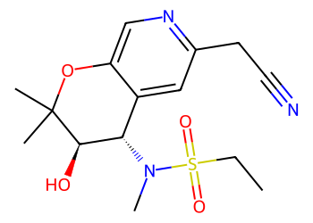
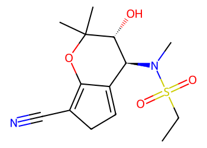
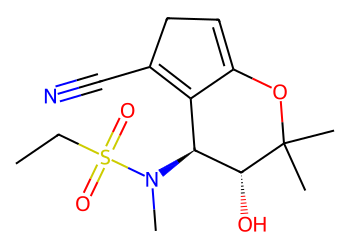
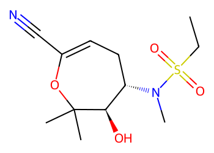
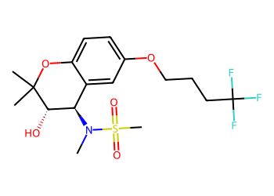

# Lead Optimization Report — 9e73f5eb87eb44328ece8987d42b0d17ce530b02
## Summary
- **Calibrated p(toxic):** 0.559
- **Threshold:** 0.510 → **Predicted class:** 1
- **Max similarity to train:** 0.375 (**bin:** 0.3-0.5)
- **OOD classification:** Out-of-domain
- **Result classification:** Generated suggestions available (Tier: Tier 1 — Flip)
- Similarity is low; treat any suggestions cautiously and consult fallback analogues.
## Base molecule
- **SMILES:** `CCS(=O)(=O)N(C)[C@H]1c2cc(C#N)ccc2OC(C)(C)[C@@H]1O`
- **True label:** 1


## Counterfactual search summary
- ExMol requested: 1800 | drawn: 1425
- Generated tier (Tier 1–4): Tier 1 — Flip
- Relaxation used: False (applied: none)
- Generated survivors (Tier 1–4): 5
- Dataset analogue fallback count (not included in survivors): 1
- Relaxation note: baseline constraints

### Filter attrition by tier (baseline + final relaxation)
<table>
<tr><th>Tier</th><th>Relaxation</th><th>Sampled</th><th>Kept</th><th>Invalid</th><th>Duplicate</th><th>Similarity</th><th>Prob</th><th>Δp</th><th>SA</th><th>ΔLogP</th><th>QED</th><th>Alerts</th></tr>
<tr><td>Tier 1 — Flip</td><td>none</td><td>1425</td><td>15</td><td>0</td><td>3</td><td>1136</td><td>208</td><td>0</td><td>20</td><td>1</td><td>0</td><td>42</td></tr>
</table>

<details><summary>All filter attempts (diagnostic)</summary>
```json
[
  {
    "tier": "flip",
    "tier_label": "Tier 1 \u2014 Flip",
    "relaxation": "none",
    "relaxation_desc": "baseline constraints",
    "counts": {
      "sampled": 1425,
      "invalid": 0,
      "duplicate": 3,
      "similarity_filtered": 1136,
      "prob_filtered": 208,
      "delta_filtered": 0,
      "sa_filtered": 20,
      "logp_filtered": 1,
      "qed_filtered": 0,
      "alert_filtered": 42,
      "kept": 15,
      "min_tanimoto_used": 0.5,
      "min_tanimoto_source": "min_tanimoto_flip",
      "prob_max_used": 0.509999,
      "delta_min_used": null,
      "sa_max_used": 4.5,
      "logp_delta_max_used": 1.5,
      "qed_min_used": 0.0,
      "pains_used": true
    }
  }
]
```
</details>

## Counterfactual suggestions (filtered)
_Rows below are generated from Tier 1 — Flip (relaxation: none)._ 
<table>
<tr><th>Rank</th><th>Structure</th><th>Tier</th><th>Relaxation</th><th>Similarity</th><th>p(toxic)</th><th>Δp</th><th>LogP</th><th>QED</th><th>SA</th></tr>
<tr><td>1</td><td></td><td>Tier 1 — Flip</td><td>none</td><td>0.243</td><td>0.396</td><td>0.163</td><td>1.16</td><td>0.84</td><td>4.44</td></tr>
<tr><td>2</td><td></td><td>Tier 1 — Flip</td><td>none</td><td>0.296</td><td>0.427</td><td>0.131</td><td>1.00</td><td>0.88</td><td>3.98</td></tr>
<tr><td>3</td><td></td><td>Tier 1 — Flip</td><td>none</td><td>0.257</td><td>0.441</td><td>0.118</td><td>0.91</td><td>0.84</td><td>4.42</td></tr>
<tr><td>4</td><td></td><td>Tier 1 — Flip</td><td>none</td><td>0.239</td><td>0.441</td><td>0.118</td><td>0.91</td><td>0.84</td><td>4.44</td></tr>
<tr><td>5</td><td></td><td>Tier 1 — Flip</td><td>none</td><td>0.273</td><td>0.442</td><td>0.117</td><td>0.60</td><td>0.82</td><td>4.29</td></tr>
</table>

## Dataset-derived analogues (fallback)
_Nearest analogues from the dataset (context only, not generated edits)._ 
<table>
<tr><th>Rank</th><th>Structure</th><th>Similarity</th><th>p(toxic)</th><th>Δp</th><th>LogP</th><th>QED</th><th>SA</th><th>Alerts</th><th>Actionable?</th></tr>
<tr><td>1</td><td></td><td>0.462</td><td>0.659</td><td>-0.101</td><td>2.87</td><td>0.73</td><td>3.50</td><td>⚠</td><td>NO</td></tr>
</table>
Fallback analogues are context-only; none meet feasibility constraints.

## Raw records (for audit)
### Counterfactuals JSON
```json
[
  {
    "raw_smiles": "C=C1C(=CCC#N)OC(C)(C)[C@H](O)[C@H]1N(C)S(=O)(=O)CC",
    "smiles": "C=C1C(=CCC#N)OC(C)(C)[C@H](O)[C@H]1N(C)S(=O)(=O)CC",
    "similarity": 0.24285714285714285,
    "p": 0.39562248764441715,
    "delta_p": 0.16307689312623325,
    "logp": 1.1599799999999998,
    "qed": 0.840611098842631,
    "sascore": 4.443349973120933,
    "alert": false,
    "tier": "diagnostic_close_edits",
    "tier_label": "Tier 1 \u2014 Flip",
    "relaxation": "none",
    "relaxation_desc": "baseline constraints",
    "p_raw": 0.39562248764441715,
    "delta_p_raw": 0.16307689312623325,
    "tier_raw": "flip",
    "tier_num_std": 4,
    "tier_label_std": "diagnostic_close_edits"
  },
  {
    "raw_smiles": "CCS(=O)(=O)N(C)[C@H]1c2cc(CC#N)ncc2OC(C)(C)[C@@H]1O",
    "smiles": "CCS(=O)(=O)N(C)[C@H]1c2cc(CC#N)ncc2OC(C)(C)[C@@H]1O",
    "similarity": 0.29577464788732394,
    "p": 0.4274583483195352,
    "delta_p": 0.13124103245111518,
    "logp": 1.00218,
    "qed": 0.8775887985128038,
    "sascore": 3.9844468822830255,
    "alert": false,
    "tier": "diagnostic_close_edits",
    "tier_label": "Tier 1 \u2014 Flip",
    "relaxation": "none",
    "relaxation_desc": "baseline constraints",
    "p_raw": 0.4274583483195352,
    "delta_p_raw": 0.13124103245111518,
    "tier_raw": "flip",
    "tier_num_std": 4,
    "tier_label_std": "diagnostic_close_edits"
  },
  {
    "raw_smiles": "CCS(=O)(=O)N(C)[C@H]1C2=CCC(C#N)=C2OC(C)(C)[C@@H]1O",
    "smiles": "CCS(=O)(=O)N(C)[C@H]1C2=CCC(C#N)=C2OC(C)(C)[C@@H]1O",
    "similarity": 0.2571428571428571,
    "p": 0.44055822913256376,
    "delta_p": 0.11814115163808664,
    "logp": 0.9139800000000002,
    "qed": 0.8363622487184129,
    "sascore": 4.415735707386668,
    "alert": false,
    "tier": "diagnostic_close_edits",
    "tier_label": "Tier 1 \u2014 Flip",
    "relaxation": "none",
    "relaxation_desc": "baseline constraints",
    "p_raw": 0.44055822913256376,
    "delta_p_raw": 0.11814115163808664,
    "tier_raw": "flip",
    "tier_num_std": 4,
    "tier_label_std": "diagnostic_close_edits"
  },
  {
    "raw_smiles": "CCS(=O)(=O)N(C)[C@H]1C2=C(C#N)CC=C2OC(C)(C)[C@@H]1O",
    "smiles": "CCS(=O)(=O)N(C)[C@H]1C2=C(C#N)CC=C2OC(C)(C)[C@@H]1O",
    "similarity": 0.23943661971830985,
    "p": 0.44055822913256376,
    "delta_p": 0.11814115163808664,
    "logp": 0.9139800000000002,
    "qed": 0.8363622487184129,
    "sascore": 4.443966756337716,
    "alert": false,
    "tier": "diagnostic_close_edits",
    "tier_label": "Tier 1 \u2014 Flip",
    "relaxation": "none",
    "relaxation_desc": "baseline constraints",
    "p_raw": 0.44055822913256376,
    "delta_p_raw": 0.11814115163808664,
    "tier_raw": "flip",
    "tier_num_std": 4,
    "tier_label_std": "diagnostic_close_edits"
  },
  {
    "raw_smiles": "CCS(=O)(=O)N(C)[C@H]1CC=C(C#N)OC(C)(C)[C@@H]1O",
    "smiles": "CCS(=O)(=O)N(C)[C@H]1CC=C(C#N)OC(C)(C)[C@@H]1O",
    "similarity": 0.2727272727272727,
    "p": 0.4418912732191725,
    "delta_p": 0.11680810755147791,
    "logp": 0.6037800000000002,
    "qed": 0.8210855546638169,
    "sascore": 4.292106316621444,
    "alert": false,
    "tier": "diagnostic_close_edits",
    "tier_label": "Tier 1 \u2014 Flip",
    "relaxation": "none",
    "relaxation_desc": "baseline constraints",
    "p_raw": 0.4418912732191725,
    "delta_p_raw": 0.11680810755147791,
    "tier_raw": "flip",
    "tier_num_std": 4,
    "tier_label_std": "diagnostic_close_edits"
  }
]
```
### Dataset analogues JSON
```json
[
  {
    "raw_smiles": "CN([C@@H]1c2cc(OCCCC(F)(F)F)ccc2OC(C)(C)[C@H]1O)S(C)(=O)=O",
    "smiles": "CN([C@@H]1c2cc(OCCCC(F)(F)F)ccc2OC(C)(C)[C@H]1O)S(C)(=O)=O",
    "similarity": 0.46153846153846156,
    "p": 0.6593423663724483,
    "delta_p": -0.10064298560179785,
    "logp": 2.872300000000001,
    "qed": 0.7288620522693042,
    "sascore": 3.4962921195105334,
    "sa_status": "ok",
    "actionable": false,
    "alert": true,
    "tier": "dataset_analogue",
    "tier_label": "Dataset analogue",
    "relaxation": "none",
    "relaxation_desc": "dataset fallback",
    "sa_max_used": 4.5,
    "pains_used": true
  }
]
```
