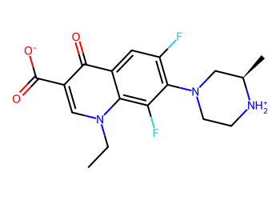
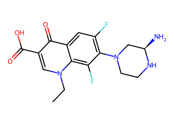
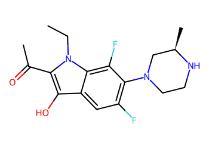
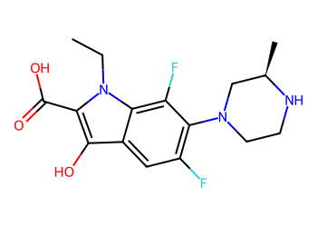
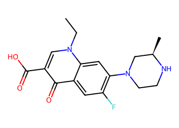
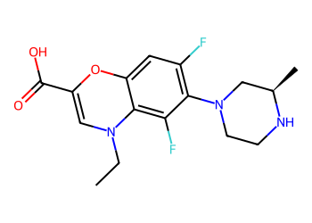
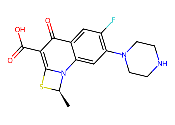

# Lead Optimization Report — ba0c9d92a655a4a82fa3ceee3051b702b783b076
## Summary
- **Calibrated p(toxic):** 0.388
- **Threshold:** 0.510 → **Predicted class:** 0
- **Max similarity to train:** 0.474 (**bin:** 0.3-0.5)
- **OOD classification:** Out-of-domain
- **Result classification:** Generated suggestions available (Tier: Tier 1 — Flip)
- Similarity is low; treat any suggestions cautiously and consult fallback analogues.
## Base molecule
- **SMILES:** `CCn1cc(C(=O)[O-])c(=O)c2cc(F)c(N3CC[NH2+][C@H](C)C3)c(F)c21`
- **True label:** 0



## Counterfactual search summary
- ExMol requested: 1800 | drawn: 1532
- Generated tier (Tier 1–4): Tier 1 — Flip
- Relaxation used: False (applied: none)
- Generated survivors (Tier 1–4): 5
- Dataset analogue fallback count (not included in survivors): 1
- Relaxation note: baseline constraints

### Filter attrition by tier (baseline + final relaxation)
<table>
<tr><th>Tier</th><th>Relaxation</th><th>Sampled</th><th>Kept</th><th>Invalid</th><th>Duplicate</th><th>Similarity</th><th>Prob</th><th>Δp</th><th>SA</th><th>ΔLogP</th><th>QED</th><th>Alerts</th></tr>
<tr><td>Tier 1 — Flip</td><td>none</td><td>1532</td><td>121</td><td>0</td><td>5</td><td>1253</td><td>20</td><td>0</td><td>12</td><td>6</td><td>0</td><td>115</td></tr>
</table>

<details><summary>All filter attempts (diagnostic)</summary>
```json
[
  {
    "tier": "flip",
    "tier_label": "Tier 1 \u2014 Flip",
    "relaxation": "none",
    "relaxation_desc": "baseline constraints",
    "counts": {
      "sampled": 1532,
      "invalid": 0,
      "duplicate": 5,
      "similarity_filtered": 1253,
      "prob_filtered": 20,
      "delta_filtered": 0,
      "sa_filtered": 12,
      "logp_filtered": 6,
      "qed_filtered": 0,
      "alert_filtered": 115,
      "kept": 121,
      "min_tanimoto_used": 0.5,
      "min_tanimoto_source": "min_tanimoto_flip",
      "prob_max_used": 0.509999,
      "delta_min_used": null,
      "sa_max_used": 4.5,
      "logp_delta_max_used": 1.5,
      "qed_min_used": 0.0,
      "pains_used": true
    }
  }
]
```
</details>

## Counterfactual suggestions (filtered)
_Rows below are generated from Tier 1 — Flip (relaxation: none)._ 
<table>
<tr><th>Rank</th><th>Structure</th><th>Tier</th><th>Relaxation</th><th>Similarity</th><th>p(toxic)</th><th>Δp</th><th>LogP</th><th>QED</th><th>SA</th></tr>
<tr><td>1</td><td></td><td>Tier 1 — Flip</td><td>none</td><td>0.325</td><td>0.402</td><td>-0.014</td><td>0.69</td><td>0.75</td><td>3.42</td></tr>
<tr><td>2</td><td></td><td>Tier 1 — Flip</td><td>none</td><td>0.286</td><td>0.402</td><td>-0.014</td><td>2.65</td><td>0.85</td><td>3.48</td></tr>
<tr><td>3</td><td></td><td>Tier 1 — Flip</td><td>none</td><td>0.307</td><td>0.404</td><td>-0.016</td><td>2.14</td><td>0.80</td><td>3.42</td></tr>
<tr><td>4</td><td></td><td>Tier 1 — Flip</td><td>none</td><td>0.449</td><td>0.404</td><td>-0.016</td><td>1.66</td><td>0.89</td><td>2.99</td></tr>
<tr><td>5</td><td></td><td>Tier 1 — Flip</td><td>none</td><td>0.289</td><td>0.404</td><td>-0.016</td><td>1.91</td><td>0.88</td><td>3.82</td></tr>
</table>

## Dataset-derived analogues (fallback)
_Nearest analogues from the dataset (context only, not generated edits)._ 
<table>
<tr><th>Rank</th><th>Structure</th><th>Similarity</th><th>p(toxic)</th><th>Δp</th><th>LogP</th><th>QED</th><th>SA</th><th>Alerts</th><th>Actionable?</th></tr>
<tr><td>1</td><td></td><td>0.333</td><td>0.407</td><td>-0.019</td><td>1.87</td><td>0.86</td><td>3.29</td><td>OK</td><td>NO</td></tr>
</table>
Fallback analogues are context-only; none meet feasibility constraints.

## Raw records (for audit)
### Counterfactuals JSON
```json
[
  {
    "raw_smiles": "CCn1cc(C(=O)O)c(=O)c2cc(F)c(N3CCN[C@H](N)C3)c(F)c21",
    "smiles": "CCn1cc(C(=O)O)c(=O)c2cc(F)c(N3CCN[C@H](N)C3)c(F)c21",
    "similarity": 0.325,
    "p": 0.4021514729269841,
    "delta_p": -0.014151458334365319,
    "logp": 0.6922000000000004,
    "qed": 0.7515791013798545,
    "sascore": 3.4196653930688523,
    "alert": false,
    "tier": "diagnostic_close_edits",
    "tier_label": "Tier 1 \u2014 Flip",
    "relaxation": "none",
    "relaxation_desc": "baseline constraints",
    "p_raw": 0.4021514729269841,
    "delta_p_raw": 0.009445210574201113,
    "tier_raw": "flip",
    "tier_num_std": 4,
    "tier_label_std": "diagnostic_close_edits"
  },
  {
    "raw_smiles": "CCn1c(C(C)=O)c(O)c2cc(F)c(N3CCN[C@H](C)C3)c(F)c21",
    "smiles": "CCn1c(C(C)=O)c(O)c2cc(F)c(N3CCN[C@H](C)C3)c(F)c21",
    "similarity": 0.2857142857142857,
    "p": 0.4021514729269841,
    "delta_p": -0.014151458334365319,
    "logp": 2.6457000000000006,
    "qed": 0.8456837295179465,
    "sascore": 3.4760184784596726,
    "alert": false,
    "tier": "diagnostic_close_edits",
    "tier_label": "Tier 1 \u2014 Flip",
    "relaxation": "none",
    "relaxation_desc": "baseline constraints",
    "p_raw": 0.4021514729269841,
    "delta_p_raw": 0.009445210574201113,
    "tier_raw": "flip",
    "tier_num_std": 4,
    "tier_label_std": "diagnostic_close_edits"
  },
  {
    "raw_smiles": "CCn1c(C(=O)O)c(O)c2cc(F)c(N3CCN[C@H](C)C3)c(F)c21",
    "smiles": "CCn1c(C(=O)O)c(O)c2cc(F)c(N3CCN[C@H](C)C3)c(F)c21",
    "similarity": 0.30666666666666664,
    "p": 0.4041179351317129,
    "delta_p": -0.01611792053909411,
    "logp": 2.1413,
    "qed": 0.7986031502134436,
    "sascore": 3.424525697394584,
    "alert": false,
    "tier": "diagnostic_close_edits",
    "tier_label": "Tier 1 \u2014 Flip",
    "relaxation": "none",
    "relaxation_desc": "baseline constraints",
    "p_raw": 0.4041179351317129,
    "delta_p_raw": 0.007478748369472321,
    "tier_raw": "flip",
    "tier_num_std": 4,
    "tier_label_std": "diagnostic_close_edits"
  },
  {
    "raw_smiles": "CCn1cc(C(=O)O)c(=O)c2cc(F)c(N3CCN[C@H](C)C3)cc21",
    "smiles": "CCn1cc(C(=O)O)c(=O)c2cc(F)c(N3CCN[C@H](C)C3)cc21",
    "similarity": 0.4492753623188406,
    "p": 0.40448512510941237,
    "delta_p": -0.016485110516793577,
    "logp": 1.6568,
    "qed": 0.8934605266027453,
    "sascore": 2.994244266517768,
    "alert": false,
    "tier": "diagnostic_close_edits",
    "tier_label": "Tier 1 \u2014 Flip",
    "relaxation": "none",
    "relaxation_desc": "baseline constraints",
    "p_raw": 0.40448512510941237,
    "delta_p_raw": 0.007111558391772854,
    "tier_raw": "flip",
    "tier_num_std": 4,
    "tier_label_std": "diagnostic_close_edits"
  },
  {
    "raw_smiles": "CCN1C=C(C(=O)O)Oc2cc(F)c(N3CCN[C@H](C)C3)c(F)c21",
    "smiles": "CCN1C=C(C(=O)O)Oc2cc(F)c(N3CCN[C@H](C)C3)c(F)c21",
    "similarity": 0.2894736842105263,
    "p": 0.40448512510941237,
    "delta_p": -0.016485110516793577,
    "logp": 1.9076000000000002,
    "qed": 0.8770342374702046,
    "sascore": 3.820343567217069,
    "alert": false,
    "tier": "diagnostic_close_edits",
    "tier_label": "Tier 1 \u2014 Flip",
    "relaxation": "none",
    "relaxation_desc": "baseline constraints",
    "p_raw": 0.40448512510941237,
    "delta_p_raw": 0.007111558391772854,
    "tier_raw": "flip",
    "tier_num_std": 4,
    "tier_label_std": "diagnostic_close_edits"
  }
]
```
### Dataset analogues JSON
```json
[
  {
    "raw_smiles": "C[C@H]1Sc2c(C(=O)O)c(=O)c3cc(F)c(N4CCNCC4)cc3n21",
    "smiles": "C[C@H]1Sc2c(C(=O)O)c(=O)c3cc(F)c(N4CCNCC4)cc3n21",
    "similarity": 0.3333333333333333,
    "p": 0.4066996575344859,
    "delta_p": -0.0186996429418671,
    "logp": 1.8725999999999998,
    "qed": 0.8622628338904335,
    "sascore": 3.290931741729125,
    "sa_status": "ok",
    "actionable": false,
    "alert": false,
    "tier": "dataset_analogue",
    "tier_label": "Dataset analogue",
    "relaxation": "none",
    "relaxation_desc": "dataset fallback",
    "sa_max_used": 4.5,
    "pains_used": true
  }
]
```
