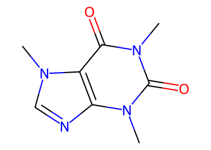
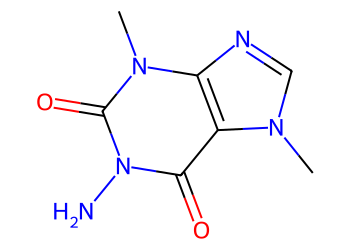
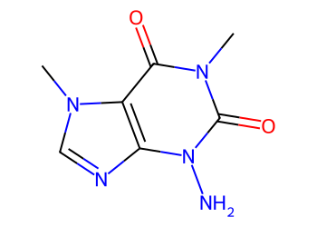
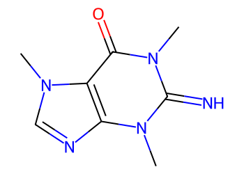
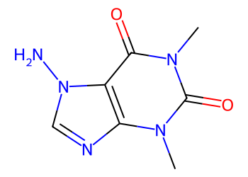
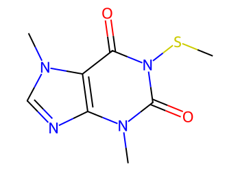
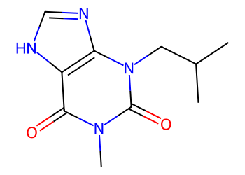

# Lead Optimization Report — c5cab157f53f634f4dd0eed9e3895cfb2fbfbc90
## Summary
- **Calibrated p(toxic):** 0.402
- **Threshold:** 0.510 → **Predicted class:** 0
- **Max similarity to train:** 0.457 (**bin:** 0.3-0.5)
- **OOD classification:** Out-of-domain
- **Result classification:** Generated suggestions available (Tier: Tier 1 — Flip)
- Similarity is low; treat any suggestions cautiously and consult fallback analogues.
## Base molecule
- **SMILES:** `Cn1c(=O)c2c(ncn2C)n(C)c1=O`
- **True label:** 1



## Counterfactual search summary
- ExMol requested: 1800 | drawn: 1294
- Generated tier (Tier 1–4): Tier 1 — Flip
- Relaxation used: False (applied: none)
- Generated survivors (Tier 1–4): 5
- Dataset analogue fallback count (not included in survivors): 2
- Relaxation note: baseline constraints

### Filter attrition by tier (baseline + final relaxation)
<table>
<tr><th>Tier</th><th>Relaxation</th><th>Sampled</th><th>Kept</th><th>Invalid</th><th>Duplicate</th><th>Similarity</th><th>Prob</th><th>Δp</th><th>SA</th><th>ΔLogP</th><th>QED</th><th>Alerts</th></tr>
<tr><td>Tier 1 — Flip</td><td>none</td><td>1294</td><td>20</td><td>0</td><td>5</td><td>1245</td><td>0</td><td>0</td><td>1</td><td>0</td><td>0</td><td>23</td></tr>
</table>

<details><summary>All filter attempts (diagnostic)</summary>
```json
[
  {
    "tier": "flip",
    "tier_label": "Tier 1 \u2014 Flip",
    "relaxation": "none",
    "relaxation_desc": "baseline constraints",
    "counts": {
      "sampled": 1294,
      "invalid": 0,
      "duplicate": 5,
      "similarity_filtered": 1245,
      "prob_filtered": 0,
      "delta_filtered": 0,
      "sa_filtered": 1,
      "logp_filtered": 0,
      "qed_filtered": 0,
      "alert_filtered": 23,
      "kept": 20,
      "min_tanimoto_used": 0.5,
      "min_tanimoto_source": "min_tanimoto_flip",
      "prob_max_used": 0.509999,
      "delta_min_used": null,
      "sa_max_used": 4.5,
      "logp_delta_max_used": 1.5,
      "qed_min_used": 0.0,
      "pains_used": true
    }
  }
]
```
</details>

## Counterfactual suggestions (filtered)
_Rows below are generated from Tier 1 — Flip (relaxation: none)._ 
<table>
<tr><th>Rank</th><th>Structure</th><th>Tier</th><th>Relaxation</th><th>Similarity</th><th>p(toxic)</th><th>Δp</th><th>LogP</th><th>QED</th><th>SA</th></tr>
<tr><td>1</td><td></td><td>Tier 1 — Flip</td><td>none</td><td>0.350</td><td>0.402</td><td>0.000</td><td>-1.85</td><td>0.50</td><td>2.75</td></tr>
<tr><td>2</td><td></td><td>Tier 1 — Flip</td><td>none</td><td>0.350</td><td>0.402</td><td>0.000</td><td>-1.85</td><td>0.50</td><td>2.82</td></tr>
<tr><td>3</td><td></td><td>Tier 1 — Flip</td><td>none</td><td>0.293</td><td>0.402</td><td>0.000</td><td>-0.91</td><td>0.59</td><td>2.99</td></tr>
<tr><td>4</td><td></td><td>Tier 1 — Flip</td><td>none</td><td>0.432</td><td>0.402</td><td>0.000</td><td>-1.85</td><td>0.50</td><td>2.72</td></tr>
<tr><td>5</td><td></td><td>Tier 1 — Flip</td><td>none</td><td>0.333</td><td>0.402</td><td>0.000</td><td>-0.44</td><td>0.66</td><td>3.13</td></tr>
</table>

## Dataset-derived analogues (fallback)
_Nearest analogues from the dataset (context only, not generated edits)._ 
<table>
<tr><th>Rank</th><th>Structure</th><th>Similarity</th><th>p(toxic)</th><th>Δp</th><th>LogP</th><th>QED</th><th>SA</th><th>Alerts</th><th>Actionable?</th></tr>
<tr><td>1</td><td></td><td>0.457</td><td>0.395</td><td>0.007</td><td>-1.04</td><td>0.56</td><td>2.54</td><td>OK</td><td>YES</td></tr>
<tr><td>2</td><td></td><td>0.311</td><td>0.432</td><td>-0.031</td><td>0.08</td><td>0.78</td><td>2.58</td><td>OK</td><td>NO</td></tr>
</table>

## Raw records (for audit)
### Counterfactuals JSON
```json
[
  {
    "raw_smiles": "Cn1cnc2c1c(=O)n(N)c(=O)n2C",
    "smiles": "Cn1cnc2c1c(=O)n(N)c(=O)n2C",
    "similarity": 0.35,
    "p": 0.4015300681231869,
    "delta_p": 0.0,
    "logp": -1.8524999999999996,
    "qed": 0.49956462738187335,
    "sascore": 2.7450597956713487,
    "alert": false,
    "tier": "diagnostic_close_edits",
    "tier_label": "Tier 1 \u2014 Flip",
    "relaxation": "none",
    "relaxation_desc": "baseline constraints",
    "p_raw": 0.4015300681231869,
    "delta_p_raw": 0.0,
    "tier_raw": "flip",
    "tier_num_std": 4,
    "tier_label_std": "diagnostic_close_edits"
  },
  {
    "raw_smiles": "Cn1c(=O)c2c(ncn2C)n(N)c1=O",
    "smiles": "Cn1c(=O)c2c(ncn2C)n(N)c1=O",
    "similarity": 0.35,
    "p": 0.4015300681231869,
    "delta_p": 0.0,
    "logp": -1.8524999999999991,
    "qed": 0.49956462738187346,
    "sascore": 2.8240801698917224,
    "alert": false,
    "tier": "diagnostic_close_edits",
    "tier_label": "Tier 1 \u2014 Flip",
    "relaxation": "none",
    "relaxation_desc": "baseline constraints",
    "p_raw": 0.4015300681231869,
    "delta_p_raw": 0.0,
    "tier_raw": "flip",
    "tier_num_std": 4,
    "tier_label_std": "diagnostic_close_edits"
  },
  {
    "raw_smiles": "Cn1c(=O)c2c(ncn2C)n(C)c1=N",
    "smiles": "Cn1c(=O)c2c(ncn2C)n(C)c1=N",
    "similarity": 0.2926829268292683,
    "p": 0.4015300681231869,
    "delta_p": 0.0,
    "logp": -0.9100299999999999,
    "qed": 0.5881798029506794,
    "sascore": 2.9930593798709335,
    "alert": false,
    "tier": "diagnostic_close_edits",
    "tier_label": "Tier 1 \u2014 Flip",
    "relaxation": "none",
    "relaxation_desc": "baseline constraints",
    "p_raw": 0.4015300681231869,
    "delta_p_raw": 0.0,
    "tier_raw": "flip",
    "tier_num_std": 4,
    "tier_label_std": "diagnostic_close_edits"
  },
  {
    "raw_smiles": "Cn1c(=O)c2c(ncn2N)n(C)c1=O",
    "smiles": "Cn1c(=O)c2c(ncn2N)n(C)c1=O",
    "similarity": 0.43243243243243246,
    "p": 0.4015300681231869,
    "delta_p": 0.0,
    "logp": -1.8524999999999996,
    "qed": 0.49956462738187346,
    "sascore": 2.716693891305443,
    "alert": false,
    "tier": "diagnostic_close_edits",
    "tier_label": "Tier 1 \u2014 Flip",
    "relaxation": "none",
    "relaxation_desc": "baseline constraints",
    "p_raw": 0.4015300681231869,
    "delta_p_raw": 0.0,
    "tier_raw": "flip",
    "tier_num_std": 4,
    "tier_label_std": "diagnostic_close_edits"
  },
  {
    "raw_smiles": "CSn1c(=O)c2c(ncn2C)n(C)c1=O",
    "smiles": "CSn1c(=O)c2c(ncn2C)n(C)c1=O",
    "similarity": 0.3333333333333333,
    "p": 0.4015300681231869,
    "delta_p": 0.0,
    "logp": -0.44020000000000015,
    "qed": 0.6610806399568472,
    "sascore": 3.1346646572654553,
    "alert": false,
    "tier": "diagnostic_close_edits",
    "tier_label": "Tier 1 \u2014 Flip",
    "relaxation": "none",
    "relaxation_desc": "baseline constraints",
    "p_raw": 0.4015300681231869,
    "delta_p_raw": 0.0,
    "tier_raw": "flip",
    "tier_num_std": 4,
    "tier_label_std": "diagnostic_close_edits"
  }
]
```
### Dataset analogues JSON
```json
[
  {
    "raw_smiles": "Cn1c(=O)c2[nH]cnc2n(C)c1=O",
    "smiles": "Cn1c(=O)c2[nH]cnc2n(C)c1=O",
    "similarity": 0.45714285714285713,
    "p": 0.39478944477282535,
    "delta_p": 0.006740623350361574,
    "logp": -1.0397000000000005,
    "qed": 0.5624722357827983,
    "sascore": 2.5435777719868486,
    "sa_status": "ok",
    "actionable": true,
    "alert": false,
    "tier": "dataset_analogue",
    "tier_label": "Dataset analogue",
    "relaxation": "none",
    "relaxation_desc": "dataset fallback",
    "sa_max_used": 4.5,
    "pains_used": true
  },
  {
    "raw_smiles": "CC(C)Cn1c(=O)n(C)c(=O)c2[nH]cnc21",
    "smiles": "CC(C)Cn1c(=O)n(C)c(=O)c2[nH]cnc21",
    "similarity": 0.3111111111111111,
    "p": 0.432339547143044,
    "delta_p": -0.03080947901985709,
    "logp": 0.07929999999999976,
    "qed": 0.7816409579492779,
    "sascore": 2.5766189583536985,
    "sa_status": "ok",
    "actionable": false,
    "alert": false,
    "tier": "dataset_analogue",
    "tier_label": "Dataset analogue",
    "relaxation": "none",
    "relaxation_desc": "dataset fallback",
    "sa_max_used": 4.5,
    "pains_used": true
  }
]
```
