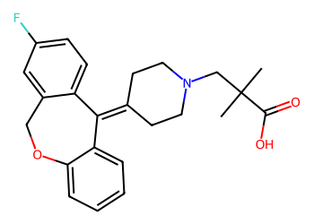
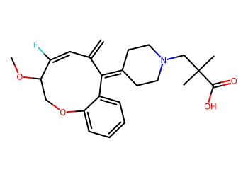

# Lead Optimization Report — d8e681ab2b7868cc60b199e691c86069d2c5657c
## Summary
- **Calibrated p(toxic):** 0.661
- **Threshold:** 0.510 → **Predicted class:** 1
- **Max similarity to train:** 0.291 (**bin:** <0.3)
- **OOD classification:** Very out-of-domain
- **Result classification:** Generated suggestions available (Tier: Tier 1 — Flip)
- Similarity is very low; generated suggestions may be scarce and fallback analogues are provided for context.
## Base molecule
- **SMILES:** `CC(C)(CN1CCC(=C2c3ccc(F)cc3COc3ccccc32)CC1)C(=O)O`
- **True label:** 1



## Counterfactual search summary
- ExMol requested: 1800 | drawn: 1449
- Generated tier (Tier 1–4): Tier 1 — Flip
- Relaxation used: False (applied: none)
- Generated survivors (Tier 1–4): 1
- Dataset analogue fallback count (not included in survivors): 5
- Relaxation note: baseline constraints

### Filter attrition by tier (baseline + final relaxation)
<table>
<tr><th>Tier</th><th>Relaxation</th><th>Sampled</th><th>Kept</th><th>Invalid</th><th>Duplicate</th><th>Similarity</th><th>Prob</th><th>Δp</th><th>SA</th><th>ΔLogP</th><th>QED</th><th>Alerts</th></tr>
<tr><td>Tier 1 — Flip</td><td>none</td><td>1449</td><td>1</td><td>0</td><td>4</td><td>1025</td><td>418</td><td>0</td><td>0</td><td>0</td><td>0</td><td>1</td></tr>
</table>

<details><summary>All filter attempts (diagnostic)</summary>
```json
[
  {
    "tier": "flip",
    "tier_label": "Tier 1 \u2014 Flip",
    "relaxation": "none",
    "relaxation_desc": "baseline constraints",
    "counts": {
      "sampled": 1449,
      "invalid": 0,
      "duplicate": 4,
      "similarity_filtered": 1025,
      "prob_filtered": 418,
      "delta_filtered": 0,
      "sa_filtered": 0,
      "logp_filtered": 0,
      "qed_filtered": 0,
      "alert_filtered": 1,
      "kept": 1,
      "min_tanimoto_used": 0.5,
      "min_tanimoto_source": "min_tanimoto_flip",
      "prob_max_used": 0.509999,
      "delta_min_used": null,
      "sa_max_used": 4.5,
      "logp_delta_max_used": 1.5,
      "qed_min_used": 0.0,
      "pains_used": true
    }
  }
]
```
</details>

## Counterfactual suggestions (filtered)
_Rows below are generated from Tier 1 — Flip (relaxation: none)._ 
<table>
<tr><th>Rank</th><th>Structure</th><th>Tier</th><th>Relaxation</th><th>Similarity</th><th>p(toxic)</th><th>Δp</th><th>LogP</th><th>QED</th><th>SA</th></tr>
<tr><td>1</td><td></td><td>Tier 1 — Flip</td><td>none</td><td>0.234</td><td>0.504</td><td>0.157</td><td>4.46</td><td>0.79</td><td>4.11</td></tr>
</table>

## Dataset-derived analogues (fallback)
_Nearest analogues from the dataset (context only, not generated edits)._ 
<table>
<tr><th>Rank</th><th>Structure</th><th>Similarity</th><th>p(toxic)</th><th>Δp</th><th>LogP</th><th>QED</th><th>SA</th><th>Alerts</th><th>Actionable?</th></tr>
<tr><td>1</td><td></td><td>0.068</td><td>0.395</td><td>0.266</td><td>-1.04</td><td>0.56</td><td>2.54</td><td>OK</td><td>YES</td></tr>
<tr><td>2</td><td></td><td>0.026</td><td>0.395</td><td>0.266</td><td>0.60</td><td>0.50</td><td>3.30</td><td>⚠</td><td>NO</td></tr>
<tr><td>3</td><td></td><td>0.101</td><td>0.396</td><td>0.266</td><td>1.86</td><td>0.58</td><td>4.05</td><td>OK</td><td>YES</td></tr>
<tr><td>4</td><td></td><td>0.098</td><td>0.396</td><td>0.266</td><td>-2.07</td><td>0.33</td><td>2.17</td><td>⚠</td><td>NO</td></tr>
<tr><td>5</td><td></td><td>0.096</td><td>0.396</td><td>0.266</td><td>-1.85</td><td>0.47</td><td>3.19</td><td>OK</td><td>YES</td></tr>
</table>

## Raw records (for audit)
### Counterfactuals JSON
```json
[
  {
    "raw_smiles": "C=C1C=C(F)C(OC)COc2ccccc2C1=C1CCN(CC(C)(C)C(=O)O)CC1",
    "smiles": "C=C1C=C(F)C(OC)COc2ccccc2C1=C1CCN(CC(C)(C)C(=O)O)CC1",
    "similarity": 0.23404255319148937,
    "p": 0.5039384365386397,
    "delta_p": 0.15727199740129427,
    "logp": 4.4638000000000035,
    "qed": 0.7866481483126112,
    "sascore": 4.106458673186733,
    "alert": false,
    "tier": "diagnostic_close_edits",
    "tier_label": "Tier 1 \u2014 Flip",
    "relaxation": "none",
    "relaxation_desc": "baseline constraints",
    "p_raw": 0.5039384365386397,
    "delta_p_raw": 0.15727199740129427,
    "tier_raw": "flip",
    "tier_num_std": 4,
    "tier_label_std": "diagnostic_close_edits"
  }
]
```
### Dataset analogues JSON
```json
[
  {
    "raw_smiles": "Cn1c(=O)c2[nH]cnc2n(C)c1=O",
    "smiles": "Cn1c(=O)c2[nH]cnc2n(C)c1=O",
    "similarity": 0.06756756756756757,
    "p": 0.39478944477282535,
    "delta_p": 0.2664209891671086,
    "logp": -1.0397000000000005,
    "qed": 0.5624722357827983,
    "sascore": 2.5435777719868486,
    "sa_status": "ok",
    "actionable": true,
    "alert": false,
    "tier": "dataset_analogue",
    "tier_label": "Dataset analogue",
    "relaxation": "none",
    "relaxation_desc": "dataset fallback",
    "sa_max_used": 4.5,
    "pains_used": true
  },
  {
    "raw_smiles": "Nc1nc(=S)c2[nH]cnc2[nH]1",
    "smiles": "Nc1nc(=S)c2[nH]cnc2[nH]1",
    "similarity": 0.025974025974025976,
    "p": 0.39478944477282535,
    "delta_p": 0.2664209891671086,
    "logp": 0.5976899999999998,
    "qed": 0.5014913838271434,
    "sascore": 3.3037189467190657,
    "sa_status": "ok",
    "actionable": false,
    "alert": true,
    "tier": "dataset_analogue",
    "tier_label": "Dataset analogue",
    "relaxation": "none",
    "relaxation_desc": "dataset fallback",
    "sa_max_used": 4.5,
    "pains_used": true
  },
  {
    "raw_smiles": "O=C(O)CNC(=O)C1NC(C(F)(F)F)(C(F)(F)F)OC1(C(F)(F)F)C(F)(F)F",
    "smiles": "O=C(O)CNC(=O)C1NC(C(F)(F)F)(C(F)(F)F)OC1(C(F)(F)F)C(F)(F)F",
    "similarity": 0.10126582278481013,
    "p": 0.39562248764441715,
    "delta_p": 0.2655879462955168,
    "logp": 1.8598999999999999,
    "qed": 0.5768274174598099,
    "sascore": 4.048334026953259,
    "sa_status": "ok",
    "actionable": true,
    "alert": false,
    "tier": "dataset_analogue",
    "tier_label": "Dataset analogue",
    "relaxation": "none",
    "relaxation_desc": "dataset fallback",
    "sa_max_used": 4.5,
    "pains_used": true
  },
  {
    "raw_smiles": "O=C(O)CN(CCN(CC(=O)O)CC(=O)O)CC(=O)O",
    "smiles": "O=C(O)CN(CCN(CC(=O)O)CC(=O)O)CC(=O)O",
    "similarity": 0.09836065573770492,
    "p": 0.39562248764441715,
    "delta_p": 0.2655879462955168,
    "logp": -2.0711999999999957,
    "qed": 0.333294737123963,
    "sascore": 2.171402762983991,
    "sa_status": "ok",
    "actionable": false,
    "alert": true,
    "tier": "dataset_analogue",
    "tier_label": "Dataset analogue",
    "relaxation": "none",
    "relaxation_desc": "dataset fallback",
    "sa_max_used": 4.5,
    "pains_used": true
  },
  {
    "raw_smiles": "NC(Cc1nn[nH]n1)C(=O)O",
    "smiles": "NC(Cc1nn[nH]n1)C(=O)O",
    "similarity": 0.0958904109589041,
    "p": 0.39562248764441715,
    "delta_p": 0.2655879462955168,
    "logp": -1.8459000000000003,
    "qed": 0.4738423616632481,
    "sascore": 3.185883407216588,
    "sa_status": "ok",
    "actionable": true,
    "alert": false,
    "tier": "dataset_analogue",
    "tier_label": "Dataset analogue",
    "relaxation": "none",
    "relaxation_desc": "dataset fallback",
    "sa_max_used": 4.5,
    "pains_used": true
  }
]
```
