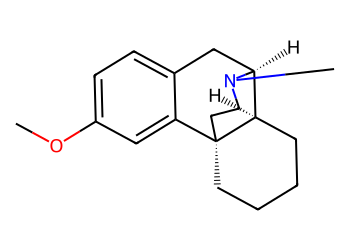
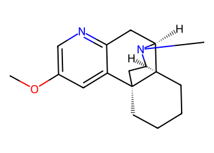
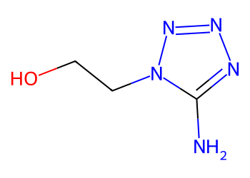
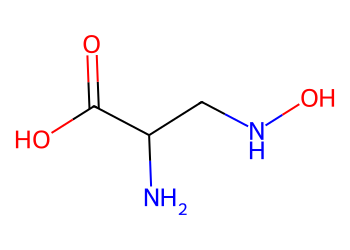

# Lead Optimization Report — e8cda283f3261597019437e6174cc9277a74b3ab
## Summary
- **Calibrated p(toxic):** 0.653
- **Threshold:** 0.510 → **Predicted class:** 1
- **Max similarity to train:** 0.247 (**bin:** <0.3)
- **OOD classification:** Very out-of-domain
- **Result classification:** Generated suggestions available (Tier: Tier 1 — Flip)
- Similarity is very low; generated suggestions may be scarce and fallback analogues are provided for context.
## Base molecule
- **SMILES:** `COc1ccc2c(c1)[C@]13CCCC[C@@H]1[C@H](C2)N(C)CC3`
- **True label:** 1



## Counterfactual search summary
- ExMol requested: 1800 | drawn: 1443
- Generated tier (Tier 1–4): Tier 1 — Flip
- Relaxation used: False (applied: none)
- Generated survivors (Tier 1–4): 1
- Dataset analogue fallback count (not included in survivors): 5
- Relaxation note: baseline constraints

### Filter attrition by tier (baseline + final relaxation)
<table>
<tr><th>Tier</th><th>Relaxation</th><th>Sampled</th><th>Kept</th><th>Invalid</th><th>Duplicate</th><th>Similarity</th><th>Prob</th><th>Δp</th><th>SA</th><th>ΔLogP</th><th>QED</th><th>Alerts</th></tr>
<tr><td>Tier 1 — Flip</td><td>none</td><td>1443</td><td>1</td><td>0</td><td>2</td><td>1287</td><td>153</td><td>0</td><td>0</td><td>0</td><td>0</td><td>0</td></tr>
</table>

<details><summary>All filter attempts (diagnostic)</summary>
```json
[
  {
    "tier": "flip",
    "tier_label": "Tier 1 \u2014 Flip",
    "relaxation": "none",
    "relaxation_desc": "baseline constraints",
    "counts": {
      "sampled": 1443,
      "invalid": 0,
      "duplicate": 2,
      "similarity_filtered": 1287,
      "prob_filtered": 153,
      "delta_filtered": 0,
      "sa_filtered": 0,
      "logp_filtered": 0,
      "qed_filtered": 0,
      "alert_filtered": 0,
      "kept": 1,
      "min_tanimoto_used": 0.5,
      "min_tanimoto_source": "min_tanimoto_flip",
      "prob_max_used": 0.509999,
      "delta_min_used": null,
      "sa_max_used": 4.5,
      "logp_delta_max_used": 1.5,
      "qed_min_used": 0.0,
      "pains_used": true
    }
  }
]
```
</details>

## Counterfactual suggestions (filtered)
_Rows below are generated from Tier 1 — Flip (relaxation: none)._ 
<table>
<tr><th>Rank</th><th>Structure</th><th>Tier</th><th>Relaxation</th><th>Similarity</th><th>p(toxic)</th><th>Δp</th><th>LogP</th><th>QED</th><th>SA</th></tr>
<tr><td>1</td><td></td><td>Tier 1 — Flip</td><td>none</td><td>0.213</td><td>0.504</td><td>0.148</td><td>2.78</td><td>0.79</td><td>4.39</td></tr>
</table>

## Dataset-derived analogues (fallback)
_Nearest analogues from the dataset (context only, not generated edits)._ 
<table>
<tr><th>Rank</th><th>Structure</th><th>Similarity</th><th>p(toxic)</th><th>Δp</th><th>LogP</th><th>QED</th><th>SA</th><th>Alerts</th><th>Actionable?</th></tr>
<tr><td>1</td><td></td><td>0.097</td><td>0.395</td><td>0.258</td><td>-1.04</td><td>0.56</td><td>2.54</td><td>OK</td><td>YES</td></tr>
<tr><td>2</td><td></td><td>0.030</td><td>0.395</td><td>0.258</td><td>0.60</td><td>0.50</td><td>3.30</td><td>⚠</td><td>NO</td></tr>
<tr><td>3</td><td></td><td>0.050</td><td>0.396</td><td>0.257</td><td>-1.75</td><td>0.49</td><td>2.79</td><td>OK</td><td>YES</td></tr>
<tr><td>4</td><td></td><td>0.034</td><td>0.396</td><td>0.257</td><td>-1.62</td><td>0.34</td><td>3.30</td><td>⚠</td><td>NO</td></tr>
<tr><td>5</td><td></td><td>0.029</td><td>0.396</td><td>0.257</td><td>-0.86</td><td>0.63</td><td>2.46</td><td>⚠</td><td>NO</td></tr>
</table>

## Raw records (for audit)
### Counterfactuals JSON
```json
[
  {
    "raw_smiles": "COc1cnc2c(c1)[C@]13CCCC[C@@H]1[C@H](C2)N(C)CC3",
    "smiles": "COc1cnc2c(c1)[C@]13CCCC[C@@H]1[C@H](C2)N(C)CC3",
    "similarity": 0.21333333333333335,
    "p": 0.5043281558155339,
    "delta_p": 0.14826183413718863,
    "logp": 2.7784000000000013,
    "qed": 0.7858211453554307,
    "sascore": 4.389718210343322,
    "alert": false,
    "tier": "diagnostic_close_edits",
    "tier_label": "Tier 1 \u2014 Flip",
    "relaxation": "none",
    "relaxation_desc": "baseline constraints",
    "p_raw": 0.5043281558155339,
    "delta_p_raw": 0.14826183413718863,
    "tier_raw": "flip",
    "tier_num_std": 4,
    "tier_label_std": "diagnostic_close_edits"
  }
]
```
### Dataset analogues JSON
```json
[
  {
    "raw_smiles": "Cn1c(=O)c2[nH]cnc2n(C)c1=O",
    "smiles": "Cn1c(=O)c2[nH]cnc2n(C)c1=O",
    "similarity": 0.0967741935483871,
    "p": 0.39478944477282535,
    "delta_p": 0.2578005451798972,
    "logp": -1.0397000000000005,
    "qed": 0.5624722357827983,
    "sascore": 2.5435777719868486,
    "sa_status": "ok",
    "actionable": true,
    "alert": false,
    "tier": "dataset_analogue",
    "tier_label": "Dataset analogue",
    "relaxation": "none",
    "relaxation_desc": "dataset fallback",
    "sa_max_used": 4.5,
    "pains_used": true
  },
  {
    "raw_smiles": "Nc1nc(=S)c2[nH]cnc2[nH]1",
    "smiles": "Nc1nc(=S)c2[nH]cnc2[nH]1",
    "similarity": 0.030303030303030304,
    "p": 0.39478944477282535,
    "delta_p": 0.2578005451798972,
    "logp": 0.5976899999999998,
    "qed": 0.5014913838271434,
    "sascore": 3.3037189467190657,
    "sa_status": "ok",
    "actionable": false,
    "alert": true,
    "tier": "dataset_analogue",
    "tier_label": "Dataset analogue",
    "relaxation": "none",
    "relaxation_desc": "dataset fallback",
    "sa_max_used": 4.5,
    "pains_used": true
  },
  {
    "raw_smiles": "Nc1nnnn1CCO",
    "smiles": "Nc1nnnn1CCO",
    "similarity": 0.05,
    "p": 0.39562248764441715,
    "delta_p": 0.2569675023083054,
    "logp": -1.7524000000000002,
    "qed": 0.49374276519904164,
    "sascore": 2.7864784687640185,
    "sa_status": "ok",
    "actionable": true,
    "alert": false,
    "tier": "dataset_analogue",
    "tier_label": "Dataset analogue",
    "relaxation": "none",
    "relaxation_desc": "dataset fallback",
    "sa_max_used": 4.5,
    "pains_used": true
  },
  {
    "raw_smiles": "NC(CNO)C(=O)O",
    "smiles": "NC(CNO)C(=O)O",
    "similarity": 0.034482758620689655,
    "p": 0.39562248764441715,
    "delta_p": 0.2569675023083054,
    "logp": -1.6228999999999996,
    "qed": 0.33550580856237117,
    "sascore": 3.304669862772739,
    "sa_status": "ok",
    "actionable": false,
    "alert": true,
    "tier": "dataset_analogue",
    "tier_label": "Dataset analogue",
    "relaxation": "none",
    "relaxation_desc": "dataset fallback",
    "sa_max_used": 4.5,
    "pains_used": true
  },
  {
    "raw_smiles": "CC(=O)Nc1nnc(S(N)(=O)=O)s1",
    "smiles": "CC(=O)Nc1nnc(S(N)(=O)=O)s1",
    "similarity": 0.029411764705882353,
    "p": 0.39562248764441715,
    "delta_p": 0.2569675023083054,
    "logp": -0.8561000000000003,
    "qed": 0.6318586926732331,
    "sascore": 2.460960564488465,
    "sa_status": "ok",
    "actionable": false,
    "alert": true,
    "tier": "dataset_analogue",
    "tier_label": "Dataset analogue",
    "relaxation": "none",
    "relaxation_desc": "dataset fallback",
    "sa_max_used": 4.5,
    "pains_used": true
  }
]
```
