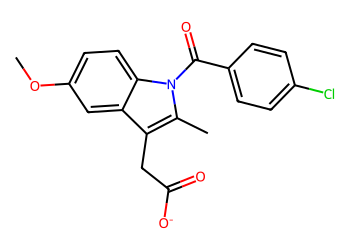
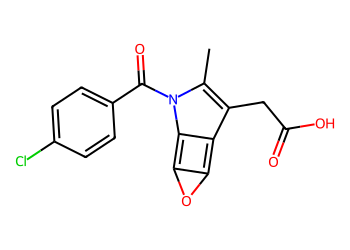
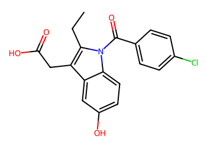
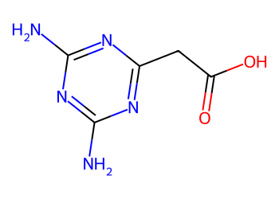
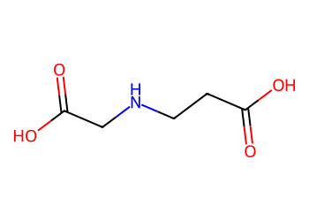

# Lead Optimization Report — f39903ddbcdba8142befdad537ab321be60605d5
## Summary
- **Calibrated p(toxic):** 0.534
- **Threshold:** 0.510 → **Predicted class:** 1
- **Max similarity to train:** 0.256 (**bin:** <0.3)
- **OOD classification:** Very out-of-domain
- **Result classification:** Generated suggestions available (Tier: Tier 1 — Flip)
- Similarity is very low; generated suggestions may be scarce and fallback analogues are provided for context.
## Base molecule
- **SMILES:** `COc1ccc2c(c1)c(CC(=O)[O-])c(C)n2C(=O)c1ccc(Cl)cc1`
- **True label:** 0



## Counterfactual search summary
- ExMol requested: 1800 | drawn: 1457
- Generated tier (Tier 1–4): Tier 1 — Flip
- Relaxation used: False (applied: none)
- Generated survivors (Tier 1–4): 2
- Dataset analogue fallback count (not included in survivors): 5
- Relaxation note: baseline constraints

### Filter attrition by tier (baseline + final relaxation)
<table>
<tr><th>Tier</th><th>Relaxation</th><th>Sampled</th><th>Kept</th><th>Invalid</th><th>Duplicate</th><th>Similarity</th><th>Prob</th><th>Δp</th><th>SA</th><th>ΔLogP</th><th>QED</th><th>Alerts</th></tr>
<tr><td>Tier 1 — Flip</td><td>none</td><td>1457</td><td>2</td><td>0</td><td>12</td><td>1146</td><td>292</td><td>0</td><td>0</td><td>5</td><td>0</td><td>0</td></tr>
</table>

<details><summary>All filter attempts (diagnostic)</summary>
```json
[
  {
    "tier": "flip",
    "tier_label": "Tier 1 \u2014 Flip",
    "relaxation": "none",
    "relaxation_desc": "baseline constraints",
    "counts": {
      "sampled": 1457,
      "invalid": 0,
      "duplicate": 12,
      "similarity_filtered": 1146,
      "prob_filtered": 292,
      "delta_filtered": 0,
      "sa_filtered": 0,
      "logp_filtered": 5,
      "qed_filtered": 0,
      "alert_filtered": 0,
      "kept": 2,
      "min_tanimoto_used": 0.5,
      "min_tanimoto_source": "min_tanimoto_flip",
      "prob_max_used": 0.509999,
      "delta_min_used": null,
      "sa_max_used": 4.5,
      "logp_delta_max_used": 1.5,
      "qed_min_used": 0.0,
      "pains_used": true
    }
  }
]
```
</details>

## Counterfactual suggestions (filtered)
_Rows below are generated from Tier 1 — Flip (relaxation: none)._ 
<table>
<tr><th>Rank</th><th>Structure</th><th>Tier</th><th>Relaxation</th><th>Similarity</th><th>p(toxic)</th><th>Δp</th><th>LogP</th><th>QED</th><th>SA</th></tr>
<tr><td>1</td><td></td><td>Tier 1 — Flip</td><td>none</td><td>0.267</td><td>0.492</td><td>0.042</td><td>3.49</td><td>0.63</td><td>2.74</td></tr>
<tr><td>2</td><td></td><td>Tier 1 — Flip</td><td>none</td><td>0.253</td><td>0.507</td><td>0.027</td><td>3.88</td><td>0.74</td><td>2.37</td></tr>
</table>

## Dataset-derived analogues (fallback)
_Nearest analogues from the dataset (context only, not generated edits)._ 
<table>
<tr><th>Rank</th><th>Structure</th><th>Similarity</th><th>p(toxic)</th><th>Δp</th><th>LogP</th><th>QED</th><th>SA</th><th>Alerts</th><th>Actionable?</th></tr>
<tr><td>1</td><td></td><td>0.076</td><td>0.395</td><td>0.139</td><td>-1.04</td><td>0.56</td><td>2.54</td><td>OK</td><td>YES</td></tr>
<tr><td>2</td><td></td><td>0.029</td><td>0.395</td><td>0.139</td><td>0.60</td><td>0.50</td><td>3.30</td><td>⚠</td><td>NO</td></tr>
<tr><td>3</td><td></td><td>0.161</td><td>0.396</td><td>0.138</td><td>-1.34</td><td>0.50</td><td>2.46</td><td>OK</td><td>YES</td></tr>
<tr><td>4</td><td></td><td>0.113</td><td>0.396</td><td>0.138</td><td>-2.07</td><td>0.33</td><td>2.17</td><td>⚠</td><td>NO</td></tr>
<tr><td>5</td><td></td><td>0.109</td><td>0.396</td><td>0.138</td><td>-0.86</td><td>0.44</td><td>2.00</td><td>⚠</td><td>NO</td></tr>
</table>

## Raw records (for audit)
### Counterfactuals JSON
```json
[
  {
    "raw_smiles": "Cc1c(CC(=O)O)c2c3oc-3c2n1C(=O)c1ccc(Cl)cc1",
    "smiles": "Cc1c(CC(=O)O)c2c3oc-3c2n1C(=O)c1ccc(Cl)cc1",
    "similarity": 0.26666666666666666,
    "p": 0.491539448957503,
    "delta_p": 0.042120794428018415,
    "logp": 3.4921200000000017,
    "qed": 0.6278264854186453,
    "sascore": 2.7404038111590143,
    "alert": false,
    "tier": "diagnostic_close_edits",
    "tier_label": "Tier 1 \u2014 Flip",
    "relaxation": "none",
    "relaxation_desc": "baseline constraints",
    "p_raw": 0.491539448957503,
    "delta_p_raw": 0.08467947687315613,
    "tier_raw": "flip",
    "tier_num_std": 4,
    "tier_label_std": "diagnostic_close_edits"
  },
  {
    "raw_smiles": "CCc1c(CC(=O)O)c2cc(O)ccc2n1C(=O)c1ccc(Cl)cc1",
    "smiles": "CCc1c(CC(=O)O)c2cc(O)ccc2n1C(=O)c1ccc(Cl)cc1",
    "similarity": 0.25301204819277107,
    "p": 0.5065691089011981,
    "delta_p": 0.02709113448432332,
    "logp": 3.878300000000002,
    "qed": 0.7422555179736732,
    "sascore": 2.3676478916950376,
    "alert": false,
    "tier": "diagnostic_close_edits",
    "tier_label": "Tier 1 \u2014 Flip",
    "relaxation": "none",
    "relaxation_desc": "baseline constraints",
    "p_raw": 0.5065691089011981,
    "delta_p_raw": 0.06964981692946104,
    "tier_raw": "flip",
    "tier_num_std": 4,
    "tier_label_std": "diagnostic_close_edits"
  }
]
```
### Dataset analogues JSON
```json
[
  {
    "raw_smiles": "Cn1c(=O)c2[nH]cnc2n(C)c1=O",
    "smiles": "Cn1c(=O)c2[nH]cnc2n(C)c1=O",
    "similarity": 0.07575757575757576,
    "p": 0.39478944477282535,
    "delta_p": 0.13887079861269608,
    "logp": -1.0397000000000005,
    "qed": 0.5624722357827983,
    "sascore": 2.5435777719868486,
    "sa_status": "ok",
    "actionable": true,
    "alert": false,
    "tier": "dataset_analogue",
    "tier_label": "Dataset analogue",
    "relaxation": "none",
    "relaxation_desc": "dataset fallback",
    "sa_max_used": 4.5,
    "pains_used": true
  },
  {
    "raw_smiles": "Nc1nc(=S)c2[nH]cnc2[nH]1",
    "smiles": "Nc1nc(=S)c2[nH]cnc2[nH]1",
    "similarity": 0.028985507246376812,
    "p": 0.39478944477282535,
    "delta_p": 0.13887079861269608,
    "logp": 0.5976899999999998,
    "qed": 0.5014913838271434,
    "sascore": 3.3037189467190657,
    "sa_status": "ok",
    "actionable": false,
    "alert": true,
    "tier": "dataset_analogue",
    "tier_label": "Dataset analogue",
    "relaxation": "none",
    "relaxation_desc": "dataset fallback",
    "sa_max_used": 4.5,
    "pains_used": true
  },
  {
    "raw_smiles": "Nc1nc(N)nc(CC(=O)O)n1",
    "smiles": "Nc1nc(N)nc(CC(=O)O)n1",
    "similarity": 0.16071428571428573,
    "p": 0.39562248764441715,
    "delta_p": 0.13803775574110427,
    "logp": -1.3369,
    "qed": 0.49944774236295647,
    "sascore": 2.457943484484762,
    "sa_status": "ok",
    "actionable": true,
    "alert": false,
    "tier": "dataset_analogue",
    "tier_label": "Dataset analogue",
    "relaxation": "none",
    "relaxation_desc": "dataset fallback",
    "sa_max_used": 4.5,
    "pains_used": true
  },
  {
    "raw_smiles": "O=C(O)CN(CCN(CC(=O)O)CC(=O)O)CC(=O)O",
    "smiles": "O=C(O)CN(CCN(CC(=O)O)CC(=O)O)CC(=O)O",
    "similarity": 0.11320754716981132,
    "p": 0.39562248764441715,
    "delta_p": 0.13803775574110427,
    "logp": -2.0711999999999957,
    "qed": 0.333294737123963,
    "sascore": 2.171402762983991,
    "sa_status": "ok",
    "actionable": false,
    "alert": true,
    "tier": "dataset_analogue",
    "tier_label": "Dataset analogue",
    "relaxation": "none",
    "relaxation_desc": "dataset fallback",
    "sa_max_used": 4.5,
    "pains_used": true
  },
  {
    "raw_smiles": "O=C(O)CCNCC(=O)O",
    "smiles": "O=C(O)CCNCC(=O)O",
    "similarity": 0.10909090909090909,
    "p": 0.39562248764441715,
    "delta_p": 0.13803775574110427,
    "logp": -0.8646999999999996,
    "qed": 0.4401186316653978,
    "sascore": 1.9954764672672276,
    "sa_status": "ok",
    "actionable": false,
    "alert": true,
    "tier": "dataset_analogue",
    "tier_label": "Dataset analogue",
    "relaxation": "none",
    "relaxation_desc": "dataset fallback",
    "sa_max_used": 4.5,
    "pains_used": true
  }
]
```
