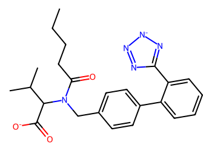
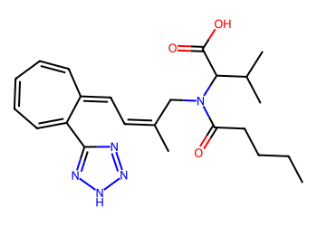
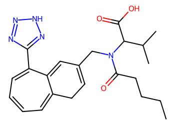
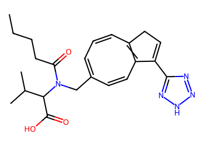
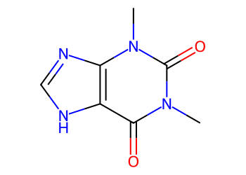
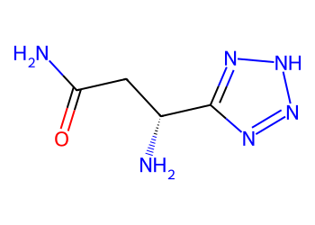
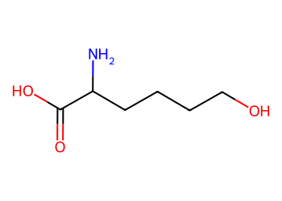

# Lead Optimization Report — f8ee8aef31a8cecfbc249993d8b42932c153a046
## Summary
- **Calibrated p(toxic):** 0.605
- **Threshold:** 0.510 → **Predicted class:** 1
- **Max similarity to train:** 0.412 (**bin:** 0.3-0.5)
- **OOD classification:** Out-of-domain
- **Result classification:** Generated suggestions available (Tier: Tier 1 — Flip)
- Similarity is low; treat any suggestions cautiously and consult fallback analogues.
## Base molecule
- **SMILES:** `CCCCC(=O)N(Cc1ccc(-c2ccccc2-c2nn[n-]n2)cc1)C(C(=O)[O-])C(C)C`
- **True label:** 0



## Counterfactual search summary
- ExMol requested: 1800 | drawn: 1472
- Generated tier (Tier 1–4): Tier 1 — Flip
- Relaxation used: False (applied: none)
- Generated survivors (Tier 1–4): 3
- Dataset analogue fallback count (not included in survivors): 5
- Relaxation note: baseline constraints

### Filter attrition by tier (baseline + final relaxation)
<table>
<tr><th>Tier</th><th>Relaxation</th><th>Sampled</th><th>Kept</th><th>Invalid</th><th>Duplicate</th><th>Similarity</th><th>Prob</th><th>Δp</th><th>SA</th><th>ΔLogP</th><th>QED</th><th>Alerts</th></tr>
<tr><td>Tier 1 — Flip</td><td>none</td><td>1472</td><td>3</td><td>0</td><td>10</td><td>878</td><td>577</td><td>0</td><td>2</td><td>0</td><td>0</td><td>2</td></tr>
</table>

<details><summary>All filter attempts (diagnostic)</summary>
```json
[
  {
    "tier": "flip",
    "tier_label": "Tier 1 \u2014 Flip",
    "relaxation": "none",
    "relaxation_desc": "baseline constraints",
    "counts": {
      "sampled": 1472,
      "invalid": 0,
      "duplicate": 10,
      "similarity_filtered": 878,
      "prob_filtered": 577,
      "delta_filtered": 0,
      "sa_filtered": 2,
      "logp_filtered": 0,
      "qed_filtered": 0,
      "alert_filtered": 2,
      "kept": 3,
      "min_tanimoto_used": 0.5,
      "min_tanimoto_source": "min_tanimoto_flip",
      "prob_max_used": 0.509999,
      "delta_min_used": null,
      "sa_max_used": 4.5,
      "logp_delta_max_used": 1.5,
      "qed_min_used": 0.0,
      "pains_used": true
    }
  }
]
```
</details>

## Counterfactual suggestions (filtered)
_Rows below are generated from Tier 1 — Flip (relaxation: none)._ 
<table>
<tr><th>Rank</th><th>Structure</th><th>Tier</th><th>Relaxation</th><th>Similarity</th><th>p(toxic)</th><th>Δp</th><th>LogP</th><th>QED</th><th>SA</th></tr>
<tr><td>1</td><td></td><td>Tier 1 — Flip</td><td>none</td><td>0.219</td><td>0.491</td><td>0.114</td><td>3.71</td><td>0.59</td><td>3.98</td></tr>
<tr><td>2</td><td></td><td>Tier 1 — Flip</td><td>none</td><td>0.222</td><td>0.506</td><td>0.099</td><td>3.46</td><td>0.63</td><td>4.05</td></tr>
<tr><td>3</td><td></td><td>Tier 1 — Flip</td><td>none</td><td>0.219</td><td>0.506</td><td>0.099</td><td>3.46</td><td>0.63</td><td>4.08</td></tr>
</table>

## Dataset-derived analogues (fallback)
_Nearest analogues from the dataset (context only, not generated edits)._ 
<table>
<tr><th>Rank</th><th>Structure</th><th>Similarity</th><th>p(toxic)</th><th>Δp</th><th>LogP</th><th>QED</th><th>SA</th><th>Alerts</th><th>Actionable?</th></tr>
<tr><td>1</td><td></td><td>0.080</td><td>0.395</td><td>0.210</td><td>-1.04</td><td>0.56</td><td>2.54</td><td>OK</td><td>YES</td></tr>
<tr><td>2</td><td></td><td>0.052</td><td>0.395</td><td>0.210</td><td>0.60</td><td>0.50</td><td>3.30</td><td>⚠</td><td>NO</td></tr>
<tr><td>3</td><td></td><td>0.242</td><td>0.396</td><td>0.209</td><td>-1.85</td><td>0.47</td><td>3.19</td><td>OK</td><td>YES</td></tr>
<tr><td>4</td><td></td><td>0.206</td><td>0.396</td><td>0.209</td><td>-1.93</td><td>0.47</td><td>3.46</td><td>OK</td><td>YES</td></tr>
<tr><td>5</td><td></td><td>0.136</td><td>0.396</td><td>0.209</td><td>-0.44</td><td>0.46</td><td>2.45</td><td>⚠</td><td>NO</td></tr>
</table>

## Raw records (for audit)
### Counterfactuals JSON
```json
[
  {
    "raw_smiles": "CCCCC(=O)N(CC(C)=CC=C1C=CC=CC=C1c1nn[nH]n1)C(C(=O)O)C(C)C",
    "smiles": "CCCCC(=O)N(CC(C)=CC=C1C=CC=CC=C1c1nn[nH]n1)C(C(=O)O)C(C)C",
    "similarity": 0.2191780821917808,
    "p": 0.49119264713869704,
    "delta_p": 0.1139124118864181,
    "logp": 3.7098000000000013,
    "qed": 0.5909216733420598,
    "sascore": 3.9841371859707735,
    "alert": false,
    "tier": "diagnostic_close_edits",
    "tier_label": "Tier 1 \u2014 Flip",
    "relaxation": "none",
    "relaxation_desc": "baseline constraints",
    "p_raw": 0.49119264713869704,
    "delta_p_raw": 0.15160370985374172,
    "tier_raw": "flip",
    "tier_num_std": 4,
    "tier_label_std": "diagnostic_close_edits"
  },
  {
    "raw_smiles": "CCCCC(=O)N(CC1=CCC2=CC=CC=C(c3nn[nH]n3)C2=C1)C(C(=O)O)C(C)C",
    "smiles": "CCCCC(=O)N(CC1=CCC2=CC=CC=C(c3nn[nH]n3)C2=C1)C(C(=O)O)C(C)C",
    "similarity": 0.2222222222222222,
    "p": 0.5064889488291708,
    "delta_p": 0.0986161101959443,
    "logp": 3.4638000000000018,
    "qed": 0.6289722813808613,
    "sascore": 4.049658233407699,
    "alert": false,
    "tier": "diagnostic_close_edits",
    "tier_label": "Tier 1 \u2014 Flip",
    "relaxation": "none",
    "relaxation_desc": "baseline constraints",
    "p_raw": 0.5064889488291708,
    "delta_p_raw": 0.13630740816326792,
    "tier_raw": "flip",
    "tier_num_std": 4,
    "tier_label_std": "diagnostic_close_edits"
  },
  {
    "raw_smiles": "CCCCC(=O)N(CC1=CC=CC2=C(C=C1)C(c1nn[nH]n1)=CC2)C(C(=O)O)C(C)C",
    "smiles": "CCCCC(=O)N(CC1=CC=CC2=C(C=C1)C(c1nn[nH]n1)=CC2)C(C(=O)O)C(C)C",
    "similarity": 0.2191780821917808,
    "p": 0.5064889488291708,
    "delta_p": 0.0986161101959443,
    "logp": 3.4638000000000018,
    "qed": 0.628972281380861,
    "sascore": 4.0800115490575655,
    "alert": false,
    "tier": "diagnostic_close_edits",
    "tier_label": "Tier 1 \u2014 Flip",
    "relaxation": "none",
    "relaxation_desc": "baseline constraints",
    "p_raw": 0.5064889488291708,
    "delta_p_raw": 0.13630740816326792,
    "tier_raw": "flip",
    "tier_num_std": 4,
    "tier_label_std": "diagnostic_close_edits"
  }
]
```
### Dataset analogues JSON
```json
[
  {
    "raw_smiles": "Cn1c(=O)c2[nH]cnc2n(C)c1=O",
    "smiles": "Cn1c(=O)c2[nH]cnc2n(C)c1=O",
    "similarity": 0.08,
    "p": 0.39478944477282535,
    "delta_p": 0.21031561425228978,
    "logp": -1.0397000000000005,
    "qed": 0.5624722357827983,
    "sascore": 2.5435777719868486,
    "sa_status": "ok",
    "actionable": true,
    "alert": false,
    "tier": "dataset_analogue",
    "tier_label": "Dataset analogue",
    "relaxation": "none",
    "relaxation_desc": "dataset fallback",
    "sa_max_used": 4.5,
    "pains_used": true
  },
  {
    "raw_smiles": "Nc1nc(=S)c2[nH]cnc2[nH]1",
    "smiles": "Nc1nc(=S)c2[nH]cnc2[nH]1",
    "similarity": 0.05194805194805195,
    "p": 0.39478944477282535,
    "delta_p": 0.21031561425228978,
    "logp": 0.5976899999999998,
    "qed": 0.5014913838271434,
    "sascore": 3.3037189467190657,
    "sa_status": "ok",
    "actionable": false,
    "alert": true,
    "tier": "dataset_analogue",
    "tier_label": "Dataset analogue",
    "relaxation": "none",
    "relaxation_desc": "dataset fallback",
    "sa_max_used": 4.5,
    "pains_used": true
  },
  {
    "raw_smiles": "NC(Cc1nn[nH]n1)C(=O)O",
    "smiles": "NC(Cc1nn[nH]n1)C(=O)O",
    "similarity": 0.24242424242424243,
    "p": 0.39562248764441715,
    "delta_p": 0.20948257138069798,
    "logp": -1.8459000000000003,
    "qed": 0.4738423616632481,
    "sascore": 3.185883407216588,
    "sa_status": "ok",
    "actionable": true,
    "alert": false,
    "tier": "dataset_analogue",
    "tier_label": "Dataset analogue",
    "relaxation": "none",
    "relaxation_desc": "dataset fallback",
    "sa_max_used": 4.5,
    "pains_used": true
  },
  {
    "raw_smiles": "NC(=O)C[C@@H](N)c1nn[nH]n1",
    "smiles": "NC(=O)C[C@@H](N)c1nn[nH]n1",
    "similarity": 0.20588235294117646,
    "p": 0.39562248764441715,
    "delta_p": 0.20948257138069798,
    "logp": -1.9250999999999996,
    "qed": 0.46999699596863087,
    "sascore": 3.4594280226012035,
    "sa_status": "ok",
    "actionable": true,
    "alert": false,
    "tier": "dataset_analogue",
    "tier_label": "Dataset analogue",
    "relaxation": "none",
    "relaxation_desc": "dataset fallback",
    "sa_max_used": 4.5,
    "pains_used": true
  },
  {
    "raw_smiles": "NC(CCCCO)C(=O)O",
    "smiles": "NC(CCCCO)C(=O)O",
    "similarity": 0.13636363636363635,
    "p": 0.39562248764441715,
    "delta_p": 0.20948257138069798,
    "logp": -0.43910000000000055,
    "qed": 0.46022434211472313,
    "sascore": 2.4467961062339256,
    "sa_status": "ok",
    "actionable": false,
    "alert": true,
    "tier": "dataset_analogue",
    "tier_label": "Dataset analogue",
    "relaxation": "none",
    "relaxation_desc": "dataset fallback",
    "sa_max_used": 4.5,
    "pains_used": true
  }
]
```
