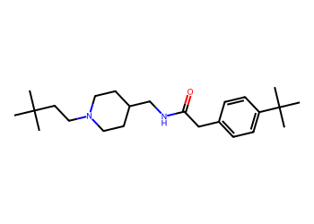
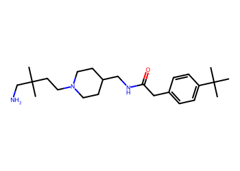
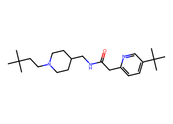
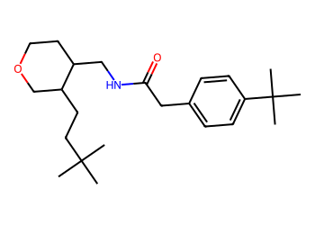
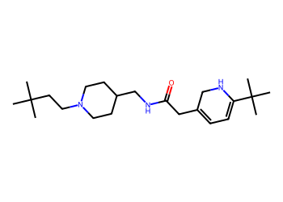
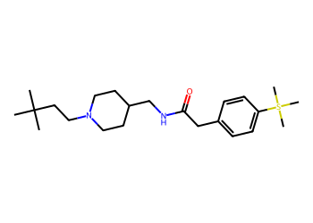

# Lead Optimization Report — a20f74e3f8ebfea51b2477906e00b06b1ca1e4b7
## Summary
- **Calibrated p(toxic):** 0.712
- **Threshold:** 0.710 → **Predicted class:** 1
- **Max similarity to train:** 0.554 (**bin:** 0.5-0.7)
- **OOD classification:** Borderline
- **Result classification:** Generated suggestions available (Tier: Tier 1 — Flip)
- Similarity is borderline; suggestions may be limited but still informative.
## Base molecule
- **SMILES:** `CC(C)(C)CCN1CCC(CNC(=O)Cc2ccc(C(C)(C)C)cc2)CC1`
- **True label:** 1



## Counterfactual search summary
- ExMol requested: 3000 | drawn: 2003
- Scaffold preservation rate: 14.2% (285/2003)
- Generated tier (Tier 1–4): Tier 1 — Flip
- Relaxation used: False (applied: none)
- Generated survivors (Tier 1–4): 5
- Dataset analogue fallback count (not included in survivors): 0
- Relaxation note: baseline constraints

### Filter attrition by tier (baseline + final relaxation)
<table>
<tr><th>Tier</th><th>Relaxation</th><th>Sampled</th><th>Kept</th><th>Invalid</th><th>Duplicate</th><th>Scaffold</th><th>Similarity</th><th>Prob</th><th>Δp</th><th>SA</th><th>ΔLogP</th><th>QED</th><th>Alerts</th></tr>
<tr><td>Tier 1 — Flip</td><td>none</td><td>2003</td><td>88</td><td>0</td><td>8</td><td>350</td><td>1391</td><td>102</td><td>0</td><td>0</td><td>9</td><td>0</td><td>55</td></tr>
</table>

<details><summary>All filter attempts (diagnostic)</summary>
```json
[
  {
    "tier": "flip",
    "tier_label": "Tier 1 \u2014 Flip",
    "relaxation": "none",
    "relaxation_desc": "baseline constraints",
    "counts": {
      "sampled": 2003,
      "invalid": 0,
      "duplicate": 8,
      "scaffold_filtered": 350,
      "similarity_filtered": 1391,
      "prob_filtered": 102,
      "delta_filtered": 0,
      "sa_filtered": 0,
      "logp_filtered": 9,
      "qed_filtered": 0,
      "alert_filtered": 55,
      "kept": 88,
      "min_tanimoto_used": 0.5,
      "min_tanimoto_source": "min_tanimoto_flip",
      "prob_max_used": 0.709999,
      "delta_min_used": null,
      "sa_max_used": 4.5,
      "logp_delta_max_used": 1.5,
      "qed_min_used": 0.0,
      "pains_used": true
    }
  }
]
```
</details>

## Counterfactual suggestions (filtered)
_Rows below are generated from Tier 1 — Flip (relaxation: none)._ 
<table>
<tr><th>Rank</th><th>Structure</th><th>Tier</th><th>Relaxation</th><th>Similarity</th><th>p(toxic)</th><th>Δp</th><th>LogP</th><th>QED</th><th>SA</th></tr>
<tr><td>1</td><td></td><td>Tier 1 — Flip</td><td>none</td><td>0.444</td><td>0.500</td><td>0.212</td><td>3.73</td><td>0.71</td><td>2.36</td></tr>
<tr><td>2</td><td></td><td>Tier 1 — Flip</td><td>none</td><td>0.508</td><td>0.486</td><td>0.226</td><td>4.19</td><td>0.81</td><td>2.44</td></tr>
<tr><td>3</td><td></td><td>Tier 1 — Flip</td><td>none</td><td>0.324</td><td>0.390</td><td>0.323</td><td>5.12</td><td>0.75</td><td>3.25</td></tr>
<tr><td>4</td><td></td><td>Tier 1 — Flip</td><td>none</td><td>0.500</td><td>0.419</td><td>0.293</td><td>4.10</td><td>0.73</td><td>3.11</td></tr>
<tr><td>5</td><td></td><td>Tier 1 — Flip</td><td>none</td><td>0.534</td><td>0.528</td><td>0.184</td><td>4.55</td><td>0.74</td><td>2.48</td></tr>
</table>

## Raw records (for audit)
### Counterfactuals JSON
```json
[
  {
    "raw_smiles": "CC(C)(CN)CCN1CCC(CNC(=O)Cc2ccc(C(C)(C)C)cc2)CC1",
    "smiles": "CC(C)(CN)CCN1CCC(CNC(=O)Cc2ccc(C(C)(C)C)cc2)CC1",
    "similarity": 0.4444444444444444,
    "p": 0.4998539508310926,
    "delta_p": 0.21241921976327177,
    "logp": 3.7298000000000027,
    "qed": 0.7144647405062011,
    "sascore": 2.3649266255817434,
    "alert": false,
    "tier": "diagnostic_close_edits",
    "tier_label": "Tier 1 \u2014 Flip",
    "relaxation": "none",
    "relaxation_desc": "baseline constraints",
    "tier_raw": "flip",
    "tier_num_std": 4,
    "tier_label_std": "diagnostic_close_edits"
  },
  {
    "raw_smiles": "CC(C)(C)CCN1CCC(CNC(=O)Cc2ccc(C(C)(C)C)cn2)CC1",
    "smiles": "CC(C)(C)CCN1CCC(CNC(=O)Cc2ccc(C(C)(C)C)cn2)CC1",
    "similarity": 0.5081967213114754,
    "p": 0.48630565162657924,
    "delta_p": 0.2259675189677851,
    "logp": 4.1860000000000035,
    "qed": 0.8132391317700526,
    "sascore": 2.436503716515775,
    "alert": false,
    "tier": "flip",
    "tier_label": "Tier 1 \u2014 Flip",
    "relaxation": "none",
    "relaxation_desc": "baseline constraints",
    "tier_raw": "flip",
    "tier_num_std": 1,
    "tier_label_std": "flip"
  },
  {
    "raw_smiles": "CC(C)(C)CCC1COCCC1CNC(=O)Cc1ccc(C(C)(C)C)cc1",
    "smiles": "CC(C)(C)CCC1COCCC1CNC(=O)Cc1ccc(C(C)(C)C)cc1",
    "similarity": 0.323943661971831,
    "p": 0.38960285008407136,
    "delta_p": 0.322670320510293,
    "logp": 5.121800000000005,
    "qed": 0.7512440609513275,
    "sascore": 3.2508628758573463,
    "alert": false,
    "tier": "diagnostic_close_edits",
    "tier_label": "Tier 1 \u2014 Flip",
    "relaxation": "none",
    "relaxation_desc": "baseline constraints",
    "tier_raw": "flip",
    "tier_num_std": 4,
    "tier_label_std": "diagnostic_close_edits"
  },
  {
    "raw_smiles": "CC(C)(C)CCN1CCC(CNC(=O)CC2=CC=C(C(C)(C)C)NC2)CC1",
    "smiles": "CC(C)(C)CCN1CCC(CNC(=O)CC2=CC=C(C(C)(C)C)NC2)CC1",
    "similarity": 0.5,
    "p": 0.41889978124478844,
    "delta_p": 0.2933733893495759,
    "logp": 4.100500000000004,
    "qed": 0.7344859175894608,
    "sascore": 3.107555691567752,
    "alert": false,
    "tier": "flip",
    "tier_label": "Tier 1 \u2014 Flip",
    "relaxation": "none",
    "relaxation_desc": "baseline constraints",
    "tier_raw": "flip",
    "tier_num_std": 1,
    "tier_label_std": "flip"
  },
  {
    "raw_smiles": "CC(C)(C)CCN1CCC(CNC(=O)Cc2ccc(S(C)(C)C)cc2)CC1",
    "smiles": "CC(C)(C)CCN1CCC(CNC(=O)Cc2ccc(S(C)(C)C)cc2)CC1",
    "similarity": 0.5344827586206896,
    "p": 0.5280233606087149,
    "delta_p": 0.18424980998564944,
    "logp": 4.546400000000004,
    "qed": 0.7383458956507709,
    "sascore": 2.4788205564326162,
    "alert": false,
    "tier": "flip",
    "tier_label": "Tier 1 \u2014 Flip",
    "relaxation": "none",
    "relaxation_desc": "baseline constraints",
    "tier_raw": "flip",
    "tier_num_std": 1,
    "tier_label_std": "flip"
  }
]
```
### Dataset analogues JSON
```json
[]
```
